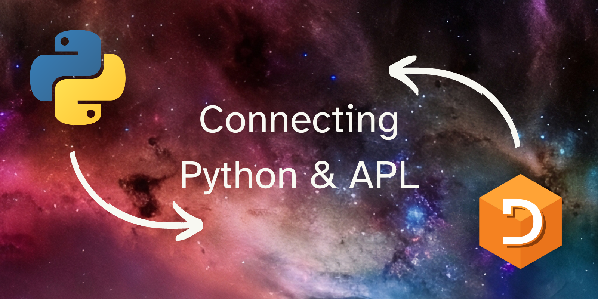

This article shows how to communicate between Python and Dyalog APL through the use of sockets. We will use the module `socket` from Python and the Conga workspace from Dyalog.

===



# Introduction

Programs communicate with each other all the time.
For example, your browser communicated with my server to retrieve this article.
Sometimes, you may want your programs to communicate with others, and when that time comes, you may want to use sockets[^1].

This article will show how to communicate between Python and [Dyalog APL][dyalog] using sockets:

 - we will use the module `sockets` on the Python side; and
 - we will use Conga on the Dyalog APL side.

Both `sockets` for Python and Conga for Dyalog APL come with their respective systems by default, so that should make things easier for us.


# How to create a socket server in Python

Thanks to some investigation I did some months ago and [an article I wrote about `sockets`][sockets-python], we can see that it doesn't take much code to create a socket server in Python.

In fact, the four lines of code that follow are enough to create a socket server in Python that will listen on port 7342 on the local host:

```py
import socket
server = socket.socket(socket.AF_INET, socket.SOCK_STREAM)
server.bind(("localhost", 7342))
server.listen()
```

If you are following along, what I suggest is that you run this code in your REPL, so that the Dyalog APL socket you create in the next step connects to your server and you see what is going on.

Go ahead, paste those four lines of code in your REPL, and then add this fifth one to wait for a socket to connect:

```py
client, address = server.accept()
```

If all went well, running that line of code should make your interpreter hang, which is normal because you are waiting for a socket to connect to your server.

Let's see how to connect from the APL side


# How to create a client socket in Dyalog APL

To work with sockets in Dyalog APL we need to load the Conga workspace, or we can just copy the namespace `DRC` in:

```apl
      )copy conga DRC
```

Next up, we initialise the namespace:

```apl
      DRC.Init ''
┌─┬─────────────────────────────┐
│0│Conga loaded from: conga34_64│
└─┴─────────────────────────────┘
```

The exact numbers you get in the `conga34_64` portion of the output will differ from version to version (and possibly from OS to OS).

Finally, we use the function `DRC.Clt` to create a client socket.
We will pass four arguments to `DRC.Clt`:

 - the name of the socket we are going to create (any character vector will do);
 - the address or name of the host (`'localhost'` in our example);
 - the port to which to connect to (`7342` in our example); and
 - the type of the socket (`'Text'` in our example):

```apl
      DRC.Clt 'my socket' 'localhost' 7342 'Text'
┌─┬─────────┐
│0│my socket│
└─┴─────────┘
```

If the first element of the result vector is a `0`, that means everything worked out and you managed to create your socket.
Otherwise, that integer will have an error code that you can use to identify what went wrong.

When the client socket connects to the Python server, the statement `client, address = server.accept()` will no longer be hanging and you will be back in control of your Python REPL.
This means that `client` is now the client socket that can communicate with Dyalog APL.


# Sending messages from Dyalog APL to Python

Now that we have a connection between Dyalog and APL, we can use the function `DRC.Send` on the Dyalog side to send messages to Python.

The function `DRC.Send` will take two arguments, which are the name of the socket that should send the message and the message itself.
Because our socket `'my socket'` is of the type `'Text'`, we can send character vectors without having to encode them:

```apl
      ⍝ From the APL side:
      DRC.Send 'my socket' 'Hello, Python, from the Dyalog side.'
┌─┬──────────────────────┐
│0│my socket.Auto00000000│
└─┴──────────────────────┘
```

Again, if the first integer of the result is a `0`, that means sending worked out great.

Now, if we head over to the Python side, we can receive that message:

```py
# From the Python side:
>>> client.recv(1024)
b'Hello, Python, from the Dyalog side.'
```


# Receiving messages from Python in Dyalog APL

Receiving a message in Dyalog APL is also simple.
The function `DRC.Wait` accepts a name of a socket and will attempt to wait for a message from that socket.
However, if you run `DRC.Wait 'my socket'` you will get a timeout almost instantly:

```apl
      ⍝ From the APL side:
      DRC.Wait 'my socket'
┌───┬───────┬───────┐
│100│TIMEOUT│Timeout│
└───┴───────┴───────┘
```

By default, the function `DRC.Wait` will wait for a message for 100ms and will return with an error code `100` if that times out.
You can increase the timeout limit by providing the number of milliseconds as the second argument:

```apl
      DRC.Wait 'my socket' 999999
```

This should give you plenty of time to go to the Python REPL and send a message through there:

```py
# From the Python side:
>>> client.send(b"Hello Dyalog, from the Python side.")
35
```

When you go back to the Dyalog APL session, you should have received your message:

```apl
      ⍝ From the APL side:
      DRC.Wait 'my socket' 999999
┌─┬─────────┬─────┬───────────────────────────────────┐
│0│my socket│Block│Hello Dyalog, from the Python side.│
└─┴─────────┴─────┴───────────────────────────────────┘
```

Again, the code `0` means everything worked great.

The remaining three values are:

 - the name of the socket that waited for the message;
 - the type of event that happened (in this case, we did a blocking operation, and in the previous example we had a timeout event); and
 - the message that was received.


# How to create a socket server in Dyalog APL

Before we conclude this article, let us see how we could establish a similar connection but with the socket server on the Dyalog APL side.

We assume that the namespace `DRC` has been loaded and Conga was initialised as shown in the section about [creating a client socket in Dyalog APL][how-to-client-dyalog].

First, we need to use the function `DRC.Srv` to create a server:

```apl
      server_name ← 'my server'
      address ← ''  ⍝ empty for localhost
      port ← 7373  ⍝ DIFFERENT port
      type ← 'Text'
      DRC.Srv server_name address port type
┌─┬─────────┐
│0│my server│
└─┴─────────┘
```

Next, we wait for a socket to connect:

```apl
      rc obj event data ← DRC.Wait 'my server' 999999
      ⍝ Should hang for a bit.
```

Now, we go to the Python side to create a socket and to connect it to the server:

```py
>>> client = socket.socket(socket.AF_INET, socket.SOCK_STREAM)
>>> client.connect(("localhost", 7373))
>>> client.send(b"Hello Dyalog, from the Python side.")
35
```

Finally, if we go back to the Dyalog APL side, we can see that the Python socket was connected to the server and created a new socket with an automatic name:

```apl
      rc obj event data ← DRC.Wait 'my server' 999999
      rc obj event data
┌─┬─────────────────────┬───────┬─┐
│0│my server.CON00000003│Connect│0│
└─┴─────────────────────┴───────┴─┘
```

In this example, the socket name ends with `3` because of some failed attempts I made when writing this article!

Now, if we want to receive the message that we sent from the Python side, we need to call `DRC.Wait` _on the new socket object_:

```apl
      DRC.Wait obj
┌─┬─────────────────────┬─────┬───────────────────────────────────┐
│0│my server.CON00000003│Block│Hello Dyalog, from the Python side.│
└─┴─────────────────────┴─────┴───────────────────────────────────┘
```

That's it for this article!
I hope you enjoyed it and feel free to share your thoughts in the comment section below or on social media.


[^1]: I am **not** a networking expert and I am not qualified enough to say whether or not you should use sockets or anything else. I just know sockets work and, at the end of the day, I just need to get the job done.

[dyalog]: https://dyalog.com
[sockets-python]: /blog/til/sockets
[how-to-client-dyalog]: #how-to-create-a-client-socket-in-dyalog-apl
