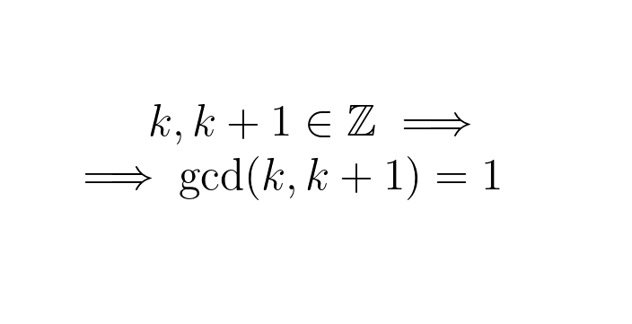

---
metadata:
    description: In this twitter proof I show that two consecutive integers have to be coprime.
title: 'Twitter proof: consecutive integers are coprime'
---

Let's prove that if $k$ is an integer, then $\gcd(k, k+1) = 1$. That is, any two consecutive integers are coprime.

===

# Twitter proof

<blockquote class="twitter-tweet">
Twitter proof: Let k be an integer and let d be the greatest common divisor of k and k+1. We have that (k+1)/d=k/d+1/d and both (k+1)/d and k/d are integers, so 1/d must be an integer and we can only have d=1.<a href="https://t.co/pItsAnueib">https://t.co/pItsAnueib</a>
&mdash; Mathspp (@mathsppblog) <a href="https://twitter.com/mathsppblog/status/1327660984266338321?ref_src=twsrc%5Etfw">November 14, 2020</a></blockquote>

Do you have an idea for a twitter proof? Let me know in the comments below!
