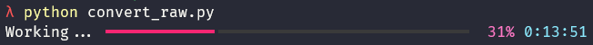

Learn how I used Python in my daily life to convert 5,000 RAW images into the JPEG format.

===


# Introduction

I have a folder with 4,902 RAW images and I want to convert them into the format JPEG to make it easier to share them with friends and family.

I wasn't sure how I would convert almost 5,000 RAW images into another format but Python had my back.
A quick Google search brought up [a similar Stack Overflow question][so-question] from someone trying to do something similar.

I installed the modules `rawpy` and `imageio` with `python -m pip install rawpy imageio` and it took me a couple of lines of code to convert my first image.

I added a loop to go over all the images, I added a [Rich] progress bar to see my code working, and I was done.

Here is a screenshot of the code showing the progress bar, so I know it is still doing work:



The full code for this script can be found below.
Now, I wonder...
How much time would I have spent if I did not know Python?!

```py
"""
Convert NEF images into JPG.

Credit to https://stackoverflow.com/q/59054975/2828287 and https://stackoverflow.com/a/66048939/2828287.
"""

import pathlib

import imageio
import rawpy
from rich.progress import track

FROM = pathlib.Path(...)  # Folder to read from.
TO = pathlib.Path(...)  # Folder to save images into.

images = list(FROM.glob("*"))

for img in track(images):
    with rawpy.imread(str(img)) as raw:
        rgb = raw.postprocess(rawpy.Params(use_camera_wb=True))
    new_location = (TO / img.name).with_suffix(".jpg")
    imageio.imsave(new_location, rgb)
```

[so-question]: https://stackoverflow.com/q/59054975/2828287
[rich]: https://rich.readthedocs.io/
