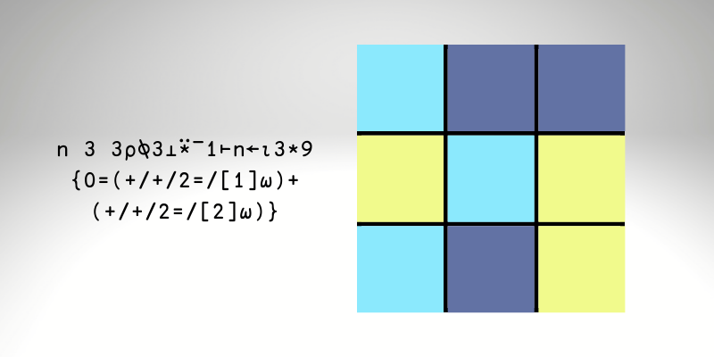

This is a short article on how I quickly used APL to verify my combinatorics calculations.

===




# Preamble

A local university runs a weekly challenge with mathematical problems
for everyone to solve.
This past week, the problem shared was a combinatorics problem that read as follows
(I'm paraphrasing):

“Consider a 3 by 3 grid of squares composing a mosaic.
In how many ways can we colour that mosaic, if we have 3 different colours
and if adjacent squares cannot share the same colour?”

In the problem statement, they clarify that “adjacent” means “horizontally or vertically adjacent”,
and they even give a hint
(skip to the next paragraph if you do not want _any_ spoilers!):
“number the squares from 1 to 9, and then work with the colours of the even squares.
That shall determine the colours of the odd squares.”.

Combinatorics has never been my strongest suit, but I wanted to solve this problem.
With that in mind, I sat down and started drafting my solution.

By the time I was done, I decided to quickly verify my solution with [APL],
a very neat programming language that I have been learning for the past 2 years.

This is the article of how it took me 30 seconds in APL to figure out my
solution had a problem.

 1. I'll start by showing you my flawed proof (as I wrote it);
 2. then, I'll tell you what I did in APL to check my solution;
 3. afterwards, I'll show you the mistake I made initially; and finally,
 4. I'll work a bit more on the APL code to make it cleaner.


# My initial solution

The text that follows was my initial solution to the problem I described above.
As a challenge for you, try to find the flaws in my reasoning/calculations.
Here we go.

“As per the problem statement hint, we'll number the squares in the grid:

```txt
1 2 3
4 5 6
7 8 9
```

Now we will study all the possible colourings as a function of the colours
attributed to squares 2, 4, 6, and 8.

The even squares can only use up to 2 colours,
otherwise square 5 won't have a possible colour.

Let's suppose that the even squares have a single colour.
In that case, the odd squares can be coloured arbitrarily.
That makes up for a total of $3 \times 3^5 = 3^6$ mosaics.

Now, let's assume that the even squares have 2 colours.
Let's fix the colour of square number 2,
which can be any one colour of the three available colours.
Next, there's either one, two, or three,
squares with a colour that is different from square 2,
but equal among themselves.
Let's consider these three cases separately.

We start with assuming there's only one square with a colour different
from the colour of square 2.
That colour can be any one of two colours.
Next, we just have to figure out in how many ways we can colour the odd squares.
That will depend on the position of the even square whose colour is
different from square 2.
Here are the three possible layouts,
where `⎕` denotes the colour of square 2,
`X` denotes the colour of the different square,
and `?` denotes the unknown colour of the odd squares:

 - case 1

```txt
? ⎕ ?
⎕ ? X
? ⎕ ?
```

 - case 2

```txt
? ⎕ ?
X ? ⎕
? ⎕ ?
```

 - case 3

```txt
? ⎕ ?
⎕ ? ⎕
? X ?
```

All these cases give the same number of total different colourings
because they are rotations of each other,
so let's just look at case 1.
In case 1, squares 1 and 7 can have 2 different colours each.
Squares 3, 5, and 9, have their colours fixed.
Hence, if the square 2 has a fixed colour, and only one of the other
even squares has a colour different from square 2, we get a total of
$3 \times 3 \times 2 \times 2^2 = 2^3 \times 3^2$ colourings.

Now, we assume that square 2 has a fixed colour,
and there are two other even squares with a colour different from square 2:

 - case 1

```txt
? ⎕ ?
X ? X
? ⎕ ?
```

 - case 2

```txt
? ⎕ ?
⎕ ? X
? X ?
```

 - case 3

```txt
? ⎕ ?
X ? ⎕
? X ?
```

Case 1 has 6 colourings.
Cases 2 and 3 have, each, $3 \times 2 \times 2^2$ colourings,
for a total of $3 \times 2^4$ colourings.

The only scenario that is missing is when square 2 has a fixed colour,
and all other even squares have another colour:

 - case 1

```txt
? ⎕ ?
X ? X
? X ?
```

This case has $3 \times 2 \times 2^2 = 2^3 \times 3$ colourings.

Therefore, we get a grand total of

$$
3^6 + (2^3 \times 3^2) + 6 + (2^4 \times 3) + (2^3 \times 3) = 879
$$

Thus, according to my calculations, there are 879 unique colourings.

Now, my calculations are wrong.
But at that point, I didn't know that.
(Did you find the mistake(s) already?)


# Verifying the solution with APL

At this point, I wanted to make sure I knew what I was doing.
For that matter, I just opened my APL interpreter and quickly
wrote a piece of code to check my solution.

My approach was the following:
generate all possible mosaics,
exclude the ones which do not satisfy the restriction where
adjacent squares must have different colours,
and count the valid ones.

## Generating all possible mosaics

Generating all possible mosaics was a walk in the park.

(Spoiler, so were all other steps!)

I quickly decided I would encode the 3 different colours as
0, 1, and 2, so I just needed to generate all 3 by 3 matrices
containing all combinations of 0s, 1s, and 2s, in all positions.

What I decided I could do was generate all sequences (of size 9)
of those three numbers, and then I'd reshape those sequences into
appropriate matrices to represent the grid.

Hence, I would go from

```APL
      seq
0 1 0 1 1 0 2 2 2
```

to

```APL
      3 3⍴seq
0 1 0
1 1 0
2 2 2
```

All I needed was to generate all possible sequences.

When you need to generate sequences of a fixed size,
and containing all combinations of a set of numbers,
recall that you probably want to use decode (`⊥`) for that.

In short, all the sequences that you care about can be seen as the digits
of a number, in a base that matches the number of different colours
I'm considering.

For example, the sequence above can be seen as the number 2537 in ternary:

```APL
      3⊥seq
2537
      3⊥⍣¯1⊢2537
1 0 1 1 0 2 2 2
      seq           ⍝ the leading 0 is missing from this example.
0 1 0 1 1 0 2 2 2
```

We know there are a total of $3^9$ sequences we care about,
so we just generate all digits from $0$ to $3^9 - 1$ and convert them
to ternary:

```APL
      3⊥⍣¯1⊢⍳3*9
0 0 0 0 0 0 0 0 0 0 0 0 0 0 0 0 0 0 0 0 0 0 0 ...
0 0 0 0 0 0 0 0 0 0 0 0 0 0 0 0 0 0 0 0 0 0 0 ...
0 0 0 0 0 0 0 0 0 0 0 0 0 0 0 0 0 0 0 0 0 0 0 ...
0 0 0 0 0 0 0 0 0 0 0 0 0 0 0 0 0 0 0 0 0 0 0 ...
0 0 0 0 0 0 0 0 0 0 0 0 0 0 0 0 0 0 0 0 0 0 0 ...
0 0 0 0 0 0 0 0 0 0 0 0 0 0 0 0 0 0 0 0 0 0 0 ...
0 0 0 0 0 0 0 0 0 1 1 1 1 1 1 1 1 1 2 2 2 2 2 ...
0 0 0 1 1 1 2 2 2 0 0 0 1 1 1 2 2 2 0 0 0 1 1 ...
0 1 2 0 1 2 0 1 2 0 1 2 0 1 2 0 1 2 0 1 2 0 1 ...
```

Now I need to transform each column into the appropriate mosaic.
That's easy, just transpose first, then use the rank operator (`⍤`)
to reshape each row of the matrix:

```APL
      boards ← 3 3∘⍴⍤1⍉3⊥⍣¯1⊢⍳3*9
      4↑boards
0 0 0
0 0 0
0 0 0
     
0 0 0
0 0 0
0 0 1
     
0 0 0
0 0 0
0 0 2
     
0 0 0
0 0 0
0 1 0
```

Now that we have all the $3^9 = 19683$ boards,
we just need to count those that are valid.


## Checking for board validity

Using windowed reductions with the equal function (`=`)
we can easily check if adjacent squares have the same colour:

```APL
      board ← 3 3⍴seq
      board
0 1 0
1 1 0
2 2 2
      2=/board
0 0
1 0
1 1
      2=⌿board
0 1 1
0 0 0
```


## Counting valid boards

We just need to apply this check to all the boards.
Once more, we can use the rank operator (`⍤`) to apply a function
to each sub-matrix within the 3D `boards` array.

If we create a function that checks if a board is valid,
and apply it to all the boards,
we can then sum the result to get a count of the valid boards:

```APL
      Valid ← {0=+/(2=⌿⍵),⍥,2=/⍵}
      Valid board
0
      +⌿Valid⍤2⊢boards
246
```

As you can see, the answer above is 246, not 879.

This is an article that is telling the story,
but when I did this on my own, I had spent between 30 and 60 seconds
to get to this answer in APL.

What's interesting, is that I still trust my combinatorics skills
more than I trust my APL skills (which is silly!) and,
as a result, I spent some minutes staring at my little APL code, wondering
if I had made a mistake in my program.

After some time, I thought “what if it's my calculations that are wrong?”.


# The mistake in the maths solution

When I looked at my calculations again, I noticed the blunder I had made:

“Let's suppose that the even squares have a single colour.
In that case, the odd squares can be coloured arbitrarily.
That makes up for a total of $3 \times 3^5 = 3^6$ mosaics.”

That's not correct!
If the even squares all have a single colour,
the 5 odd squares get to be any of the 2 colours that are left,
which makes for a total of $3 \times 2^5$ mosaics, not $3^6$.

Replacing this new number in the final calculation gives

$$
(2^5 \times 3) + (2^3 \times 3^2) + 6 + (2^4 \times 3) + (2^3 \times 3) = 246
$$

Now my calculations were correct!

At this point, I was happy with what I had written and was about
to submit it to the publishers of the problem.
Before I did that, I just pasted all 246 valid boards at the end of my
solution, just as a flex.
As it turns out, it's easy to get those with APL:

```APL
      boards⌿⍨Valid⍤2⊢boards
0 1 0
1 0 1
0 1 0
     
0 1 0
1 0 1
0 1 2
     
0 1 0
1 0 1
0 2 0
     
0 1 0
1 0 1
2 1 0

...
```


# Polishing the APL

After all this, I decided to go back to my APL code and see if I could polish it.

After all, I ended up using `⍤` quite a bit, in a “loopy fashion”.
I wanted to see if I could make my code more array-oriented.

As it turns out, and not surprisingly, I sure can!

First of all, a proper reshape `⍴` is all it takes to generate all boards:

```APL
      boards ← n 3 3⍴⍉3⊥⍣¯1⊢⍳n ← 3*9
      4↑boards
0 0 0
0 0 0
0 0 0
     
0 0 0
0 0 0
0 0 1
     
0 0 0
0 0 0
0 0 2
     
0 0 0
0 0 0
0 1 0
```

Second of all, I can do the adjacency checks on the whole 3D array!
I just have to use the correct axis for that:

```APL
      2=⌿[1]boards
1 1 1
1 1 1
     
1 1 1
1 1 0
     
1 1 1
1 1 0
     
1 1 1
1 0 1

...
      2=⌿[2]boards
1 1
1 1
1 1
   
1 1
1 1
1 0
   
1 1
1 1
1 0
   
1 1
1 1
0 0

...
```

In order to combine these two reductions,
that result in two 3D arrays with different shapes,
I just reduce each one separately into a vector:

 - one checks which boards have vertical same-colour adjacencies; and
 - the other checks which boards have horizontal same-colour adjacencies.

Finally, we sum the two together, and look for boards with _no_ same-colour
adjacencies:

```APL
      valid ← 0=(+/+/2=/[1]boards)+(+/+/2=/[2]boards)
      +/valid
246
      4↑valid⌿boards
0 1 0
1 0 1
0 1 0
     
0 1 0
1 0 1
0 1 2
     
0 1 0
1 0 1
0 2 0
     
0 1 0
1 0 1
2 1 0
```

Beautiful.
Really.
Writing “all this code” (two short lines, really!) was effortless.
It took much more time to write this sloppy blog article than this piece
of APL code!

This was fun, maybe I'll do it again in the future.
If you find this sort of article interesting, let me know in the comments below!
I tend to write mostly about Python, so this might be a bit
different from what you are used to.


[APL]: https://apl.wiki
