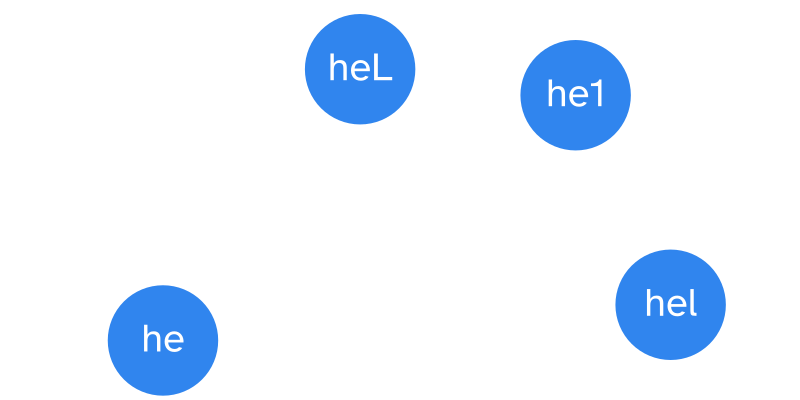
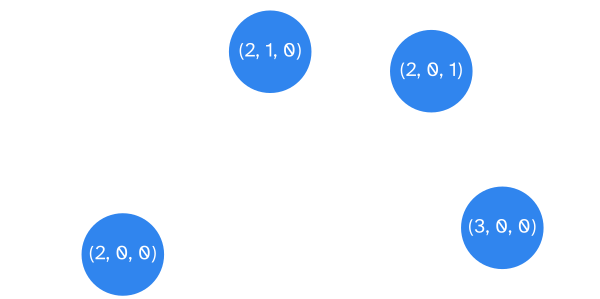
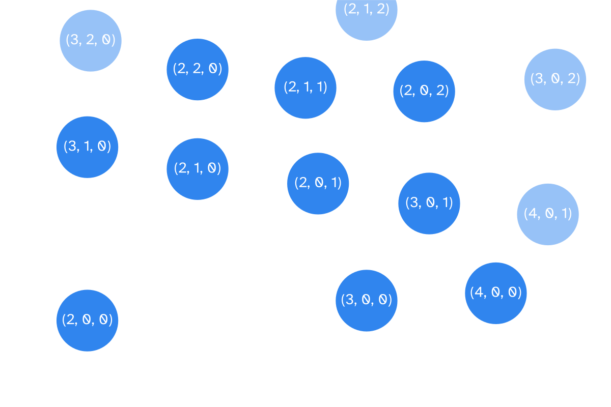

---
metadata:
    description: "In this article we use (finite state) automatons to count 698,438,863,898,480,640 passwords in a couple milliseconds."
title: "Counting passwords with automatons"
---

In this article we use (finite state) automatons to count
698,438,863,898,480,640 passwords in a couple milliseconds.

===

# Counting is easy

At one point or another in your maths education you were asked all
sorts of “how many are there” questions, like

 > “_If you have 5 pairs of jeans and 6 t-shirts, how many different outfits can you make?_”

These questions are _combinatorial_ questions, given that combinatorics is the branch
of mathematics that concerns itself with counting things.
(This is a reductive statement, but let's go with it for now.)

These questions can evolve and become more and more complicated as your maths education
progresses, and you even learn methods to be able to answer these more complicated questions.

Combinatorics has never been my strong suit so for many combinatorics problems I had to
solve I would check my answers with a short computer program that would do the counting
for me.
More often than not, I would follow the most basic route:
ask the computer to list _all possible alternatives_ and then count all of them.

This would work for simple problems like the one above, e.g.:

```py
>>> jeans = ["blue 1", "blue 2", "blue 3", "light", "dark"]
>>> tshirts = ["red", "green", "white", "pink", "yellow", "brown"]
>>> count = 0
>>> for j in jeans:
...     for t in tshirts:
...         print(j, t)
...         count += 1
...  
blue 1 red
blue 1 green
# ...
dark brown
>>> count
30
```

However, this strategy fails utterly if you are faced with more complex problems,
like

 > “_How many passwords of length between 8 and 10 (inclusive) are there,
 if the password must contain at least one lowercase letter, one uppercase letter,
 and one digit?_”


# Counting is hard

Well, everyone knows the answer to the previous question is 698,438,863,898,480,640,
but how do you tell a computer to count those up?
(To get to that number, I assumed we would be using the 26 latin characters,
upper and lowercase, and the 10 arabic digits zero through nine.)

You can ask the computer to generate all possible combinations of letters/digits,
and then only count the ones that are valid passwords.
This would work, right?
Yeah, it would work, but it would take you
[a little over 27 years](https://www.wolframalpha.com/input/?i=%2862%5E8+%2B+62%5E9+%2B+62%5E10%29%2F%281000000000%29+seconds+to+years)
_IF_ your computer could list 1 billion such combinations per second,
which is faster than most home computers (if not all!).
This shows that the simpler methods will not work, and we need to be smarter about it.

The next step in your thinking process might be the same as mine:
ok, instead of generating _all_ possible combinations, let's just
generate _all_ the passwords.
Ok, that is indeed much less, and now it would take
[only 22 years](https://www.wolframalpha.com/input/?i=698438863898480640%2F1000000000+seconds+to+years),
which means we just saved 5 years!
Good job!
Although, I should mention that in order to save these 5 years you would
have to write a computer program that is more complex,
because now we wouldn't want to blindly list all combinations of characters.


# Inclusion-exclusion principle

If you actually had to solve this specific problem, or a similar one,
with pen and paper, you would probably resort to the [inclusion-exclusion principle][wiki-iep],
which is a technique that helps you solving counting problems.

Alas, like I said, combinatorics has never been my strong suit.
Furthermore, the inclusion-exclusion principle can be really annoying to apply
because you get many intermediate values that you need to compute and keep track of.
We _could_ implement the inclusion-exclusion principle but,
to be _completely honest with you_, I didn't even consider it until I started
writing this blog post, which only happened _after_ I wrote the code
that uses automatons.

Either way, the inclusion-exclusion principle becomes very ugly very fast,
and I believe it would result in a less elegant program, or a less flexible one.


# Finite-state machines

If we are not going to implement the inclusion-exclusion principle, then what are we doing?
Automatons to the rescue!
An automaton in nothing more than a mathematical model for a machine that follows
a predetermined sequence of operations automatically.
Because we are dealing with a finite number of operations and steps,
we are dealing with a finite automaton, which is also often called a finite-state machine.

Bear with me for a second, while I tell you our goal in an abstract way:
we will build an automaton that builds valid passwords,
and then we will use it to count how many passwords exist
without having to actually build all the passwords.

To make everything more tractable and visible, think of an automaton
as a drawing with circles and arrows between the circles.
Each circle represents a state and the arrows represent the
actions you can take to go from one state to the other.
In our password-building example, part of our automaton could look like this:



Each circle represents a portion of a password we are building
and each arrow represents the type of character we can add to that password.
The image above shows that we have a password that is already two
characters long: "he".
The three arrows then point to "heL", "he1", and "hel",
with labels "uppercase", "digit", and "lowercase", respectively,
indicating the type of character we just added to our password.


## Generalising the states

This is similar to what we want to build,
except we do not want the circles to reflect the exact characters we have
used so far.
We want to build an automaton that is more general.
If we had a circle for each possible part of a password, we would be in
even greater trouble than in the beginning.
No, what we want is just to keep track of _how many characters of each type_
have been used so far.

For our case, each state of our automaton is just the number of
lowercase letters, uppercase letters, and digits that have been used so far.
With this approach we can abstract away the specific passwords that we are building,
and can instead focus on the structure of the password,
which is the only thing that really matters.
Having said that, let us represent the states of our automaton as triples, containing

 1. the count of lowercase letters used;
 2. the count of uppercase letters used; and
 3. the count of digits used.

Going back to the last figure, here is its new version:



With this change, our automaton now represents many more passwords,
because the lower-left corner represents _any_ string that contains
two lowercase letters, for example "ab", "fo" or "zz", but also, "he",
which was the specific state that we had in the previous automaton.

The idea is that we take this generic representation and expand it,
in order to represent the whole process of building a password,
as a sequence of operations, where each "operation" is "adding a character of a specific type".
If we add some more steps to the figure we just showed, we could get something like this:



In brighter blue and in white, you have all the states that you can get to in two steps,
assuming you start in the state that is on the lower-left corner of the figure.
Slightly greyed out are other states that would come up in later stages.


## Length of the password

It is important to note that in this new representation
of the states, in order to figure out the length of the password
we have built so far we just have to sum all the numbers in the triple.
For example, the state $(2, 3, 4)$ represents passwords of length
$2 + 3 + 4 = 9$, that contain 2 lowercase letters,
3 uppercase letters, and 4 digits.


## Counting paths

If the states represent the structure of our passwords, if the arrows
represent the action of "adding a character", and if what we want is to
count how many passwords exist, we just need to count how many passwords
the automaton can build.
In other words, we need to traverse the automaton, walking through the arrows,
and counting in how many ways we can go from some states to others.

For example, if you start with two lowercase letters, in how many ways
can you complete your password so that it ends up having two lowercase
letters, one uppercase letter, and one digit?
In other words, in how many different ways can you go from the state $(2, 0, 0)$
to the state $(2, 1, 1)$ in our automaton?

The answer corresponds to walking two different paths in our automaton:

 and (2, 1, 1).")

To go from $(2, 0, 0)$ to $(2, 1, 1)$ we can do one of two things:

 1. we can first add an uppercase letter (i.e., go to $(2, 1, 0)$) and then a digit; or
 2. we can first add a digit (i.e., go to $(2, 0, 1)$) and then an uppercase letter.

If we generate this structure with a bit of code,
we can then use a simple algorithm to walk the automaton and figure out how many paths
there are to build a password.


## Path multipliers

Now, walking the automaton only tells you in how many ways you can add different
types of characters to your password.
For example, we have seen that to go from a password with two lowercase letters
to another password that also has a digit and an uppercase letter, you could take
two routes:
`du` and `ud`, meaning you can first add a digit and then the uppercase letter
or the other way around.

However, in order to count the _total_ number of passwords,
we want more information than just the number of ways to build the structure of the
password.
Sure, it seems relevant to know that `ddul`, `duld`, and `ludd` are just some of the ways
to have passwords with two digits and one letter of each type, but how many
passwords with that structure are there?
`ddul` covers passwords like "35Tv" or "10Xz", but how many of those are there?

As it turns out, as soon as we know the structure of the password,
and in particular, as soon as we know the order in which the types of characters show up,
it becomes _really_ easy to count the passwords.
As a matter of fact, why don't you try to determine how many passwords there
are that follow a `ddul` structure?
Well, there's 10 digits, 26 lowercase letters, and 26 corresponding uppercase letters,
so your answer is

$$
\texttt{ddul} \rightarrow 10 \times 10 \times 26 \times 26 = 67600 ~~~.
$$

We can look at this as the establishing of a multiplier for each arrow:
each arrow is associated with a _type_ of character, and the
number of characters of that type is something that we know,
e.g. there are 10 digits.
This way, we can pair each arrow with its multiplier
and take those multipliers into account when walking the automaton.
This will let us count the total number of passwords while
we traverse the automaton,
instead of having to collect all the structural information to
perform the calculations later.


## Terminal states

There is just one final thing we need to go over before
being able to actually implement this algorithm,
and that is the notion of _terminal state_.
The _terminal states_ are the states of the automaton
that represent the end of the sequence of operations.
If we are building a password of length 10, for example,
the automaton would stop in states like $(10, 0, 0)$ or
$(5, 5, 0)$, because those represent passwords of length 10
and we do not want to add any more characters.

For our purposes, we want something slightly different, though.
In theory, the terminal states are such that the automaton
_should_ halt when it reaches them.
For the purposes of counting valid passwords,
instead we consider states where the automaton _could_
halt.
This is to mimic the fact that shorter passwords can be extended
to create longer passwords that are still valid:
that is, both the states of these shorter passwords and of the
extended passwords are relevant when we count the passwords,
so we want all of these to be considered terminal states.

This ends up being equivalent to the formal definition,
but is easier to work with in our case,
so we aren't cheating _that_ much.


# Implementation

!!! All the code is available [in this GitHub repository][gh-repo].

Now comes the fun part, which is to translate all of this into
code.
If you want to give it a go yourself,
I'm going to go ahead and give you the opportunity.
If my explanations above were clear enough, you should be able
to write the code by yourself.
If something wasn't clear, feel free to ask for clarifications
in the comments below.


## Separation of concerns

If you want an extra push, I'll leave an overview of the code
we will be writing.

We will divide things into two separate programs:

 1. implement a generic automaton that can count in how many
 ways said automaton can be traversed; and
 2. write some code to generate the states related to the specific
 restrictions of the passwords we want to count.


## Automaton

For the generic automaton, here is what we need:

 - states are tuples;
 - a dictionary will hold the list of states and related arrows:
   - each state has an entry in the dictionary;
   - each entry is a list and each element of the list concerns
     itself with one of the arrows coming _out_ of that state;
   - each arrow has a sequence representing all the possible
   values for that type of arrow and the new state we end up at;
 - the multiplier associated with each arrow is the length
 of the string with the characters;
 - we will have a list with the terminal states;

Recall the first figure we showed with triples as states?

, (3, 0, 0), (2, 1, 0) and (2, 0, 1), connected with three arrows.")

As an example, here is the dictionary holding the state transitions,
as we just described, in Python:

```py
import string

state_transitions = {
    (2, 0, 0): [
        (string.ascii_uppercase, (2, 1, 0)),
        (string.digits, (2, 0, 1)),
        (string.ascii_lowercase, (3, 0, 0)),
    ],
    (2, 1, 0): [],
    (2, 0, 1): [],
    (3, 0, 0): [],
}
```

Notice that we use `string.xxx` which are strings that contain
all the characters we care about:

```py
>>> import string
>>> string.ascii_uppercase
'ABCDEFGHIJKLMNOPQRSTUVWXYZ'
>>> string.ascii_lowercase
'abcdefghijklmnopqrstuvwxyz'
>>> string.digits
'0123456789'
```

Now that we know the information we need to store, we can
create the skeleton of our `Automaton` class:

```py
class Automaton:
    """Class that represents a finite state automaton."""
    def __init__(self, state_transitions, terminal_states):
        """Initialises a finite state automaton.

        `state_transitions` is a dictionary representing the state transitions
        and `terminal_states` is a container that holds all the terminal states.
        """

        self._state_transitions = state_transitions
        self._terminal_states = terminal_states

    def is_terminal(self, state):
        """Returns whether `state` is a terminal state for the automaton or not."""
        return state in self._terminal_states

    def count_terminal_paths(self, state):
        """Counts how many paths go from `state` to any terminal state."""
        pass
```

## Counting paths

In order to count paths, all we need to do is traverse the automaton.
If you paid enough attention and are familiarised with graph algorithms,
then you realised you can probably use your favourite graph search algorithm for our task.

We want to count all valid paths in an automaton that
start at `origin` and end up in a terminal state:

 - we look at all the states in `state_transitions[origin]`,
 because those are the ones that are immediately accessible
 from `origin`;
 - we recursively count how many paths go from those states to the terminal states;
 - we take into account the arrow multipliers;
 - we add `1` if the state we are at is also a valid
 terminal state.

The fact that we describe this algorithm recursively makes it
very simple to implement it:

```py
class Automaton:
    # ...

    def count_terminal_paths(self, state):
        """Counts how many paths go from `state` to any terminal state."""
        acc = int(self.is_terminal(state))
        for actions, next_state in self._state_transitions.get(state, []):
            acc += len(actions) * self.count_terminal_paths(next_state)
        return acc
```


## Branching recursion

However, we should be careful!
This problem lends itself to recursion but we should aways [watch out for recursion][pydont-recursion].
Because we have many arrows that can end up in the same place,
we have a case of [overlapping branching recursion][pydont-recursion-branching]
at hands.
Because we want our code to be efficient, what we can do is cache
the results as we go along.
This will be the difference between the code running instantaneously
or having to wait a lot for the results.

In order to cache the results, we can go ahead and write our own
cache decorator or reach out for something in the standard library,
like `functools.lru_cache`, but in our case it is actually
a good idea to bake it into our class:

```py
class Automaton:
    """Class that represents a finite state automaton."""
    def __init__(self, state_transitions, terminal_states):
        # ...
        self._count_terminal_paths_cache = {}

    # ...

    def count_terminal_paths(self, state):
        """Counts how many paths go from `state` to any terminal state."""
        if state not in self._count_terminal_paths_cache:
            acc = int(self.is_terminal(state))
            for actions, next_state in self._state_transitions.get(state, []):
                acc += len(actions) * self.count_terminal_paths(next_state)
            self._count_terminal_paths_cache[state] = acc
        return self._count_terminal_paths_cache[state]
```


## Testing the automaton

We can take this function for a very simple test-drive.
Let us use this class to count the number of passwords of length
between 1 and 3, that are made up of the letters "a" and "b".
Doing it by hand, we conclude there are 2 valid passwords of length
1,

 1. a
 2. b

4 valid passwords of length 2,

 1. aa
 2. ab
 3. ba
 4. bb

and 8 valid passwords of length 3,

 1. aaa
 2. aab
 3. aba
 4. abb
 5. baa
 6. bab
 7. bba
 8. bbb

for a total of 14 valid passwords.

Using our code, we would have to encode the state transitions
to create an `Automaton` instance and then call the function
that does the heavy lifting for us:

```py
# ...

if __name__ == "__main__":
    transitions = {
        0: [("ab", 1)],
        1: [("ab", 2)],
        2: [("ab", 3)],
        3: [],
    }
    terminal_states = [1, 2, 3]
    automaton = Automaton(transitions, terminal_states)
    print(automaton.count_terminal_paths(0))
```

We are really, really close to having everything running smoothly!
All there is left is being able to build the automaton that encodes
all the valid passwords.

Our passwords will have length greater than 3 and more than
just one type of valid character, so we can't write down the
automaton by hand (ok, we _can_, but we _won't_, it will have
thousands of states).

Let's go ahead and create an empty script that will import
our `Automaton` class and count passwords.

## Next possible states

Given the state $(2, 0, 0)$, what are the next possible states
for our password?
Well, it is just a matter of adding 1 to the number in each
index, which represents adding one character of that type.
Therefore, in a single line we can write a function that takes
a state and returns all the next possible states:

```py
def generate_next_pwd_states(s):
    return [s[:i] + (num+1,) + s[i+1:] for i, num in enumerate(s)]
```

And here is an example usage:

```py
>>> generate_next_pwd_states((2, 0, 0))
[(3, 0, 0), (2, 1, 0), (2, 0, 1)]
```

This is an important piece of the puzzle, but how do we
piece all the states together with the relevant arrows?
In other words, how do we build the dictionary that represents
the states and how to move between them?


## Building the state transitions

The answer: write a function!

We will have a function that receives the types of characters
that are available and then creates all of the states that
represent passwords _up to a limit length_.
This function will also create all the relevant arrows,
and then return everything in the dictionary we need for the
`Automaton` class.

In order to do this, we will maintain a queue of all the states
that we know _exist_ but still need to be added to the dictionary.
We initialise the queue with the state that is all zeroes,
and then we try to empty the queue by processing all the states
in it.
We go over the queue and process each state we find:

 - if the state represents passwords that are shorter than the
 maximum length, we use the function above to find out all the
 possible next states;
 - we add this state as a key to the dictionary, with its value
 being the list of types of characters paired up with the
 resulting states.
For the example with $(2, 0, 0)$ above, this would take $(2, 0, 0)$
and produce the entry

```py
(2, 0, 0): [
    (string.ascii_uppercase, (2, 1, 0)),
    (string.digits, (2, 0, 1)),
    (string.ascii_lowercase, (3, 0, 0)),
]
```

in the dictionary;
 - add all these new states to the queue if they aren't there yet.

Implementing this is fairly straightforward:

```py
def generate_state_transitions(classes, max_length):
    queue = [(0,) * len(classes)]
    state_transitions = {}

    while queue:
        state, *queue = queue
        if sum(state) < max_length:
            next_states = generate_next_pwd_states(state)
        else:
            next_states = []
        state_transitions[state] = list(zip(classes, next_states))
        for state_ in next_states:
            if state_ not in queue:
                queue.append(state_)

    return state_transitions
```

!!! If you don't know what `state, *queue = queue` does,
!!! then you are missing out on a fantastic Python feature
!!! that allows you to unpack sequences in a really neat way
!!! ([read about it here][pydont-star]).
!!! Also, `zip` is a fairly simple tool in Python that is
!!! often overlooked, so [go here][pydont-zip] if you need
!!! a refresher on how that works.

Here is an example usage, building the basic transitions
for the really short passwords with only "ab" as characters:

```py
>>> generate_state_transitions(["ab"], 3)
{(0,): [('ab', (1,))], (1,): [('ab', (2,))], (2,): [('ab', (3,))], (3,): []}
```

If you reformat that dictionary, you get

```py
{
    (0,): [('ab', (1,))],
    (1,): [('ab', (2,))],
    (2,): [('ab', (3,))],
    (3,): [],
}
```

which is basically what we had, except our code _always_ generates
tuples and my handwritten example used integers instead of one-item
tuples because I am sloppy :/

We now have the state transitions, we are just left with
identifying the terminal states before we can instantiate
our `Automaton` class.


## Identifying terminal states

What we have to do now is traverse the dictionary that tells
us how the state transitions work and collect all
the states that are relative to valid passwords.

In order to do that, we write a function that expects a predicate,
and produces a list comprehension with all the terminal states.
A “predicate” is a Boolean function that takes a state and returns
`True` if that state corresponds to a valid structure for a password.

If we are looking for passwords with lengths between 8 and 10
that have at least one lowercase letter, one uppercase letter, and
one digit, our predicate function is as simple as:

```py
valid_pwd = lambda s: 8 <= sum(s) <= 10 and all(s)
```

Recall that `sum(s)` is the length of the password
that is being represented by that tuple 
and the usage of `all(s)` checks if _all_ the positions of the state
tuple are at least 1:

```py
>>> all((2, 0, 0))
False
>>> all((2, 0, 1))
False
>>> all((2, 1, 1))
True
```

Finally, the function that identifies all terminal states is
another simple one-liner:

```py
def gather_terminal_states(state_transitions, is_valid_pwd):
    return [s for s in state_transitions if is_valid_pwd(s)]
```


# Counting passwords

With all the code that we have written (which isn't that much,
to be honest) we can now count all the 698,438,863,898,480,640
passwords that have length between 8 and 10, that contain at least
one lowercase letter, one uppercase letter, and one digit:

```py
import string
import time


class Automaton:
    """Class that represents a finite state automaton."""

    def __init__(self, state_transitions, terminal_states):
        """Initialises a finite state automaton.

        `state_transitions` is a dictionary representing the state transitions
        and `terminal_states` is a container that holds all the terminal states.
        """

        self._state_transitions = state_transitions
        self._terminal_states = terminal_states
        self._count_terminal_paths_cache = {}

    def is_terminal(self, state):
        """Returns whether `state` is a terminal state for the automaton or not."""
        return state in self._terminal_states

    def count_terminal_paths(self, state):
        """Counts how many paths go from `state` to any terminal state."""
        if state not in self._count_terminal_paths_cache:
            acc = int(self.is_terminal(state))
            for actions, next_state in self._state_transitions.get(state, []):
                acc += len(actions) * self.count_terminal_paths(next_state)
            self._count_terminal_paths_cache[state] = acc
        return self._count_terminal_paths_cache[state]


def generate_next_pwd_states(s):
    return [s[:i] + (num + 1,) + s[i + 1 :] for i, num in enumerate(s)]


def generate_state_transitions(classes, max_length):
    queue = [(0,) * len(classes)]
    state_transitions = {}

    while queue:
        state, *queue = queue
        if sum(state) < max_length:
            next_states = generate_next_pwd_states(state)
        else:
            next_states = []
        state_transitions[state] = list(zip(classes, next_states))
        for state_ in next_states:
            if state_ not in queue:
                queue.append(state_)

    return state_transitions


def gather_terminal_states(state_transitions, is_valid_pwd):
    return [s for s in state_transitions if is_valid_pwd(s)]


if __name__ == "__main__":
    # Configure the password:
    classes = [
        string.ascii_uppercase,
        string.ascii_lowercase,
        string.digits,
    ]
    MIN_LENGTH = 8
    MAX_LENGTH = 10
    is_valid_pwd = lambda s: MIN_LENGTH <= sum(s) <= MAX_LENGTH and all(s)

    state_transitions = generate_state_transitions(classes, MAX_LENGTH)
    terminal_states = gather_terminal_states(state_transitions, is_valid_pwd)

    automaton = Automaton(state_transitions, terminal_states)
    start = time.perf_counter()
    print(automaton.count_terminal_paths((0,) * len(classes)))
    elapsed = time.perf_counter() - start
    print(f"Counted in {elapsed:.6f}s.")
```

This script produces the following output for me:

```
 > python .\count_passwords.py
698438863898480640
Counted in 0.000436s.
```

Pretty impressive, hun?
From 22 years down to 0.0004 seconds.
That is a speed-up by a factor of more or less a 1.7 **trillion**!

## Checking the correctness

This is pretty impressive, but at this point
I wouldn't be able to tell if my program was counting correctly
or not, so I decided to do a not-so-trivial empirical test.

I went online and found two questions on [math.stackexchange.com][math-se] that ask for the number of passwords that follow
some restrictions.
For one of them we know the answer from the textbook,
and for both of them we have other skilled people actually
answering (with explanations) so we can look at the explanations
and be convinced that the answers are correct.

The first one was the one we covered throughout this article.
The other one reads [more or less][math-se-q2] as follows:

 > “_How many passwords are there with length between 6 and 8,
 made up of uppercase letters and digits, and that contain
 at least one digit?_”

This question comes with the answer from the textbook,
which is 2,684,483,063,360,
plus an explained answer that also produces that value.

What answer does our code come up with?
Because we wrote a fairly generic piece of code,
it is really easy to adapt it to this situation:

```py
if __name__ == "__main__":
    # Solve https://math.stackexchange.com/q/2452401/329832,
    # which should give 2,684,483,063,360

    # Configure the password:
    classes = [
        string.ascii_uppercase,
        string.digits,
    ]
    MIN_LENGTH = 6
    MAX_LENGTH = 8
    # Predicates:
    predicates = [
        lambda s: MIN_LENGTH <= sum(s) <= MAX_LENGTH,   # valid length?
        lambda s: s[1],                                 # has a digit?
    ]
    is_valid_pwd = lambda s: all(pred(s) for pred in predicates)

    state_transitions = generate_state_transitions(classes, MAX_LENGTH)
    terminal_states = gather_terminal_states(state_transitions, is_valid_pwd)

    automaton = Automaton(state_transitions, terminal_states)
    start = time.perf_counter()
    print(automaton.count_terminal_paths((0,) * len(classes)))
    elapsed = time.perf_counter() - start
    print(f"Counted in {elapsed:.6f}s.")
```

Notice that I have now broken up the `is_valid_pwd`
function into a series of smaller predicates,
so that it becomes even easier to count
different types of passwords.

Also, checking if the password has at least one digit is the
same as checking the position at index 1 of the state
(because the digits are in position 1 of the `classes` list),
and we do so with `lambda s: s[1]`.

Running this gives

```
 > python .\count_passwords.py 
2684483063360
Counted in 0.000040s.
```

With these two checks I am fairly confident that the code is
good to go.


# Load test

For our final load test, we want to see how many different
passwords there are with lengths between 8 and 20,
containing at least one of each of the following:

 - lowercase letters;
 - uppercase letters;
 - digits; and
 - special symbols ``!"#$%&'()*+,-./:;<=>?@[\]^_`{|}~``.

The configuration is now:

```py
if __name__ == "__main__":
    # Configure the password:
    classes = [
        string.ascii_lowercase,
        string.ascii_uppercase,
        string.digits,
        string.punctuation,
    ]
    MIN_LENGTH = 8
    MAX_LENGTH = 20
    # Predicates:
    predicates = [
        lambda s: MIN_LENGTH <= sum(s) <= MAX_LENGTH,   # valid length?
        all,
    ]
```

and that produces

```
 > python .\count_passwords.py
2613279260982103214130338931095048847360
Counted in 1.2325s.
```

I can't read that number, but [I'm told](https://www.wolframalpha.com/input/?i=2613279260982103214130338931095048847360+in+words)
that it's read as

 > “2 duodecillion 613 undecillion 279 decillion 260 nonillion 982 octillion 103 septillion 214 sextillion 130 quintillion 338 quadrillion 931 trillion 95 billion 48 million 847 thousand 360”

If we were to list all those passwords, at the rate of 1 billion
per second, [we would need $8.287 \times 10^{22}$ years](https://www.wolframalpha.com/input/?i=2613279260982103214130338931095048847360%2F1000000000+seconds+in+years).
That's $6 \times 10^{12}$ longer than the current age of the universe.
I can't fathom these numbers...
Let's just agree they are _LARGE_.

# Final code

If you want to take a look at the final code,
then go ahead and check [the GitHub repository][gh-repo].

[wiki-iep]: https://en.wikipedia.org/wiki/Inclusion%E2%80%93exclusion_principle
[gh-repo]: https://github.com/RodrigoGiraoSerrao/projects/tree/master/automatons
[pydonts]: /blog/pydonts
[pydont-recursion]: /blog/pydonts/watch-out-for-recursion
[pydont-recursion-branching]: https://mathspp.com/blog/pydonts/watch-out-for-recursion#branching-overlap
[pydont-zip]: /blog/pydonts/zip-up
[pydont-star]: /blog/pydonts/unpacking-with-starred-assignments
[math-se]: https://math.stackexchange.com
[math-se-q2]: https://math.stackexchange.com/q/2452401/329832
