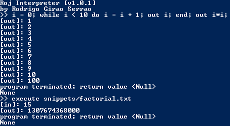

Este artigo conta a história (curta) de como criei um interpretador para uma linguagem de programação!

===

Python é a linguagem de programação com a qual estou mais confortável (de longe!). A certa altura ouvi dizer que Python tinha sido feito com C. O que quer que fosse que isso quisesse dizer... E a certa altura comecei a pensar neste assunto desta maneira: as linguagens de programação servem para criar programas. Alguém usou C para criar um programa que serve para criar outros programas! E isto deixou-me satisfeito.

Num outro momento da minha vida, ganhei algum interesse por compiladores e por interpretadores. Numa das minhas pesquisas encontrei [este](https://ruslanspivak.com/lsbasi-part1/) artigo. Gostei do que li e comecei a seguir a série de artigos "Let's Build a Simple Interpreter" para escrever o meu interpretador de Pascal com Python (que é o objetivo dessa série de artigos).

Na altura só havia 5 ou 6 artigos nessa série e eu consegui atingir esse ponto com alguma facilidade. Também reparei que o intervalo de tempo entre artigos era considerável e decidi deixar de seguir a série, ponto em que inventei um pouco e criei a linguagem de programação a que chamei **Roj**.

O produto final foi uma linguagem de programação simples com os elementos habituais, tais como os ciclos ``while`` e as expressões ``if-else``. O código fonte do interpretador e alguns programas pequenos escritos em Roj podem ser encontrados [neste](https://github.com/RojerGS/Roj) repositório do GitHub. Aí também se pode encontrar a minha tentativa de formalizar a gramática do Roj com [_notação BNF_](https://en.wikipedia.org/wiki/Backus%E2%80%93Naur_form).

Para se conseguir correr os programas escritos em Roj, há que correr o ficheiro ``RojInterpreter.py``, que começa um ciclo REPL (Read-Evaluate-Print-Loop). Podem escrever código Roj numa linha ou escrever _execute ficheiro_, onde _ficheiro_ é o nome do ficheiro com o programa que querem executar:

Por favor notem que o ciclo REPL **não** grava as variáveis de umas linhas para as outras. Se quiserem escrever um programa Roj diretamente no ciclo REPL têm de o fazer numa única linha.

Também podem experimentar correr o código online; só precisam de carregar no botão cinzento no topo do artigo, carregar no botão verde que diz **Run** no site do Repl.it e podem colar este código Roj na consola:

``readint n; out "The square of your number is"; out n*n;``

Deixem o vosso feedback nos comentários, em baixo!