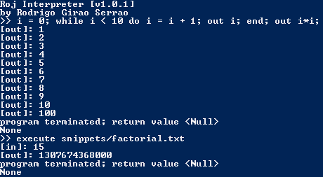

This blog post tells the short story of how I wrote a simple interpreter for a toy programming language!

===

Python is the programming language I am more comfortable with, by far; at an early stage of my learning I heard that Python was built on top of C. Whatever that meant. Then I started thinking of it in this way: programming languages are used to build programs. Someone used C to create another program, that can be used to create even more programs! That seemed reasonable.

At some point in time I got interested in compilers and interpreters and all those weird things, and I came across [this](https://ruslanspivak.com/lsbasi-part1/) wonderful blog post. I immediately started following the "Let's Build a Simple Interpreter" series to write my own Pascal interpreter with Python, which is the aim of that series.

At that time there were only 5 or 6 posts, and I got to the point where I had done everything he told us to do and couldn't wait for the other posts, as I noticed the frequency with which the author posted in that series was rather low. At that point, my project's aim diverged of that of the blog and I tried using what I had learned to create a very basic programming language I called **Roj**.

The end product of that is a programming language with some common constructs, such as the ``while`` loop and the ``if-else`` statement. The code and some snippets written in Roj can be downloaded from [this GitHub repo](https://github.com/RodrigoGiraoSerrao/Roj). In there you can also find my attempt at formalising Roj's grammar with [_BNF notation_](https://en.wikipedia.org/wiki/Backus%E2%80%93Naur_form).

To run one of the snippets, run the `RojInterpreter.py` file, which starts a REPL. You can type Roj programs in one line or you can type _execute filename_ where _filename_ is the path to the file you want to execute:

Please bear in mind that the REPL does **not** save variables and whatnot from the previous lines. If you want to type a Roj program directly into the REPL, it will have to be a one-liner.

You can also run the code online; just click the button on top of the article, hit the green **Run** button at the Repl.it website and try pasting this Roj code in the console:

``readint n; out "The square of your number is"; out n*n;``

Let me know, down in the comments, what you think!