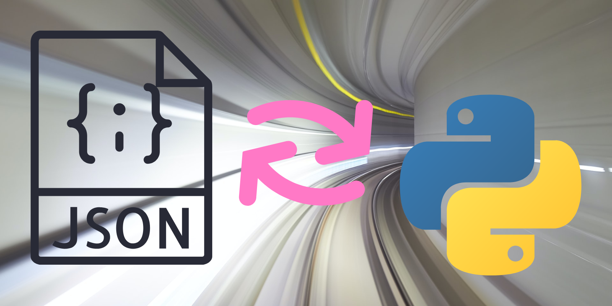

This article explains how to extend the JSON format by using a custom encoder and a custom decoder to turn arbitrary Python objects into JSON and back.

===



# Custom JSON encoder and decoder

The Python module `json` allows you to work with the JSON data format.
In previous articles,
I've written about doing [custom JSON encoding][til-json-encoder] of arbitrary Python objects
and [custom JSON decoding][til-json-decoder] _into_ arbitrary Python objects.

In this article I want to define a system that makes it easy to extend the JSON format,
so that we can encode more Python objects into JSON and back.

My goal is to define a mechanism through which you can easily define small, atomic encoders and decoders,
and to have them all operate together.


# Extending the JSON format

I think it will be easier to understand what I want to achieve if I show you how I want the end product to look like.

Suppose that you want to extend the JSON format so that you can also encode and decode complex numbers and Python `range` objects.
This is what you want to do.
How do you achieve that?

When you are done with the article, you will be able to define something like this:

```py
class ComplexAndRangeEncoder(...):
    def encode_complex(self, c):
        return {"real": c.real, "imag": c.imag}

    def encode_range(self, r):
        return {"start": r.start, "stop": r.stop, "step": r.step}


class ComplexAndRangeDecoder(...):
    def decode_complex(self, obj):
        return complex(obj["real"], obj["imag"])

    def decode_range(self, obj):
        return range(obj["start"], obj["stop"], obj["step"])
```

Then, you will be able to use these two classes as the `cls` argument to the `json` methods,
enabling you to encode complex numbers and ranges to JSON, and then decoding them back.

The point, here, is that I want to make it as easy as possible to extend the JSON standard,
simply by providing the encoders and the decoders for each new type you want to be able to handle.


# Automatically recognising non-standard JSON

The main issue I have to struggle with is in defining the mechanism that will allow the custom JSON decoder to recognise that certain JSON objects should actually be parsed into something else.
For example, in the previous [article about custom JSON decoding][til-json-decoder],
I showed how to convert the following JSON:

```json
{
    "real": 1.0,
    "imag": 2.0
}
```

into the Python complex number $1 + 2i$:

```py
(1+2j)
```

However, suppose that we actually have the following Python dictionary:

```py
dict_looks_like_complex = {
    "real": 1.0,
    "imag": 2.0,
}
```

If we convert this dictionary to JSON, we get a string:

```json
'{"real": 1.0, "imag": 2.0}'
```

Now, if we use our custom decoder, we will get a complex number back instead of the original dictionary!
Why?
Because complex numbers and some dictionaries have the same JSON representations.

! In mathematical terms, we say that the JSON encoding is not injective.
! After all, I can find two objects `obj1` and `obj2` such that `obj1 != obj2` and yet
! `json.dumps(obj1) == json.dumps(obj2)`.

We have two options here:

 - assume these collisions aren't troublesome and decide to not worry about them; or
 - try to tweak the JSON encoding so that it becomes injective (or, at least, “as injective as possible”).

I will go with the second option.


# Adapting the JSON format to be injective

The strategy that I will implement will revolve around using (JSON) dictionaries to encode our new arbitrary types,
together with the usage of a special key to disambiguate between the non-standard encodings and native Python dictionaries that were unlucky enough to look like something else.


## Special key

Let us say that the special key will be something like `"__extended_json_type__"`.
Thus, whenever we encode a non-standard object into JSON, we have to annotate the resulting dictionary with that key.
The value of the key will indicate what is the type of the original object.

For example, here is what a complex number could look like:

```py
>>> json.dumps(1+2j)
"""{
    "__extended_json_type__": "complex",
    "real": 1.0,
    "imag": 2.0
}"""
```

As another example, a `range` could look like this:

```py
>>> json.dumps(range(1, 10, 3))
"""{
    "__extended_json_type__": "range",
    "start": 1.0,
    "stop": 10.0,
    "step": 3.0
}"""
```

By providing the key `"__extended_json_type__"`, the decoder will know this was not a native Python dictionary and will be able to reconstruct the intended objects.
Except...


## Native dictionaries with the special key

Suppose that, _for some annoying reason_,
you have the following Python dictionary:

```py
dict_ = {
    "__extended_json_type__": "complex",
    "real": 1.0,
    "imag": 2.0
}
```

If you encode this to JSON, you will end up with the exact same JSON as the one we got for the complex number `(1+2j)`...
So, are we back at square one?

I don't think so.
The special key will help the decoder know what type of object it should build out of the non-standard JSON.
The special key also makes it _less likely_ for collisions to happen,
although it does not get rid of them entirely.


# Implementing the encoding mechanism

At this point, I already have a pretty clear picture of what I have to do, and how, so let me show you the code and walk you through it.

```py
import json


class ExtendedEncoder(json.JSONEncoder):
    def default(self, obj):
        name = type(obj).__name__
        try:
            encoder = getattr(self, f"encode_{name}")
        except AttributeError:
            super().default(obj)
        else:
            encoded = encoder(obj)
            encoded["__extended_json_type__"] = name
            return encoded
```

This isn't a lot of code, but it is not your typical `for` loop,
so you may need to read the code twice to get what it is doing.
Let me give you a hand:

 1. The first thing to understand is that we are overriding the method `.default` from `json.JSONEncoder`,
 because that is what you have to do in order to implement [custom JSON encoding of Python objects][til-json-encoder-custom].
 2. We start by getting the name of the type of the object we want to encode. You can read about the [dunder attribute `__name__`][pydont-name] in a Pydon't I wrote. To make this explanation simpler, suppose `obj = complex(1, 2)`. Then, `name = "complex"`.
 3. We look for a method whose name starts with `encode_` and that is then followed by the name of the type at hands.
 In our example, we look for a method called `encode_complex`.
 4. If the method doesn't exist, the call to `getattr` will raise an `AttributeError`, which we catch.
 At this point, the encoder has no idea how to encode the object of the given type, so we call the method `.default` of the parent class,
 because that is what the `json` documentation says we should do.
 5. If the method exists, we enter the `else` and we get to use the encoder to encode the object we have.
 6. After encoding, we tag the encoding with the special key and we return it.

This is what the code is doing.
If something isn't clear, feel free to ask for further clarifications!

The decoding mechanism follows a similar approach, as I will show you next.


# Implementing the decoding mechanism

Here is the code for the decoding mechanism:

```py
import json


class ExtendedDecoder(json.JSONDecoder):
    def __init__(self, **kwargs):
        kwargs["object_hook"] = self.object_hook
        super().__init__(**kwargs)

    def object_hook(self, obj):
        try:
            name = obj["__extended_json_type__"]
            decoder = getattr(self, f"decode_{name}")
        except (KeyError, AttributeError):
            return obj
        else:
            return decoder(obj)
```

We subclass `json.JSONDecoder` and, in the method `__init__`,
we set the parameter `object_hook` to the object hook that we define.
This is the object hook responsible for parsing non-standard JSON back into the original Python objects.

The object hook, itself, just undoes what the encoder does:

 1. We try to get the name of the original type and use it to find a method that is named accordingly.
 For example, for a complex number, we would want a method `decode_complex`.
 2. If there is no type name information or if we can't find the appropriate decode method,
 then we weren't supposed to be doing any fancy decoding and just return the original object.
 3. Otherwise, we use the decoder to decode the object we have.

Now that we have defined the encoding and decoding mechanisms,
we can extend the JSON standard with, for example, complex numbers and Python `range` objects:


# Extending JSON with complex numbers and `range` objects

Assuming you have the definitions of `ExtendedEncoder` and `ExtendedDecoder`,
this is how you could extend JSON to support complex numbers and `range` objects:

```py
import json


class ExtendedEncoder(json.JSONEncoder):
    ...


class ExtendedDecoder(json.JSONDecoder):
    ...


class MyEncoder(ExtendedEncoder):
    def encode_complex(self, c):
        return {"real": c.real, "imag": c.imag}

    def encode_range(self, r):
        return {"start": r.start, "stop": r.stop, "step": r.step}
        

class MyDecoder(ExtendedDecoder):
    def decode_complex(self, obj):
        return complex(obj["real"], obj["imag"])

    def decode_range(self, obj):
        return range(obj["start"], obj["stop"], obj["step"])
```

Then, you can use the custom encoder to encode some complex numbers and `range` objects:

```py
my_data = {
    "hey": complex(1, 2),
    "there": range(1, 10, 3),
    73: False,
}

json_data = json.dumps(my_data, cls=MyEncoder)
```

Obviously, you can also go back to retrieve the original data:

```py
decoded = json.loads(json_data, cls=MyDecoder)
print(decoded)
# {'hey': (1+2j), 'there': range(1, 10, 3), '!': False}
```

And that's it!


# Conclusion

The classes `ExtendedEncoder` and `ExtendedDecoder` provide a convenient way of extending the JSON standard:

 - subclassing `ExtendedEncoder` lets you define JSON encodings for non-standard Python objects; and
 - subclassing `ExtendedDecoder` lets you define the way in which the JSON is decoded back into the original objects.

!!! I went through all this trouble because I needed this for another project of mine,
!!! so I'll package this up and open source it!
!!! Stay tuned!


[til-json-encoder]: /blog/til/custom-json-encoder
[til-json-decoder]: /blog/til/custom-json-decoder-part-2
[til-json-encoder-custom]: /blog/til/custom-json-encoder#custom-json-encoding-of-python-objects
[pydont-name]: /blog/pydonts/name-dunder-attribute

That's it for now! [Stay tuned][subscribe] and I'll see you around!

[subscribe]: /subscribe
