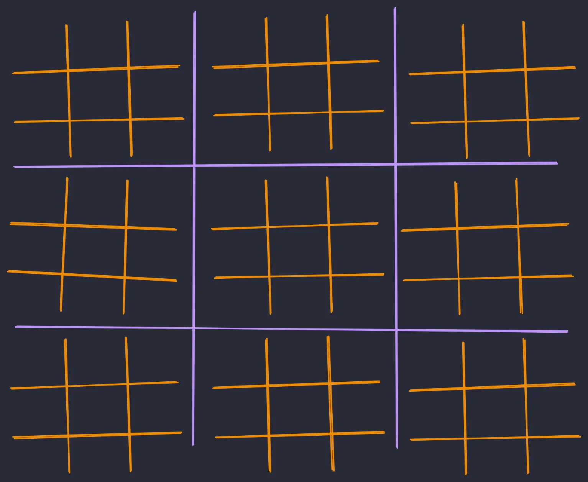

This article shows how to use the Python built-in `divmod` for unit conversions.

===


The built-in `divmod` is the built-in that tells me that 45813 seconds is the same as 12 hours, 43 minutes, and 33 seconds.
But how?

The built-in `divmod` gets its name from two arithmetic operations you probably know:

 1. DIVision; and
 2. MODulo.

So, the built-in `divmod` takes two arguments and returns two numbers.
The first one is the division of the arguments and the second one is the module of the arguments.
Sounds simple, right?
That's because it is!

```pycon
>>> x, y = 23, 10
>>> divmod(x, y)
(2, 3)
>>> (x // y, x % y)
(2, 3)

>>> x, y = 453, 19
>>> divmod(x, y)
(23, 16)
>>> (x // y, x % y)
(23, 16)
```

So, when can `divmod` be useful?
Literally when you want to divide two numbers and also know what's the remainder of that division.

In practice, `divmod` shows up a lot when converting one small unit to more convenient units.
That's a common use case, at least.


## Example with time units

45813 seconds is A LOT of seconds and most people just prefer to use the units of hours and minutes to talk about that many seconds!
So, how do we convert 45813 into its corresponding number of hours and minutes?

We can use `divmod` to divide 45813 by 60, which will convert 45813 seconds to minutes, and also let us know how many seconds couldn't be converted to minutes:

```pycon
>>> divmod(45813, 60)
(763, 33)
```

Then, we take the total number of minutes and repeat the same process to figure out how many hours we have.

```pycon
>>> divmod(763, 60)
(12, 43)
```

If you put everything together, it looks like this:

```pycon
>>> seconds = 45813
>>> minutes, seconds = divmod(seconds, 60)
>>> hours, minutes = divmod(minutes, 60)
>>> hours, minutes, seconds
(12, 43, 33)
```

Is this making sense?
Try to convert 261647 seconds into days, hours, minutes, and seconds!


## Example with grid click

I have another example that you might enjoy.
There's this weird game I play sometimes called “meta tic-tac-toe”.
(At least, that's what we called it in uni.)
It's 9 tic-tac-toe games embedded in a larger tic-tac-toe game.

The board is shown below:




The rules aren't SUPER important now (although it's a pretty fun game).
What matters now is that I wanted to implement this game in Python.

To do that, when a user clicks on the board, I need to know what's the purple (outer) cell that is being clicked.
I also need to know what's the orange (inner) cell that is being clicked!
The question is:
how would I compute that?

Suppose the board is a 900 pixel square and everything is evenly spaced.
If I click at position `(423, 158)`, what are the outer and inner cells I clicked?

.")

We can figure out the outer and inner cells with the built-in `divmod`!
By using the width of the outer and inner separations, we can compute the position of the click.

```pycon
>>> x_pos = 423
>>> x_outer, x_pos = divmod(x_pos, 300)
>>> x_inner, _ = divmod(x_pos, 100)

>>> y_pos = 158
>>> y_outer, y_pos = divmod(y_pos, 300)
>>> y_inner, _ = divmod(y_pos, 100)

>>> (x_outer, y_outer)
(1, 0)  # Middle column, top row
>>> (x_inner, y_inner)
(1, 1)  # Left column, middle row
```

Again, we went from a small unit (pixels) to more convenient units (outer and inner cells).


## Converting computer memory units

Here's a final challenge for you.
Say I have a huge object in memory that is taking up `25895632957` bits.
How much memory is that in more decent units?
(A byte has 8 bits, a kilobyte has 1024 bytes, a megabyte has 1024 kilobytes, etc.)
