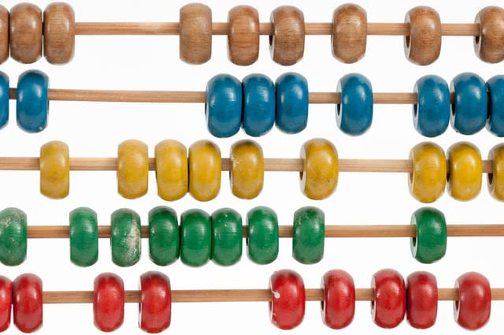

Progress is great and new things are always exciting... but that doesn't mean old things don't have any value!

===

Very recently I watched a [Youtube video](https://www.youtube.com/watch?v=CwT9oZtfRYw) posted by my friend [MathGurl](https://www.youtube.com/channel/UC5RV_s1Jh-jQI4HfexEIb2Q), in which she explained the ancient Egyptian multiplication method. At the same time, and for no particular reason, I remembered Haskell, so I decided to implement the method. It was not a big feat of programming, but I did enjoy relearning the basics of Haskell I once knew. You can find the file with the implementation in [this GH file](https://github.com/RodrigoGiraoSerrao/projects/blob/master/misc/egyptianMult.hs) or right here:

(The implementation only works for non-negative integers)

The method is quite simple and works because of the binary expansion of a number. Basically, if you want to calculate $a \times b$, either $b$ is even or odd. If $b$ is even, just cut $b$ in half and duplicate $a$ to compute $(2a)\times(\frac{b}2)$. If $b$ is odd, then $ab = a + (2a)\times\frac{b-1}2$. Another way of thinking about this is by writing $b$ in the form

\[
b = 2^{k_1} + 2^{k_2} + \cdots + 2^{k_n}
\]

and then having 

\[
a\times b = a(2^{k_1} + 2^{k_2} + \cdots + 2^{k_n}) = a2^{k_1} + a2^{k_2} + \cdots + a2^{k_n}.
\]

If I muster the courage to do it, I might also redo the functions in the [post about Kleene recursive functions](../kleene-recursion), in Haskell...
