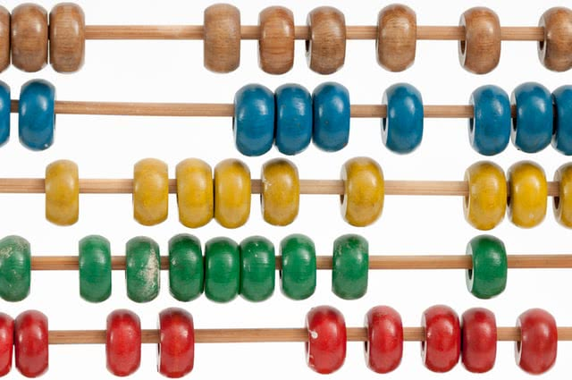

Inovação é algo incrível e coisas novas são sempre interessantes... mas isso não quer dizer que as coisas antigas não tenham valor!

===

Recentemente vi um [vídeo no Youtube](https://www.youtube.com/watch?v=CwT9oZtfRYw) de uma amiga minha, a [MathGurl](https://www.youtube.com/channel/UC5RV_s1Jh-jQI4HfexEIb2Q), no qual ela explica o método antigo que os egípcios usavam para fazer multiplicações. Por razão nenhuma, mais ou menos ao mesmo tempo que via o vídeo lembrei-me de Haskell e decidi implementar o método de multiplicação em Haskell. Não foi um feito particularmente incrível, mas podem encontrar a implementação [neste ficheiro no GH](https://github.com/RojerGS/projects/blob/master/misc/egyptianMult.hs) ou já aqui em baixo:

(A implementação só funciona para inteiros não negativos.)

O método é simples e tem por base a expansão binária de um número. Basicamente, para calcular $a \times b$ vemos se $b$ é par ou ímpar. Se $b$ for par, então cortamos $b$ ao meio e duplicamos $a$ para calcular $(2a) \times \frac{b}2$. Se $b$ for ímpar, então $ab = a + (2a)\times\frac{b-1}2$. Outra maneira de ver isto é escrevendo $b$ como

\[
b = 2^{k_1} + 2^{k_2} + \cdots + 2^{k_n}
\]

e depois vermos que temos

\[
a \times b = a(2^{k_1} + 2^{k_2} + \cdots + 2^{k_n}) = a2^{k_1} + a2^{k_2} + \cdots + a2^{k_n}.
\]

Se algum dia tiver coragem, talvez reescreva as funções do [post sobre funções recursivas "à Kleene"](../kleene-recursion) em Haskell...
