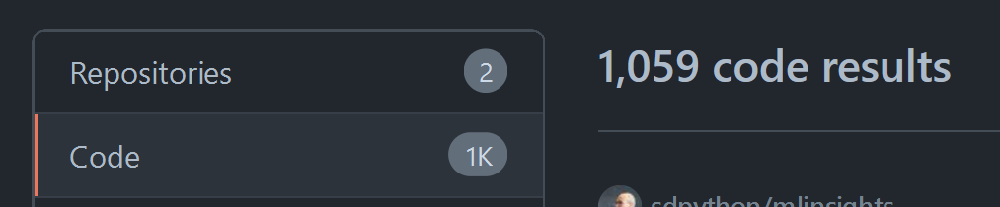

Learn how I found over +10,000 bugs in Python code all over GitHub and how all those bugs could have been fixed by importing the Python module string and using the constants `ascii_lowercase` and `ascii_uppercase`.

===

# Finding the bugs

Yesterday, or two days ago, I was sitting down at my desk and doing some Python work.
Then, all of a sudden, I thought “No... It can't be... Can it?”...

Immediately, I opened the [GitHub search](https://github.com/search) and typed a search query...
And immediately got 1,059 search results back, which means approximately 1,000 bugs.



And this was just one query.
25 search queries later, I had found over 10,000 bugs in Python code all over GitHub.

What bug am I talking about?

Misspelling the alphabet!

At the time of writing, there are over 10,000 occurrences of misspelt Latin alphabets!
Isn't that a shame?
Of all the intricacies and subtleties of Python, your code will be buggy because you forgot a letter?


# Fixing the bugs with the `string` constants

The Python module `string` contains many useful constants that you can use.
Here are some of them:


## ASCII letters in Python

If you need the 26 ASCII letters in Python, consider using the constants from the module `string`.
Use `ascii_lowercase` for the lowercase letters, `ascii_uppercase` for the uppercase letters, and `ascii_letters` for the lowercase and uppercase letters combined:

```py
>>> import string
>>> string.ascii_lowercase
'abcdefghijklmnopqrstuvwxyz'
>>> string.ascii_uppercase
'ABCDEFGHIJKLMNOPQRSTUVWXYZ'
>>> string.ascii_letters
'abcdefghijklmnopqrstuvwxyzABCDEFGHIJKLMNOPQRSTUVWXYZ'
```


## `string` constants for digits

The module `string` also contains three constants that contain the digits of numbers written in the decimal, hexadecimal, and octal systems:

```py
>>> import string
>>> string.digits
'0123456789'
>>> string.hexdigits
'0123456789abcdefABCDEF'
>>> string.octdigits
'01234567'
```


## Other useful `string` constants

Just for the sake of completeness, let me tell you that the module `string` also has constants that contain all whitespace characters, all ASCII punctuation characters, and then a constant with _all_ the ASCII characters that are printable:

```py
>>> import string
>>> string.whitespace
' \t\n\r\x0b\x0c'
>>> string.punctuation
'!"#$%&\'()*+,-./:;<=>?@[\\]^_`{|}~'
>>> string.printable
'0123456789abcdefghijklmnopqrstuvwxyzABCDEFGHIJKLMNOPQRSTUVWXYZ!"#$%&\'()*+,-./:;<=>?@[\\]^_`{|}~ \t\n\r\x0b\x0c'
```
