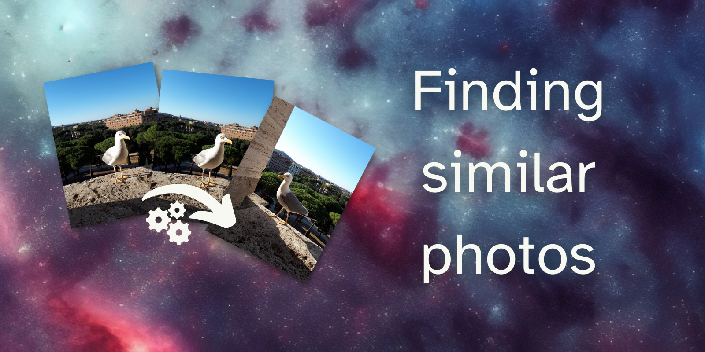
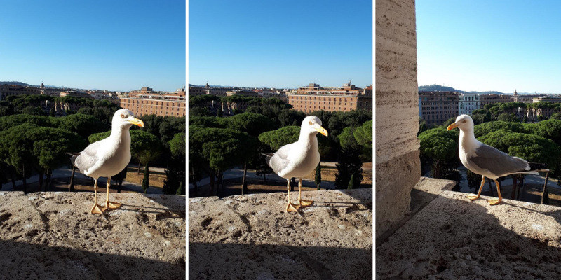
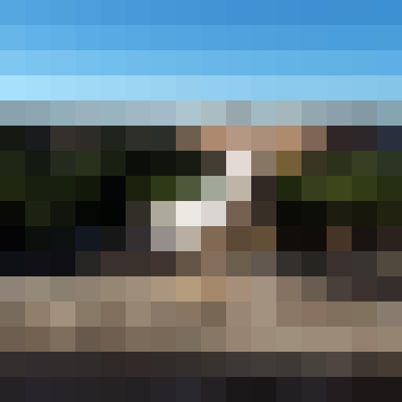

Go through the complete code for a Python project that consists in finding similar photographs in a folder. This tutorial will make use of classical techniques and is suitable for beginners.

===




# Introduction

The photo gallery on my phone is consistently packed with photos that all look (pretty much) the same.
Going through batches of photos and looking for near-duplicates is boring, so I thought I would try to use some maths and some Python to help me find images that are very close to one another.

For example, I would like my program to determine that the first two photos in the collage below are pretty much the same, while also saying that the third one is different from the other two.



This short tutorial will go through the (surprisingly little) code I wrote as an experiment.


# Tooling

This short project makes use of the [pillow] imaging library for Python and **does not** use any machine learning.
To determine our near-duplicate photos, we will be using rudimentary image processing techniques.


# GitHub repository

## Code

The code for this project can be found in the [“Finding similar images” GitHub repo][gh-repo].
Feel free to star the repository and fork it to play around with the code.

To get started using the code,

 1. clone the repository;
 2. run `poetry install` to install the [pillow] dependency (or install it by hand, if you must); and
 3. run `python src/similarity.py`.

## Images

The repository also includes two folders `seagulls` and `dublin` with some _real_ photographs I took,
respectively of a seagull and from Dublin.
We can use these photographs to test our code.


# Algorithm to determine similarity

In order to determine if two images are near duplicates of each other, we need to come up with a simple algorithm to do so.
In this project, we will follow this approach:

 1. resize the two images to 16 by 16;
 2. determine the average pixel difference of the two 16 by 16 images; and
 3. check if that average difference is below a threshold value.

This is just a high-level description of what we will be doing together.
As we go through the tutorial, I will give you more details regarding what we need to do.

Ready?
Let's get started.


# Setting up everything

To go through this tutorial, you can [clone the repository][gh-repo] and use poetry to install the dependencies with `poetry install`.
If you can't be bothered with that, you'll need at least the folders `seagulls` and `dublin` from that repository.
Then, go ahead and create your file `src/similarity.py`:

```py
# src/similarity.py
from PIL import Image


seagull = Image.open("seagulls/seagull_1.jpeg")
seagull.show()
```

If you run this code, it should open the image for you.
If it didn't, make sure you have pillow installed (you can follow the instructions in the [pillow docs][pillow]) and make sure the path to the `seagulls` directory is correct.

!!! If you cloned the repository or if you have a folder structure like mine:
!!!
!!! ```
!!! project_folder
!!! | - seagulls
!!!   | - seagull_1.jpeg
!!!   | - ...
!!! | - src
!!!   | - similarity.py
!!! ```
!!!
!!! Be sure to run your code from within the folder `project_folder` and not from `src`.
!!! Otherwise, you'll have to use slightly different paths in your code.


# Resizing the images

Why do we start by resizing the images into 16 by 16 “thumbnails”?
The idea is that we consider small sections that are likely to represent the same objects/entities.

As an example, take a look at the seagull photograph below that was split into a 4 by 4 grid:


The four sections at the top all contain the sky, so if we summarise each section into a single pixel, that pixel will be blue.
On the other hand, the bottom sections all point to the stone on which the seagull was standing, so if we summarise each of those sections into a single pixel, those would all be the same colour as the stone.

As another example, the third section of the second row contains the beak of the seagull.
In a similar photo, the beak of the seagull should be in the same section, and thus, when we summarise both sections and compare them, both should have a similar shade of yellow/orange.

For reference, here is what this same seagull image looks like after being summarised into a 16 by 16 image.




Notice how the top squares are all blue, the bottom squares are all brownish, the centre squares are off-white, and the surrounding squares are green!
These colours represent the objects that were being shown in the photo, but without as much detail so that it makes it easier to compare with another photo.

To do the resize, we only need to use the built-in method `Image.resize` that pillow gives us access to:

```py
# image_similarity.py
from PIL import Image


def summarise(img: Image.Image) -> Image.Image:
    """Summarise an image into a 16 x 16 image."""

    resized = img.resize((16, 16))
    return resized
```

That is as simple as that.
You can give it a go on one of your images:

```py
# image_similarity.py
from PIL import Image


def summarise(img: Image.Image) -> Image.Image:
    """Summarise an image into a 16 x 16 image."""

    resized = img.resize((16, 16))
    return resized


if __name__ == "__main__":
    seagull = Image.open("seagulls/seagull_1.jpeg")
    summarise(seagull).show()
```

This will show a tiny 16 by 16 image that was the result of summarising the image.
If you want to make it bigger so it is easier to see, replace `summarise(seagull).show()` with

```py
summarise(seagull).resize((512, 512), resample=Image.Resampling.BOX).show()
```

so it becomes easier to see the result.


# Determining the average pixel difference

Now that we have our images summarised, we need to find a way of computing their difference.
In other words, given two images, how different are they?

Mathematics and image processing have really good answers to this question.
However, we will opt for a not-so-good answer for the sake of simplicity.

What we will do is take the two images, and subtract the pixels of one image from the pixels of another image.
In other words, for each pair of corresponding pixels `p1` and `p2` (one from each image), we will compute `abs(p1 - p2)`.
However, each pixel contains three components, so it can be seen as a tuple with three values.
So, what we will compute is roughly equivalent to:

```py
color = tuple[int, int, int]


def pixel_difference(p1: color, p2: color) -> color:
    r1, g1, b1 = p1
    r2, g2, b2 = p2
    r = abs(r1 - r2)
    g = abs(g1 - g2)
    b = abs(b1 - b2)
    return (r, g, b)
```

We could do this by hand, but thankfully pillow provides this functionality in the submodule `ImageChops`.

After we compute the difference for each pixel in the three channels, we find the average difference across the whole 16 by 16 image and use that as a (basic!) measure of the difference between the two images.

The code looks like this:

```py
# image_similarity.py
from itertools import product

from PIL import Image, ImageChops


def summarise(...):
    # ...


def difference(img1: Image.Image, img2: Image.Image) -> float:
    """Find the difference between two images."""

    diff = ImageChops.difference(img1, img2)

    acc = 0
    width, height = diff.size
    for w, h in product(range(width), range(height)):
        r, g, b = diff.getpixel((w, h))
        acc += (r + g + b) / 3

    average_diff = acc / (width * height)
    normalised_diff = average_diff / 255
    return normalised_diff
```

I'll break it down piece by piece.

First, we use the function `ImageChops.difference` to compute the pixel-wise difference between the two summaries:

```py
diff = ImageChops.difference(img1, img2)
```

Then, we prepare three auxiliary variables:

 - `acc` will be the loop accumulator that we will use to compute the average difference; and
 - `width` and `height` are the dimensions of the images we are working with (which is also the size of the result of the difference).

Notice that we get the size from the result of the difference instead of assuming it is `width, height = 16, 16`.
We do that so that our function is a bit more general and so that our code doesn't break if we decide to summarise our images to a different size.

Next, we iterate over all pixels of the difference by using `itertools.product`.
The loop

```py
for w, h in product(range(width), range(height)):
    # ...
```

is pretty much equivalent to the double loop

```py
for w in range(width):
    for h in range(height):
        # ...
```

The only difference is that by using `itertools.product` I manage to save one indentation level.
(You can find the documentation on `itertools.product` [here](https://docs.python.org/3/library/itertools#itertools.product).)

The next step is getting the three values of the difference at the current pixel, averaging them out, and adding them to the accumulator variable:

```py
for w, h in product(range(width), range(height)):
    r, g, b = diff.getpixel((w, h))
    acc += (r + g + b) / 3
```

Then, we divide the accumulator by the total number of pixels we went through to get the average difference with `average_diff = acc / (width * height)`.
Finally, we normalise that difference to be between zero and one and we return that value.

The return value, that is between zero and one, can be interpreted as a percentage of the difference.
If that value is small (for example, below 7%), then we will say that the two images are very similar.

To try this function out, add this `if` statement at the bottom of your script:

```py
# image_similarity.py

from itertools import product

from PIL import Image, ImageChops


def summarise(...):
    # ...


def difference(...):
    # ...


if __name__ == "__main__":
    seagull1 = summarise(Image.open("seagulls/seagull1.jpeg"))
    seagull2 = summarise(Image.open("seagulls/seagull2.jpeg"))
    seagull3 = summarise(Image.open("seagulls/seagull3.jpeg"))
    print(difference(seagull1, seagull2))
    print(difference(seagull1, seagull3))
```

If you run this code, you should get the output below, or something quite similar:

```
0.18389501633986932
0.03787785947712419
```


# Finding similar images in a directory

The final touch to our simple script is the entry point that will take the path to a directory and will compare all images to each other, to determine what duplicates we can delete.

Such a function will

 - find all images in the folder passed in as an argument;
 - summarise all the images found;
 - compare every unique pair of images;
 - store the differences found; and
 - print a report with all the similar images found.

The function `explore_directory` looks like this:

```py
# image_similarity.py

from itertools import product
from pathlib import Path

from PIL import Image, ImageChops


def summarise(...):
    ...


def difference(...):
    ...


def explore_directory(path: Path) -> None:
    """Find images in a directory and compare them all."""

    files = (
        list(path.glob("*.jpg")) + list(path.glob("*.jpeg")) + list(path.glob("*.png"))
    )
    diffs = {}

    summaries = [(file, summarise(Image.open(file))) for file in files]

    for (f1, sum1), (f2, sum2) in product(summaries, repeat=2):
        key = tuple(sorted([str(f1), str(f2)]))
        if f1 == f2 or key in diffs:
            continue

        diff = difference(sum1, sum2)
        print(key, diff)
        diffs[key] = diff

    print()
    print("Near-duplicates found:")
    print("======================")
    for key, diff in diffs.items():
        if diff < 0.07:
            print(key)
```

The function `explore_directory` accepts a `Path` (from the standard module `pathlib`) that points to a directory that contains photographs.

Then, we use the method `.glob` to look for photographs with some common extensions, namely `.jpg`, `.jpeg`, and `.png`.
If you have photographs in other formats and pillow knows those formats, feel free to also look for photographs in those alternative formats.

The next step uses a [list comprehension][list-comp] to summarise all of the images, saving the image path and the summary in a tuple with two items.

What we do next is write a loop that goes through every pair of two images.
If the two images are actually the same or if they've been compared before, we skip that iteration.

We need to check if the two images have been compared before because we are using `itertools.product` again and we are passing in the same list twice.
`itertools.product` returns all combinations, which means I'll get pairs of the form `(A, B)` and also `(B, A)`.

We have a dictionary `diffs` that saves all the comparisons between two images and the keys for that dictionary will be a tuple with the paths to the two images.
If we make sure that the tuple is always sorted, then it becomes easy to figure out if two images have been compared yet:
we sort the two paths and check if they are in the dictionary or not.

That's what is happening in the part

```py
def explore_directory(...):
    # ...

    for (f1, sum1), (f2, sum2) in product(summaries, repeat=2):
        key = tuple(sorted([str(f1), str(f2)]))
        if f1 == f2 or key in diffs:
            continue

    # ...
```

If the two files are different and if they haven't been compared yet, then we use the function `difference` to find their difference and we save that in our dictionary `diffs`.

After we are done going through the directory, we print all the similar images we found, as determined by a threshold that we pick by hand.
In this article, I went with `0.07` because that looked like a good value.


# Find near-duplicate photos

Now that you have finished your [script `image_similarity.py`][gh-repo] by adding the three functions we've seen,

 1. `summarise`;
 2. `difference`; and
 3. `explore_directory`,

you can run your code in a directory with photographs.

My suggestion is that you start with the directory with the seagulls:

```py
# image_similarity.py

...

if __name__ == "__main__":
    explore_directory(Path("seagulls"))
```

Start with that one because it has fewer images.
When I run `image_similarity.py` on the seagulls directory, I get this output after the progress prints:
(remember, my threshold for near-duplicate is `0.07`)

```
Near-duplicates found:
======================
('seagulls\\seagull_1.jpeg', 'seagulls\\seagull_3.jpeg')
('seagulls\\seagull_1.jpeg', 'seagulls\\seagull_4.jpeg')
('seagulls\\seagull_3.jpeg', 'seagulls\\seagull_4.jpeg')
('seagulls\\seagull_5.jpeg', 'seagulls\\seagull_6.jpeg')
```

This means that images 1, 3, and 4, are all similar to each other, and the photos 5 and 6 are also similar to each other.
Thus, I could delete photographs 3, 4, and 6, and still preserve pretty much all the seagull poses that I had captured.

After the seagulls, you can change the directory to the pictures I took of Dublin.
This is my output:

```
Near-duplicates found:
======================
('dublin\\airplane_1.jpg', 'dublin\\airplane_2.jpg')
('dublin\\airplane_3.jpg', 'dublin\\airplane_4.jpg')
('dublin\\airplane_5.jpg', 'dublin\\airplane_6.jpg')
('dublin\\airplane_5.jpg', 'dublin\\airplane_7.jpg')
('dublin\\airplane_6.jpg', 'dublin\\airplane_7.jpg')
('dublin\\convention_centre_1.jpg', 'dublin\\convention_centre_2.jpg')
```


# Conclusion

That is it for this article!

This was a short introduction to using some basic mathematics and some basic image processing to determine what photos or what images are near-duplicates of each other.

We also saw some useful Python constructs in a real application, like [list comprehensions][list-comp] or the standard module `itertools`.

I hope you enjoyed this article and if you are keen to improve your program to make it better and more elegant, I have some follow-up challenges for you!


# Challenges 🚀

Get follow-up challenges:
 - improve your photo similarity detection;
 - optimise your program;
 - make the program output beautiful with rich;
 - and more!


<script async data-uid="9d3297ef34" src="https://mathspp.ck.page/9d3297ef34/index.js"></script>


[pillow]: https://pillow.readthedocs.io/en/stable/
[gh-repo]: https://github.com/mathspp/Finding-similar-photos
[list-comp]: /blog/pydonts/list-comprehensions-101
