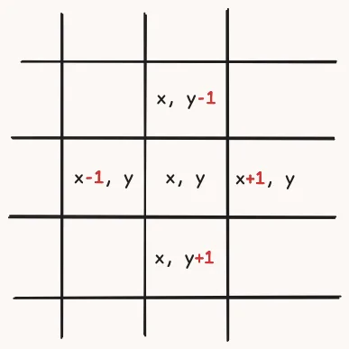

Learn how to implement and use the floodfill algorithm in Python.

===

<link rel="stylesheet" href="https://pyscript.net/releases/2025.11.1/core.css" />
<script defer type="module" src="https://pyscript.net/releases/2025.11.1/core.js"></script>


## What is the floodfill algorithm?

Click the image below to randomly colour the region you click.

Go ahead, try it!

<canvas id="bitmap" width="320" height="320" style="display: block; margin: 0 auto;"></canvas>

<script>
function set_canvas_loading(canvas) {
    let ctx = canvas.getContext("2d");

    // Get computed values of CSS variables
    const styles = getComputedStyle(document.documentElement);
    const bg = styles.getPropertyValue("--bg").trim();
    const fg = styles.getPropertyValue("--accent").trim();

    ctx.fillStyle = bg;
    ctx.fillRect(0, 0, canvas.width, canvas.height);
    ctx.fillStyle = fg;
    ctx.font = "36px Atkinson Hyperlegible";
    ctx.textAlign = "center";
    ctx.textBaseline = "middle";
    ctx.fillText("Loading...", canvas.width / 2, canvas.height / 2);
}

set_canvas_loading(document.getElementById("bitmap"));
</script>

<py-script>
IMG_WIDTH = 160
IMG_HEIGHT = 160
PIXEL_SIZE = 2

import asyncio
import collections
import random

from pyscript import display
from pyodide.ffi import create_proxy
import js
from js import fetch

canvas = js.document.getElementById("bitmap")
ctx = canvas.getContext("2d")

URL = "/blog/floodfill-algorithm-in-python/_python.txt"

async def load_bitmap(url: str) -> list[list[int]]:
    # Fetch the text file from the URL
    response = await fetch(url)
    text = await response.text()

    bitmap: list[list[int]] = []
    for line in text.splitlines():
        line = line.strip()
        if not line:
            continue
        row = [int(ch) for ch in line if ch in "01"]
        if row:
            bitmap.append(row)
    return bitmap

def draw_bitmap(bitmap):
    rows = len(bitmap)
    cols = len(bitmap[0]) if rows > 0 else 0

    if rows == 0 or cols == 0:
        return

    for y, row in enumerate(bitmap):
        for x, value in enumerate(row):
            if value == 1:
                ctx.fillStyle = "black"
            else:
                ctx.fillStyle = "white"
            ctx.fillRect(x * PIXEL_SIZE, y * PIXEL_SIZE, PIXEL_SIZE, PIXEL_SIZE)

_neighbours = [(1, 0), (-1, 0), (0, 1), (0, -1)]

async def fill_bitmap(bitmap, x, y):
    if bitmap[y][x] == 1:
        return

    ctx = canvas.getContext("2d")
    r, g, b = (random.randint(0, 255) for _ in range(3))
    ctx.fillStyle = f"rgb({r}, {g}, {b})"
    def draw_pixel(x, y):
        ctx.fillRect(x * PIXEL_SIZE, y * PIXEL_SIZE, PIXEL_SIZE, PIXEL_SIZE)

    pixels = collections.deque([(x, y)])
    seen = set((x, y))
    while pixels:
        nx, ny = pixels.pop()
        draw_pixel(nx, ny)
        for dx, dy in _neighbours:
            x_, y_ = nx + dx, ny + dy
            if x_ &lt; 0 or x_ &gt;= IMG_WIDTH or y_ &lt; 0 or y_ &gt;= IMG_HEIGHT or (x_, y_) in seen:
                continue
            if bitmap[y_][x_] == 0:
                seen.add((x_, y_))
                pixels.appendleft((x_, y_))
        await asyncio.sleep(0.0001)

is_running = False

def get_event_coords(event):
    """Return (clientX, clientY) for mouse/pointer/touch events."""
    # PointerEvent / MouseEvent: clientX/clientY directly available
    if hasattr(event, "clientX") and hasattr(event, "clientY") and event.clientX is not None:
        return event.clientX, event.clientY

    # TouchEvent: use the first touch point
    if hasattr(event, "touches") and event.touches.length &gt; 0:
        touch = event.touches.item(0)
        return touch.clientX, touch.clientY

    # Fallback: try changedTouches
    if hasattr(event, "changedTouches") and event.changedTouches.length &gt; 0:
        touch = event.changedTouches.item(0)
        return touch.clientX, touch.clientY

    return None, None

async def on_canvas_press(event):
    global is_running

    if is_running:
        return

    is_running = True
    try:
        # Avoid scrolling / zooming taking over on touch
        if hasattr(event, "preventDefault"):
            event.preventDefault()

        clientX, clientY = get_event_coords(event)
        if clientX is None:
            # Could not read coordinates; bail out gracefully
            return

        rect = canvas.getBoundingClientRect()

        # Account for CSS scaling: map from displayed size to canvas units
        scale_x = canvas.width / rect.width
        scale_y = canvas.height / rect.height

        x_canvas = (clientX - rect.left) * scale_x
        y_canvas = (clientY - rect.top) * scale_y

        x_idx = int(x_canvas // PIXEL_SIZE)
        y_idx = int(y_canvas // PIXEL_SIZE)

        # Bounds check just to be safe
        if 0 &lt;= x_idx &lt; IMG_WIDTH and 0 &lt;= y_idx &lt; IMG_HEIGHT:
            await fill_bitmap(bitmap, x_idx, y_idx)
    finally:
        # Ensure the flag is always reset, even if something raises
        is_running = False

bitmap = await load_bitmap(URL)
draw_bitmap(bitmap)

proxied_on_canvas_press = create_proxy(on_canvas_press)
# Attach event listener
canvas.addEventListener("pointerdown", proxied_on_canvas_press)
canvas.addEventListener("touchstart", proxied_on_canvas_press)
</py-script>
<br />


If you click the image, you will see colour spread out from the place you clicked, filling in the region you clicked on.
If you click one of the eyes of the snakes, the eye fills pretty quickly and you can barely see it...
If you click one of the snakes, you can see the colour spread to fill the entire snake...
And if you click the outside area, you see the colour spread in weird ways, going around the snakes and into the tight corners between the two snakes.

But regardless of where you click, you see that the colour spreading will always stay _inside_ the region you clicked.
And the floodfill algorithm is the algorithm that allows you to implement this behaviour:

 1. spread out from the starting point; but
 2. remain constrained inside a region.


## Understanding the floodfill algorithm

The floodfill algorithm does not have a lot of moving parts and, because it can be visualised as paint filling up a region of a drawing, it is a great stepping stone for someone looking to learn more about graph algorithms.
Now, you'll understand how it works and how to implement it.

The algorithm will be implemented as a function `floodfill` with three arguments:

 - a grid representing the locations of the walls; and
 - the `x` and `y` coordinates of the starting point (the place you clicked).

```py
def floodfill(walls, x, y):
    pass
```

Ok, I lied.
The function has three arguments, really.

If the position you click is a wall, you don't want to do anything and you return from the function right away:

```py
def floodfill(walls, x, y):
    if walls[y][x]:
        return
```

In here, you can assume that `walls` is a list of lists, where each list represents a row of the image.
So, the first piece of code checks if you clicked a wall, because you don't want to change the colour of walls.

Next, you need a way to represent the growing region of colour, and that's represented by a growing collection of all of the pixels you already painted.
To make it very efficient, you can use a set instead of a list, and this set starts empty because you haven't painted anything yet:

```py
def floodfill(walls, x, y):
    if walls[y][x]:
        return

    painted = set()  # <--
```

You also need another collection to keep track of all the points you still need to paint.
In the beginning, you already know you _have_ to paint your starting point:

```py
def floodfill(walls, x, y):
    if walls[y][x]:
        return

    painted = set()
    to_paint = [(x, y)]  # <--
```

Now comes the fun part, which is the `while` loop that ensures your painted region keeps growing to fill in every empty spot!
You want to write a loop that runs _while_ there are pixels _to be painted_:

```py
def floodfill(walls, x, y):
    if walls[y][x]:
        return

    painted = set()
    to_paint = [(x, y)]
    while to_paint:  # <--
        ...          # <--
```

Inside this loop you need to do four things:

 1. get a new pixel to process from the list of pixels to process;
 2. paint the pixel you're processing now;
 3. mark this pixel as having been painted; and
 4. find if the neighbours of the current pixel must be painted also.

To do the first thing, you can just pop from the list `to_paint`:

```py
def floodfill(walls, x, y):
    if walls[y][x]:
        return

    painted = set()
    to_paint = [(x, y)]
    while to_paint:
        this = to_paint.pop()  # <--
```

To paint this pixel, you can assume you have an auxiliary function that does that:

```py
def draw_pixel(p): pass  # Do-nothing; just so the code works.

def floodfill(walls, x, y):
    if walls[y][x]:
        return

    painted = set()
    to_paint = [(x, y)]
    while to_paint:
        this_pixel = to_paint.pop()
        draw_pixel(this_pixel)  # <--
```

And now that your pixel has been painted, you can mark it as having been painted:

```py

def draw_pixel(p): pass  # Do-nothing; just so the code works.

def floodfill(walls, x, y):
    if walls[y][x]:
        return

    painted = set()
    to_paint = [(x, y)]
    while to_paint:
        this_pixel = to_paint.pop()
        draw_pixel(this_pixel)
        painted.add(this_pixel)  # <--
```

The fourth and final step is the most important one, though: “find if the neighbours of the current pixel must be painted also”.

One of my favourite ways of looking at the neighbours of a pixel is realising that the neighbours of a pixel have coordinates that are _very similar_ to the original pixel; all I have to do is add or subtract 1 from either coordinate, as the diagram below shows:



To represent this, I usually create a list with the small offsets and then use a loop to go through the offsets and modify the coordinates of the base pixel:

```py
neighbour_offsets = [(+1, 0), (0, +1), (-1, 0), (0, -1)]  # <--

def draw_pixel(p): pass  # Do-nothing; just so the code works.

def floodfill(walls, x, y):
    if walls[y][x]:
        return

    painted = set()
    to_paint = [(x, y)]
    while to_paint:
        this_pixel = to_paint.pop()
        draw_pixel(this_pixel)
        painted.add(this_pixel)
        tx, ty = this_pixel               # <--
        for dx, dy in neighbour_offsets:  # <--
            nx, ny = tx + dx, ty + dy     # <--
```

The coordinates `tx, ty` represent the pixel you just painted; the offsets `dx, dy` represent the small jump you need to take from the base pixel to a neighbouring pixel; and the coordinates `nx, ny` represent the coordinates of the neighbour pixel.

For each of the neighbours, you need to check if that's still inside the grid and, if it is, if it's a wall or an empty space.
If the neighbour is outside of the grid or a wall, you don't want to do anything with that neighbour and you skip to the next one:

```py
neighbour_offsets = [(+1, 0), (0, +1), (-1, 0), (0, -1)]

def draw_pixel(p): pass  # Do-nothing; just so the code works.

def floodfill(walls, x, y):
    if walls[y][x]:
        return

    HEIGHT = len(walls)
    WIDTH = len(walls[0])

    painted = set()
    to_paint = [(x, y)]
    while to_paint:
        this_pixel = to_paint.pop()
        draw_pixel(this_pixel)
        painted.add(this_pixel)
        tx, ty = this_pixel
        for dx, dy in neighbour_offsets:
            nx, ny = tx + dx, ty + dy

            if (
                nx < 0 or nx >= WIDTH  # Is nx too big/small?
                or ny < 0 or ny >= HEIGHT  # Is ny too big/small?
                or walls[ny][nx]  # Is this a wall?
            ):
                continue
```

If the neighbour pixel is a valid pixel that is _not_ a wall, then you can add it to the list of pixels to paint next!
As long as this pixel hasn't been painted yet, of course:

```py
neighbour_offsets = [(+1, 0), (0, +1), (-1, 0), (0, -1)]

def draw_pixel(p): pass  # Do-nothing; just so the code works.

def floodfill(walls, x, y):
    if walls[y][x]:
        return

    HEIGHT = len(walls)
    WIDTH = len(walls[0])

    painted = set()
    to_paint = [(x, y)]
    while to_paint:
        this_pixel = to_paint.pop()
        draw_pixel(this_pixel)
        painted.add(this_pixel)
        tx, ty = this_pixel
        for dx, dy in neighbour_offsets:
            nx, ny = tx + dx, ty + dy

            if (
                nx < 0 or nx >= WIDTH
                or ny < 0 or ny >= HEIGHT
                or walls[ny][nx]
            ):
                continue

            if (nx, ny) not in painted:    # <--
                to_paint.append((nx, ny))  # <--
```

That's it!
This is enough to use the floodfill algorithm and this is _very_ close to what I actually used to paint the Python logo above.
Below, you can find an interactive demo of this algorithm in action, which is trying to fill the centre region with pink.
Play the algorithm step by step until you're comfortable with its behaviour and then click “auto-play” to see the pink region fill up completely...

<p>
  <span style="color: var(--accent);">█</span> <code>painted</code>;&nbsp;
  <code id="slow-ff-grid-painted-values"></code>
</p>
<p>
  <span style="color: var(--accent-2);">█</span> <code>to_paint</code>:&nbsp;
  <code id="slow-ff-grid-to_paint-values"></code>
</p>
<canvas id="slow-ff-grid" width="690" height="438" style="display: block; margin: 0 auto;"></canvas>
<p id="slow-ff-grid-status">Starting the floodfill algorithm from the centre square. Press “Next”.</p>
<div style="display:flex; justify-content:center; gap: 1em;">
<button id="slow-reset" class="button">Reset</button>
<button id="slow-next" class="button">Next</button>
<button id="slow-autoplay" class="button">Auto-play</button>
</div>

<script>
set_canvas_loading(document.getElementById("slow-ff-grid"))
</script>

<py-script>
import asyncio

import js
from pyodide.ffi import create_proxy  # you'll likely use this later

# --- configuration ----------------------------------------------------
CELL_SIZE = 60
GRID_LINE_WIDTH = 3
GRID = [
    [0, 0, 0, 0, 1, 0, 1, 0, 0, 0, 0],
    [0, 0, 0, 1, 1, 0, 1, 0, 0, 0, 0],
    [0, 0, 1, 1, 1, 0, 1, 1, 0, 0, 0],
    [1, 1, 1, 0, 0, 0, 0, 1, 1, 0, 0],
    [1, 1, 0, 0, 0, 0, 0, 0, 1, 0, 0],
    [1, 0, 0, 0, 0, 0, 0, 0, 1, 0, 0],
    [1, 1, 1, 1, 1, 1, 1, 1, 1, 1, 0],
]
START = (5, 3)

ROWS = len(GRID)
COLS = len(GRID[0])

CANVAS_WIDTH = COLS * CELL_SIZE + (COLS + 1) * GRID_LINE_WIDTH
CANVAS_HEIGHT = ROWS * CELL_SIZE + (ROWS + 1) * GRID_LINE_WIDTH

# Read CSS custom properties from :root
root = js.document.documentElement
computed = js.window.getComputedStyle(root)

BG_COLOR = computed.getPropertyValue("--bg").strip()
FG_COLOR = computed.getPropertyValue("--tx").strip()
UI_COLOR = computed.getPropertyValue("--ui").strip()
AC_COLOR = computed.getPropertyValue("--accent").strip()
AC2_COLOR = computed.getPropertyValue("--accent-2").strip()
CONTRAST = {
    BG_COLOR: FG_COLOR,
    FG_COLOR: BG_COLOR,
    UI_COLOR: FG_COLOR,
    AC_COLOR: FG_COLOR,
    AC2_COLOR: FG_COLOR,
}

# --- drawing helpers --------------------------------------------------
def draw_cells(ctx):
    for row in range(ROWS):
        for col in range(COLS):
            value = GRID[row][col]
            color = BG_COLOR if value == 0 else FG_COLOR
            ctx.fillStyle = color
            ctx.fillRect(
                col * CELL_SIZE + (col + 1) * GRID_LINE_WIDTH,
                row * CELL_SIZE + (row + 1) * GRID_LINE_WIDTH,
                CELL_SIZE,
                CELL_SIZE,
            )

def draw_gridlines(ctx):
    ctx.lineWidth = 3
    ctx.fillStyle = UI_COLOR

    # I'm drawing the lines as rectangles because it's easier to control
    # the position of the corners of the “thick lines” this way.
    for c in range(COLS + 2):
        x = c * (CELL_SIZE + GRID_LINE_WIDTH)
        ctx.fillRect(
            x,
            0,
            GRID_LINE_WIDTH,
            CANVAS_HEIGHT,
        )

    for r in range(ROWS + 2):
        y = r * (CELL_SIZE + GRID_LINE_WIDTH)
        ctx.fillRect(
            0,
            y,
            CANVAS_WIDTH,
            GRID_LINE_WIDTH,
        )

def draw_grid1():
    canvas = js.document.getElementById("slow-ff-grid")
    ctx = canvas.getContext("2d")
    # Ensure canvas has the correct internal size
    canvas.width = CANVAS_WIDTH
    canvas.height = CANVAS_HEIGHT

    draw_cells(ctx)
    draw_gridlines(ctx)

class Animation:
    def __init__(self, ctx, status_p):
        self.ctx = ctx
        self.status_p = status_p
        self.painted = set()
        self.to_paint = []
        self.animation_ff = None
        self.autoplaying = False
        self.stop_autoplaying = asyncio.Event()

    def current_cell_colour(self, x, y):
        if GRID[y][x]:
            return FG_COLOR
        elif (x, y) in self.to_paint:
            return AC2_COLOR
        elif (x, y) in self.painted:
            return AC_COLOR
        else:
            return BG_COLOR

    def mark_cell(self, x, y):
        cell_colour = self.current_cell_colour(x, y)
        self.ctx.strokeStyle = CONTRAST[cell_colour]
        cx = x * CELL_SIZE + (x + 1) * GRID_LINE_WIDTH + CELL_SIZE // 2
        cy = y * CELL_SIZE + (y + 1) * GRID_LINE_WIDTH + CELL_SIZE // 2
        self.ctx.beginPath()
        self.ctx.arc(cx, cy, 3 * CELL_SIZE // 10, 0, 2 * js.Math.PI)
        self.ctx.stroke()

    def mark_cell_x(self, x, y):
        """Draw an X on top of this cell."""
        self.ctx.beginPath()
        self.ctx.strokeStyle = CONTRAST[self.current_cell_colour(x, y)]
        xl = x * CELL_SIZE + (x + 1) * GRID_LINE_WIDTH + CELL_SIZE // 4
        xr = x * CELL_SIZE + (x + 1) * GRID_LINE_WIDTH + CELL_SIZE // 4 * 3
        yt = y * CELL_SIZE + (y + 1) * GRID_LINE_WIDTH + CELL_SIZE // 4
        yb = y * CELL_SIZE + (y + 1) * GRID_LINE_WIDTH + CELL_SIZE // 4 * 3
        self.ctx.moveTo(xl, yt)
        self.ctx.lineTo(xr, yb)
        self.ctx.stroke()
        self.ctx.moveTo(xl, yb)
        self.ctx.lineTo(xr, yt)
        self.ctx.stroke()

    def clear_cell(self, x, y):
        self.draw_cell(x, y, self.current_cell_colour(x, y))

    def draw_cell(self, x, y, colour):
        self.ctx.fillStyle = colour
        self.ctx.fillRect(
            x * CELL_SIZE + (x + 1) * GRID_LINE_WIDTH,
            y * CELL_SIZE + (y + 1) * GRID_LINE_WIDTH,
            CELL_SIZE,
            CELL_SIZE,
        )

    async def start(self, _evt):
        if self.autoplaying:
            self.stop_autoplaying.set()
            await asyncio.sleep(0)  # Give the loop a chance to cancell the running autoplay
        self._start()

    def _start(self):
        draw_grid1()
        self.status_p.innerHTML = "Starting the floodfill algorithm from the centre square. Press “Next”."
        self.painted = set()
        self.to_paint = [START]
        self.draw_cell(*START, AC2_COLOR)
        self.sync_painted()
        self.sync_to_paint()
        self.animation_ff = self.floodfill()

    def sync_to_paint(self):
        for x, y in self.to_paint:
            self.draw_cell(x, y, AC2_COLOR)
        elem = js.document.getElementById("slow-ff-grid-to_paint-values")
        elem.innerHTML = ", ".join(map(str, self.to_paint))

    def sync_painted(self):
        elem = js.document.getElementById("slow-ff-grid-painted-values")
        elem.innerHTML = ", ".join(map(str, self.painted))

    def animation_step(self):
        if self.autoplaying:
            return
        if self.animation_ff is None:
            self.start()
        try:
            msg = next(self.animation_ff)
        except StopIteration:
            msg = "Done"
        self.status_p.innerHTML = msg
        print(msg)

    async def autoplay(self, _evt):
        self.autoplaying = True
        await self._autoplay()

    async def _autoplay(self):
        if self.animation_ff is None:
            self.start()
        for msg in self.animation_ff:
            self.status_p.innerHTML = msg
            print(msg)
            await asyncio.wait(
                [
                    asyncio.create_task(asyncio.sleep(.25)),
                    asyncio.create_task(self.stop_autoplaying.wait()),
                ],
                return_when=asyncio.FIRST_COMPLETED,
            )
            if self.stop_autoplaying.is_set():
                self.stop_autoplaying.clear()
                self.autoplaying = False
                break

    def floodfill(self):
        print("starting ff")
        neighbour_offsets = [(+1, 0), (0, +1), (-1, 0), (0, -1)]
        neighbour_msgs = {
            (1, 0): "Checking the cell on the right...",
            (-1, 0): "Checking the cell on the left...",
            (0, 1): "Checking the cell below...",
            (0, -1): "Checking the cell above...",
        }

        while self.to_paint:
            this_pixel = self.to_paint.pop()
            self.painted.add(this_pixel)
            self.sync_painted()
            self.sync_to_paint()
            tx, ty = this_pixel
            self.mark_cell(tx, ty)
            yield f"Will now process {this_pixel}."
            self.draw_cell(tx, ty, AC_COLOR)
            self.mark_cell_x(tx, ty)
            yield f"The cell {this_pixel} has now been coloured. Now, we check its neighbours."

            for dx, dy in neighbour_offsets:
                nx, ny = tx + dx, ty + dy

                # Produce nice message about neighbour to process.
                if not (nx &lt; 0 or nx &gt;= COLS or ny &lt; 0 or ny &gt;= ROWS):
                    self.mark_cell(nx, ny)
                yield neighbour_msgs[(dx, dy)]

                if nx &lt; 0 or nx &gt;= COLS or ny &lt; 0 or ny &gt;= ROWS:
                    yield f"... oh wait, there's no cell there because the grid ends here."
                    continue
                elif GRID[ny][nx]:
                    yield f"Will skip this neighbour because it's a wall!"
                    self.clear_cell(nx, ny)
                    continue

                if (nx, ny) not in self.painted:
                    self.to_paint.append((nx, ny))
                    self.sync_to_paint()
                    self.draw_cell(nx, ny, AC2_COLOR)
                    yield f"Tracked and set neighbour to paint later."
                else:
                    self.clear_cell(nx, ny)
                    yield f"Skipped because it was painted already!"
            self.clear_cell(tx, ty)
        yield f"We're done because there are no more cells to paint!"

animator1 = Animation(
    js.document.getElementById("slow-ff-grid").getContext("2d"),
    js.document.getElementById("slow-ff-grid-status"),
)

proxied_start = create_proxy(animator1.start)
js.document.getElementById("slow-reset").addEventListener("click", proxied_start)

proxied_animation_step = create_proxy(lambda evt: animator1.animation_step())
js.document.getElementById("slow-next").addEventListener("click", proxied_animation_step)

proxied_autoplay = create_proxy(animator1.autoplay)
js.document.getElementById("slow-autoplay").addEventListener("click", proxied_autoplay)

# Initial reset
animator1._start()
</py-script>


Wait, did you see that?
Did you notice how, at the end, some of the pink cells turned purple again and you had to paint them more than once?!


## Optimising the floodfill algorithm to avoid duplicated work

There is a key difference between the algorithm I'm using to paint the Python logo and the algorithm you just used, and it has to do with the role that the set `painted` has.
The main objective of the set `painted` is to avoid wasting time painting the same pixel more than once, but that doesn't prevent the same pixel to be added to the list `to_paint` twice!

If you modify the function `floodfill` to add a couple of calls to `print` and if you call it with a small grid, you will find that you can end up with duplicated points in the list `to_paint`:

```py
neighbour_offsets = [(+1, 0), (0, +1), (-1, 0), (0, -1)]

def draw_pixel(p): pass  # Do-nothing; just so the code works.

def floodfill(walls, x, y):
    # ...

    painted = set()
    to_paint = [(x, y)]
    while to_paint:
        print(to_paint)  # <--
        # ...


grid = [[0, 0, 0], [0, 0, 0], [0, 0, 0]]
floodfill(grid, 1, 1)
```
```txt
[(1, 1)]
[(2, 1), (1, 2), (0, 1), (1, 0)]
[(2, 1), (1, 2), (0, 1), (2, 0), (0, 0)]
[(2, 1), (1, 2), (0, 1), (2, 0), (0, 1)]
# ...
```

The first four lines of output are shown above and the fourth line of output has the pixel `(0, 1)` repeated in the third and fifth positions.
This means we'll process this pixel twice.
For this small 3 x 3 grid, this isn't a big problem...
But for big grids, these overlaps will be costly and waste a lot of your time.

Instead of keeping track of the pixels that have been painted already, you can keep track of the pixels that you already queued up for painting.
This means you add a new pixel to the set _at the same time_ as you add it to the list of pixels to paint:

```py
neighbour_offsets = [(+1, 0), (0, +1), (-1, 0), (0, -1)]

def draw_pixel(p): pass  # Do-nothing; just so the code works.

def floodfill(walls, x, y):
    if walls[y][x]:
        return

    HEIGHT = len(walls)
    WIDTH = len(walls[0])

    tracked = {(x, y)}  # <-- The starting point starts in the set.
    to_paint = [(x, y)]
    while to_paint:
        this_pixel = to_paint.pop()
        draw_pixel(this_pixel)
        tx, ty = this_pixel
        for dx, dy in neighbour_offsets:
            nx, ny = tx + dx, ty + dy

            if (
                nx < 0 or nx >= WIDTH
                or ny < 0 or ny >= HEIGHT
                or walls[ny][nx]
            ):
                continue

            if (nx, ny) not in tracked:  # <--
                tracked.add((nx, ny))    # <-- Add it to the set right away.
                to_paint.append((nx, ny))
```


## Visualising the floodfill algorithm step by step

Hopefull you understood the prose that explains the algorithm...
But there's nothing like seeing it in action.
The demo below lets you step through the floodfill algorithm as it tries to paint the middle region in pink.
The cells shown in purple are cells that have been added to the list `to_paint`, but haven't been painted yet.


<p>
  <span style="color: var(--accent);">█</span><span style="color: var(--accent-2);">█</span> <code>tracked</code>;&nbsp;
  <code id="ff-grid-tracked-values"></code>
</p>
<p>
  <span style="color: var(--accent-2);">█</span> <code>to_paint</code>:&nbsp;
  <code id="ff-grid-to_paint-values"></code>
</p>
<canvas id="ff-grid" width="690" height="438" style="display: block; margin: 0 auto;"></canvas>
<p id="ff-grid-status">Starting the floodfill algorithm from the centre square. Press “Next”.</p>
<div style="display:flex; justify-content:center; gap: 1em;">
<button id="reset" class="button">Reset</button>
<button id="next" class="button">Next</button>
<button id="autoplay" class="button">Auto-play</button>
</div>

<script>
set_canvas_loading(document.getElementById("ff-grid"))
</script>

<py-script>
import asyncio

import js
from pyodide.ffi import create_proxy  # you'll likely use this later

# --- configuration ----------------------------------------------------
CELL_SIZE = 60
GRID_LINE_WIDTH = 3
GRID = [
    [0, 0, 0, 0, 1, 0, 1, 0, 0, 0, 0],
    [0, 0, 0, 1, 1, 0, 1, 0, 0, 0, 0],
    [0, 0, 1, 1, 1, 0, 1, 1, 0, 0, 0],
    [1, 1, 1, 0, 0, 0, 0, 1, 1, 0, 0],
    [1, 1, 0, 0, 0, 0, 0, 0, 1, 0, 0],
    [1, 0, 0, 0, 0, 0, 0, 0, 1, 0, 0],
    [1, 1, 1, 1, 1, 1, 1, 1, 1, 1, 0],
]
START = (5, 3)

ROWS = len(GRID)
COLS = len(GRID[0])

CANVAS_WIDTH = COLS * CELL_SIZE + (COLS + 1) * GRID_LINE_WIDTH
CANVAS_HEIGHT = ROWS * CELL_SIZE + (ROWS + 1) * GRID_LINE_WIDTH

# Read CSS custom properties from :root
root = js.document.documentElement
computed = js.window.getComputedStyle(root)

BG_COLOR = computed.getPropertyValue("--bg").strip()
FG_COLOR = computed.getPropertyValue("--tx").strip()
UI_COLOR = computed.getPropertyValue("--ui").strip()
AC_COLOR = computed.getPropertyValue("--accent").strip()
AC2_COLOR = computed.getPropertyValue("--accent-2").strip()
CONTRAST = {
    BG_COLOR: FG_COLOR,
    FG_COLOR: BG_COLOR,
    UI_COLOR: FG_COLOR,
    AC_COLOR: FG_COLOR,
    AC2_COLOR: FG_COLOR,
}

# --- drawing helpers --------------------------------------------------
def draw_cells(ctx):
    for row in range(ROWS):
        for col in range(COLS):
            value = GRID[row][col]
            color = BG_COLOR if value == 0 else FG_COLOR
            ctx.fillStyle = color
            ctx.fillRect(
                col * CELL_SIZE + (col + 1) * GRID_LINE_WIDTH,
                row * CELL_SIZE + (row + 1) * GRID_LINE_WIDTH,
                CELL_SIZE,
                CELL_SIZE,
            )

def draw_gridlines(ctx):
    ctx.lineWidth = 3
    ctx.fillStyle = UI_COLOR

    # I'm drawing the lines as rectangles because it's easier to control
    # the position of the corners of the “thick lines” this way.
    for c in range(COLS + 2):
        x = c * (CELL_SIZE + GRID_LINE_WIDTH)
        ctx.fillRect(
            x,
            0,
            GRID_LINE_WIDTH,
            CANVAS_HEIGHT,
        )

    for r in range(ROWS + 2):
        y = r * (CELL_SIZE + GRID_LINE_WIDTH)
        ctx.fillRect(
            0,
            y,
            CANVAS_WIDTH,
            GRID_LINE_WIDTH,
        )

def draw_grid():
    canvas = js.document.getElementById("ff-grid")
    ctx = canvas.getContext("2d")
    # Ensure canvas has the correct internal size
    canvas.width = CANVAS_WIDTH
    canvas.height = CANVAS_HEIGHT

    draw_cells(ctx)
    draw_gridlines(ctx)

class Animation:
    def __init__(self, ctx, status_p):
        self.ctx = ctx
        self.status_p = status_p
        self.tracked = set()
        self.to_paint = []
        self.animation_ff = None
        self.autoplaying = False
        self.stop_autoplaying = asyncio.Event()

    def current_cell_colour(self, x, y):
        if GRID[y][x]:
            return FG_COLOR
        elif (x, y) in self.to_paint:
            return AC2_COLOR
        elif (x, y) in self.tracked:
            return AC_COLOR
        else:
            return BG_COLOR

    def mark_cell(self, x, y):
        cell_colour = self.current_cell_colour(x, y)
        self.ctx.strokeStyle = CONTRAST[cell_colour]
        cx = x * CELL_SIZE + (x + 1) * GRID_LINE_WIDTH + CELL_SIZE // 2
        cy = y * CELL_SIZE + (y + 1) * GRID_LINE_WIDTH + CELL_SIZE // 2
        self.ctx.beginPath()
        self.ctx.arc(cx, cy, 3 * CELL_SIZE // 10, 0, 2 * js.Math.PI)
        self.ctx.stroke()

    def mark_cell_x(self, x, y):
        """Draw an X on top of this cell."""
        self.ctx.beginPath()
        self.ctx.strokeStyle = CONTRAST[self.current_cell_colour(x, y)]
        xl = x * CELL_SIZE + (x + 1) * GRID_LINE_WIDTH + CELL_SIZE // 4
        xr = x * CELL_SIZE + (x + 1) * GRID_LINE_WIDTH + CELL_SIZE // 4 * 3
        yt = y * CELL_SIZE + (y + 1) * GRID_LINE_WIDTH + CELL_SIZE // 4
        yb = y * CELL_SIZE + (y + 1) * GRID_LINE_WIDTH + CELL_SIZE // 4 * 3
        self.ctx.moveTo(xl, yt)
        self.ctx.lineTo(xr, yb)
        self.ctx.stroke()
        self.ctx.moveTo(xl, yb)
        self.ctx.lineTo(xr, yt)
        self.ctx.stroke()

    def clear_cell(self, x, y):
        self.draw_cell(x, y, self.current_cell_colour(x, y))

    def draw_cell(self, x, y, colour):
        self.ctx.fillStyle = colour
        self.ctx.fillRect(
            x * CELL_SIZE + (x + 1) * GRID_LINE_WIDTH,
            y * CELL_SIZE + (y + 1) * GRID_LINE_WIDTH,
            CELL_SIZE,
            CELL_SIZE,
        )

    async def start(self, _evt):
        if self.autoplaying:
            self.stop_autoplaying.set()
            await asyncio.sleep(0)  # Give the loop a chance to cancell the running autoplay
        self._start()

    def _start(self):
        draw_grid()
        self.status_p.innerHTML = "Starting the floodfill algorithm from the centre square. Press “Next”."
        self.tracked = {START}
        self.to_paint = [START]
        self.draw_cell(*START, AC2_COLOR)
        self.sync_tracked()
        self.sync_to_paint()
        self.animation_ff = self.floodfill()

    def sync_to_paint(self):
        elem = js.document.getElementById("ff-grid-to_paint-values")
        elem.innerHTML = ", ".join(map(str, self.to_paint))

    def sync_tracked(self):
        elem = js.document.getElementById("ff-grid-tracked-values")
        elem.innerHTML = ", ".join(map(str, self.tracked))

    def animation_step(self):
        if self.autoplaying:
            return
        if self.animation_ff is None:
            self.start()
        try:
            msg = next(self.animation_ff)
        except StopIteration:
            msg = "Done"
        self.status_p.innerHTML = msg
        print(msg)

    async def autoplay(self, _evt):
        self.autoplaying = True
        await self._autoplay()

    async def _autoplay(self):
        if self.animation_ff is None:
            self.start()
        for msg in self.animation_ff:
            self.status_p.innerHTML = msg
            print(msg)
            await asyncio.wait(
                [
                    asyncio.create_task(asyncio.sleep(1)),
                    asyncio.create_task(self.stop_autoplaying.wait()),
                ],
                return_when=asyncio.FIRST_COMPLETED,
            )
            if self.stop_autoplaying.is_set():
                self.stop_autoplaying.clear()
                self.autoplaying = False
                break

    def floodfill(self):
        print("starting ff")
        neighbour_offsets = [(+1, 0), (0, +1), (-1, 0), (0, -1)]
        neighbour_msgs = {
            (1, 0): "Checking the cell on the right...",
            (-1, 0): "Checking the cell on the left...",
            (0, 1): "Checking the cell below...",
            (0, -1): "Checking the cell above...",
        }

        while self.to_paint:
            this_pixel = self.to_paint.pop()
            self.sync_to_paint()
            tx, ty = this_pixel
            self.mark_cell(tx, ty)
            yield f"Will now process {this_pixel}."
            self.draw_cell(tx, ty, AC_COLOR)
            self.mark_cell_x(tx, ty)
            yield f"The cell {this_pixel} has now been coloured. Now, we check its neighbours."

            for dx, dy in neighbour_offsets:
                nx, ny = tx + dx, ty + dy

                # Produce nice message about neighbour to process.
                if not (nx &lt; 0 or nx &gt;= COLS or ny &lt; 0 or ny &gt;= ROWS):
                    self.mark_cell(nx, ny)
                yield neighbour_msgs[(dx, dy)]

                if nx &lt; 0 or nx &gt;= COLS or ny &lt; 0 or ny &gt;= ROWS:
                    yield f"... oh wait, there's no cell there because the grid ends here."
                    continue
                elif GRID[ny][nx]:
                    yield f"Will skip this neighbour because it's a wall!"
                    self.clear_cell(nx, ny)
                    continue

                if (nx, ny) not in self.tracked:
                    self.tracked.add((nx, ny))
                    self.to_paint.append((nx, ny))
                    self.sync_to_paint()
                    self.sync_tracked()
                    self.draw_cell(nx, ny, AC2_COLOR)
                    yield f"Tracked and set neighbour to paint later."
                else:
                    self.clear_cell(nx, ny)
                    yield f"Skipped because it was tracked already!"
            self.clear_cell(tx, ty)
        yield f"We're done because there are no more cells to paint!"

animator = Animation(
    js.document.getElementById("ff-grid").getContext("2d"),
    js.document.getElementById("ff-grid-status"),
)

proxied_start = create_proxy(animator.start)
js.document.getElementById("reset").addEventListener("click", proxied_start)

proxied_animation_step = create_proxy(lambda evt: animator.animation_step())
js.document.getElementById("next").addEventListener("click", proxied_animation_step)

proxied_autoplay = create_proxy(animator.autoplay)
js.document.getElementById("autoplay").addEventListener("click", proxied_autoplay)

# Initial reset
animator._start()
</py-script>


## Example applications of the floodfill algorithm

This section shows a couple of practical applications of the floodfill algorithm.


### Is a maze solvable?

If you have a maze, you can use the floodfill algorithm to check where the maze exit could go based on your starting point.
All you have to do is start the floodfill algorithm at your maze entrance and then you can place an exit in any point reached by the floodfill algorithm;
if the floodfill algorithm doesn't reach a certain point, the exit can't go there.

Click any empty cell of the maze below and see what portion of the maze you can fill.
For example, if you start in the bottom left of the maze, can you go all the way up to the top right corner of the maze?


<p id="ff2-grid-legend">
  <span style="color: var(--accent);">█</span> processed;&nbsp;
  <span style="color: var(--accent-2);">█</span> queued
</p>

<canvas id="ff2-grid-canvas" width="464" height="222" style="display: block; margin: 0 auto;"></canvas>

<p id="ff2-grid-status">Click an empty cell to start the floodfill.</p>

<div style="display:flex; justify-content:center; gap: 1em;">
  <button id="ff2-reset-button" class="button">Reset</button>
</div>

<script>
  set_canvas_loading(document.getElementById("ff2-grid-canvas"))
</script>

<py-script>
import asyncio

import js
from pyodide.ffi import create_proxy

# --- configuration ----------------------------------------------------
FF2_CELL_SIZE = 20
FF2_GRID_LINE_WIDTH = 2
FF2_GRID = [
    [1,0,0,0,0,0,0,0,1,0,0,0,0,0,0,0,0,0,1,0,0,0,0,0,0,0,0,1,0],
    [1,1,1,1,1,1,0,0,1,0,1,1,1,1,1,1,0,0,1,0,1,1,1,1,1,1,0,1,0],
    [0,0,0,0,0,1,0,0,0,0,1,0,0,0,0,1,1,0,0,0,1,0,0,0,0,1,0,0,0],
    [1,1,1,1,0,1,1,1,1,1,1,0,1,1,1,1,1,1,1,1,1,0,1,1,1,1,1,1,1],
    [0,0,0,0,0,1,0,0,0,0,0,0,1,0,0,0,1,0,0,0,1,0,0,0,0,0,0,0,0],
    [0,1,1,1,1,1,0,1,1,1,1,1,1,0,1,1,1,1,1,0,1,1,1,1,1,1,1,0,1],
    [0,0,0,0,0,0,0,1,0,0,0,0,0,0,1,0,0,0,0,0,0,0,0,0,0,0,1,0,0],
    [1,0,1,1,1,0,0,1,1,0,1,1,1,1,1,1,1,1,1,1,1,1,0,1,1,1,1,1,1],
    [0,0,0,0,1,0,0,0,0,0,1,0,0,0,0,0,0,0,0,0,0,1,0,0,0,0,0,0,0],
    [0,1,1,0,1,1,1,1,1,1,1,0,1,1,1,1,1,1,1,1,0,1,1,1,1,1,1,0,1],
    [0,0,0,0,1,0,0,0,0,0,0,0,1,0,0,0,0,0,0,0,0,0,0,0,0,0,1,0,0],
    [1,0,1,1,1,0,1,1,1,1,1,1,1,0,1,1,1,1,1,1,1,1,1,1,1,0,1,1,1],
    [0,0,0,0,0,0,1,0,0,0,0,0,0,0,1,0,0,0,0,0,0,0,0,0,1,0,0,0,0],
    [0,1,1,1,1,1,1,0,1,1,1,1,1,1,1,0,1,1,1,1,1,1,1,0,1,1,1,1,1],
]

FF2_ROWS = len(FF2_GRID)
FF2_COLS = len(FF2_GRID[0])

FF2_CANVAS_WIDTH = FF2_COLS * FF2_CELL_SIZE + (FF2_COLS + 1) * FF2_GRID_LINE_WIDTH
FF2_CANVAS_HEIGHT = FF2_ROWS * FF2_CELL_SIZE + (FF2_ROWS + 1) * FF2_GRID_LINE_WIDTH

# Read CSS custom properties from :root
root = js.document.documentElement
computed = js.window.getComputedStyle(root)

BG_COLOR = computed.getPropertyValue("--bg").strip()
FG_COLOR = computed.getPropertyValue("--tx").strip()
UI_COLOR = computed.getPropertyValue("--ui").strip()
AC_COLOR = computed.getPropertyValue("--accent").strip()
AC2_COLOR = computed.getPropertyValue("--accent-2").strip()
CONTRAST = {
    BG_COLOR: FG_COLOR,
    FG_COLOR: BG_COLOR,
    UI_COLOR: FG_COLOR,
    AC_COLOR: FG_COLOR,
    AC2_COLOR: FG_COLOR,
}

# --- drawing helpers --------------------------------------------------
def ff2_draw_cells(ctx):
    for row in range(FF2_ROWS):
        for col in range(FF2_COLS):
            value = FF2_GRID[row][col]
            color = BG_COLOR if value == 0 else FG_COLOR
            ctx.fillStyle = color
            ctx.fillRect(
                col * FF2_CELL_SIZE + (col + 1) * FF2_GRID_LINE_WIDTH,
                row * FF2_CELL_SIZE + (row + 1) * FF2_GRID_LINE_WIDTH,
                FF2_CELL_SIZE,
                FF2_CELL_SIZE,
            )

def ff2_draw_gridlines(ctx):
    ctx.lineWidth = FF2_GRID_LINE_WIDTH
    ctx.fillStyle = UI_COLOR

    for c in range(FF2_COLS + 2):
        x = c * (FF2_CELL_SIZE + FF2_GRID_LINE_WIDTH)
        ctx.fillRect(
            x,
            0,
            FF2_GRID_LINE_WIDTH,
            FF2_CANVAS_HEIGHT,
        )

    for r in range(FF2_ROWS + 2):
        y = r * (FF2_CELL_SIZE + FF2_GRID_LINE_WIDTH)
        ctx.fillRect(
            0,
            y,
            FF2_CANVAS_WIDTH,
            FF2_GRID_LINE_WIDTH,
        )

def ff2_draw_grid():
    canvas = js.document.getElementById("ff2-grid-canvas")
    ctx = canvas.getContext("2d")
    canvas.width = FF2_CANVAS_WIDTH
    canvas.height = FF2_CANVAS_HEIGHT

    ff2_draw_cells(ctx)
    ff2_draw_gridlines(ctx)

# --- animation --------------------------------------------------------
class FF2Animation:
    def __init__(self, ctx, status_p):
        self.ctx = ctx
        self.status_p = status_p
        self.running = False
        self.current_task = None

    def current_cell_colour(self, x, y):
        if FF2_GRID[y][x]:
            return FG_COLOR
        else:
            return BG_COLOR

    def draw_cell(self, x, y, colour):
        self.ctx.fillStyle = colour
        self.ctx.fillRect(
            x * FF2_CELL_SIZE + (x + 1) * FF2_GRID_LINE_WIDTH,
            y * FF2_CELL_SIZE + (y + 1) * FF2_GRID_LINE_WIDTH,
            FF2_CELL_SIZE,
            FF2_CELL_SIZE,
        )

    def reset(self):
        if self.current_task is not None:
            self.current_task.cancel()
            self.current_task = None
        self.running = False
        ff2_draw_grid()
        self.status_p.innerHTML = "Click an empty cell to start the floodfill."

    async def floodfill_from(self, start):
        self.running = True
        try:
            neighbour_offsets = [(+1, 0), (0, +1), (-1, 0), (0, -1)]
            stack = [start]
            tracked = {start}

            sx, sy = start
            # start cell as queued
            self.draw_cell(sx, sy, AC2_COLOR)

            while stack:
                x, y = stack.pop()

                # mark as being processed
                self.draw_cell(x, y, AC_COLOR)
                await asyncio.sleep(0.05)

                for dx, dy in neighbour_offsets:
                    nx, ny = x + dx, y + dy
                    if nx &lt; 0 or nx &gt;= FF2_COLS or ny &lt; 0 or ny &gt;= FF2_ROWS:
                        continue
                    if FF2_GRID[ny][nx]:
                        continue
                    if (nx, ny) in tracked:
                        continue

                    tracked.add((nx, ny))
                    stack.append((nx, ny))
                    # queued cell
                    self.draw_cell(nx, ny, AC2_COLOR)

                await asyncio.sleep(0.02)
        except asyncio.CancelledError:
            pass
        finally:
            self.running = False
            self.current_task = None
            self.status_p.innerHTML = "Floodfill finished. Click any cell or Reset."

    def start_from_cell(self, x, y):
        if self.running:
            # do not interrupt an ongoing floodfill
            return
        if FF2_GRID[y][x]:
            # clicked on a wall; ignore
            return

        # reset grid and start from the clicked cell
        ff2_draw_grid()
        self.status_p.innerHTML = f"Floodfilling from ({x}, {y})."
        self.current_task = asyncio.create_task(self.floodfill_from((x, y)))

# --- helpers ----------------------------------------------------------
def ff2_canvas_coords_to_cell(x, y):
    # convert canvas pixel coordinates to grid indices or return None
    # subtract initial grid line
    x_local = x - FF2_GRID_LINE_WIDTH
    y_local = y - FF2_GRID_LINE_WIDTH
    if x_local &lt; 0 or y_local &lt; 0:
        return None

    cell_span = FF2_CELL_SIZE + FF2_GRID_LINE_WIDTH

    col, x_off = divmod(x_local, cell_span)
    row, y_off = divmod(y_local, cell_span)

    if col &lt; 0 or col &gt;= FF2_COLS or row &lt; 0 or row &gt;= FF2_ROWS:
        return None

    # ignore clicks on grid lines
    if x_off &gt;= FF2_CELL_SIZE or y_off &gt;= FF2_CELL_SIZE:
        return None

    return int(col), int(row)

# --- setup ------------------------------------------------------------
ff2_canvas = js.document.getElementById("ff2-grid-canvas")

animator2 = FF2Animation(ff2_canvas.getContext("2d"), js.document.getElementById("ff2-grid-status"))

def ff2_handle_canvas_click(evt):
    if animator2.running:
        # ignore clicks while floodfill is running
        return

    rect = evt.target.getBoundingClientRect()
    x = evt.clientX - rect.left
    y = evt.clientY - rect.top

    cell = ff2_canvas_coords_to_cell(x, y)
    if cell is None:
        return

    cx, cy = cell
    animator2.start_from_cell(cx, cy)

def handle_reset_click(evt):
    animator2.reset()

# attach event listeners
ff2_canvas_click_proxy = create_proxy(ff2_handle_canvas_click)
ff2_canvas.addEventListener("click", ff2_canvas_click_proxy)

ff2_reset_proxy = create_proxy(handle_reset_click)
js.document.getElementById("ff2-reset-button").addEventListener("click", ff2_reset_proxy)

# initial draw
ff2_draw_grid()
</py-script>

I love mazes, but checking if a maze is solvable isn't your typical programmer task.
But the maze is just a simple way of understanding this application of the floodfill algorithm.
Instead of checking if a maze is solvable, you can apply this algorithm in the same way to check if you can go from one place to another in your city by bus:
your “cells” are bus stops and the “neighbours” of a bus stop are all the stops you can get to by taking a bus there.


### Counting disconnected regions

The maze above isn't fully connected.
Starting from the bottom left corner of the maze, there are some corridors you can't get to...
But how many such regions are there?

With a bit of effort, you may conclude that there are 5 independent regions.
Regions that are disconnected from each other.
But how can you use the floodfill algorithm to figure that out?
What if instead of a small maze, you had a huge grid and you didn't want to count the regions by hand?

In order to achieve this, you can apply the floodfill algorithm successively:

 1. start by looking for a cell that hasn't been covered yet;
 2. apply the floodfill algorithm from the cell found in 1 until it finishes;
 3. mark all cells that were filled as “covered”; and
 4. go back to 1 until you cover all cells.

You can see this in action in the demo below:

<p id="ff3-grid-legend">
  <span style="color: var(--accent);">█</span> processed;&nbsp;
  <span style="color: var(--accent-2);">█</span> queued;&nbsp;
  <span style="color: var(--re);">█</span><span style="color: var(--bl);">█</span><span style="color: var(--gr);">█</span><span style="color: var(--ye);">█</span><span style="color: var(--or);">█</span> regions
</p>

<canvas id="ff3-grid-canvas" width="464" height="222" style="display: block; margin: 0 auto;"></canvas>

<p id="ff3-grid-status">Click “Count regions” to start the demo.</p>

<div style="display:flex; justify-content:center; gap: 1em;">
  <button id="ff3-count-button" class="button">Count regions</button>
  <button id="ff3-reset-button" class="button">Reset</button>
</div>

<script>
  set_canvas_loading(document.getElementById("ff3-grid-canvas"))
</script>

<py-script>
import asyncio
import itertools

import js
from pyodide.ffi import create_proxy

# --- configuration ----------------------------------------------------
FF3_CELL_SIZE = 20
FF3_GRID_LINE_WIDTH = 2
FF3_GRID = [
    [1,0,0,0,0,0,0,0,1,0,0,0,0,0,0,0,0,0,1,0,0,0,0,0,0,0,0,1,0],
    [1,1,1,1,1,1,0,0,1,0,1,1,1,1,1,1,0,0,1,0,1,1,1,1,1,1,0,1,0],
    [0,0,0,0,0,1,0,0,0,0,1,0,0,0,0,1,1,0,0,0,1,0,0,0,0,1,0,0,0],
    [1,1,1,1,0,1,1,1,1,1,1,0,1,1,1,1,1,1,1,1,1,0,1,1,1,1,1,1,1],
    [0,0,0,0,0,1,0,0,0,0,0,0,1,0,0,0,1,0,0,0,1,0,0,0,0,0,0,0,0],
    [0,1,1,1,1,1,0,1,1,1,1,1,1,0,1,1,1,1,1,0,1,1,1,1,1,1,1,0,1],
    [0,0,0,0,0,0,0,1,0,0,0,0,0,0,1,0,0,0,0,0,0,0,0,0,0,0,1,0,0],
    [1,0,1,1,1,0,0,1,1,0,1,1,1,1,1,1,1,1,1,1,1,1,0,1,1,1,1,1,1],
    [0,0,0,0,1,0,0,0,0,0,1,0,0,0,0,0,0,0,0,0,0,1,0,0,0,0,0,0,0],
    [0,1,1,0,1,1,1,1,1,1,1,0,1,1,1,1,1,1,1,1,0,1,1,1,1,1,1,0,1],
    [0,0,0,0,1,0,0,0,0,0,0,0,1,0,0,0,0,0,0,0,0,0,0,0,0,0,1,0,0],
    [1,0,1,1,1,0,1,1,1,1,1,1,1,0,1,1,1,1,1,1,1,1,1,1,1,0,1,1,1],
    [0,0,0,0,0,0,1,0,0,0,0,0,0,0,1,0,0,0,0,0,0,0,0,0,1,0,0,0,0],
    [0,1,1,1,1,1,1,0,1,1,1,1,1,1,1,0,1,1,1,1,1,1,1,0,1,1,1,1,1],
]

FF3_ROWS = len(FF3_GRID)
FF3_COLS = len(FF3_GRID[0])

FF3_CANVAS_WIDTH = FF3_COLS * FF3_CELL_SIZE + (FF3_COLS + 1) * FF3_GRID_LINE_WIDTH
FF3_CANVAS_HEIGHT = FF3_ROWS * FF3_CELL_SIZE + (FF3_ROWS + 1) * FF3_GRID_LINE_WIDTH

# Read CSS custom properties from :root
root = js.document.documentElement
computed = js.window.getComputedStyle(root)

BG_COLOR = computed.getPropertyValue("--bg").strip()
FG_COLOR = computed.getPropertyValue("--tx").strip()
UI_COLOR = computed.getPropertyValue("--ui").strip()
AC_COLOR = computed.getPropertyValue("--accent").strip()
AC2_COLOR = computed.getPropertyValue("--accent-2").strip()
RE_COLOR = computed.getPropertyValue("--re").strip()
BL_COLOR = computed.getPropertyValue("--bl").strip()
GR_COLOR = computed.getPropertyValue("--gr").strip()
YE_COLOR = computed.getPropertyValue("--ye").strip()
OR_COLOR = computed.getPropertyValue("--or").strip()

CONTRAST = {
    BG_COLOR: FG_COLOR,
    FG_COLOR: BG_COLOR,
    UI_COLOR: FG_COLOR,
    AC_COLOR: FG_COLOR,
    AC2_COLOR: FG_COLOR,
    RE_COLOR: FG_COLOR,
    BL_COLOR: FG_COLOR,
    GR_COLOR: FG_COLOR,
    YE_COLOR: FG_COLOR,
    OR_COLOR: FG_COLOR,
}

REGION_COLOURS = itertools.cycle([RE_COLOR, BL_COLOR, GR_COLOR, YE_COLOR, OR_COLOR])

# --- drawing helpers --------------------------------------------------
def ff3_draw_cells(ctx):
    for row in range(FF3_ROWS):
        for col in range(FF3_COLS):
            value = FF3_GRID[row][col]
            color = FG_COLOR if value else BG_COLOR
            ctx.fillStyle = color
            ctx.fillRect(
                col * FF3_CELL_SIZE + (col + 1) * FF3_GRID_LINE_WIDTH,
                row * FF3_CELL_SIZE + (row + 1) * FF3_GRID_LINE_WIDTH,
                FF3_CELL_SIZE,
                FF3_CELL_SIZE,
            )

def ff3_draw_gridlines(ctx):
    ctx.lineWidth = FF3_GRID_LINE_WIDTH
    ctx.fillStyle = UI_COLOR

    for c in range(FF3_COLS + 2):
        x = c * (FF3_CELL_SIZE + FF3_GRID_LINE_WIDTH)
        ctx.fillRect(
            x,
            0,
            FF3_GRID_LINE_WIDTH,
            FF3_CANVAS_HEIGHT,
        )

    for r in range(FF3_ROWS + 2):
        y = r * (FF3_CELL_SIZE + FF3_GRID_LINE_WIDTH)
        ctx.fillRect(
            0,
            y,
            FF3_CANVAS_WIDTH,
            FF3_GRID_LINE_WIDTH,
        )

def ff3_draw_grid():
    canvas = js.document.getElementById("ff3-grid-canvas")
    ctx = canvas.getContext("2d")
    canvas.width = FF3_CANVAS_WIDTH
    canvas.height = FF3_CANVAS_HEIGHT

    ff3_draw_cells(ctx)
    ff3_draw_gridlines(ctx)

# --- animation --------------------------------------------------------
class FF3Animation:
    def __init__(self, ctx, status_p):
        self.ctx = ctx
        self.status_p = status_p
        self.running = False
        self.current_task = None
        self.painted = set()  # cells already assigned to a region
        self.region_count = 0

    def draw_cell(self, x, y, colour):
        self.ctx.fillStyle = colour
        self.ctx.fillRect(
            x * FF3_CELL_SIZE + (x + 1) * FF3_GRID_LINE_WIDTH,
            y * FF3_CELL_SIZE + (y + 1) * FF3_GRID_LINE_WIDTH,
            FF3_CELL_SIZE,
            FF3_CELL_SIZE,
        )

    def reset(self):
        if self.current_task is not None:
            self.current_task.cancel()
            self.current_task = None
        self.running = False
        self.painted.clear()
        self.region_count = 0
        ff3_draw_grid()
        self.status_p.innerHTML = "Click “Count regions” to start the demo."

    async def floodfill_region(self, start, region_colour):
        neighbour_offsets = [(+1, 0), (0, +1), (-1, 0), (0, -1)]
        stack = [start]
        tracked = {start}

        sx, sy = start

        self.draw_cell(sx, sy, AC2_COLOR)

        while stack:
            x, y = stack.pop()

            # mark as being processed
            self.draw_cell(x, y, AC_COLOR)
            await asyncio.sleep(0.05)

            for dx, dy in neighbour_offsets:
                nx, ny = x + dx, y + dy
                if nx &lt; 0 or nx &gt;= FF3_COLS or ny &lt; 0 or ny &gt;= FF3_ROWS:
                    continue
                if (nx, ny) in tracked:
                    continue
                if FF3_GRID[ny][nx]:
                    continue

                tracked.add((nx, ny))
                stack.append((nx, ny))
                # queued cell
                self.draw_cell(nx, ny, AC2_COLOR)

            await asyncio.sleep(0.02)

        # repaint region cells with region colour, except the starting cell
        for (x, y) in tracked:
            if (x, y) == start:
                continue
            self.draw_cell(x, y, region_colour)

        # mark all cells as painted (including the start cell)
        print("Updating ")
        self.painted.update(tracked)

    async def run_all_regions(self):
        self.running = True
        self.painted.clear()
        self.region_count = 0
        ff3_draw_grid()

        try:
            for y in range(FF3_ROWS):
                for x in range(FF3_COLS):
                    print("@@@")
                    print(x, y)
                    print(self.painted)
                    print((x, y) in self.painted)
                    print("@@@")
                    if (x, y) in self.painted or FF3_GRID[y][x]:
                        continue
                    next_start = (x, y)
                    self.region_count += 1
                    region_colour = next(REGION_COLOURS)
                    self.status_p.innerHTML = (
                        f"Region {self.region_count}: starting at {next_start}."
                    )
                    await self.floodfill_region(next_start, region_colour)
                    await asyncio.sleep(0.1)

            self.status_p.innerHTML = f"Finished. Found {self.region_count} disconnected regions."
        except asyncio.CancelledError:
            self.status_p.innerHTML = "Cancelled."
        finally:
            self.running = False
            self.current_task = None

    def start_count(self):
        if self.running:
            return
        self.status_p.innerHTML = "Running region floodfills..."
        self.current_task = asyncio.create_task(self.run_all_regions())

# --- setup ------------------------------------------------------------
ff3_canvas = js.document.getElementById("ff3-grid-canvas")
ff3_draw_grid()

animator3 = FF3Animation(ff3_canvas.getContext("2d"), js.document.getElementById("ff3-grid-status"))

def ff3_handle_count_click(evt):
    animator3.start_count()

def ff3_handle_reset_click(evt):
    animator3.reset()

# attach event listeners
ff3_count_proxy = create_proxy(ff3_handle_count_click)
js.document.getElementById("ff3-count-button").addEventListener("click", ff3_count_proxy)

ff3_reset_proxy = create_proxy(ff3_handle_reset_click)
js.document.getElementById("ff3-reset-button").addEventListener("click", ff3_reset_proxy)
</py-script>
<br />

The code below represents this algorithm:

```py
neighbour_offsets = [(+1, 0), (0, +1), (-1, 0), (0, -1)]

def count_regions(walls):
    HEIGHT = len(walls)
    WIDTH = len(walls[0])

    covered = set()
    regions = 0
    for x in range(WIDTH):
        for y in range(HEIGHT):
            if walls[y][x]:  # We don't care about walls.
                continue
            if (x, y) in covered:  # This was covered already, skip.
                continue
            regions += 1
            region_cells = floodfill(walls, x, y)
            covered.update(region_cells)

    return regions

def floodfill(walls, x, y):
    # Everything else is the same...
    # ... but you add this line:
    return tracked  # <-- VERY IMPORTANT :D
```


### Simulating a flow spreading on a surface

You can also use the floodfill algorithm to create a basic simulation of a flow spreading on a surface.
It won't be physically accurate, but it will look _pretty cool_ given the amount of effort you have to put in...
And trust me, I did [numerical simulations for 2D and 3D flows and it's not easy](https://www.researchgate.net/publication/353654805_Fundamental_solutions_for_the_Stokes_equations_Numerical_applications_for_2D_and_3D_flows).

! I'm still working on the interactive demo for this section.
! Check back in 24 hours!


## Conclusion

This article showed you the main visual interpretation of the floodfill algorithm, as you used it to colour the Python logo in random colours.
You saw what the algorithm looks like in code, you stepped through it, and you learned about a minor tweak you can make to the algorithm to make it much more efficient.

In this article you also saw how you can use the floodfill algorithm to perform real-life tasks like

 - checking whether a grid is connected or not (when you checked where you could get to inside the maze);
 - segmenting an image (counting the number of disconnected regions in the maze); and
 - simulating a flow spreading on a surface.

This is a very important stepping stone in understanding some classical and _fundamental_ Computer Science algorithms, and I can't wait to see you apply this algorithm in your code and experiments!
