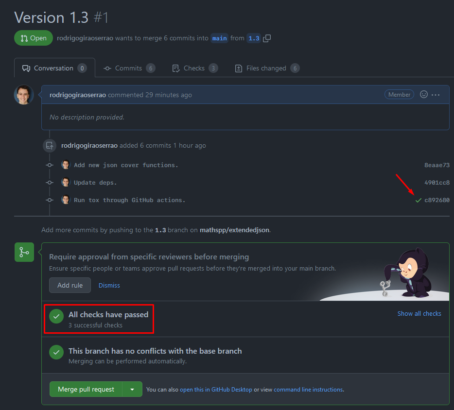

How do you create a Python package? How do you set up automated testing and code coverage? How do you publish the package? That's what this article teaches you.

===


## How to create a Python package?

In order to create a Python package, you need to write the code that implements the functionality you want to put in your package,
and then you need to publish it to [PyPI].
That is the bare minimum.

Nowadays, you can also set up a variety of other things to make your life easier down the road:

 - continuous testing of your package;
 - code coverage reports;
 - pre-commit hooks (to ensure proper code formatting, for example);
 - automatic publishing to [PyPI] every time you make a new release;
 - ...

This article will guide you through all of these steps.
I want to create a Python package with all the bells and whistles,
so I need to figure out how that is done.
However, be mindful that this article is my account of my findings as I try to figure out how to set everything up myself.
If you notice I am doing something wrong, _do_ let me know!

! This article contains **more than what is needed** to create and publish a Python package.
! If you want the bare minimums (which also depends on what you define as “the bare minimums”),
! it should be enough to read up until the section “[Write tests](#write-tests)”.


## What is the package for?

Typically, if you are creating a Python package, that's either because you have some code you would like to share with others,
or because you have an _idea_ for something you would like to share.

In my case, I want to package the [custom JSON encoder and decoder][custom-json] mechanism I wrote about recently,
which allows you to [extend the JSON standard][custom-json-extend-standard].


## Set up dependency management

I will start by setting up the dependency management of my package, and I will use [Poetry].
The reason I'm going for [Poetry] in this article is because I see a lot of other packages using it successfully,
so I reckon they are probably doing something right.

(I confess I frequently check how the [Textualize repositories][textualize] are set up,
and I try to mimic that.
They use [Poetry], so I'll do the same.)


### Pick a name

[Naming matters][pydont-naming-matters] **a lot** in programming.
You do not need a definitive name for your package at this point, but I know I want my package to be called `extendedjson`,
so I can actually start creating everything with the correct name.

When picking a name for your package, make sure to head over to [PyPI] and check if it is available!


### Initialise the project with Poetry

Go ahead and create a folder with your package name.
That's `extendedjson` for me.

Then, inside that folder, create a new project with [Poetry] by running the command

```bash
poetry new .
```

This will set up a couple of things for you:

```txt
extendedjson
├───extendedjson
│   └───__init__.py
├───tests
│   ├───__init__.py
│   └───test_extendedjson.py
├───pyproject.toml
└───README.rst
```

Take a look at the file `pyproject.toml`, which was filled in with some default information for me:

```ini
[tool.poetry]
name = "extendedjson"
version = "0.1.0"
description = ""
authors = ["Rodrigo Girão Serrão <5621605+RodrigoGiraoSerrao@users.noreply.github.com>"]

[tool.poetry.dependencies]
python = "^3.8"

[tool.poetry.dev-dependencies]
pytest = "^5.2"

[build-system]
requires = ["poetry-core>=1.0.0"]
build-backend = "poetry.core.masonry.api"
```

The TOML file contains settings and configurations for your package,
and each heading inside the square brackets `[]` defines a section.
For example, the file starts with the section `[tool.poetry]` where we have some configuration options for Poetry itself.
Then, we have the package dependencies, which amount to Python, for now.
After that, we have dependencies that are specific to the development of the package, i.e., things that you depend on when you are implementing functionality, testing your code, etc., but that aren't really needed by the end user.
Finally, we see some settings for the build system.

We are going to go ahead and leave the defaults as-is, because they are aligned with what I want right now.
The only thing I'll change is the file `README.rst`, because I prefer markdown files over reStructured Text.

After creating a new project, we can use Poetry to install all the dependencies in a virtual environment:

```bash
poetry install
```

This should create a file `poetry.lock` in your root directory, containing information about the specific versions of all the installed dependencies.

I did this already because I won't be having many dependencies,
but you can check [Poetry]'s documentation on how to add more dependencies,
or you can keep reading and I'll show you how in a second.


## Set up a repository

Now that we have the file structure set up, I will initialise a GitHub repository to host the code:

```bash
git init
git add *
git commit -m "First commit"
git branch -M main
git remote add origin https://github.com/mathspp/extendedjson.git
git push -u origin main
```

And we're live!
The [`extendedjson` repository][extendedjson-repo] is up!


### Set up some pre-commit hooks

The next thing we are doing is setting up some commit hooks.
This is just an extra step I'm taking because it helps keep things homogeneous.

For example, we can easily set up a pre-commit hook that ensures files will never have extra whitespace hanging at the end of lines,
or we can [set up `black` as a pre-commit hook][pre-commit-black] to make sure all code is always properly formatted.

! Check [`pre-commit`'s homepage][pre-commit] and [`black`'s GitHub repo][black] to read more about these tools.

First, we add `pre-commit` as a _development_ dependency with Poetry:

```bash
poetry add -D pre-commit
```

Then, we commit the updated dependencies:

```bash
git add poetry.lock pyproject.toml
git commit -m "Add pre-commit devt dependency."
```

Now, to set up `pre-commit`, we create a file `.pre-commit-config.yaml` in the root directory,
and we just set it up how we want.
This is how my `.pre-commit-config.yaml` file looks like:

```yaml
## See https://pre-commit.com for more information
## See https://pre-commit.com/hooks.html for more hooks
repos:
  - repo: https://github.com/pre-commit/pre-commit-hooks
    rev: v4.0.1
    hooks:
      - id: check-toml
      - id: check-yaml
      - id: end-of-file-fixer
      - id: mixed-line-ending
  - repo: https://github.com/psf/black
    rev: 22.3.0
    hooks:
      - id: black
  - repo: https://github.com/PyCQA/isort
    rev: 5.10.1
    hooks:
      - id: isort
        args: ["--profile", "black"]
```

After this, we install the hooks and then we run them once, just for good measure.

```bash
pre-commit install
pre-commit run --all-files
```

! Make sure your Poetry virtual environment is active!
! Running `poetry shell` will do the trick.

Now it is time to commit the changes to the repository,
the ones from adding the new dependency and then the ones that came from running the pre-commit hooks:

```bash
git add pyproject.toml poetry.lock .pre-commit-config.yaml
git commit -m "Add pre-commit devt dependency."
git add *
git commit -m "Run all pre-commits."
git push
```


## Add a license

Woops! Maybe I should have done this sooner, but I don't think it is too far down the road for me to do this now!
For this project, I am going with the permissive MIT license,
but bear in mind that your project might have different needs!

Adding the MIT license can be done from the repository webpage,
so I will do just that and then I'll actually pull the license into the local repository.


## Test uploading the package

Now I will try to upload the stub package to the **test** PyPI repository, https://test.pypi.org.
This lets everyone test their packaging/publishing workflows without messing with the real repository.


### Configure the test repository

First, we tell Poetry about this test repository:

```bash
poetry config repositories.testpypi https://test.pypi.org/legacy/
```

This makes it so that Poetry is aware of that repository, which we called `testpypi`.


### Get an API key

Next up, we need to get an API key so that Poetry can actually push to the `testpypi` repository.
For that, you need to [create an account on TestPyPI](https://test.pypi.org/account/register/) and then create a new API key under your account settings.

After grabbing your API key, you can configure Poetry to use it:

```bash
poetry config http-basic.testpypi __token__ pypi-your-api-token-here
```


### Build and upload your package

The step immediately before uploading your package is building it!
After building the package, you can try uploading it to TestPyPI:

```bash
poetry build
poetry publish -r testpypi
```

Once you have done that, and assuming all goes well,
your package should be [live on TestPyPI](https://test.pypi.org/project/extendedjson/).


### Ignore the build products

When you build your package, a folder `dist` is created,
and that's where you can find the things that Poetry built for you.

We don't want to push these to GitHub, so we'll go ahead and add the folder `dist` to the `.gitignore` file.


## Populate the real package

The next thing we are going to do is to actually populate the package with the actual code,
and then publish it to the real [PyPI] repository.


### Add the code

So, I will start by grabbing my [custom JSON encoder and decoder mechanism][custom-json],
and put it in the `extendedjson/__init__.py` file.


### Changelog management

Next, I want to record this change in a changelog, so I will add one more development dependency, [scriv].
Scriv is a command-line tool for helping developers maintain useful changelogs.

This step is entirely optional, but I like using scriv,
so I'll briefly describe what I did to set it up.

Once again, adding a development dependency with Poetry is straightforward:

```bash
poetry add -D scriv[toml]
```

Next, I configure scriv in my file `pyproject.toml` to use markdown files for the changelog fragments,
I create the directory `changelog.d` where the changelog fragments will live,
and now I can create a fragment that keeps track of my code change:

```bash
scriv create
```

Scriv will now create a small file where I'm supposed to jot down the changes I made.
In my case, it's just this:

```md
#### Added

- Classes `ExtendedEncoder` and `ExtendedDecoder` to allow extension of the JSON format.
```


### Committing everything

At this point there is a lot that needs to be committed:

```bash
git add pyproject.toml poetry.lock changelog.d/.gitkeep
git commit -m "Add scriv as devt dependency."
git add changelog.d/* extendedjson/__init__.py
git commit -m "Add ExtendedEncoder and ExtendedDecoder."
```


## Publish the real package

Now that we have real code to distribute, we can publish it to the real PyPI repository!


### Configure PyPI

Because Poetry is built with Python in mind, configuring PyPI is a tad easier than TestPyPI.
Simply go to your [PyPI] account (create one if needed!),
grab an API key,
and then tell Poetry to use it:

```bash
poetry config pypi-token.pypi pypi-your-token-here
```


### Build and publish

Now we can publish our code, but we **must build it first**,
which we do with the flag `--build`:

```bash
poetry publish --build
```

There it goes!
Now you can [get `extendedjson` from PyPI][extendedjson-pypi]!


### Do a victory lap

After uploading a new project to PyPI for the first time, I always like doing a small victory lap...

I just install the module, import it, exit Python, and then uninstall it:

```bash
λ python -m pip install extendedjson
## ...

λ python
Python 3.9.7 (tags/v3.9.7:1016ef3, Aug 30 2021, 20:19:38) [MSC v.1929 64 bit (AMD64)] on win32
Type "help", "copyright", "credits" or "license" for more information.
>>> import extendedjson as xjson
>>> xjson.ExtendedEncoder
<class 'extendedjson.ExtendedEncoder'>
>>> exit()

λ python -m pip uninstall extendedjson
Found existing installation: extendedjson 0.1.0
Uninstalling extendedjson-0.1.0:
  Would remove:
    c:\users\rodri\appdata\roaming\python\python39\site-packages\extendedjson-0.1.0.dist-info\*
    c:\users\rodri\appdata\roaming\python\python39\site-packages\extendedjson\*
Proceed (Y/n)? y
  Successfully uninstalled extendedjson-0.1.0

λ # Victory lap completed.
```


## Publish a release

Let's prepare a GitHub release for version 0.1.0.


### Prepare the release

I'll start by putting _some_ info on the README file, which is currently empty.
I'll also let Poetry know that the package information is in there, by specifying

```bash
readme = "README.md"
```

in the file `pyproject.toml`.

The first sentence will be a short description of what `extendedjson` is for,
which I'll also add as the project description under the Poetry configurations.
Next, I'll add a short example and link to the article where I wrote about the code.

Finally, I'll use scriv to collect the changelog fragment into the CHANGELOG file that I'll use:

```bash
scriv collect
```

Then, I'll take the short sentence from the README file and make it the repository description.
And I'll also add some subject tags.


### Tag the commit history

After all these nice changes are into place and committed,
let's tag the commit history to say that _this_ point in time is version 0.1.0:

```bash
git tag -a v0.1.0 -m "Initial version."
```

And now, it's release time!

I tried using the command `scriv github-release` to do the release for me,
but something wasn't working, so I made the release manually.


### Publish the release

After you create a tag, it is very straightforward to create a release!
Just go to the `/tags` page in your repository and click the three dots next to your tag:
it will have an option to create a release out of that tag.


## Write tests

Some may say I should have done this sooner, but let's write tests for our code.
Poetry already created a directory `tests` for us,
together with a file `tests/test_extendedjson.py`:

```py
from extendedjson import __version__


def test_version():
    assert __version__ == "0.1.0"
```

We'll extend these tests to actually cover the functionality that the package provides.

To run all the tests, all you need to do is run the command `pytest`:

```bash
λ pytest
========================= test session starts =========================
platform win32 -- Python 3.8.5, pytest-5.4.3, py-1.11.0, pluggy-0.13.1
rootdir: C:\Users\rodri\Documents\Programming\extendedjson
collected 5 items

tests\test_extendedjson.py .....                                 [100%]

========================== 5 passed in 0.06s ==========================
```

After adding tests, we commit them and prepare a patch release for version 0.1.1.


## Automating testing, linting, formatting, and everything

### Understanding tox

[tox] is a tool that aims to automate and standardise testing in Python,
and it is a tool that I want to set up to automate a lot of tasks:

 - testing (with `pytest`);
 - linting (with `flake8`, `pylint`, `mccabe`);
 - formatting (with `black`);
 - test coverage (with `coverage`); and
 - later on, building the documentation.

At the time of writing, [tox doesn't yet have native support to be configured from `pyproject.toml`][tox-pyproject],
so we'll configure tox in the standard way, which is through a file `tox.ini`.

I was trying to understand what my file `tox.ini` was going to look like, based off of another file `tox.ini`:

```ini
[tox]
isolated_build = True
envlist = py37,py38,py39

[testenv]
deps =
    black
    coverage
    flake8
    mccabe
    mypy
    pylint
    pytest
commands =
    black podsearch
    flake8 podsearch
    pylint podsearch
    mypy podsearch
    coverage erase
    coverage run --include=podsearch/* -m pytest -ra
    coverage report -m
```

The section `deps` lists the dependencies that tox needs,
and the section `commands` lists all the commands that tox will run for us.

I have been trying to understand what dependencies go in `deps`,
and what dependencies go in `pyproject.toml`.

As I understand it, the command `poetry add` manages your (development) dependencies
for things that you need to use directly,
either while using the package or while developing the package.
The dependencies listed in tox are all the dependencies for the commands that tox will run,
_even if there is overlap_.
That is because tox manages virtual environments for the dependencies,
and those virtual environments are independent from Poetry's.

I was also trying to understand what the option `isolated_build` does.
[Reading the docs][tox-packaging], I understand that tox builds packages following a default procedure,
which differs from the procedure that Poetry follows.
So, `isolated_build = True` probably tells tox that building will be handled by another tool/in some other way.


### A simple tox configuration

For a very first try, I created a simple file `tox.ini` with just a couple of dependencies:

```ini
[tox]
isolated_build = True
envlist = py38,py39,py310

[testenv]
deps =
    black
    pytest
commands =
    black --check extendedjson
    pytest .
```

This will test my package on Python versions 3.8, 3.9, and 3.10,
and it will check that the code is well-formatted and it will run the tests.
That's it.


### Running tox

To run tox, I can either run everything with the simple command

```bash
λ tox
```

or I can run a single environment by specifying it.
For example, if I only want to run all the commands for Python 3.10,
I would use the following command:

```bash
λ tox -e py310
```

The first time an environment is ran, tox has to do some setup,
but most of the setup is cached, so subsequent runs should be faster!

When you run tox, and if all goes well,
you should see a couple of success messages at the end:

```bash
λ tox
## ...
  py38: commands succeeded
  py39: commands succeeded
  py310: commands succeeded
  congratulations :)
```


### Expanding the tox configuration

Now that I've seen how tox works, I feel more confident in expanding the configuration:

```ini
[tox]
isolated_build = True
envlist = py38,py39,py310

[testenv]
deps =
    black
    flake8
    isort
    mccabe
    pylint
    pytest
commands =
    black --check extendedjson
    isort --check extendedjson
    flake8 extendedjson --max-complexity 10
    pylint extendedjson
    pytest .
```

The configuration was extended to include flake8, pylint, and the mccabe complexity checker.
(The complexity checker is a plugin for flake8,
and it's why I added the `--max-complexity 10` argument to the command `flake8 extendedjson`.)

Running tox now blows right in my face, because pylint says my code quality is just 5.22 out of 10!
Well, that sucks!


## Improving code quality

There is no point in automating all these tests and checks if then we ignore the output,
so let's improve the code quality of the package.
Thankfully, pylint tells me exactly what the issues are:

```txt
************* Module extendedjson
extendedjson\__init__.py:1:0: C0114: Missing module docstring (missing-module-docstring)
extendedjson\__init__.py:6:0: C0115: Missing class docstring (missing-class-docstring)
extendedjson\__init__.py:7:4: W0237: Parameter 'o' has been renamed to 'obj' in overridden 'ExtendedEncoder.default' method (arguments-renamed)
extendedjson\__init__.py:7:4: R1710: Either all return statements in a function should return an expression, or none of them should. (inconsistent-return-statements)
extendedjson\__init__.py:19:0: C0115: Missing class docstring (missing-class-docstring)
extendedjson\__init__.py:24:4: C0116: Missing function or method docstring (missing-function-docstring)
extendedjson\__init__.py:24:4: E0202: An attribute defined in json.decoder line 319 hides this method (method-hidden)
```

These were all fixed in a fairly small [commit](https://github.com/mathspp/extendedjson/commit/6a58086cdfadcf4085eea2a39a766dd20df257ba),
and now tox is all happy again:

```bash
λ tox
## ...
  py38: commands succeeded
  py39: commands succeeded
  py310: commands succeeded
  congratulations :)
```


## Code coverage

Now I want to setup code coverage!
I hope this is easy enough...

I started by going to the [coverage.py documentation][coverage-docs] and followed the steps indicated.
Two minutes later, I already had my first coverage report:


To build this report, all I did was

 1. install coverage.py with `python -m pip install coverage`;
 2. use coverage.py to run my tests with `coverage run --source=extendedjson --branch -m pytest .`; and
 3. create the HTML report with `coverage html`.

The command that runs coverage.py could have been as simple as `coverage run -m pytest .`,
but I used the two arguments you can see above to tweak the execution:

 - `--source=extendedjson` says we care about the coverage of the code inside `extendedjson`,
 which can find files in that folder that haven't been touched _and_ it ignores the source code in the tests.
 - `--branch` tells coverage.py to investigate which branching paths are and are not taken in the code,
 which is more fine-grained than just checking which statements run.


### Running coverage.py with tox

For this test run of coverage.py, I ran everything locally and by hand.
What I want to do now is to have tox run coverage.py for me.
For that, I just need to add coverage.py to the dependency list in the file `tox.ini`
and then I need to add the two relevant coverage.py commands in the list of commands:

```ini
[tox]
isolated_build = True
envlist = py38,py39,py310

[testenv]
deps =
    black
    coverage
    # ...
commands =
    # ...
    coverage run --source=extendedjson --branch -m pytest .
    coverage report -m
```

This sets up tox to run coverage.py for me.
However, there is something that isn't clear yet:
do I want tox to fail if code coverage isn't 100%?
Or am I using tox simply for the fact that it does automate the code coverage report generation?

Either way, I only have 85% code coverage right now, so let's work on improving that.


### 100% code coverage

To achieve 100% code coverage I need to make sure that each statement in my code runs at least once when the tests run.
At this point, this just means that I need to write a couple of tests for which encoding and decoding fails,
because those are the cases that I haven't covered yet.

This is not terribly difficult to do, which means I eventually got to 100% code coverage:


Having done that, now is a good time to make a new minor release (0.1.2) that contains full code coverage.


### Forcing 100% code coverage

Right now, tox will run code coverage and it will build the coverage report,
but it will succeed, regardless of the coverage percentage achieved.

If you specify a level of code coverage that you want to always have,
like 100%, you could modify your tox configuration:
as it turns out, the command `coverage report` accepts an argument `--fail-under`
that tells coverage.py to exit with a non-zero status code if the coverage is below a certain threshold.
This means tox would say you failed.

To configure tox in this way, just modify your coverage report command:

```ini
## ...

commands =
    # ...
    coverage run --source=extendedjson --branch -m pytest .
    coverage report -m --fail-under 100  # This can be another target threshold.
```

Right now, I'm not sure if I'll set tox to fail when the code coverage is under 100,
so I'll leave this alone for now.


## CI/CD with GitHub Actions

GitHub Actions is a service that GitHub provides that lets you run your workflows in the cloud.
For example, linting your code and running the tests.
What is more, these _actions_ that you run can be customised to trigger at specific times,
for example, when we push code to the main branch or when people make pull requests against that branch.


### Running linters and tests

GitHub Actions are defined by YAML files that live in the directory `.github/workflows`,
so we are going to go ahead and create the file `.github/workflows/build.yaml`.
This will define a GitHub action that runs tox.

In order to set this up and test it while I go, I created a new branch `1.3`.
This release will contain a bit more functionality in the code itself,
and the CI/CD we are setting up _right now_.

By cross-referencing some sources, I came up with the YAML file you can find below.
I will go over what everything means in just a second.

```yaml
## .github/workflows/build.yaml
name: extendedjson CI

on:
  push:
    branches: [ main ]
  pull_request:
    branches: [ main ]

jobs:
  build:
    runs-on: ubuntu-latest
    strategy:
      matrix:
        python-version: ["3.8", "3.9", "3.10"]

    steps:
      - name: Checkout sources
        uses: actions/checkout@v2

      - name: Setup Python
        uses: actions/setup-python@v2
        with:
          python-version: ${{ matrix.python-version }}

      - name: Install dependencies
        run: |
          python -m pip install --upgrade pip
          python -m pip install tox tox-gh-actions

      - name: Run tox
        run: tox
```

After saving the file, I committed it, pushed it to GitHub,
and then created a pull request from the branch `1.3` into `main`.
Because of the newly added GitHub Action, a couple of things started happening when the PR was made.

After a couple of seconds, I got a green checkmark next to the commit and GitHub told me that “All checks have passed”,
next to the button that lets me merge the pull request:



By clicking the link “show all checks” or by navigating to the tab “Actions”,
which is right next to the tab “Pull requests”, you can see more information regarding the run.
When we open that interface, we get an overview of all the workflows we have and the latest runs.
On the left, we can find the workflows identified by the `name` information we defined at the top of the YAML file.


I am getting too carried away, explaining how all of this works, so let me cut to the chase:
while I was taking a look around, I noticed that running tox had taken **zero** seconds.
When I looked closer, I realised tox wasn't running a single environment...

As it turns out, I was making use of the tox plugin `tox-gh-actions` but I didn't set it up correctly yet.
Remember that tox can run all your linting and testing in isolated environments for multiple Python versions.
As it turns out, we can also ask GitHub Actions to run our checks in multiple Python versions...
But we don't want GitHub Actions to go over all the Python versions I care about,
and then have tox test all Python versions again, because that would duplicate a lot of effort.

Instead, we use `tox-gh-actions` to let tox know which environments should run,
and we define that in the file `tox.ini`, to which I added this configuration:

```ini
[gh-actions]
python =
    3.8: py38
    3.9: py39
    3.10: py310
```

This maps Python version from the GitHub action to the tox environments we care about.
I added this configuration and committed it, which triggered the workflow again...
And this time, it failed!
It failed because my new code hadn't been linted yet,
and one of the linters complained.
I proceeded to fixing the code and committing the changes, until I had a passing build.

Now that GitHub Actions is happy, let me briefly go over what I set up in the YAML file:

First, I defined the name of the workflow with `name: ...`.
Then, I defined the triggers for the workflow:

```yaml
on:
  push:
    branches: [ main ]
  pull_request:
    branches: [ main ]
```

This means the workflow runs when code is pushed to the branch `main` or when people open pull requests for the branch `main`.
Finally, we define the things that actually need to run by defining “jobs”, which are just a series of steps you want to go over.
Jobs are defined in `jobs:`, and you can have multiple of them.
In our case, we only have a single job called `build`:

```yaml
jobs:
  build: ...
```

Notice that the fact that the file is `build.yaml` and this job is called `build` is for consistency,
but none of these names have any real effect on what GitHub Actions does for us.

After creating a job, we need to specify what are its steps, i.e., the sequence of actions that need to happen.
That's what the section `steps` is for:

```yaml
jobs:
  build:
    # ...

    steps:
      - name: Checkout sources
        uses: actions/checkout@v2

      - name: Setup Python
        uses: actions/setup-python@v2
        with:
          python-version: ${{ matrix.python-version }}

      - name: Install dependencies
        run: |
          python -m pip install --upgrade pip
          python -m pip install tox tox-gh-actions

      - name: Run tox
        run: tox
```

Each step may run commands or make use of other actions.
The first two steps make use of actions provided by GitHub:

 1. the first action, `checkout`, clones your repository into the machine running the action; and
 2. the second action installs Python on that machine.

By using `with: python-version: ...` we can specify which Python version we want.
And then, instead of hardcoding a Python version, we use the variable `matrix.python-version`.
What's that?

Well, above the steps, we defined a “matrix strategy”,
which just means we are going to run this job for different combinations of variables that we care about.
In our case, we just want to run this job for multiple Python versions:

```yaml
jobs:
  build:
    # ...
    strategy:
      matrix:
        python-version: ["3.8", "3.9", "3.10"]
```

So, `strategy: matrix: ...` means we can specify our custom variables (like `python-version`) and then the job will run for each value of that variable.
In our case, we specified Python versions 3.8, 3.9, and 3.10.

Finally, we upgrade `pip`, install tox and the GH Actions plugin, and then run tox.

The only thing that I didn't cover yet is the `runs-on: ubuntu-latest`,
which just specifies the operating system (and version) that the host machine is running on.

You should check [the GitHub Actions documentation][gh-actions-docs] for more information on all of this.


### Integrating with Codecov

After setting up the initial version of CI, I noticed my checks were passing but I only had 77% code coverage.
So, I ended up setting coverage.py to fail when my coverage isn't 100%.
I did that by going to the file `tox.ini` and adding `--fail-under 100` to the command `coverage report -m`:

```ini
## ...

[testenv]
## ...
commands =
    # ...
    coverage report -m --fail-under 100
```

I added tests to get my coverage to 100% and I committed those tests.
Next, I will integrate [Codecov] with my project, so that we get nice code coverage reports on pull requests.
I'll start by logging in with my GitHub account over at the [Codecov website][Codecov],
and then I just need to modify my workflow YAML file to upload the coverage data to Codecov.
This needs to happen _after_ tox has run:

```yaml
## ...
jobs:
  build:
    # ...

    steps:
      # ...

      - name: Run tox
        run: tox

      - name: Upload coverage to Codecov
        uses: codecov/codecov-action@v2
        with:
            fail_ci_if_error: true
```

On top of this, we do one other minor modification on the `on` dictionary:

```yaml
name: extendedjson CI

on:
  push:
    branches: [ main ]
  pull_request:
    branches: [ main ]
  workflow_dispatch:

## ...
```

By adding `workflow-dispatch:`, we make it possible to rerun a workflow that completed successfully.
From [other sources I read][hynek-codecov], it looks like this might be needed in some weird cases when Codecov fails to do what it should be doing.

Commit all the changes and push, and let us see if I was able to set everything up correctly!
And it was not! Codecov was not finding the coverage report because I wasn't writing a coverage report in a format understood by Coverage.
All I had to do was add a `coverage xml` command to the file `tox.ini`:

```ini
## ...

[testenv]
## ...
commands =
    # ...
    coverage xml
```

After this was fixed, Codecov worked perfectly and commented my PR saying my coverage is 100%:


### Publishing to PyPI automatically

The final step in this endeavour is publishing automatically to PyPI every time we make a new release.
There are actions that publish Python packages to PyPI for us,
but I want to do this by hand.
In essence, I need to create a GitHub Action such that the steps mimic what I wrote above regarding publish to PyPI with Poetry.
So, the action will have these steps:

 1. Use the checkout action to checkout the repository.
 2. Set up Python.
 3. Install Poetry.
 4. Configure Poetry with a PyPI token.
 5. Build and publish the package.

The only step that requires some extra care is the one where we configure Poetry with the token.
We cannot write the token explicitly in the YAML file, so we need to create a GitHub secret with a token.

I went to PyPI, created a new token, and added it to the repository on GitHub:


This makes it usable from within actions.
Here is the new action file `.github/workflows/publish.yaml`:

```yaml
name: Publish to PyPI

on:
  release:
    types: [ published ]
    branches: [ main ]
  workflow_dispatch:

jobs:
  build-and-publish:
    runs-on: ubuntu-latest

    steps:
      - name: Checkout sources
        uses: actions/checkout@v2

      - name: Setup Python
        uses: actions/setup-python@v2
        with:
          python-version: "3.10"

      - name: Install poetry and dependencies
        run: |
          python -m pip install --upgrade pip
          python -m pip install poetry

      - name: Configure poetry
        env:
          pypi_token: ${{ secrets.PyPI_TOKEN }}
        run: poetry config pypi-token.pypi $pypi_token

      - name: Build and publish
        run: poetry publish --build
```

Commit the workflow and push.
Now, I just need to prepare everything for a release.
Then, when I create the `0.1.3` release, GitHub should publish to PyPI for me...
Which it did!


## README badges

To conclude this endeavour, let us finish up by adding nice badges to the README file!
This is what we are adding:


To add these badges, all we need to do is add links to some images that are automatically generated for us.
Here is the change to the README file:

```md
## extendedjson

 > Easily extend JSON to encode and decode arbitrary Python objects.

[![PyPI Version][pypi-image]][pypi-url]
[![Build Status][build-image]][build-url]
[![Code Coverage][coverage-image]][coverage-url]
[![][stars-image]][stars-url]
[![][versions-image]][versions-url]

...

<!-- Badges: -->

[pypi-image]: https://img.shields.io/pypi/v/extendedjson
[pypi-url]: https://pypi.org/project/extendedjson/
[build-image]: https://github.com/mathspp/extendedjson/actions/workflows/build.yaml/badge.svg
[build-url]: https://github.com/mathspp/extendedjson/actions/workflows/build.yaml
[coverage-image]: https://codecov.io/gh/mathspp/extendedjson/branch/main/graph/badge.svg
[coverage-url]: https://codecov.io/gh/mathspp/extendedjson/
[stars-image]: https://img.shields.io/github/stars/mathspp/extendedjson/
[stars-url]: https://github.com/mathspp/extendedjson
[versions-image]: https://img.shields.io/pypi/pyversions/extendedjson/
[versions-url]: https://pypi.org/project/extendedjson/
```

If you go to [shields.io][shields] you can find _hundreds_ of different badges that you can add to your own projects.
Just have fun selecting all the appropriate badges you want to add!


## Tidying up

At this point, I published this article and it got some attention on Twitter,
which meant I got **lots** of good suggestions for improvements!

Here are the implementations of some of those suggestions.


### Modifying the code layout to use `src`

As it turns out, it is a good idea to have your source code one level deeper,
inside a folder `src`.
[This helps you out when testing your code][use-src-layout] because it helps you catch import issues with submodules.
You can read the article I linked for more information, but fixing this is easy:

 1. Add a folder `src` in the root directory, inside which we move the folder `extendedjson` with the source code of the package.
 2. Fix other paths, like the Scriv configuration.

Fixing Scriv's configuration is a piece of cake.
Just go to the file `pyproject.toml` and change this setting:

```toml
[tool.scriv]
## ...
version = "literal: src/extendedjson/__init__.py: __version__"
```


### Running linting in tox through pre-commit

Another thing that was suggested to me was deduplicating some effort.
As of now, pre-commit runs some linting and then tox reruns all the linting for all the Python environments.
This has some drawbacks:

 - linting is run in triplicate;
 - tox and pre-commit may run different versions of the linters; and
 - I can commit something that passes the pre-commit but then makes CI fail.

This can be fixed if we choose to run linting through pre-commit.
First, I need to set up pre-commit to use all the linters I care about:

```yaml
## See https://pre-commit.com for more information
## See https://pre-commit.com/hooks.html for more hooks
repos:
  - repo: https://github.com/pre-commit/pre-commit-hooks
    rev: v4.0.1
    hooks:
      - id: check-toml
      - id: check-yaml
      - id: end-of-file-fixer
      - id: mixed-line-ending

  - repo: https://github.com/psf/black
    rev: 22.3.0
    hooks:
      - id: black
        args: ["--check"]

  - repo: https://github.com/PyCQA/isort
    rev: 5.10.1
    hooks:
      - id: isort
        args: ["--check", "--profile", "black"]

  - repo: https://github.com/PyCQA/flake8
    rev: 4.0.1
    hooks:
    - id: flake8
      additional_dependencies: [mccabe]
      args: ["--max-line-length", "88", "--max-complexity", "10"]

  - repo: https://github.com/PyCQA/pylint/
    rev: v2.14.5
    hooks:
    - id: pylint
      exclude: tests/  # Prevent files in tests/ to be passed in to pylint.
```

This is just an extension to what was already here.
Then, I need to configure tox to have an environment specific for linting.
By creating a separate environment, I manage to speed up some of the CI checks.

Here is the new tox configuration:

```ini
[tox]
isolated_build = True
envlist =
    py38,
    py39,
    py310,
    linting,

[testenv]
deps =
    coverage
    pytest
changedir = {envtmpdir}
commands =
    pytest {toxinidir}
    coverage run --source=extendedjson --branch -m pytest {toxinidir}
    coverage report -m --fail-under 100
    coverage xml

[testenv:linting]
deps = pre-commit
commands = pre-commit run --all-files --show-diff-on-failure

[gh-actions]
python =
    3.8: py38
    3.9: py39
    3.10: py310, linting
```

We created a new environment `linting` which uses pre-commit to run linting on all files.
As simple as that.
Then, we tell tox to run the environment `linting` when GitHub actions runs Python 3.10.
(We need to add `linting` to _some_ Python version, otherwise linting doesn't run.)


### Check coverage only once

Now that we went through all the effort of not triplicating the linting,
might as well not triplicate the code coverage reports as well.

In order to do this, we also create a new tox environment just for coverage:

```ini
[testenv:coverage]
deps =
    pytest
    coverage
commands =
    coverage run --source=extendedjson --branch -m pytest {toxinidir}
    coverage report -m --fail-under 100
    coverage xml
```

Now, recall that we changed directories and are running testing and coverage from a different place.
So, the coverage report also gets written to a different path,
which means that Codecov can't find it by default.
We need to fix this, for example, by changing the `coverage xml` command so that the report is written to a path where Codecov can find it:

```ini
[testenv:coverage]
## ...
commands =
    # ...
    coverage xml -o {toxinidir}/coverage.xml
```

Then, once again, we need to configure the section `[gh-actions]` to add the environment `coverage`
(which needs to be listed at the top as well, in `envlist`) to a Python version.
Finally, we need to modify our build YAML file so that CI only tries to upload the coverage report for the correct Python version(s).

So, here are the other changes to the file `tox.ini`:

```ini
[tox]
isolated_build = True
envlist =
    # ...
    coverage

## ...

[gh-actions]
python =
    3.8: py38
    3.9: py39, coverage
    3.10: py310, linting
```

Finally, we add a condition to the file `build.yaml` in the step that uploads code coverage reports:

```yaml
name: extendedjson CI
## ...

jobs:
  build:
    # ...
    steps:
      # ...
      - name: Upload coverage to Codecov
        # We only generate the coverage report in Python 3.9
        if: "matrix.python-version == '3.9'"
        uses: codecov/codecov-action@v2
        with:
          fail_ci_if_error: true

```


## Wrap up

That is it for now.
Throughout this article, we

 - created a Python package;
 - set up Poetry for dependency management;
 - set up a GitHub repository to host the code;
 - defined some pre-commit hooks to make sure we only make commits that meet certain criteria;
 - added a (fairly permissive) license to the project;
 - configured Poetry to allow uploading to PyPI and a test version of PyPI;
 - tested uploading the package to a test version of PyPI;
 - added Scriv to help us with changelog management and generation;
 - tagged and published a release of our project;
 - wrote a bunch of tests;
 - automated testing and linting with tox;
 - checked code coverage and got it to 100%;
 - set up CI/CD with GitHub actions to run linting and testing;
 - integrated with Codecov to get coverage reports in our pull requests;
 - created a GitHub action to publish our package to PyPI automatically; and
 - added some nifty badges to the README file.

I hope this was useful for you!
If you have any other steps you follow in your own packages,
feel free to leave a comment below!


[custom-json]: /blog/custom-json-encoder-and-decoder
[custom-json-extend-standard]: /blog/custom-json-encoder-and-decoder#extending-the-json-format
[pre-commit-black]: /blog/til/run-black-formatter-on-pre-commit
[extendedjson-repo]: https://github.com/mathspp/extendedjson
[extendedjson-pypi]: https://pypi.org/project/extendedjson/
[PyPI]: https://pypi.org
[Poetry]: https://python-poetry.org/
[textualize]: https://github.com/textualize/
[black]: https://github.com/psf/black
[pre-commit]: https://pre-commit.com/
[scriv]: https://pypi.org/project/scriv/
[tox]: https://tox.wiki/en/latest/
[tox-pyproject]: https://tox.wiki/en/3.26.0/example/basic.html#pyproject-toml-tox-legacy-ini
[tox-packaging]: https://tox.wiki/en/3.26.0/example/package.html
[coverage-docs]: https://coverage.readthedocs.io/en/6.4.1/index.html
[gh-actions-docs]: https://docs.github.com/en/actions
[Codecov]: https://about.codecov.io/
[hynek-codecov]: https://hynek.me/articles/python-github-actions/#coverage
[shields]: https://shields.io/
[use-src-layout]: https://blog.ganssle.io/articles/2019/08/test-as-installed.html


That's it for now! [Stay tuned][subscribe] and I'll see you around!

[subscribe]: /subscribe
