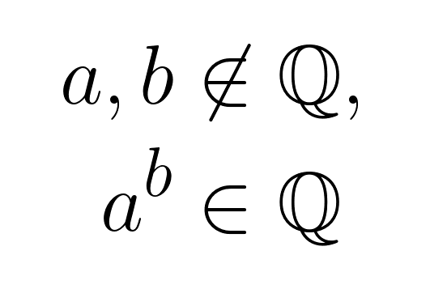

Let's prove that there are two irrational numbers, call them $a$ and $b$, such that $a^b$ is a rational number! And let's do it in a tweet.

===

# Twitter proof

<blockquote class="twitter-tweet">
Twitter proof: Let a=b=√2. If a^b is rational then there is nothing to be done. Assume a^b is irrational. Redefine a=√2^√2. Notice how a^b = (√2^√2)^√2 = (√2)^2 = 2 which is clearly rational. QED.<a href="https://t.co/3sFinyzJwu">https://t.co/3sFinyzJwu</a>
&mdash; Mathspp (@mathsppblog) <a href="https://twitter.com/mathsppblog/status/1286089355732365313?ref_src=twsrc%5Etfw">July 23, 2020</a></blockquote>

Do you have an idea for a twitter proof? Let me know in the comments below!
