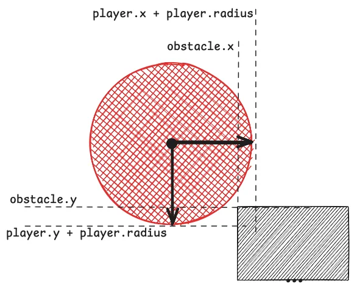

This tutorial walks you through implementing a 2D scrolling game in JavaScript.

===


# JavaScript 2D scrolling game tutorial

This JavaScript tutorial is for people who know programming (for example, in Python) but have no JavaScript knowledge.
In this tutorial we will build a 2D scrolling game where the player (a red ball) will jump to avoid obstacles (black rectangles) that come toward the player at increasing speeds.


## JavaScript and the web

JavaScript is a language that runs directly in your browser without you having to do anything else.
In fact, if you click the address bar (where you usually type the URL addresses of the websites you want to visit) and type something like `javascript:alert("Hello, world!");`, the browser should display a pop-up with the message “Hello, world!”.

JavaScript is tightly integrated with your browser.
This means you can also use JavaScript to manipulate web pages.
In JavaScript, `document` is a variable that refers to the web page (document) you're currently on, and it lets you interact with the page programmatically.
Here's a fun example:

 1. open the Wikipedia page at <wikipedia.org>; and
 2. type `javascript:document.getElementById("www-wikipedia-org").remove()` in your address bar.

If all goes well[^1] and you copy that code correctly, it should look like the page disappeared.
In fact, if you look at the end of the code you pasted, there's a `remove` in there.
What we did was ask the web page for an element with the unique ID `www-wikipedia-org`, which for the main Wikipedia page refers to the whole visible page.

[^1]: Web pages evolve and change with time; if enough time has passed, this tutorial may be outdated and the reference `www-wikipedia-org` that I'm trying to use may no longer be there. If that's the case, please [email me](mailto:rodrigo@mathspp.com) so I can update this tutorial.

Don't worry, you didn't hack Wikipedia and you aren't going to jail.
If you refresh the page, you should get a brand new copy of the page you were at, and everything should be back to normal.
That's because the JavaScript code you ran when you pasted it in the address bar was running _locally_, on your browser, on your copy of the Wikipedia main page.
It ran on the “client side”.


## Developer console

Next, I want to tell you about the developer console.
The developer console is like a debugger, but instead of being built into your IDE of choice, it's built into your web browser.
All major web browsers have a developer console: Safari, Chrome, Firefox, Opera, Brave, etc.

Each browser has a different shortcut to open the developer console, so you may want to look up “Open developer console INSERT_BROWSER_HERE”.

In most browsers, a roundabout way of achieving this effect is right-clicking _anywhere_ on a page and then looking for the option that says something like “Inspect” or “Inspect element”.
That should open a window that lets you peek at the source code of the page you're currently on, and it should have a tab that says something like “Console” or “JavaScript console”.

If you haven't been able to open the console yet, look up how to do it in your preferred browser.

When you manage to open the console, it won't look _exactly_ like mine, but it should be somewhat similar to this:


The highlight is the prompt at the bottom, which is where you get to write JavaScript code and interact with the browser of the page you're in.
You can try creating another alert, as before, but now you can also use `console.log`, which is like Python's `print`, but that writes to the console.
Try typing this in the prompt at the bottom: `console.log("Hello, world!")`.

If you do it correctly, you should see the message “Hello, world!” appear in the console:


When you're writing JavaScript code, you can use `console.log` as a basic debugging tool.


## Game setup

We will write the game in a plain page with nothing but our game.
To do this, you will need to write the basic skeleton of a web page in HTML, and then you'll write the JavaScript code that actually makes your game run.

Go ahead and create a file `game.html` and put this in it:

```html
<html>

<body>
    <h1>Best game ever</h1>
</body>
</html>
```

If you double-click your file (and make sure its extension is `.html`), it should open your default web browser and show an exciting web page:


I'm cutting some corners here, but the code you typed in your file `game.html` is some basic HTML that is just enough for the browser to display _something_.
You'll be working on top of this over the next few sections.


## Game canvas

To make our game, you will create what's called a “canvas”, which is an HTML element that provides functionality for you to draw on.
HTML elements are created with tags, which are the things that start with `<`, have a name, and then end with `>`.
Many tags are created in pairs (like `html`, `body`, and `h1` above) and the content usually goes between the tags.
The tag `html` sets the whole page, and virtually everything goes inside it; the tag `body` is for the main content of the page; and the tag `h1` creates a heading.

Now, you will add a tag to create a canvas:

```html
<html>

<body>
    <h1>Best game ever</h1>

    <canvas></canvas>
</body>
</html>
```

If you modify your file `game.html`, save it, and reload the browser page...
Nothing should happen!
At least, nothing visible.
That's because you created an empty canvas with the default colour, which means you can't see it.
To make the canvas visible, go ahead and style it by modifying its HTML code:

```html
<html>

<body>
    <h1>Best game ever</h1>

    <canvas style="background: lightblue"></canvas>
</body>
</html>
```

That should make the canvas visible:


## Interacting with the canvas with JavaScript

Now you will use some JavaScript to interact with the game canvas.
Remember the little demo where you used the function `document.getElementById` to access a part of the Wikipedia page and then delete it?
You'll use a similar mechanism to access the canvas, so you need to give the canvas a unique ID.
Then, you can create a `script` tag that contains JavaScript code to interact with your canvas:

```html
<html>

<body>
    <h1>Best game ever</h1>

    <canvas id="gameCanvas" style="background: lightblue"></canvas>

    <script>
        const canvas = document.getElementById("gameCanvas");

        canvas.width = 600;
        canvas.height = 300;
    </script>
</body>
</html>
```

This should create a larger canvas.
Save your code and reload the page, and you should see a larger canvas on the screen.


## Live demos

The beauty of writing your game in the file `game.html` is that it acts as a standalone web page (that you can view offline) and that you can easily share with others.
Additionally, I can embed it on this article or link you to it, so you can see an example of exactly what you should be seeing, so I'll start doing that from now on.
At each step, I will embed the state of the game for you to take a look at and I will link to the standalone page for you to check your progress.

The only difference will be that I will require you to click the demo once for it to start, otherwise all demos will run without you actually seeing them.
I will also get rid of the title “Best game ever” because it's in the way.

Here's [the first demo I'm linking to](/blog/javascript-2d-scrolling-game-tutorial/game04.html), which shows the larger canvas:

<iframe style="border: 0;" width="100%" height="400" src="/blog/javascript-2d-scrolling-game-tutorial/game04.html"></iframe>


## Drawing the player

The first thing you'll do is draw the player on the canvas.
The player will be a red ball, so we need to create a data structure to hold information about the player position and then we need to somehow draw the player on the screen.

To hold player info we will create a JavaScript object, which looks a bit like a Python dictionary but allows accessing information with the dot syntax we are used to.
This is the code to create the player object:

```js
const canvas = document.getElementById("gameCanvas");

canvas.width = 600;
canvas.height = 300;

const player = {  // Create an object with values for x, y, and radius.
    x: 50,
    y: 50,
    radius: 15,
}
```

(From now on I am only showing the content that should go inside the tag `script`, since we don't need to change anything else.)

The keyword `const` is used by JavaScript to declare a constant variable.
You used it to create a constant reference to the canvas, and now a reference to the player object.
You will also use it to create a reference to the drawing context, an object that lets you draw on the canvas:


```js
// ...

const drawing_ctx = canvas.getContext("2d");
```

By using this `drawing_ctx`, you can draw things on the canvas.
For now, we want to draw a red circle.
First, you tell the drawing context that what you'll be drawing is red.
Then, you tell the drawing context that you want to start drawing.
After, you use the function `arc` to draw a complete arc.
Finally, you tell the drawing context to fill the line you drew.
That's a lot...
Here's the corresponding code:

```js
// ...

const drawing_ctx = canvas.getContext("2d");

// You want to draw in red.
drawing_ctx.fillStyle = "red";
// Tell the drawing context you want to start drawing.
drawing_ctx.beginPath();
// Draw an arc centred at the coordinates given by `player.x` and `player.y`,
// with the radius given by `player.radius`.
// Since you're drawing an arc, you need to specify the starting and ending angle.
// Starting at `0` and ending at `2 * Math.PI` creates a full circle.
drawing_ctx.arc(player.x, player.y, player.radius, 0, 2 * Math.PI);
// Tell the drawing context to fill the line you drew.
drawing_ctx.fill();
```

Save the code and reload the page.
You should see a red circle near the top-left corner of the canvas.
[Demo of the player drawn near the top-left corner of the canvas](/blog/javascript-2d-scrolling-game-tutorial/game05.html).

<iframe style="border: 0;" width="100%" height="400" src="/blog/javascript-2d-scrolling-game-tutorial/game05.html"></iframe>


## Game loop

The next thing to do is add gravity to the game, so that the ball falls to the ground.
To do this, we need to update the position of the player ball over time to change its vertical position little by little.
This requires the concept of a game loop.

In games, movement is created by drawing the screen repeatedly over time, a couple of dozen times per second, so that the sequence of images shown in quick succession create the idea of movement.
This is something you'll know if you've read my book [“The little book of pygame”](/books/the-little-book-of-pygame), where you create your own minigames with Python and pygame.
It's the same idea in JavaScript, but you use a slightly different mechanism because you're using different tools.

To animate the game and to create movement you will do two actions in sequence and repeatedly:

 1. update the entities of the game (move them around, etc); and
 2. draw the canvas based on the current information about the entities of the game.

And this needs to happen repeatedly.
Updating the entities of the game will be done in a function `update` and the drawing will happen in a function `draw`.
Then, a central function `gameLoop` will call those two functions and will use the mechanism that JavaScript provides to allow this to happen multiple times per second.

For now, you will reorganise your code slightly:

```js
const canvas = document.getElementById("gameCanvas");

canvas.width = 600;
canvas.height = 300;

const player = {
    x: 50,
    y: 50,
    radius: 15,
}

function update() {  // Update the game entities.
}

const drawing_ctx = canvas.getContext("2d");

function draw() {  // Draw the current game state.
    // Draw the player:
    drawing_ctx.fillStyle = "red";
    drawing_ctx.beginPath();
    drawing_ctx.arc(player.x, player.y, player.radius, 0, 2 * Math.PI);
    drawing_ctx.fill();
}

function gameLoop() {
    update();
    draw();
    requestAnimationFrame(gameLoop);
}

gameLoop();
```

Note that the code that drew the player now has been moved into the function `draw`.
If you run your game now, [everything should look the same](/blog/javascript-2d-scrolling-game-tutorial/game06.html):

<iframe style="border: 0;" width="100%" height="400" src="/blog/javascript-2d-scrolling-game-tutorial/game06.html"></iframe>

However, you can see that something changed.
To see that, go ahead and add a call to `console.log` inside the function `gameLoop`.
For example, `console.log("Running the game loop once.");`.
Do that, rerun your game, and open the JavaScript console.
You should be flooded by copies of the same message over and over again!

Your console might be clever and fold the repeated messages into a single notification, but they'll be there.
The screenshot below shows how I logged the same message over 1,400 times in a short amount of time:


When you run your code, you call the function `gameLoop` at the bottom, which will call the functions `update` and `draw`.
Then, the function `gameLoop` calls the JavaScript function with `requestAnimationFrame(gameLoop)`.
This function call is what ensures the function `gameLoop` runs again, a bit later, to create the next frame of our animation.
Since the function calls itself with `requestAnimationFrame` as an intermediary, you create an infinite loop that runs your game.

With the game loop in place, we can implement gravity!


## Gravity

To implement gravity, the vertical position of the player must go down at every frame.
Since we want to _update_ the position of the player, we do that inside the function `update`:

```js
// ...

const player = {
    x: 50,
    y: 50,
    radius: 15,
}
const gravity = 0.4;

function update() {
    // Update the game entities.
    player.y += gravity;
}

// ...
```

We add the value of `gravity` with the augmented assignment `+=`, which is equivalent to doing `player.y = player.y + gravity`, which effectively increases the value of `player.y` by the value stored in `gravity`.
The reason we _add_ to make the player go down is because, in computers, the value of the coordinate `y` increases as you go down.
That's why the player at position `y = 50` is near the top of the canvas.

If you reload the game at this point, you'll see that gravity works...
But drawing seems to have been broken!
[Demo with gravity and broken drawing](/blog/javascript-2d-scrolling-game-tutorial/game07.html).

<iframe style="border: 0;" width="100%" height="400" src="/blog/javascript-2d-scrolling-game-tutorial/game07.html"></iframe>


## Clearing the screen before redrawing

The issue is that you are drawing a red circle on the canvas without erasing what was drawn on the canvas before, which makes it look like the red ball is smearing the screen instead of falling due to gravity.
To fix this issue, the function `draw` must start by clearing the previous frame:

```js
function draw() {  // Draw the current game state.
    // Clear previous frame.
    drawing_ctx.clearRect(0, 0, canvas.width, canvas.height);
    // Draw the player:
    drawing_ctx.fillStyle = "red";
    drawing_ctx.beginPath();
    drawing_ctx.arc(player.x, player.y, player.radius, 0, 2 * Math.PI);
    drawing_ctx.fill();
}
```

This should do the trick.
[See the demo with drawing fixed here](/blog/javascript-2d-scrolling-game-tutorial/game08.html).

<iframe style="border: 0;" width="100%" height="400" src="/blog/javascript-2d-scrolling-game-tutorial/game08.html"></iframe>

But now we see another problem, and that is that the ball is falling too slowly.
Gravity isn't linear like that.
When a body is falling, it accelerates down!


## Gravity and acceleration

Fixing this requires a little bit of maths.
Or code.
But the code implements the maths.

I won't bother you with the maths because I don't want to force you to digest it.
It's something really worth understanding, really!
Especially if you'll be creating other games!
But I'll spare you for now.

Instead of keeping track of the coordinate `y` and always incrementing that by the value of `gravity`, we create another player attribute for its vertical velocity.
Each frame, we increment the vertical velocity by the value of the gravity and we increment the vertical position by the value of the vertical velocity:

```js
const player = {
    x: 50,
    y: 50,
    vy: 0,  // <-- NEW
    radius: 15,
}
const gravity = 0.4;

function update() {  // Update the game entities.
    player.vy += gravity;
    player.y += player.vy;
}
```

Since the vertical velocity keeps increasing, each frame the ball drops further than in the previous frame, making the ball accelerate downward.
[Link for the demo with proper gravity](/blog/javascript-2d-scrolling-game-tutorial/game09.html).
Except, now, you have another issue...

<iframe style="border: 0;" width="100%" height="400" src="/blog/javascript-2d-scrolling-game-tutorial/game09.html"></iframe>


## Hitting the ground

As of now, the ball will fall past the bottom of the canvas and into the void.
That's because your function `update` updates the vertical position of the player at every frame, regardless of where the player is.
We need to modify the function so that gravity only pulls the player when the player is in the air.

To do this, I will add an attribute `jumping` to the player, so that you can easily check if the player is currently jumping or not.
If the player is in the air, you let gravity do its thing.
Then, if the player hits the ground, you set `jumping` to `false`.
If the player is not jumping, you do nothing.

But how do you check if the player has hit the ground?
To do that, you need to use the vertical position of the centre of the player ball and its radius.
The value `player.y + player.radius` will be the vertical position of the bottom of the player ball and if that value matches the height of the canvas, then the ball just hit the ground:


The diagram above shows an issue we might have.
The position of the player depends on the value of its vertical velocity and when the player is close to the ground you can't know if the value of the velocity will be aligned exactly with the ground level or if it's too large, in which case the bottom of the player ball is pushed bast the ground level.
That's why, instead of checking if the bottom of the ball is touching the ground, you'll check if it's _past_ the ground level:

```js
const player = {
    x: 50,
    y: 50,
    vy: 0,
    radius: 15,
    jumping: true,  // <-- NEW
}
const gravity = 0.4;

function update() {  // Update the game entities.
    if (player.jumping) {
        player.vy += gravity;
        player.y += player.vy;

        // Is the bottom of the player ball past the ground?
        if (player.y + player.radius >= canvas.height) {
            player.jumping = false;
            player.y = canvas.height - player.radius;
        }
    }
}
```

You can see that I enclosed the code that updates the vertical position of the player in a conditional that checks if the player is jumping.
Inside it, I also check if the bottom of the player is past the ground level, at which point I set `player.jumping = false` and adjust the vertical position of the player to ensure the player ball is touching the ground instead of being partially buried.
(Try removing that line to see what happens.)

With this logic in place, [you can see the ball stops when it hits the ground](/blog/javascript-2d-scrolling-game-tutorial/game10.html).

<iframe style="border: 0;" width="100%" height="400" src="/blog/javascript-2d-scrolling-game-tutorial/game10.html"></iframe>


## Jumping

The next thing you'll do is add functionality to make the ball jump when the player hits the spacebar.
To do this, you will need to implement an “event handler”.
When a person interacts with a web page, scrolling up and down, clicking menu buttons, following links, and pressing keys, JavaScript gets “notifications” of these interactions in the form of events.
When you receive these notifications, you are free to ignore them (the default) or you can react to them.
For example, now you'll want to react to a <kbd>SPACE</kbd> key press by making the player ball jump.

The first step to create an event handler is to write a function that performs the action you want.
To make the ball jump, you need to set its vertical velocity to a negative value and set `player.jumping` to `true`:

```js
function jump() {
    player.vy = -8;
    player.jumping = true;
}
```

After that, you tell JavaScript that you want to run this function when the user presses the <kbd>SPACE</kbd> key:

```js
function jump() {
    player.vy = -8;
    player.jumping = true;
}

document.addEventListener(
    "keydown",
    jump,
);
```

The function `addEventListener` accepts the name of the type of event you care about (key presses, mouse clicks, scrolling the page, etc) and the function you want to run when that event happens. 
Go ahead and [check that pressing <kbd>SPACE</kbd> makes the player ball jump](/blog/javascript-2d-scrolling-game-tutorial/game11.html):

<iframe style="border: 0;" width="100%" height="400" src="/blog/javascript-2d-scrolling-game-tutorial/game11.html"></iframe>

Incidentally, you will also see that every single key makes the ball jump, which is not what you wanted.
This is because the event `"keydown"` is used for every single key, but you can figure out which key was pressed and only jump if it was the correct key.
To do this, you will create an anonymous function that only calls `jump` if the key pressed was the correct one:

```js
document.addEventListener(
    "keydown",
    (event) => { if (event.code === "Space") jump() },
);
```

The notation `(...) => {...}` creates an anonymous function in JavaScript.
Inside the parentheses `()` you write the list of arguments you expect.
In this case, we expect an object with information about the event, so we call it `event`.
Inside the curly braces `{}` you can write arbitrary JavaScript statements.
In this case, you just want to look at `event.code`, which holds information about the key pressed, and check if it's `"Space"`.

The reason you are checking for equality with a triple equals sign `===` instead of a double equals sign `==` is because `==` is a looser type of equality that often catches people off guard.
JavaScript's `===` is typically the same as standard equality comparison in most other languages.
For example, `2 == "2"` evaluates to `true` in JavaScript but `2 === "2"` evaluates to `false`.
In this concrete instance, it's unlikely that using `==` would be a problem, but it's best to use `===` by default and only use `==` when you know that's exactly what you want instead of using `==` by default and having to decide, every single time, if that's going to be dangerous or not.

With this modified event handler, [the ball only jumps when the user presses <kbd>SPACE</kbd>](/blog/javascript-2d-scrolling-game-tutorial/game12.html):

<iframe style="border: 0;" width="100%" height="400" src="/blog/javascript-2d-scrolling-game-tutorial/game12.html"></iframe>

The next issue to fix is the fact that the ball essentially starts flying if you press <kbd>SPACE</kbd> repeatedly, which shouldn't happen.
The idea is that the ball can only jump if it's on the ground, so that's a check you need to add before making the ball jump.
To check if the player is _not_ jumping, you'll need the Boolean operator NOT, which is an exclamation mark in JavaScript:

```js
function jump() {
    if (!player.jumping) {
        player.vy = -8;
        player.jumping = true;
    }
}
```

With this extra check, [the player ball only jumps once when it's on the ground](/blog/javascript-2d-scrolling-game-tutorial/game13.html):

<iframe style="border: 0;" width="100%" height="400" src="/blog/javascript-2d-scrolling-game-tutorial/game13.html"></iframe>


## Adding the first obstacle

The next thing you'll do is add an obstacle that comes towards the player.
I think we can go for rectangular obstacles because those are easy to manage.
Start by creating a couple of relevant constants, holding information about the scrolling speed and the dimensions of the obstacles, and then create a list with a single obstacle object inside it:

```js
const speed = 3;
const obstacleWidth = 20;
const obstacleHeight = 50;
const obstacles = [{ x: canvas.width, y: canvas.height - obstacleHeight }];

function update() {  // Update the game entities.
    // ...
}
```

The values for `x` and `y` are the top-left corner of the rectangle, so if you set `x` to `canvas.width`, the obstacle is invisible and flush with the canvas right border.
You need to update the value of `x` inside the function `update` to make the obstacle scroll toward the player:

```js
const speed = 3;
const obstacleWidth = 20;
const obstacleHeight = 50;
const obstacles = [{ x: canvas.width, y: canvas.height - obstacleHeight }];

function update() {  // Update the game entities.
    // ...

    obstacles[0].x -= speed;
}
```

Finally, you need to draw the obstacle, otherwise you won't see it:

```js
function draw() {  // Draw the current game state.
    // ...

    // Draw the obstacle:
    drawing_ctx.fillStyle = "black";
    drawing_ctx.fillRect(obstacles[0].x, obstacles[0].y, obstacleWidth, obstacleHeight);
}
```

Reload your game and [see how a black obstacle comes toward the player ball](/blog/javascript-2d-scrolling-game-tutorial/game14.html):

<iframe style="border: 0;" width="100%" height="400" src="/blog/javascript-2d-scrolling-game-tutorial/game14.html"></iframe>


## Preparing for multiple obstacles

I know, I know, you don't lose if you hit the obstacle.
I'll help you take care of that in a second.
First, I want you to add the ability to generate randomly-spaced obstacles.
The sooner you do this, the fewer lines of code you'll have to change afterwards!

The list `obstacles` will always hold all of the obstacles on the screen, so whatever you did to this single obstacle, you'll want to do to all obstacles in the list instead.
Lists have a method `forEach` that lets you apply a function to each element of the list in-place, so updating the position of the obstacles can go from

```js
obstacles[0].x -= speed;
```

to

```js
obstacles.forEach((obstacle) => { obstacle.x -= speed; });
```

Note that I'm using an anonymous function again, instead of creating a function `updateObstacleX` elsewhere and calling it here.
Similarly, you can draw all obstacles by going from

```js
drawing_ctx.fillStyle = "black";
drawing_ctx.fillRect(obstacles[0].x, obstacles[0].y, obstacleWidth, obstacleHeight);
```

to

```js
drawing_ctx.fillStyle = "black";
obstacles.forEach((obstacle) => {
    drawing_ctx.fillRect(obstacle.x, obstacle.y, obstacleWidth, obstacleHeight);
});
```

If you do this, [your game should remain functionally the same as before](/blog/javascript-2d-scrolling-game-tutorial/game15.html).
However, you are now ready to handle an arbitrary number of obstacles.

<iframe style="border: 0;" width="100%" height="400" src="/blog/javascript-2d-scrolling-game-tutorial/game15.html"></iframe>


## Adding randomly-spaced obstacles

The list `obstacles` has a method `push` that lets you put new obstacles inside that list and that's what you will use.
Inside the function `update`, you will check if there are any obstacles at all and if the last obstacle is far away enough.
If it is, you create a new obstacle at the right edge of the canvas:

```js
// ...
const obstacles = [];  // <-- Starts empty.
let nextObstacleGap = 0;  // <-- NEW.

function update() {  // Update the game entities.
    // ...

    let len = obstacles.length;
    // Is there enough space between the last obstacle and the right edge of the canvas?
    if (len === 0 || canvas.width - obstacles[len - 1].x >= nextObstacleGap) {
        obstacles.push({ x: canvas.width, y: canvas.height - obstacleHeight });
        nextObstacleGap = canvas.width / 4 + Math.random() * 100;
    }

    obstacles.forEach((obstacle) => { obstacle.x -= speed; });
}
```

The operator `||` corresponds to the Boolean operator OR and `Math.random()` generates a pseudo-random number between 0 and 1, so multiplying it by 100 makes it so that you're generating a random number between 0 and 100 and this spaces the obstacles randomly.

Reload your game.
You should see [obstacles coming at the player non-stop](/blog/javascript-2d-scrolling-game-tutorial/game16.html):

<iframe style="border: 0;" width="100%" height="400" src="/blog/javascript-2d-scrolling-game-tutorial/game16.html"></iframe>


## Removing passed obstacles

At this point, you are creating new obstacles a couple of times per minute.
In your code, use `console.log` to log the length of the list `obstacles` every time you create a new obstacle.
You should see that your list keeps growing indefinitely, even though there are never more than 3 or 4 obstacles on the screen at the same time.
If you wait for long enough, you'll crash your browser because you have a humongous list of obstacles that are _way_ past the left edge of the canvas.

To combat this, and to make sure that your game keeps running smoothly, you'll want to remove obstacles that are to the left of the canvas.
You can do this by using the method `filter`, which accepts a predicate function that picks what values to keep.
`forEach` modified the values in-place but `filter` produces a new list, so you'll want to reassign `obstacles` to the result of this filtering operation, which does a computation similar to the one used to check if the player ball is past the ground level:

```js
function update() {  // Update the game entities.
    // ...

    obstacles.forEach((obstacle) => { obstacle.x -= speed; });
    obstacles = obstacles.filter((obstacle) => { return obstacle.x + obstacleWidth >= 0; });
}
```

Note that you're reassigning to `obstacles`, so you have to go back to where you first declared `obstacles` and stop using the keyword `const`.
Instead, you'll use the keyword `let` which creates a variable that you are free to reassign to:

```js
// ...
const speed = 3;
const obstacleWidth = 20;
const obstacleHeight = 50;
// const obstacles = [];
let obstacles = [];
let nextObstacleGap = 0;
```

If you add a `console.log(obstacles.length)` inside the function `update` you will see that the value logged stays between 2 and 4 instead of growing indefinitely.
This [new version of your game should look the same as the previous one](/blog/javascript-2d-scrolling-game-tutorial/game17.html), but now it won't crash your computer if you let the game running during the night:

<iframe style="border: 0;" width="100%" height="400" src="/blog/javascript-2d-scrolling-game-tutorial/game17.html"></iframe>


## Detecting collisions with the obstacles

It's time!
It's time to modify the game so that you can actually lose by colliding with an obstacle.

To do this, I will show you a quick and dirty way of checking if the player ball is colliding with the obstacle.
This method won't be exact, but it will be quite simple to compute (and fast), so that's what I recommend I use in your game.

To check if the player ball is hitting an obstacle, you'll want to check if the right edge of the ball is to the right of the left border of the obstacle _and_ the bottom of the ball is below the top edge of the obstacle:


Now, think about what happens when the player ball jumps over the obstacle and starts landing on the ground...
The two conditions I mentioned will also be true: the right edge of the ball will be to the right of the left border of the obstacle _and_ the bottom of the ball will be below the top edge of the obstacle:


This shows that you need to check another condition: you need to check that the ball hasn't cleared the obstacle yet, and you do that by making sure that the left edge of the ball isn't past the right edge of the obstacle:


It's by checking these three conditions, together, that you can detect (approximately!) that the player ball hit an obstacle.
The ball will ever only hit the first obstacle in the list, so that's the one we check against in the function `update`:

```js
function update() {  // Update the game entities.
    // ...

    let obst = obstacles[0];
    if (
        player.y + player.radius >= obst.y
        && player.x + player.radius >= obst.x
        && player.x - player.radius <= obst.x + obstacleWidth
    ) {
        alert("You lost!");
    }
}
```

The operator `&&` is the Boolean operator AND, and it's what you're using to combine the three conditions that we mentioned above, respectively:

 1. the bottom of the player ball must be below the top edge of the obstacle;
 2. the right end of the player ball must be past the left edge of the obstacle; and
 3. the left end of the player ball must come before the right edge of the obstacle.

By using the JavaScript function `alert` you get a cheap way of letting the user know they lost.

Reload your game and [try to avoid the obstacles for as long as you can](/blog/javascript-2d-scrolling-game-tutorial/game18.html):

<iframe style="border: 0;" width="100%" height="400" src="/blog/javascript-2d-scrolling-game-tutorial/game18.html"></iframe>

There's just one issue with your game...
When you lose and close the alert saying that you lost...
You get another alert!
This happens because you are not stopping the game loop once the player loses; instead, you're just pausing it while the alert is shown.
Once the alert is closed, the game loop resumes and immediately after the game realises you're still colliding with the obstacle.
You'll fix this next.

Ah, but I lied.
There's also another issue.
Your collision detection isn't perfect.
In fact, it's far from perfect.
There are situations when the player ball won't be touching the obstacle and yet the code you wrote will end the game:



This is the price to pay for a simple collision check.
Feel free to draw some diagrams yourself, to see if you can come up with a better way of handling collisions.


## Stopping the game after losing

The easiest way to fix this is by adding a Boolean flag that keeps track of whether the player is playing or not.
When the player loses, the game stops:

```js
let gameOver = false;

function update() {  // Update the game entities.
    // ...

    let obst = obstacles[0];
    if (
        player.y + player.radius >= obst.y
        && player.x + player.radius >= obst.x
        && player.x - player.radius <= obst.x + obstacleWidth
    ) {
        gameOver = true;
    }
}

// ...

function gameLoop() {
    update();
    draw();
    if (!gameOver) requestAnimationFrame(gameLoop);
}
```

The modified line of code inside the function `gameLoop` shows that you don't need to use the braces when the code inside an `if` is a single statement:

```js
if (!gameOver) requestAnimationFrame(gameLoop);
/* Equivalent to:
if (!gameOver) {
    requestAnimationFrame(gameLoop);
}
*/
```

Reload the game and [check that the game stops for real when you lose](/blog/javascript-2d-scrolling-game-tutorial/game19.html):

<iframe style="border: 0;" width="100%" height="400" src="/blog/javascript-2d-scrolling-game-tutorial/game19.html"></iframe>


## Creating a “Game over” screen

Another nice touch is to add a “Game over” screen when the player loses.
You can keep it simple by just writing “Game over” in the canvas when the game is over.
You can write text by using the method `fillText` that the drawing context of the canvas provides:

```js
function draw() {  // Draw the current game state.
    // ...

    if (gameOver) {
        drawing_ctx.fillStyle = "black";
        drawing_ctx.font = "60px Arial";
        drawing_ctx.fillText("Game over", canvas.width / 2 - 160, canvas.height / 2 + 15);
    }
}
```

The arguments for the function `fillText` are the text you want to write, and the `x` and `y` coordinates to position the text.
It took a bit of trial and error to kind of centre the text on the canvas, since I'm not showing you any tools to figure out how much space the text would occupy, which would allow you to compute the exact coordinates that would centre the text on the canvas.

Go ahead, play the game, and lose.
You should [see the message “Game over” across the screen after you lose](/blog/javascript-2d-scrolling-game-tutorial/game20.html):

<iframe style="border: 0;" width="100%" height="400" src="/blog/javascript-2d-scrolling-game-tutorial/game20.html"></iframe>


## Keeping track of score

To finalise this tutorial, you'll add a score to the game.
You can definitely do something different, if you want, but I'll show you how to add a simple score that increases with the total playing time:

```js
// ...
let gameOver = false;
let score = 0;

function update() {  // Update the game entities.
    ++score;

    // ...
}

function draw() {
    // ...
    // Draw the score:
    drawing_ctx.fillStyle = "black";
    drawing_ctx.font = "20px Arial";
    drawing_ctx.fillText("Score: " + score, 20, 30);

    // Draw the “Game over” screen:
    // ...
}
```

Reload your game and appreciate the fact that now [your game has a scoring system](/blog/javascript-2d-scrolling-game-tutorial/game21.html)!

<iframe style="border: 0;" width="100%" height="400" src="/blog/javascript-2d-scrolling-game-tutorial/game21.html"></iframe>


## Wrap up

Congratulations, you did it!
You wrote a minigame in JavaScript.
If you're having fun with your game, here are a few challenges you can try:

 - Modify the scoring system so that increases by 1 each time you jump over an obstacle.
 - Modify the game mechanics so that the speed increases gradually over time.
 - If you try the above, tweak obstacle creation to space obstacles more when the game is scrolling faster.
 - Modify obstacle creation so that obstacle height and width are random (careful to ensure you can still jump over them).


## Full code

You can find the full code for your game here:

<details markdown=1>
<summary><code>game.html</code></summary>

```html
<html>

<body>
    <canvas id="gameCanvas" style="background: lightblue; display: block; margin: auto;"></canvas>

    <script>
        const canvas = document.getElementById("gameCanvas");

        canvas.width = 600;
        canvas.height = 300;

        const player = {
            x: 50,
            y: 50,
            vy: 0,
            radius: 15,
            jumping: true,
        }
        const gravity = 0.4;

        function jump() {
            if (!player.jumping) {
                player.vy = -8;
                player.jumping = true;
            }
        }

        document.addEventListener(
            "keydown",
            (event) => { if (event.code === "Space") jump() },
        );

        const speed = 3;
        const obstacleWidth = 20;
        const obstacleHeight = 50;
        let obstacles = [];
        let nextObstacleGap = 0;

        let gameOver = false;
        let score = 0;

        function update() {  // Update the game entities.
            ++score;

            if (player.jumping) {
                player.vy += gravity;
                player.y += player.vy;

                // Is the bottom of the player ball past the ground?
                if (player.y + player.radius >= canvas.height) {
                    player.jumping = false;
                    player.y = canvas.height - player.radius;
                }
            }

            let len = obstacles.length;
            if (len === 0 || canvas.width - obstacles[len - 1].x >= nextObstacleGap) {
                obstacles.push({ x: canvas.width, y: canvas.height - obstacleHeight });
                nextObstacleGap = canvas.width / 4 + Math.random() * 100;
            }

            obstacles.forEach((obstacle) => { obstacle.x -= speed; });
            obstacles = obstacles.filter((obstacle) => { return obstacle.x + obstacleWidth >= 0; });

            let obst = obstacles[0];
            if (
                player.y + player.radius >= obst.y
                && player.x + player.radius >= obst.x
                && player.x - player.radius <= obst.x + obstacleWidth
            ) {
                gameOver = true;
            }
        }

        const drawing_ctx = canvas.getContext("2d");

        function draw() {  // Draw the current game state.
            // Clear previous frame.
            drawing_ctx.clearRect(0, 0, canvas.width, canvas.height);

            // Draw the player:
            drawing_ctx.fillStyle = "red";
            drawing_ctx.beginPath();
            drawing_ctx.arc(player.x, player.y, player.radius, 0, 2 * Math.PI);
            drawing_ctx.fill();

            // Draw the obstacle:
            drawing_ctx.fillStyle = "black";
            obstacles.forEach((obstacle) => {
                drawing_ctx.fillRect(obstacle.x, obstacle.y, obstacleWidth, obstacleHeight);
            });

            // Draw the score:
            drawing_ctx.fillStyle = "black";
            drawing_ctx.font = "20px Arial";
            drawing_ctx.fillText("Score: " + score, 20, 30);

            // Draw the “Game over” screen:
            if (gameOver) {
                drawing_ctx.fillStyle = "black";
                drawing_ctx.font = "60px Arial";
                drawing_ctx.fillText("Game over", canvas.width / 2 - 160, canvas.height / 2 + 15);
            }
        }

        function gameLoop() {
            update();
            draw();
            if (!gameOver) requestAnimationFrame(gameLoop);
        }

        gameLoop();
    </script>
</body>

</html>
```

</details>
