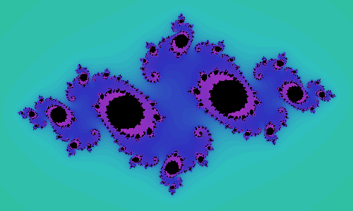

The filled Julia set is a really cool fractal that kind of resembles the [Mandelbrot set](https://mathspp.com/blog/mandelbrot)!

===

(You may want to read [my post](https://mathspp.com/blog/mandelbrot) on the Mandelbrot set as it is closely related to this one!)

The Mandelbrot set is just one, and is built in the complex plane. The filled Julia set, on the other hand, is not "just one set". There is one filled Julia set for each complex number $z_0 \in \mathbb{C}$. If you pick a complex number $z_0$, then its filled Julia set is the set of points in the complex plane for which the repeated application of $f(z) = z^2 + z_0$ diverges to infinity. Formally, the filled Julia set associated with $z_0$ is

\[
    \{ z \in \mathbb{C}: \lim_{n \to \infty} |f^n(z)| = \infty \} \subset \mathbb{C}
\]

The screenshot above shows the filled Julia set for some $z_0$ I picked. The points in black belong in the set and the coloured points do not (the colouring was done as explained in the [article](https://mathspp.com/blog/mandelbrot) about the Mandelbrot set). I took another screenshot, here:

from a [small Python 3 program](https://github.com/RojerGS/projects/tree/master/fractals) I wrote with pygame. You press any point in the complex plane and the program builds its corresponding filled Julia set. You can use the left and right arrows to navigate the sets you already created. Pressing the space bar cleans the fractal you are viewing. You can also download a Windows executable from [here](https://github.com/RojerGS/projects/blob/master/fractals/juliaSet.rar).