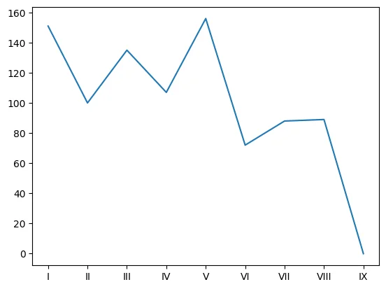

This tutorial uses Pokémon to introduce readers to data science with pandas and matplotlib.

===


# Learn pandas and matplotlib with Pokémon

This tutorial will teach you the basics of data science with pandas and matplotlib with Pokémon as an example.
We will use Pokémon data from the first 8 generations to learn what are pandas series and dataframes, what's categorical data and how broadcasting works, and more.
We'll also use matplotlib to learn about line and bar plots, scatter plots, and violin plots, all while studying the strengths and weaknesses of Pokémon.

By the time you're done with this tutorial, you'll know enough to get started with pandas on your own data science projects, you'll be able to use matplotlib to create publication-ready plots, and as a byproduct you will have learned a bit more about Pokémon.

## Setup

Pandas is a library that is the de facto standard to do data analysis in Python, and we'll be using it here.
To start off, make sure it's installed (`pip install pandas`):

```python
import pandas as pd
```

Importing pandas as `pd` is a common abbreviation, since you'll be using pandas a lot.

Then, the best way to start is to grab some data (`pokemon.csv`) and load it in with the function `read_csv`:

```python
pokemon = pd.read_csv("pokemon.csv")
```

## First look at the data

When you load a new dataset, the first thing you want to do is to take a global look at the data, to get an idea for what you have.

The best first thing you can do is inspect the “head” of the data, which corresponds to the first few rows:
```python
pokemon.head()
```

<div>
<style scoped>
    .dataframe {
        display: block;
        overflow-x: auto;
        white-space: nowrap;
    }

    .dataframe tbody tr th:only-of-type {
        vertical-align: middle;
    }

    .dataframe tbody tr th {
        vertical-align: top;
    }

    .dataframe thead th {
        text-align: right;
    }
</style>
<table border="1" class="dataframe">
  <thead>
    <tr style="text-align: right;">
      <th></th>
      <th>national_number</th>
      <th>gen</th>
      <th>english_name</th>
      <th>japanese_name</th>
      <th>primary_type</th>
      <th>secondary_type</th>
      <th>classification</th>
      <th>percent_male</th>
      <th>percent_female</th>
      <th>height_m</th>
      <th>...</th>
      <th>evochain_1</th>
      <th>evochain_2</th>
      <th>evochain_3</th>
      <th>evochain_4</th>
      <th>evochain_5</th>
      <th>evochain_6</th>
      <th>gigantamax</th>
      <th>mega_evolution</th>
      <th>mega_evolution_alt</th>
      <th>description</th>
    </tr>
  </thead>
  <tbody>
    <tr>
      <th>0</th>
      <td>1</td>
      <td>I</td>
      <td>Bulbasaur</td>
      <td>Fushigidane</td>
      <td>grass</td>
      <td>poison</td>
      <td>Seed Pokémon</td>
      <td>88.14</td>
      <td>11.86</td>
      <td>0.7</td>
      <td>...</td>
      <td>Level</td>
      <td>Ivysaur</td>
      <td>Level</td>
      <td>Venusaur</td>
      <td>NaN</td>
      <td>NaN</td>
      <td>NaN</td>
      <td>NaN</td>
      <td>NaN</td>
      <td>There is a plant seed on its back right from t...</td>
    </tr>
    <tr>
      <th>1</th>
      <td>2</td>
      <td>I</td>
      <td>Ivysaur</td>
      <td>Fushigisou</td>
      <td>grass</td>
      <td>poison</td>
      <td>Seed Pokémon</td>
      <td>88.14</td>
      <td>11.86</td>
      <td>1.0</td>
      <td>...</td>
      <td>Level</td>
      <td>Ivysaur</td>
      <td>Level</td>
      <td>Venusaur</td>
      <td>NaN</td>
      <td>NaN</td>
      <td>NaN</td>
      <td>NaN</td>
      <td>NaN</td>
      <td>When the bulb on its back grows large, it appe...</td>
    </tr>
    <tr>
      <th>2</th>
      <td>3</td>
      <td>I</td>
      <td>Venusaur</td>
      <td>Fushigibana</td>
      <td>grass</td>
      <td>poison</td>
      <td>Seed Pokémon</td>
      <td>88.14</td>
      <td>11.86</td>
      <td>2.0</td>
      <td>...</td>
      <td>Level</td>
      <td>Ivysaur</td>
      <td>Level</td>
      <td>Venusaur</td>
      <td>NaN</td>
      <td>NaN</td>
      <td>Gigantamax Venusaur</td>
      <td>Mega Venusaur</td>
      <td>NaN</td>
      <td>Its plant blooms when it is absorbing solar en...</td>
    </tr>
    <tr>
      <th>3</th>
      <td>4</td>
      <td>I</td>
      <td>Charmander</td>
      <td>Hitokage</td>
      <td>fire</td>
      <td>NaN</td>
      <td>Lizard Pokémon</td>
      <td>88.14</td>
      <td>11.86</td>
      <td>0.6</td>
      <td>...</td>
      <td>Level</td>
      <td>Charmeleon</td>
      <td>Level</td>
      <td>Charizard</td>
      <td>NaN</td>
      <td>NaN</td>
      <td>NaN</td>
      <td>NaN</td>
      <td>NaN</td>
      <td>It has a preference for hot things. When it ra...</td>
    </tr>
    <tr>
      <th>4</th>
      <td>5</td>
      <td>I</td>
      <td>Charmeleon</td>
      <td>Lizardo</td>
      <td>fire</td>
      <td>NaN</td>
      <td>Flame Pokémon</td>
      <td>88.14</td>
      <td>11.86</td>
      <td>1.1</td>
      <td>...</td>
      <td>Level</td>
      <td>Charmeleon</td>
      <td>Level</td>
      <td>Charizard</td>
      <td>NaN</td>
      <td>NaN</td>
      <td>NaN</td>
      <td>NaN</td>
      <td>NaN</td>
      <td>It has a barbaric nature. In battle, it whips ...</td>
    </tr>
  </tbody>
</table>
<p>5 rows × 55 columns</p>
</div>

This shows the first 5 rows, as you can see by the information at the bottom-left corner, and 55 columns.
We have so many columns that they aren't all visible at first.

If we want, we can check which columns we have with the attribute `columns` on `pokemon`:

```python
pokemon.columns
```

    Index(['national_number', 'gen', 'english_name', 'japanese_name',
           'primary_type', 'secondary_type', 'classification', 'percent_male',
           'percent_female', 'height_m', 'weight_kg', 'capture_rate',
           'base_egg_steps', 'hp', 'attack', 'defense', 'sp_attack', 'sp_defense',
           'speed', 'abilities_0', 'abilities_1', 'abilities_2',
           'abilities_hidden', 'against_normal', 'against_fire', 'against_water',
           'against_electric', 'against_grass', 'against_ice', 'against_fighting',
           'against_poison', 'against_ground', 'against_flying', 'against_psychic',
           'against_bug', 'against_rock', 'against_ghost', 'against_dragon',
           'against_dark', 'against_steel', 'against_fairy', 'is_sublegendary',
           'is_legendary', 'is_mythical', 'evochain_0', 'evochain_1', 'evochain_2',
           'evochain_3', 'evochain_4', 'evochain_5', 'evochain_6', 'gigantamax',
           'mega_evolution', 'mega_evolution_alt', 'description'],
          dtype='object')

This shows the names of the 55 columns that our data has...

But what _is_ our data?

In pandas, we'll often deal with something called a “dataframe”.
Dataframes are 2D objects that contain data.
Each row represents a data point and each column represents a variable/measurement.

Our variable `pokemon` is a dataframe:

```python
type(pokemon)
```

    pandas.core.frame.DataFrame

The columns in a dataframe are called series.
A series contains all of the values of a given variable and it's “kind of like a list”, in the sense that it is a 1D container.
For example, the series `pokemon["english_name"]` contains all of the English names of our Pokémon and we can see it has `898` values:

```python
len(pokemon["english_name"])
```

    898

But a series is _much more_ than just a list.
It contains many more useful methods and attributes that let us work with data.

Let us see what this series looks like:

```python
pokemon["english_name"]
```

    0       Bulbasaur
    1         Ivysaur
    2        Venusaur
    3      Charmander
    4      Charmeleon
              ...    
    893     Regieleki
    894     Regidrago
    895     Glastrier
    896     Spectrier
    897       Calyrex
    Name: english_name, Length: 898, dtype: object

The series is so long (it has 898 elements) that the output only shows the first and the last values, inserting an ellipsis `...` in the middle.

## Data types

In the output of the series, above, we see several Pokémon names:

 1. Bulbasaur;
 2. Ivysaur;
 3. Venusaur; ...

At the bottom, we also see three other pieces of information:
```
Name: english_name, Length: 898, dtype: object
```

This shows the name of the series (the name of the column), its length, and the data type (“dtype”, for short) of that column.

When we're dealing with a new data set, we should always check the data types of its columns:

```python
print(pokemon.dtypes)
```

    national_number         int64
    gen                    object
    english_name           object
    japanese_name          object
    primary_type           object
    secondary_type         object
    classification         object
    percent_male           object
    percent_female         object
    height_m              float64
    weight_kg             float64
    capture_rate           object
    base_egg_steps          int64
    hp                      int64
    attack                  int64
    defense                 int64
    sp_attack               int64
    sp_defense              int64
    speed                   int64
    abilities_0            object
    abilities_1            object
    abilities_2            object
    abilities_hidden       object
    against_normal        float64
    against_fire          float64
    against_water         float64
    against_electric      float64
    against_grass         float64
    against_ice           float64
    against_fighting      float64
    against_poison        float64
    against_ground        float64
    against_flying        float64
    against_psychic       float64
    against_bug           float64
    against_rock          float64
    against_ghost         float64
    against_dragon        float64
    against_dark          float64
    against_steel         float64
    against_fairy         float64
    is_sublegendary         int64
    is_legendary            int64
    is_mythical             int64
    evochain_0             object
    evochain_1             object
    evochain_2             object
    evochain_3             object
    evochain_4             object
    evochain_5             object
    evochain_6             object
    gigantamax             object
    mega_evolution         object
    mega_evolution_alt     object
    description            object
    dtype: object

When you loaded the data, Pandas did its best to figure out what columns should be of what type, but sometimes you need to help Pandas out and do some conversions yourself.
Throughout this tutorial, we'll convert some columns to more appropriate data types.

## Working with numerical series

### Pokémon stats

Pokémon have 6 basic stats:

 1. HP (hit points or health points);
 2. attack;
 3. defense;
 4. special attack;
 5. special defense; and
 6. speed.

These dictate how strong a Pokémon is when battling other Pokémon.
Here is a brief explanation of what each stat means:

 1. HP dictates how much damage a Pokémon can sustain before fainting.
 2. The stats “attack” and “special attack” influence how much damage a Pokémon inflicts when attacking. The stat “attack” is for attacks that make physical contact and the stat “special attack” is for attacks that don't (for example, magical attacks).
 3. The stats “defense” and “special defense” reduce the damage you take when being attacked, respectively by physical or non-physical attacks.
 4. The stat “speed” influences whether you attack before your opponent or not.

The dataset contains six columns that provide information about the values of these stats.
For example, we can easily grab the column with the information about HP for all Pokémon:

```python
pokemon["hp"]
```

    0       45
    1       60
    2       80
    3       39
    4       58
          ... 
    893     80
    894    200
    895    100
    896    100
    897    100
    Name: hp, Length: 898, dtype: int64

The values in the column are not the actual HP of each Pokémon.
Instead, they're a measurement that you can use in a formula to compute the HP a Pokémon will have when fully grown (at level 100).
The formula is as follows:

$$
2 \times hp + 110
$$

For example, the first Pokémon in the series has a base HP of 45, which means that it will have 200 HP when fully grown:

```python
2 * pokemon["hp"][0] + 110
```

    200

### Basic mathematical operations

When working with Pandas series, basic mathematical operations can be performed _on the whole series_ at once.
Above, the expression `2 * pokemon["hp"][0] + 110` computed the final HP for a single Pokémon.
If we drop the index `[0]`, we compute the final HP for _all_ Pokémon:

```python
2 * pokemon["hp"] + 110
```

    0      200
    1      230
    2      270
    3      188
    4      226
          ... 
    893    270
    894    510
    895    310
    896    310
    897    310
    Name: hp, Length: 898, dtype: int64

The ability to perform mathematical operations like addition and multiplication between a single number and a whole series is called broadcasting.

### Computing the other final stats

All other five stats have a similar formula, but instead of adding 110 at the end, you add 5:

```python
2 * pokemon["attack"] + 5
```

    0      103
    1      129
    2      169
    3      109
    4      133
          ... 
    893    205
    894    205
    895    295
    896    135
    897    165
    Name: attack, Length: 898, dtype: int64

```python
2 * pokemon["defense"] + 5
```

    0      103
    1      131
    2      171
    3       91
    4      121
          ... 
    893    105
    894    105
    895    265
    896    125
    897    165
    Name: defense, Length: 898, dtype: int64

```python
2 * pokemon["sp_attack"] + 5
```

    0      135
    1      165
    2      205
    3      125
    4      165
          ... 
    893    205
    894    205
    895    135
    896    295
    897    165
    Name: sp_attack, Length: 898, dtype: int64

```python
2 * pokemon["sp_defense"] + 5
```

    0      135
    1      165
    2      205
    3      105
    4      135
          ... 
    893    105
    894    105
    895    225
    896    165
    897    165
    Name: sp_defense, Length: 898, dtype: int64

```python
2 * pokemon["speed"] + 5
```

    0       95
    1      125
    2      165
    3      135
    4      165
          ... 
    893    405
    894    165
    895     65
    896    265
    897    165
    Name: speed, Length: 898, dtype: int64

These computations were _all_ the same, so wouldn't it be nice if we could do everything at once, given that the formula is exactly the same..?

## Manipulating columns

### Fetching multiple columns

You can use a list of column names to grab multiple columns at once:

```python
stats = ["attack", "defense", "sp_attack", "sp_defense", "speed"]
pokemon[stats].head()
```

<div>
<style scoped>
    .dataframe {
        display: block;
        overflow-x: auto;
        white-space: nowrap;
    }

    .dataframe tbody tr th:only-of-type {
        vertical-align: middle;
    }

    .dataframe tbody tr th {
        vertical-align: top;
    }

    .dataframe thead th {
        text-align: right;
    }
</style>
<table border="1" class="dataframe">
  <thead>
    <tr style="text-align: right;">
      <th></th>
      <th>attack</th>
      <th>defense</th>
      <th>sp_attack</th>
      <th>sp_defense</th>
      <th>speed</th>
    </tr>
  </thead>
  <tbody>
    <tr>
      <th>0</th>
      <td>49</td>
      <td>49</td>
      <td>65</td>
      <td>65</td>
      <td>45</td>
    </tr>
    <tr>
      <th>1</th>
      <td>62</td>
      <td>63</td>
      <td>80</td>
      <td>80</td>
      <td>60</td>
    </tr>
    <tr>
      <th>2</th>
      <td>82</td>
      <td>83</td>
      <td>100</td>
      <td>100</td>
      <td>80</td>
    </tr>
    <tr>
      <th>3</th>
      <td>52</td>
      <td>43</td>
      <td>60</td>
      <td>50</td>
      <td>65</td>
    </tr>
    <tr>
      <th>4</th>
      <td>64</td>
      <td>58</td>
      <td>80</td>
      <td>65</td>
      <td>80</td>
    </tr>
  </tbody>
</table>
</div>

Now, `pokemon[stats]` is not a series, but a (smaller) dataframe.
However, the principles of broadcasting apply just the same:

```python
2 * pokemon[stats] + 5
```

<div>
<style scoped>
    .dataframe {
        display: block;
        overflow-x: auto;
        white-space: nowrap;
    }

    .dataframe tbody tr th:only-of-type {
        vertical-align: middle;
    }

    .dataframe tbody tr th {
        vertical-align: top;
    }

    .dataframe thead th {
        text-align: right;
    }
</style>
<table border="1" class="dataframe">
  <thead>
    <tr style="text-align: right;">
      <th></th>
      <th>attack</th>
      <th>defense</th>
      <th>sp_attack</th>
      <th>sp_defense</th>
      <th>speed</th>
    </tr>
  </thead>
  <tbody>
    <tr>
      <th>0</th>
      <td>103</td>
      <td>103</td>
      <td>135</td>
      <td>135</td>
      <td>95</td>
    </tr>
    <tr>
      <th>1</th>
      <td>129</td>
      <td>131</td>
      <td>165</td>
      <td>165</td>
      <td>125</td>
    </tr>
    <tr>
      <th>2</th>
      <td>169</td>
      <td>171</td>
      <td>205</td>
      <td>205</td>
      <td>165</td>
    </tr>
    <tr>
      <th>3</th>
      <td>109</td>
      <td>91</td>
      <td>125</td>
      <td>105</td>
      <td>135</td>
    </tr>
    <tr>
      <th>4</th>
      <td>133</td>
      <td>121</td>
      <td>165</td>
      <td>135</td>
      <td>165</td>
    </tr>
    <tr>
      <th>...</th>
      <td>...</td>
      <td>...</td>
      <td>...</td>
      <td>...</td>
      <td>...</td>
    </tr>
    <tr>
      <th>893</th>
      <td>205</td>
      <td>105</td>
      <td>205</td>
      <td>105</td>
      <td>405</td>
    </tr>
    <tr>
      <th>894</th>
      <td>205</td>
      <td>105</td>
      <td>205</td>
      <td>105</td>
      <td>165</td>
    </tr>
    <tr>
      <th>895</th>
      <td>295</td>
      <td>265</td>
      <td>135</td>
      <td>225</td>
      <td>65</td>
    </tr>
    <tr>
      <th>896</th>
      <td>135</td>
      <td>125</td>
      <td>295</td>
      <td>165</td>
      <td>265</td>
    </tr>
    <tr>
      <th>897</th>
      <td>165</td>
      <td>165</td>
      <td>165</td>
      <td>165</td>
      <td>165</td>
    </tr>
  </tbody>
</table>
<p>898 rows × 5 columns</p>
</div>

### Dropping columns

Given that we now know syntax that we can use to grab only some columns, we could use this same syntax to drop columns that we don't care about.

Let us review all of the columns that we have:

```python
pokemon.columns
```

    Index(['national_number', 'gen', 'english_name', 'japanese_name',
           'primary_type', 'secondary_type', 'classification', 'percent_male',
           'percent_female', 'height_m', 'weight_kg', 'capture_rate',
           'base_egg_steps', 'hp', 'attack', 'defense', 'sp_attack', 'sp_defense',
           'speed', 'abilities_0', 'abilities_1', 'abilities_2',
           'abilities_hidden', 'against_normal', 'against_fire', 'against_water',
           'against_electric', 'against_grass', 'against_ice', 'against_fighting',
           'against_poison', 'against_ground', 'against_flying', 'against_psychic',
           'against_bug', 'against_rock', 'against_ghost', 'against_dragon',
           'against_dark', 'against_steel', 'against_fairy', 'is_sublegendary',
           'is_legendary', 'is_mythical', 'evochain_0', 'evochain_1', 'evochain_2',
           'evochain_3', 'evochain_4', 'evochain_5', 'evochain_6', 'gigantamax',
           'mega_evolution', 'mega_evolution_alt', 'description'],
          dtype='object')

We only care about these:

 - `national_number`
 - `gen`
 - `english_name`
 - `primary_type`
 - `secondary_type`
 - `hp`
 - `attack`
 - `defense`
 - `sp_attack`
 - `sp_defense`
 - `speed`
 - `is_sublegendary`
 - `is_legendary`
 - `is_mythical`

Here's how we can grab them:

```python
pokemon[
    [
        "national_number",
        "gen",
        "english_name",
        "primary_type",
        "secondary_type",
        "hp",
        "attack",
        "defense",
        "sp_attack",
        "sp_defense",
        "speed",
        "is_sublegendary",
        "is_legendary",
        "is_mythical",
    ]
].head()
```

<div>
<style scoped>
    .dataframe {
        display: block;
        overflow-x: auto;
        white-space: nowrap;
    }

    .dataframe tbody tr th:only-of-type {
        vertical-align: middle;
    }

    .dataframe tbody tr th {
        vertical-align: top;
    }

    .dataframe thead th {
        text-align: right;
    }
</style>
<table border="1" class="dataframe">
  <thead>
    <tr style="text-align: right;">
      <th></th>
      <th>national_number</th>
      <th>gen</th>
      <th>english_name</th>
      <th>primary_type</th>
      <th>secondary_type</th>
      <th>hp</th>
      <th>attack</th>
      <th>defense</th>
      <th>sp_attack</th>
      <th>sp_defense</th>
      <th>speed</th>
      <th>is_sublegendary</th>
      <th>is_legendary</th>
      <th>is_mythical</th>
    </tr>
  </thead>
  <tbody>
    <tr>
      <th>0</th>
      <td>1</td>
      <td>I</td>
      <td>Bulbasaur</td>
      <td>grass</td>
      <td>poison</td>
      <td>45</td>
      <td>49</td>
      <td>49</td>
      <td>65</td>
      <td>65</td>
      <td>45</td>
      <td>0</td>
      <td>0</td>
      <td>0</td>
    </tr>
    <tr>
      <th>1</th>
      <td>2</td>
      <td>I</td>
      <td>Ivysaur</td>
      <td>grass</td>
      <td>poison</td>
      <td>60</td>
      <td>62</td>
      <td>63</td>
      <td>80</td>
      <td>80</td>
      <td>60</td>
      <td>0</td>
      <td>0</td>
      <td>0</td>
    </tr>
    <tr>
      <th>2</th>
      <td>3</td>
      <td>I</td>
      <td>Venusaur</td>
      <td>grass</td>
      <td>poison</td>
      <td>80</td>
      <td>82</td>
      <td>83</td>
      <td>100</td>
      <td>100</td>
      <td>80</td>
      <td>0</td>
      <td>0</td>
      <td>0</td>
    </tr>
    <tr>
      <th>3</th>
      <td>4</td>
      <td>I</td>
      <td>Charmander</td>
      <td>fire</td>
      <td>NaN</td>
      <td>39</td>
      <td>52</td>
      <td>43</td>
      <td>60</td>
      <td>50</td>
      <td>65</td>
      <td>0</td>
      <td>0</td>
      <td>0</td>
    </tr>
    <tr>
      <th>4</th>
      <td>5</td>
      <td>I</td>
      <td>Charmeleon</td>
      <td>fire</td>
      <td>NaN</td>
      <td>58</td>
      <td>64</td>
      <td>58</td>
      <td>80</td>
      <td>65</td>
      <td>80</td>
      <td>0</td>
      <td>0</td>
      <td>0</td>
    </tr>
  </tbody>
</table>
</div>

Almost all Pandas operations do _not_ mutate the series/dataframes that you use as arguments and, instead, they return _new_ series/dataframes with the computed results.
So, if we want to keep the dataframe with just these 14 columns, we need to assign the result back into `pokemon`:

```python
pokemon = pokemon[
    [
        "national_number",
        "gen",
        "english_name",
        "primary_type",
        "secondary_type",
        "hp",
        "attack",
        "defense",
        "sp_attack",
        "sp_defense",
        "speed",
        "is_sublegendary",
        "is_legendary",
        "is_mythical",
    ]
]
pokemon.head()
```

<div>
<style scoped>
    .dataframe {
        display: block;
        overflow-x: auto;
        white-space: nowrap;
    }

    .dataframe tbody tr th:only-of-type {
        vertical-align: middle;
    }

    .dataframe tbody tr th {
        vertical-align: top;
    }

    .dataframe thead th {
        text-align: right;
    }
</style>
<table border="1" class="dataframe">
  <thead>
    <tr style="text-align: right;">
      <th></th>
      <th>national_number</th>
      <th>gen</th>
      <th>english_name</th>
      <th>primary_type</th>
      <th>secondary_type</th>
      <th>hp</th>
      <th>attack</th>
      <th>defense</th>
      <th>sp_attack</th>
      <th>sp_defense</th>
      <th>speed</th>
      <th>is_sublegendary</th>
      <th>is_legendary</th>
      <th>is_mythical</th>
    </tr>
  </thead>
  <tbody>
    <tr>
      <th>0</th>
      <td>1</td>
      <td>I</td>
      <td>Bulbasaur</td>
      <td>grass</td>
      <td>poison</td>
      <td>45</td>
      <td>49</td>
      <td>49</td>
      <td>65</td>
      <td>65</td>
      <td>45</td>
      <td>0</td>
      <td>0</td>
      <td>0</td>
    </tr>
    <tr>
      <th>1</th>
      <td>2</td>
      <td>I</td>
      <td>Ivysaur</td>
      <td>grass</td>
      <td>poison</td>
      <td>60</td>
      <td>62</td>
      <td>63</td>
      <td>80</td>
      <td>80</td>
      <td>60</td>
      <td>0</td>
      <td>0</td>
      <td>0</td>
    </tr>
    <tr>
      <th>2</th>
      <td>3</td>
      <td>I</td>
      <td>Venusaur</td>
      <td>grass</td>
      <td>poison</td>
      <td>80</td>
      <td>82</td>
      <td>83</td>
      <td>100</td>
      <td>100</td>
      <td>80</td>
      <td>0</td>
      <td>0</td>
      <td>0</td>
    </tr>
    <tr>
      <th>3</th>
      <td>4</td>
      <td>I</td>
      <td>Charmander</td>
      <td>fire</td>
      <td>NaN</td>
      <td>39</td>
      <td>52</td>
      <td>43</td>
      <td>60</td>
      <td>50</td>
      <td>65</td>
      <td>0</td>
      <td>0</td>
      <td>0</td>
    </tr>
    <tr>
      <th>4</th>
      <td>5</td>
      <td>I</td>
      <td>Charmeleon</td>
      <td>fire</td>
      <td>NaN</td>
      <td>58</td>
      <td>64</td>
      <td>58</td>
      <td>80</td>
      <td>65</td>
      <td>80</td>
      <td>0</td>
      <td>0</td>
      <td>0</td>
    </tr>
  </tbody>
</table>
</div>

Now that we got rid of a bunch of columns we don't care about, let us create some new columns that we _do_ care about.

### Creating new columns

You can use the method `assign` to create new columns.
Just check the output below and scroll to the right:

```python
pokemon.assign(
    hp_final = 2 * pokemon["hp"] + 110
).head()
```

<div>
<style scoped>
    .dataframe {
        display: block;
        overflow-x: auto;
        white-space: nowrap;
    }

    .dataframe tbody tr th:only-of-type {
        vertical-align: middle;
    }

    .dataframe tbody tr th {
        vertical-align: top;
    }

    .dataframe thead th {
        text-align: right;
    }
</style>
<table border="1" class="dataframe">
  <thead>
    <tr style="text-align: right;">
      <th></th>
      <th>national_number</th>
      <th>gen</th>
      <th>english_name</th>
      <th>primary_type</th>
      <th>secondary_type</th>
      <th>hp</th>
      <th>attack</th>
      <th>defense</th>
      <th>sp_attack</th>
      <th>sp_defense</th>
      <th>speed</th>
      <th>is_sublegendary</th>
      <th>is_legendary</th>
      <th>is_mythical</th>
      <th>hp_final</th>
    </tr>
  </thead>
  <tbody>
    <tr>
      <th>0</th>
      <td>1</td>
      <td>I</td>
      <td>Bulbasaur</td>
      <td>grass</td>
      <td>poison</td>
      <td>45</td>
      <td>49</td>
      <td>49</td>
      <td>65</td>
      <td>65</td>
      <td>45</td>
      <td>0</td>
      <td>0</td>
      <td>0</td>
      <td>200</td>
    </tr>
    <tr>
      <th>1</th>
      <td>2</td>
      <td>I</td>
      <td>Ivysaur</td>
      <td>grass</td>
      <td>poison</td>
      <td>60</td>
      <td>62</td>
      <td>63</td>
      <td>80</td>
      <td>80</td>
      <td>60</td>
      <td>0</td>
      <td>0</td>
      <td>0</td>
      <td>230</td>
    </tr>
    <tr>
      <th>2</th>
      <td>3</td>
      <td>I</td>
      <td>Venusaur</td>
      <td>grass</td>
      <td>poison</td>
      <td>80</td>
      <td>82</td>
      <td>83</td>
      <td>100</td>
      <td>100</td>
      <td>80</td>
      <td>0</td>
      <td>0</td>
      <td>0</td>
      <td>270</td>
    </tr>
    <tr>
      <th>3</th>
      <td>4</td>
      <td>I</td>
      <td>Charmander</td>
      <td>fire</td>
      <td>NaN</td>
      <td>39</td>
      <td>52</td>
      <td>43</td>
      <td>60</td>
      <td>50</td>
      <td>65</td>
      <td>0</td>
      <td>0</td>
      <td>0</td>
      <td>188</td>
    </tr>
    <tr>
      <th>4</th>
      <td>5</td>
      <td>I</td>
      <td>Charmeleon</td>
      <td>fire</td>
      <td>NaN</td>
      <td>58</td>
      <td>64</td>
      <td>58</td>
      <td>80</td>
      <td>65</td>
      <td>80</td>
      <td>0</td>
      <td>0</td>
      <td>0</td>
      <td>226</td>
    </tr>
  </tbody>
</table>
</div>

If we save the result of that method call into the name `pokemon`, we keep the new columns:

```python
pokemon = pokemon.assign(
    hp_final = 2 * pokemon["hp"] + 110
)
pokemon.head()
```

<div>
<style scoped>
    .dataframe {
        display: block;
        overflow-x: auto;
        white-space: nowrap;
    }

    .dataframe tbody tr th:only-of-type {
        vertical-align: middle;
    }

    .dataframe tbody tr th {
        vertical-align: top;
    }

    .dataframe thead th {
        text-align: right;
    }
</style>
<table border="1" class="dataframe">
  <thead>
    <tr style="text-align: right;">
      <th></th>
      <th>national_number</th>
      <th>gen</th>
      <th>english_name</th>
      <th>primary_type</th>
      <th>secondary_type</th>
      <th>hp</th>
      <th>attack</th>
      <th>defense</th>
      <th>sp_attack</th>
      <th>sp_defense</th>
      <th>speed</th>
      <th>is_sublegendary</th>
      <th>is_legendary</th>
      <th>is_mythical</th>
      <th>hp_final</th>
    </tr>
  </thead>
  <tbody>
    <tr>
      <th>0</th>
      <td>1</td>
      <td>I</td>
      <td>Bulbasaur</td>
      <td>grass</td>
      <td>poison</td>
      <td>45</td>
      <td>49</td>
      <td>49</td>
      <td>65</td>
      <td>65</td>
      <td>45</td>
      <td>0</td>
      <td>0</td>
      <td>0</td>
      <td>200</td>
    </tr>
    <tr>
      <th>1</th>
      <td>2</td>
      <td>I</td>
      <td>Ivysaur</td>
      <td>grass</td>
      <td>poison</td>
      <td>60</td>
      <td>62</td>
      <td>63</td>
      <td>80</td>
      <td>80</td>
      <td>60</td>
      <td>0</td>
      <td>0</td>
      <td>0</td>
      <td>230</td>
    </tr>
    <tr>
      <th>2</th>
      <td>3</td>
      <td>I</td>
      <td>Venusaur</td>
      <td>grass</td>
      <td>poison</td>
      <td>80</td>
      <td>82</td>
      <td>83</td>
      <td>100</td>
      <td>100</td>
      <td>80</td>
      <td>0</td>
      <td>0</td>
      <td>0</td>
      <td>270</td>
    </tr>
    <tr>
      <th>3</th>
      <td>4</td>
      <td>I</td>
      <td>Charmander</td>
      <td>fire</td>
      <td>NaN</td>
      <td>39</td>
      <td>52</td>
      <td>43</td>
      <td>60</td>
      <td>50</td>
      <td>65</td>
      <td>0</td>
      <td>0</td>
      <td>0</td>
      <td>188</td>
    </tr>
    <tr>
      <th>4</th>
      <td>5</td>
      <td>I</td>
      <td>Charmeleon</td>
      <td>fire</td>
      <td>NaN</td>
      <td>58</td>
      <td>64</td>
      <td>58</td>
      <td>80</td>
      <td>65</td>
      <td>80</td>
      <td>0</td>
      <td>0</td>
      <td>0</td>
      <td>226</td>
    </tr>
  </tbody>
</table>
</div>

You can also assign the columns directly by using the `[]` syntax to refer to columns that may not even exist yet.
The method `assign` is always preferable when possible, but this example shows how this works:

```python
stats
```

    ['attack', 'defense', 'sp_attack', 'sp_defense', 'speed']

```python
final_stats = [stat + "_final" for stat in stats]
final_stats
```

    ['attack_final',
     'defense_final',
     'sp_attack_final',
     'sp_defense_final',
     'speed_final']

```python
pokemon[final_stats] = 2 * pokemon[stats] + 5
pokemon.head()
```

<div>
<style scoped>
    .dataframe {
        display: block;
        overflow-x: auto;
        white-space: nowrap;
    }

    .dataframe tbody tr th:only-of-type {
        vertical-align: middle;
    }

    .dataframe tbody tr th {
        vertical-align: top;
    }

    .dataframe thead th {
        text-align: right;
    }
</style>
<table border="1" class="dataframe">
  <thead>
    <tr style="text-align: right;">
      <th></th>
      <th>national_number</th>
      <th>gen</th>
      <th>english_name</th>
      <th>primary_type</th>
      <th>secondary_type</th>
      <th>hp</th>
      <th>attack</th>
      <th>defense</th>
      <th>sp_attack</th>
      <th>sp_defense</th>
      <th>speed</th>
      <th>is_sublegendary</th>
      <th>is_legendary</th>
      <th>is_mythical</th>
      <th>hp_final</th>
      <th>attack_final</th>
      <th>defense_final</th>
      <th>sp_attack_final</th>
      <th>sp_defense_final</th>
      <th>speed_final</th>
    </tr>
  </thead>
  <tbody>
    <tr>
      <th>0</th>
      <td>1</td>
      <td>I</td>
      <td>Bulbasaur</td>
      <td>grass</td>
      <td>poison</td>
      <td>45</td>
      <td>49</td>
      <td>49</td>
      <td>65</td>
      <td>65</td>
      <td>45</td>
      <td>0</td>
      <td>0</td>
      <td>0</td>
      <td>200</td>
      <td>103</td>
      <td>103</td>
      <td>135</td>
      <td>135</td>
      <td>95</td>
    </tr>
    <tr>
      <th>1</th>
      <td>2</td>
      <td>I</td>
      <td>Ivysaur</td>
      <td>grass</td>
      <td>poison</td>
      <td>60</td>
      <td>62</td>
      <td>63</td>
      <td>80</td>
      <td>80</td>
      <td>60</td>
      <td>0</td>
      <td>0</td>
      <td>0</td>
      <td>230</td>
      <td>129</td>
      <td>131</td>
      <td>165</td>
      <td>165</td>
      <td>125</td>
    </tr>
    <tr>
      <th>2</th>
      <td>3</td>
      <td>I</td>
      <td>Venusaur</td>
      <td>grass</td>
      <td>poison</td>
      <td>80</td>
      <td>82</td>
      <td>83</td>
      <td>100</td>
      <td>100</td>
      <td>80</td>
      <td>0</td>
      <td>0</td>
      <td>0</td>
      <td>270</td>
      <td>169</td>
      <td>171</td>
      <td>205</td>
      <td>205</td>
      <td>165</td>
    </tr>
    <tr>
      <th>3</th>
      <td>4</td>
      <td>I</td>
      <td>Charmander</td>
      <td>fire</td>
      <td>NaN</td>
      <td>39</td>
      <td>52</td>
      <td>43</td>
      <td>60</td>
      <td>50</td>
      <td>65</td>
      <td>0</td>
      <td>0</td>
      <td>0</td>
      <td>188</td>
      <td>109</td>
      <td>91</td>
      <td>125</td>
      <td>105</td>
      <td>135</td>
    </tr>
    <tr>
      <th>4</th>
      <td>5</td>
      <td>I</td>
      <td>Charmeleon</td>
      <td>fire</td>
      <td>NaN</td>
      <td>58</td>
      <td>64</td>
      <td>58</td>
      <td>80</td>
      <td>65</td>
      <td>80</td>
      <td>0</td>
      <td>0</td>
      <td>0</td>
      <td>226</td>
      <td>133</td>
      <td>121</td>
      <td>165</td>
      <td>135</td>
      <td>165</td>
    </tr>
  </tbody>
</table>
</div>

If you scroll all the way to the right, you will see that we just created 5 more columns with the final values for the stats “attack”, “defense”, “special attack”, “special defense”, and “speed”.

## Broadcasting and dimensions

As a quick bonus/aside, part of the art of using Pandas is getting used to broadcasting and the ability to operate on whole series and dataframes at once.
In the section above, we used the expression `2 * pokemon[stats] + 5` to compute the final values for 5 of the 6 stats...
But what if we wanted to compute the final stats for _all 6 stats at once_?

The difficulty lies on the fact that the formula for the stat HP is slightly different.
However, that doesn't pose a real challenge because broadcasting can work on multiple levels:

```python
all_stats = ["hp", "attack", "defense", "sp_attack", "sp_defense", "speed"]
2 * pokemon[all_stats] + (110, 5, 5, 5, 5, 5)
```

<div>
<style scoped>
    .dataframe {
        display: block;
        overflow-x: auto;
        white-space: nowrap;
    }

    .dataframe tbody tr th:only-of-type {
        vertical-align: middle;
    }

    .dataframe tbody tr th {
        vertical-align: top;
    }

    .dataframe thead th {
        text-align: right;
    }
</style>
<table border="1" class="dataframe">
  <thead>
    <tr style="text-align: right;">
      <th></th>
      <th>hp</th>
      <th>attack</th>
      <th>defense</th>
      <th>sp_attack</th>
      <th>sp_defense</th>
      <th>speed</th>
    </tr>
  </thead>
  <tbody>
    <tr>
      <th>0</th>
      <td>200</td>
      <td>103</td>
      <td>103</td>
      <td>135</td>
      <td>135</td>
      <td>95</td>
    </tr>
    <tr>
      <th>1</th>
      <td>230</td>
      <td>129</td>
      <td>131</td>
      <td>165</td>
      <td>165</td>
      <td>125</td>
    </tr>
    <tr>
      <th>2</th>
      <td>270</td>
      <td>169</td>
      <td>171</td>
      <td>205</td>
      <td>205</td>
      <td>165</td>
    </tr>
    <tr>
      <th>3</th>
      <td>188</td>
      <td>109</td>
      <td>91</td>
      <td>125</td>
      <td>105</td>
      <td>135</td>
    </tr>
    <tr>
      <th>4</th>
      <td>226</td>
      <td>133</td>
      <td>121</td>
      <td>165</td>
      <td>135</td>
      <td>165</td>
    </tr>
    <tr>
      <th>...</th>
      <td>...</td>
      <td>...</td>
      <td>...</td>
      <td>...</td>
      <td>...</td>
      <td>...</td>
    </tr>
    <tr>
      <th>893</th>
      <td>270</td>
      <td>205</td>
      <td>105</td>
      <td>205</td>
      <td>105</td>
      <td>405</td>
    </tr>
    <tr>
      <th>894</th>
      <td>510</td>
      <td>205</td>
      <td>105</td>
      <td>205</td>
      <td>105</td>
      <td>165</td>
    </tr>
    <tr>
      <th>895</th>
      <td>310</td>
      <td>295</td>
      <td>265</td>
      <td>135</td>
      <td>225</td>
      <td>65</td>
    </tr>
    <tr>
      <th>896</th>
      <td>310</td>
      <td>135</td>
      <td>125</td>
      <td>295</td>
      <td>165</td>
      <td>265</td>
    </tr>
    <tr>
      <th>897</th>
      <td>310</td>
      <td>165</td>
      <td>165</td>
      <td>165</td>
      <td>165</td>
      <td>165</td>
    </tr>
  </tbody>
</table>
<p>898 rows × 6 columns</p>
</div>

Notice that the expression `2 * pokemon[stats] + (110, 5, 5, 5, 5, 5)` contains elements of 3 different dimensions:

 - the number `2` is a single integer and has no dimension;
 - the tuple `(110, 5, 5, 5, 5, 5)` is an iterable of integers, so it's 1D; and
 - the dataframe `pokemon[stats]` is 2D.

The multiplication `2 * pokemon[stats]` results in a 2D dataframe and so, when Pandas does the addition with `(110, 5, 5, 5, 5, 5)`, it understands that it should broadcast the tuple to _all of the rows_ of the dataframe, so that the numbers in the tuple get added to all of the rows of the dataframe.

## Maths with series

### Adding series together

There is another column that we want to compute that provides another measure of the strength of a Pokémon.
This value is the sum of the six base stats.

We've seen that we can add single numbers to series but we can also add two series together:

```python
pokemon["hp"].head()
```

    0    45
    1    60
    2    80
    3    39
    4    58
    Name: hp, dtype: int64

```python
pokemon["attack"].head()
```

    0    49
    1    62
    2    82
    3    52
    4    64
    Name: attack, dtype: int64

```python
(pokemon["hp"] + pokemon["attack"]).head()
```

    0     94
    1    122
    2    162
    3     91
    4    122
    dtype: int64

So, if we're not lazy, we can easily compute the total base stats for each Pokémon:

```python
pokemon["hp"] + pokemon["attack"] + pokemon["defense"] + pokemon["sp_attack"] + pokemon["sp_defense"] + pokemon["speed"]
```

    0      318
    1      405
    2      525
    3      309
    4      405
          ... 
    893    580
    894    580
    895    580
    896    580
    897    500
    Length: 898, dtype: int64

We might as well make a new column out of it:

```python
pokemon = pokemon.assign(
    total = pokemon["hp"] + pokemon["attack"] + pokemon["defense"] + pokemon["sp_attack"] + pokemon["sp_defense"] + pokemon["speed"]
)
pokemon.head()
```

<div>
<style scoped>
    .dataframe {
        display: block;
        overflow-x: auto;
        white-space: nowrap;
    }

    .dataframe tbody tr th:only-of-type {
        vertical-align: middle;
    }

    .dataframe tbody tr th {
        vertical-align: top;
    }

    .dataframe thead th {
        text-align: right;
    }
</style>
<table border="1" class="dataframe">
  <thead>
    <tr style="text-align: right;">
      <th></th>
      <th>national_number</th>
      <th>gen</th>
      <th>english_name</th>
      <th>primary_type</th>
      <th>secondary_type</th>
      <th>hp</th>
      <th>attack</th>
      <th>defense</th>
      <th>sp_attack</th>
      <th>sp_defense</th>
      <th>...</th>
      <th>is_sublegendary</th>
      <th>is_legendary</th>
      <th>is_mythical</th>
      <th>hp_final</th>
      <th>attack_final</th>
      <th>defense_final</th>
      <th>sp_attack_final</th>
      <th>sp_defense_final</th>
      <th>speed_final</th>
      <th>total</th>
    </tr>
  </thead>
  <tbody>
    <tr>
      <th>0</th>
      <td>1</td>
      <td>I</td>
      <td>Bulbasaur</td>
      <td>grass</td>
      <td>poison</td>
      <td>45</td>
      <td>49</td>
      <td>49</td>
      <td>65</td>
      <td>65</td>
      <td>...</td>
      <td>0</td>
      <td>0</td>
      <td>0</td>
      <td>200</td>
      <td>103</td>
      <td>103</td>
      <td>135</td>
      <td>135</td>
      <td>95</td>
      <td>318</td>
    </tr>
    <tr>
      <th>1</th>
      <td>2</td>
      <td>I</td>
      <td>Ivysaur</td>
      <td>grass</td>
      <td>poison</td>
      <td>60</td>
      <td>62</td>
      <td>63</td>
      <td>80</td>
      <td>80</td>
      <td>...</td>
      <td>0</td>
      <td>0</td>
      <td>0</td>
      <td>230</td>
      <td>129</td>
      <td>131</td>
      <td>165</td>
      <td>165</td>
      <td>125</td>
      <td>405</td>
    </tr>
    <tr>
      <th>2</th>
      <td>3</td>
      <td>I</td>
      <td>Venusaur</td>
      <td>grass</td>
      <td>poison</td>
      <td>80</td>
      <td>82</td>
      <td>83</td>
      <td>100</td>
      <td>100</td>
      <td>...</td>
      <td>0</td>
      <td>0</td>
      <td>0</td>
      <td>270</td>
      <td>169</td>
      <td>171</td>
      <td>205</td>
      <td>205</td>
      <td>165</td>
      <td>525</td>
    </tr>
    <tr>
      <th>3</th>
      <td>4</td>
      <td>I</td>
      <td>Charmander</td>
      <td>fire</td>
      <td>NaN</td>
      <td>39</td>
      <td>52</td>
      <td>43</td>
      <td>60</td>
      <td>50</td>
      <td>...</td>
      <td>0</td>
      <td>0</td>
      <td>0</td>
      <td>188</td>
      <td>109</td>
      <td>91</td>
      <td>125</td>
      <td>105</td>
      <td>135</td>
      <td>309</td>
    </tr>
    <tr>
      <th>4</th>
      <td>5</td>
      <td>I</td>
      <td>Charmeleon</td>
      <td>fire</td>
      <td>NaN</td>
      <td>58</td>
      <td>64</td>
      <td>58</td>
      <td>80</td>
      <td>65</td>
      <td>...</td>
      <td>0</td>
      <td>0</td>
      <td>0</td>
      <td>226</td>
      <td>133</td>
      <td>121</td>
      <td>165</td>
      <td>135</td>
      <td>165</td>
      <td>405</td>
    </tr>
  </tbody>
</table>
<p>5 rows × 21 columns</p>
</div>

The code above showed how to add two or more series together, but as you might imagine, there are many other operations that you could perform.

The example above also warrants a word of caution:
when doing calculations with whole series from the same dataframe, the operation typically applies to the corresponding pairs of numbers.
When you're doing calculations with series coming from different dataframes, you have to be slightly more careful.

### Computing series values

Series have many methods that let you compute useful values or measurements.
For example, with the methods `min` and `max` you can quickly find out what are the total strengths of the weakest and the strongest Pokémon in our data set:

```python
pokemon["total"].min()
```

    175

```python
pokemon["total"].max()
```

    720

This also works across series if you have a dataframe:

```python
pokemon[all_stats].min()
```

    hp             1
    attack         5
    defense        5
    sp_attack     10
    sp_defense    20
    speed          5
    dtype: int64

```python
pokemon[all_stats].max()
```

    hp            255
    attack        181
    defense       230
    sp_attack     173
    sp_defense    230
    speed         200
    dtype: int64

Another commonly useful method is the method `sum`:

```python
pokemon[all_stats].sum()
```

    hp            61990
    attack        68737
    defense       64554
    sp_attack     62574
    sp_defense    62749
    speed         59223
    dtype: int64

The result above shows that the stat “attack” seems to be the strongest one, on average, which we can easily verify by computing the means instead of the sums:

```python
pokemon[all_stats].mean()
```

    hp            69.031180
    attack        76.544543
    defense       71.886414
    sp_attack     69.681514
    sp_defense    69.876392
    speed         65.949889
    dtype: float64

## Axis

Besides the notion of dimension (a number is 0D, a series is 1D, and a dataframe is 2D), it is also important to be aware of the notion of axis.
The axes of an object represent its dimensions and many operations can be tweaked to apply in different ways to different axes.

For example, let us go back to the example of summing all of the stats of all Pokémon:

```python
pokemon[all_stats].sum()
```

    hp            61990
    attack        68737
    defense       64554
    sp_attack     62574
    sp_defense    62749
    speed         59223
    dtype: int64

This summed the “HP” for all Pokémon, the “attack” for all Pokémon, etc.
It is like the `sum` operated on the columns of the dataframe.
By playing with the axis of the operation, we can instead ask for Pandas to sum all of the stats of each row:

```python
pokemon[all_stats].sum(axis=1)
```

    0      318
    1      405
    2      525
    3      309
    4      405
          ... 
    893    580
    894    580
    895    580
    896    580
    897    500
    Length: 898, dtype: int64

This new computation produces a single series that matches the series “total” that we computed before.

So, another way in which we could have computed the series “total” was by computing a sum along the axis 1:

```python
pokemon.assign(
    total = pokemon[all_stats].sum(axis=1)
)
```

<div>
<style scoped>
    .dataframe {
        display: block;
        overflow-x: auto;
        white-space: nowrap;
    }

    .dataframe tbody tr th:only-of-type {
        vertical-align: middle;
    }

    .dataframe tbody tr th {
        vertical-align: top;
    }

    .dataframe thead th {
        text-align: right;
    }
</style>
<table border="1" class="dataframe">
  <thead>
    <tr style="text-align: right;">
      <th></th>
      <th>national_number</th>
      <th>gen</th>
      <th>english_name</th>
      <th>primary_type</th>
      <th>secondary_type</th>
      <th>hp</th>
      <th>attack</th>
      <th>defense</th>
      <th>sp_attack</th>
      <th>sp_defense</th>
      <th>...</th>
      <th>is_sublegendary</th>
      <th>is_legendary</th>
      <th>is_mythical</th>
      <th>hp_final</th>
      <th>attack_final</th>
      <th>defense_final</th>
      <th>sp_attack_final</th>
      <th>sp_defense_final</th>
      <th>speed_final</th>
      <th>total</th>
    </tr>
  </thead>
  <tbody>
    <tr>
      <th>0</th>
      <td>1</td>
      <td>I</td>
      <td>Bulbasaur</td>
      <td>grass</td>
      <td>poison</td>
      <td>45</td>
      <td>49</td>
      <td>49</td>
      <td>65</td>
      <td>65</td>
      <td>...</td>
      <td>0</td>
      <td>0</td>
      <td>0</td>
      <td>200</td>
      <td>103</td>
      <td>103</td>
      <td>135</td>
      <td>135</td>
      <td>95</td>
      <td>318</td>
    </tr>
    <tr>
      <th>1</th>
      <td>2</td>
      <td>I</td>
      <td>Ivysaur</td>
      <td>grass</td>
      <td>poison</td>
      <td>60</td>
      <td>62</td>
      <td>63</td>
      <td>80</td>
      <td>80</td>
      <td>...</td>
      <td>0</td>
      <td>0</td>
      <td>0</td>
      <td>230</td>
      <td>129</td>
      <td>131</td>
      <td>165</td>
      <td>165</td>
      <td>125</td>
      <td>405</td>
    </tr>
    <tr>
      <th>2</th>
      <td>3</td>
      <td>I</td>
      <td>Venusaur</td>
      <td>grass</td>
      <td>poison</td>
      <td>80</td>
      <td>82</td>
      <td>83</td>
      <td>100</td>
      <td>100</td>
      <td>...</td>
      <td>0</td>
      <td>0</td>
      <td>0</td>
      <td>270</td>
      <td>169</td>
      <td>171</td>
      <td>205</td>
      <td>205</td>
      <td>165</td>
      <td>525</td>
    </tr>
    <tr>
      <th>3</th>
      <td>4</td>
      <td>I</td>
      <td>Charmander</td>
      <td>fire</td>
      <td>NaN</td>
      <td>39</td>
      <td>52</td>
      <td>43</td>
      <td>60</td>
      <td>50</td>
      <td>...</td>
      <td>0</td>
      <td>0</td>
      <td>0</td>
      <td>188</td>
      <td>109</td>
      <td>91</td>
      <td>125</td>
      <td>105</td>
      <td>135</td>
      <td>309</td>
    </tr>
    <tr>
      <th>4</th>
      <td>5</td>
      <td>I</td>
      <td>Charmeleon</td>
      <td>fire</td>
      <td>NaN</td>
      <td>58</td>
      <td>64</td>
      <td>58</td>
      <td>80</td>
      <td>65</td>
      <td>...</td>
      <td>0</td>
      <td>0</td>
      <td>0</td>
      <td>226</td>
      <td>133</td>
      <td>121</td>
      <td>165</td>
      <td>135</td>
      <td>165</td>
      <td>405</td>
    </tr>
    <tr>
      <th>...</th>
      <td>...</td>
      <td>...</td>
      <td>...</td>
      <td>...</td>
      <td>...</td>
      <td>...</td>
      <td>...</td>
      <td>...</td>
      <td>...</td>
      <td>...</td>
      <td>...</td>
      <td>...</td>
      <td>...</td>
      <td>...</td>
      <td>...</td>
      <td>...</td>
      <td>...</td>
      <td>...</td>
      <td>...</td>
      <td>...</td>
      <td>...</td>
    </tr>
    <tr>
      <th>893</th>
      <td>894</td>
      <td>VIII</td>
      <td>Regieleki</td>
      <td>electric</td>
      <td>NaN</td>
      <td>80</td>
      <td>100</td>
      <td>50</td>
      <td>100</td>
      <td>50</td>
      <td>...</td>
      <td>1</td>
      <td>0</td>
      <td>0</td>
      <td>270</td>
      <td>205</td>
      <td>105</td>
      <td>205</td>
      <td>105</td>
      <td>405</td>
      <td>580</td>
    </tr>
    <tr>
      <th>894</th>
      <td>895</td>
      <td>VIII</td>
      <td>Regidrago</td>
      <td>dragon</td>
      <td>NaN</td>
      <td>200</td>
      <td>100</td>
      <td>50</td>
      <td>100</td>
      <td>50</td>
      <td>...</td>
      <td>1</td>
      <td>0</td>
      <td>0</td>
      <td>510</td>
      <td>205</td>
      <td>105</td>
      <td>205</td>
      <td>105</td>
      <td>165</td>
      <td>580</td>
    </tr>
    <tr>
      <th>895</th>
      <td>896</td>
      <td>VIII</td>
      <td>Glastrier</td>
      <td>ice</td>
      <td>NaN</td>
      <td>100</td>
      <td>145</td>
      <td>130</td>
      <td>65</td>
      <td>110</td>
      <td>...</td>
      <td>1</td>
      <td>0</td>
      <td>0</td>
      <td>310</td>
      <td>295</td>
      <td>265</td>
      <td>135</td>
      <td>225</td>
      <td>65</td>
      <td>580</td>
    </tr>
    <tr>
      <th>896</th>
      <td>897</td>
      <td>VIII</td>
      <td>Spectrier</td>
      <td>ghost</td>
      <td>NaN</td>
      <td>100</td>
      <td>65</td>
      <td>60</td>
      <td>145</td>
      <td>80</td>
      <td>...</td>
      <td>0</td>
      <td>0</td>
      <td>0</td>
      <td>310</td>
      <td>135</td>
      <td>125</td>
      <td>295</td>
      <td>165</td>
      <td>265</td>
      <td>580</td>
    </tr>
    <tr>
      <th>897</th>
      <td>898</td>
      <td>VIII</td>
      <td>Calyrex</td>
      <td>psychic</td>
      <td>grass</td>
      <td>100</td>
      <td>80</td>
      <td>80</td>
      <td>80</td>
      <td>80</td>
      <td>...</td>
      <td>0</td>
      <td>0</td>
      <td>0</td>
      <td>310</td>
      <td>165</td>
      <td>165</td>
      <td>165</td>
      <td>165</td>
      <td>165</td>
      <td>500</td>
    </tr>
  </tbody>
</table>
<p>898 rows × 21 columns</p>
</div>

## Series data type conversion

Let us now turn our attention to the columns `is_sublegendary`, `is_legendary`, and `is_mythical`, which currently are series with the values `0` or `1`, but which should be Boolean columns with the values `True` or `False`.

You can check the type of a series by checking the attribute `dtype` (which stands for **d**ata **type**):

```python
pokemon["is_sublegendary"].dtype
```

    dtype('int64')

To convert the type of a series, you can use the method `astype`.
The method `astype` can accept type names to determine what type(s) your data will be converted to.
For Boolean values, you can use the type name `"bool"`:

```python
pokemon["is_sublegendary"].astype("bool")
```

    0      False
    1      False
    2      False
    3      False
    4      False
           ...  
    893     True
    894     True
    895     True
    896    False
    897    False
    Name: is_sublegendary, Length: 898, dtype: bool

You can also use the method `astype` to convert multiple columns at once if you provide a dictionary that maps column names to their new types:

```python
pokemon = pokemon.astype(
    {
        "is_sublegendary": "bool",
        "is_legendary": "bool",
        "is_mythical": "bool",
    }
)
pokemon.head()
```

<div>
<style scoped>
    .dataframe {
        display: block;
        overflow-x: auto;
        white-space: nowrap;
    }

    .dataframe tbody tr th:only-of-type {
        vertical-align: middle;
    }

    .dataframe tbody tr th {
        vertical-align: top;
    }

    .dataframe thead th {
        text-align: right;
    }
</style>
<table border="1" class="dataframe">
  <thead>
    <tr style="text-align: right;">
      <th></th>
      <th>national_number</th>
      <th>gen</th>
      <th>english_name</th>
      <th>primary_type</th>
      <th>secondary_type</th>
      <th>hp</th>
      <th>attack</th>
      <th>defense</th>
      <th>sp_attack</th>
      <th>sp_defense</th>
      <th>...</th>
      <th>is_sublegendary</th>
      <th>is_legendary</th>
      <th>is_mythical</th>
      <th>hp_final</th>
      <th>attack_final</th>
      <th>defense_final</th>
      <th>sp_attack_final</th>
      <th>sp_defense_final</th>
      <th>speed_final</th>
      <th>total</th>
    </tr>
  </thead>
  <tbody>
    <tr>
      <th>0</th>
      <td>1</td>
      <td>I</td>
      <td>Bulbasaur</td>
      <td>grass</td>
      <td>poison</td>
      <td>45</td>
      <td>49</td>
      <td>49</td>
      <td>65</td>
      <td>65</td>
      <td>...</td>
      <td>False</td>
      <td>False</td>
      <td>False</td>
      <td>200</td>
      <td>103</td>
      <td>103</td>
      <td>135</td>
      <td>135</td>
      <td>95</td>
      <td>318</td>
    </tr>
    <tr>
      <th>1</th>
      <td>2</td>
      <td>I</td>
      <td>Ivysaur</td>
      <td>grass</td>
      <td>poison</td>
      <td>60</td>
      <td>62</td>
      <td>63</td>
      <td>80</td>
      <td>80</td>
      <td>...</td>
      <td>False</td>
      <td>False</td>
      <td>False</td>
      <td>230</td>
      <td>129</td>
      <td>131</td>
      <td>165</td>
      <td>165</td>
      <td>125</td>
      <td>405</td>
    </tr>
    <tr>
      <th>2</th>
      <td>3</td>
      <td>I</td>
      <td>Venusaur</td>
      <td>grass</td>
      <td>poison</td>
      <td>80</td>
      <td>82</td>
      <td>83</td>
      <td>100</td>
      <td>100</td>
      <td>...</td>
      <td>False</td>
      <td>False</td>
      <td>False</td>
      <td>270</td>
      <td>169</td>
      <td>171</td>
      <td>205</td>
      <td>205</td>
      <td>165</td>
      <td>525</td>
    </tr>
    <tr>
      <th>3</th>
      <td>4</td>
      <td>I</td>
      <td>Charmander</td>
      <td>fire</td>
      <td>NaN</td>
      <td>39</td>
      <td>52</td>
      <td>43</td>
      <td>60</td>
      <td>50</td>
      <td>...</td>
      <td>False</td>
      <td>False</td>
      <td>False</td>
      <td>188</td>
      <td>109</td>
      <td>91</td>
      <td>125</td>
      <td>105</td>
      <td>135</td>
      <td>309</td>
    </tr>
    <tr>
      <th>4</th>
      <td>5</td>
      <td>I</td>
      <td>Charmeleon</td>
      <td>fire</td>
      <td>NaN</td>
      <td>58</td>
      <td>64</td>
      <td>58</td>
      <td>80</td>
      <td>65</td>
      <td>...</td>
      <td>False</td>
      <td>False</td>
      <td>False</td>
      <td>226</td>
      <td>133</td>
      <td>121</td>
      <td>165</td>
      <td>135</td>
      <td>165</td>
      <td>405</td>
    </tr>
  </tbody>
</table>
<p>5 rows × 21 columns</p>
</div>

## Working with Boolean series

There are many useful concepts that we can explore if we do a bit of work with these Boolean series.

### How many?

Because Boolean series answer a yes/no question, one typical thing you might wonder is “how many `True` values are there in my series?”.
We can answer this question with the method `sum`:

```python
pokemon["is_legendary"].sum()
```

    20

We've seen this also works on dataframes, so we can easily figure out how many Pokémon are sublegendary, how many are legendary, and how many are mythical:

```python
legendary_columns = [
    "is_sublegendary",
    "is_legendary",
    "is_mythical",
]
pokemon[legendary_columns].sum()
```

    is_sublegendary    45
    is_legendary       20
    is_mythical        20
    dtype: int64

### What percentage?

Another common idiom when working with Boolean data is to figure out what percentage of data points satisfy the predicate set by the Boolean series.
This can be done by counting (summing) and then dividing by the total, which is what the method `mean` does:

```python
pokemon[legendary_columns].mean()
```

    is_sublegendary    0.050111
    is_legendary       0.022272
    is_mythical        0.022272
    dtype: float64

This shows that roughly 5% of all Pokémon are sublegendary, 2.2% are legendary, and another 2.2% are mythical.

### Which ones?

Boolean series can also be used to extract parts of your data.
To do this, all you have to do is use the Boolean series as the index into the dataframe of the other column.

The example below slices the data to only show the rows of mythical Pokémon:

```python
pokemon[pokemon["is_mythical"]]
```

<div>
<style scoped>
    .dataframe {
        display: block;
        overflow-x: auto;
        white-space: nowrap;
    }

    .dataframe tbody tr th:only-of-type {
        vertical-align: middle;
    }

    .dataframe tbody tr th {
        vertical-align: top;
    }

    .dataframe thead th {
        text-align: right;
    }
</style>
<table border="1" class="dataframe">
  <thead>
    <tr style="text-align: right;">
      <th></th>
      <th>national_number</th>
      <th>gen</th>
      <th>english_name</th>
      <th>primary_type</th>
      <th>secondary_type</th>
      <th>hp</th>
      <th>attack</th>
      <th>defense</th>
      <th>sp_attack</th>
      <th>sp_defense</th>
      <th>...</th>
      <th>is_sublegendary</th>
      <th>is_legendary</th>
      <th>is_mythical</th>
      <th>hp_final</th>
      <th>attack_final</th>
      <th>defense_final</th>
      <th>sp_attack_final</th>
      <th>sp_defense_final</th>
      <th>speed_final</th>
      <th>total</th>
    </tr>
  </thead>
  <tbody>
    <tr>
      <th>150</th>
      <td>151</td>
      <td>I</td>
      <td>Mew</td>
      <td>psychic</td>
      <td>NaN</td>
      <td>100</td>
      <td>100</td>
      <td>100</td>
      <td>100</td>
      <td>100</td>
      <td>...</td>
      <td>False</td>
      <td>False</td>
      <td>True</td>
      <td>310</td>
      <td>205</td>
      <td>205</td>
      <td>205</td>
      <td>205</td>
      <td>205</td>
      <td>600</td>
    </tr>
    <tr>
      <th>250</th>
      <td>251</td>
      <td>II</td>
      <td>Celebi</td>
      <td>psychic</td>
      <td>grass</td>
      <td>100</td>
      <td>100</td>
      <td>100</td>
      <td>100</td>
      <td>100</td>
      <td>...</td>
      <td>False</td>
      <td>False</td>
      <td>True</td>
      <td>310</td>
      <td>205</td>
      <td>205</td>
      <td>205</td>
      <td>205</td>
      <td>205</td>
      <td>600</td>
    </tr>
    <tr>
      <th>384</th>
      <td>385</td>
      <td>III</td>
      <td>Jirachi</td>
      <td>steel</td>
      <td>psychic</td>
      <td>100</td>
      <td>100</td>
      <td>100</td>
      <td>100</td>
      <td>100</td>
      <td>...</td>
      <td>False</td>
      <td>False</td>
      <td>True</td>
      <td>310</td>
      <td>205</td>
      <td>205</td>
      <td>205</td>
      <td>205</td>
      <td>205</td>
      <td>600</td>
    </tr>
    <tr>
      <th>385</th>
      <td>386</td>
      <td>III</td>
      <td>Deoxys</td>
      <td>psychic</td>
      <td>NaN</td>
      <td>50</td>
      <td>150</td>
      <td>50</td>
      <td>150</td>
      <td>50</td>
      <td>...</td>
      <td>False</td>
      <td>False</td>
      <td>True</td>
      <td>210</td>
      <td>305</td>
      <td>105</td>
      <td>305</td>
      <td>105</td>
      <td>305</td>
      <td>600</td>
    </tr>
    <tr>
      <th>488</th>
      <td>489</td>
      <td>IV</td>
      <td>Phione</td>
      <td>water</td>
      <td>NaN</td>
      <td>80</td>
      <td>80</td>
      <td>80</td>
      <td>80</td>
      <td>80</td>
      <td>...</td>
      <td>False</td>
      <td>False</td>
      <td>True</td>
      <td>270</td>
      <td>165</td>
      <td>165</td>
      <td>165</td>
      <td>165</td>
      <td>165</td>
      <td>480</td>
    </tr>
    <tr>
      <th>489</th>
      <td>490</td>
      <td>IV</td>
      <td>Manaphy</td>
      <td>water</td>
      <td>NaN</td>
      <td>100</td>
      <td>100</td>
      <td>100</td>
      <td>100</td>
      <td>100</td>
      <td>...</td>
      <td>False</td>
      <td>False</td>
      <td>True</td>
      <td>310</td>
      <td>205</td>
      <td>205</td>
      <td>205</td>
      <td>205</td>
      <td>205</td>
      <td>600</td>
    </tr>
    <tr>
      <th>490</th>
      <td>491</td>
      <td>IV</td>
      <td>Darkrai</td>
      <td>dark</td>
      <td>NaN</td>
      <td>70</td>
      <td>90</td>
      <td>90</td>
      <td>135</td>
      <td>90</td>
      <td>...</td>
      <td>False</td>
      <td>False</td>
      <td>True</td>
      <td>250</td>
      <td>185</td>
      <td>185</td>
      <td>275</td>
      <td>185</td>
      <td>255</td>
      <td>600</td>
    </tr>
    <tr>
      <th>491</th>
      <td>492</td>
      <td>IV</td>
      <td>Shaymin</td>
      <td>grass</td>
      <td>grass</td>
      <td>100</td>
      <td>100</td>
      <td>100</td>
      <td>100</td>
      <td>100</td>
      <td>...</td>
      <td>False</td>
      <td>False</td>
      <td>True</td>
      <td>310</td>
      <td>205</td>
      <td>205</td>
      <td>205</td>
      <td>205</td>
      <td>205</td>
      <td>600</td>
    </tr>
    <tr>
      <th>492</th>
      <td>493</td>
      <td>IV</td>
      <td>Arceus</td>
      <td>normal</td>
      <td>NaN</td>
      <td>120</td>
      <td>120</td>
      <td>120</td>
      <td>120</td>
      <td>120</td>
      <td>...</td>
      <td>False</td>
      <td>False</td>
      <td>True</td>
      <td>350</td>
      <td>245</td>
      <td>245</td>
      <td>245</td>
      <td>245</td>
      <td>245</td>
      <td>720</td>
    </tr>
    <tr>
      <th>493</th>
      <td>494</td>
      <td>V</td>
      <td>Victini</td>
      <td>psychic</td>
      <td>fire</td>
      <td>100</td>
      <td>100</td>
      <td>100</td>
      <td>100</td>
      <td>100</td>
      <td>...</td>
      <td>False</td>
      <td>False</td>
      <td>True</td>
      <td>310</td>
      <td>205</td>
      <td>205</td>
      <td>205</td>
      <td>205</td>
      <td>205</td>
      <td>600</td>
    </tr>
    <tr>
      <th>646</th>
      <td>647</td>
      <td>V</td>
      <td>Keldeo</td>
      <td>water</td>
      <td>fighting</td>
      <td>91</td>
      <td>72</td>
      <td>90</td>
      <td>129</td>
      <td>90</td>
      <td>...</td>
      <td>False</td>
      <td>False</td>
      <td>True</td>
      <td>292</td>
      <td>149</td>
      <td>185</td>
      <td>263</td>
      <td>185</td>
      <td>221</td>
      <td>580</td>
    </tr>
    <tr>
      <th>647</th>
      <td>648</td>
      <td>V</td>
      <td>Meloetta</td>
      <td>normal</td>
      <td>psychic</td>
      <td>100</td>
      <td>77</td>
      <td>77</td>
      <td>128</td>
      <td>128</td>
      <td>...</td>
      <td>False</td>
      <td>False</td>
      <td>True</td>
      <td>310</td>
      <td>159</td>
      <td>159</td>
      <td>261</td>
      <td>261</td>
      <td>185</td>
      <td>600</td>
    </tr>
    <tr>
      <th>648</th>
      <td>649</td>
      <td>V</td>
      <td>Genesect</td>
      <td>bug</td>
      <td>steel</td>
      <td>71</td>
      <td>120</td>
      <td>95</td>
      <td>120</td>
      <td>95</td>
      <td>...</td>
      <td>False</td>
      <td>False</td>
      <td>True</td>
      <td>252</td>
      <td>245</td>
      <td>195</td>
      <td>245</td>
      <td>195</td>
      <td>203</td>
      <td>600</td>
    </tr>
    <tr>
      <th>718</th>
      <td>719</td>
      <td>VI</td>
      <td>Diancie</td>
      <td>rock</td>
      <td>fairy</td>
      <td>50</td>
      <td>100</td>
      <td>150</td>
      <td>100</td>
      <td>150</td>
      <td>...</td>
      <td>False</td>
      <td>False</td>
      <td>True</td>
      <td>210</td>
      <td>205</td>
      <td>305</td>
      <td>205</td>
      <td>305</td>
      <td>105</td>
      <td>600</td>
    </tr>
    <tr>
      <th>719</th>
      <td>720</td>
      <td>VI</td>
      <td>Hoopa</td>
      <td>psychic</td>
      <td>ghost</td>
      <td>80</td>
      <td>110</td>
      <td>60</td>
      <td>150</td>
      <td>130</td>
      <td>...</td>
      <td>False</td>
      <td>False</td>
      <td>True</td>
      <td>270</td>
      <td>225</td>
      <td>125</td>
      <td>305</td>
      <td>265</td>
      <td>145</td>
      <td>600</td>
    </tr>
    <tr>
      <th>720</th>
      <td>721</td>
      <td>VI</td>
      <td>Volcanion</td>
      <td>fire</td>
      <td>water</td>
      <td>80</td>
      <td>110</td>
      <td>120</td>
      <td>130</td>
      <td>90</td>
      <td>...</td>
      <td>False</td>
      <td>False</td>
      <td>True</td>
      <td>270</td>
      <td>225</td>
      <td>245</td>
      <td>265</td>
      <td>185</td>
      <td>145</td>
      <td>600</td>
    </tr>
    <tr>
      <th>800</th>
      <td>801</td>
      <td>VII</td>
      <td>Magearna</td>
      <td>steel</td>
      <td>fairy</td>
      <td>80</td>
      <td>95</td>
      <td>115</td>
      <td>130</td>
      <td>115</td>
      <td>...</td>
      <td>False</td>
      <td>False</td>
      <td>True</td>
      <td>270</td>
      <td>195</td>
      <td>235</td>
      <td>265</td>
      <td>235</td>
      <td>135</td>
      <td>600</td>
    </tr>
    <tr>
      <th>801</th>
      <td>802</td>
      <td>VII</td>
      <td>Marshadow</td>
      <td>fighting</td>
      <td>ghost</td>
      <td>90</td>
      <td>125</td>
      <td>80</td>
      <td>90</td>
      <td>90</td>
      <td>...</td>
      <td>False</td>
      <td>False</td>
      <td>True</td>
      <td>290</td>
      <td>255</td>
      <td>165</td>
      <td>185</td>
      <td>185</td>
      <td>255</td>
      <td>600</td>
    </tr>
    <tr>
      <th>806</th>
      <td>807</td>
      <td>VII</td>
      <td>Zeraora</td>
      <td>electric</td>
      <td>NaN</td>
      <td>88</td>
      <td>112</td>
      <td>75</td>
      <td>102</td>
      <td>80</td>
      <td>...</td>
      <td>False</td>
      <td>False</td>
      <td>True</td>
      <td>286</td>
      <td>229</td>
      <td>155</td>
      <td>209</td>
      <td>165</td>
      <td>291</td>
      <td>600</td>
    </tr>
    <tr>
      <th>807</th>
      <td>808</td>
      <td>VII</td>
      <td>Meltan</td>
      <td>steel</td>
      <td>NaN</td>
      <td>46</td>
      <td>65</td>
      <td>65</td>
      <td>55</td>
      <td>35</td>
      <td>...</td>
      <td>False</td>
      <td>False</td>
      <td>True</td>
      <td>202</td>
      <td>135</td>
      <td>135</td>
      <td>115</td>
      <td>75</td>
      <td>73</td>
      <td>300</td>
    </tr>
  </tbody>
</table>
<p>20 rows × 21 columns</p>
</div>

Notice how the output says it contains 20 rows which is precisely how many mythical Pokémon there are.

We can also index _only_ a specific column.
For example, the operation below returns the names of the 20 mythical Pokémon:

```python
pokemon["english_name"][pokemon["is_mythical"]]
```

    150          Mew
    250       Celebi
    384      Jirachi
    385       Deoxys
    488       Phione
    489      Manaphy
    490      Darkrai
    491      Shaymin
    492       Arceus
    493      Victini
    646       Keldeo
    647     Meloetta
    648     Genesect
    718      Diancie
    719        Hoopa
    720    Volcanion
    800     Magearna
    801    Marshadow
    806      Zeraora
    807       Meltan
    Name: english_name, dtype: object

### Comparison operators

Comparison operators can be used to manipulate series and build more interesting data queries.
For example, we can easily figure out how many Pokémon are from the first generation by comparing the column “gen” with the value `"I"` and then adding it up:

```python
(pokemon["gen"] == "I").sum()
```

    151

We can also see how many Pokémon have their base strength above 600, which is considered a very strong Pokémon:

```python
(pokemon["total"] > 600).sum()
```

    22

Now we might wonder: do all of them have some sort of legendary status?

```python
legendary_status_columns = pokemon[legendary_columns]
legendary_status_columns[pokemon["total"] > 600]
```

<div>
<style scoped>
    .dataframe {
        display: block;
        overflow-x: auto;
        white-space: nowrap;
    }

    .dataframe tbody tr th:only-of-type {
        vertical-align: middle;
    }

    .dataframe tbody tr th {
        vertical-align: top;
    }

    .dataframe thead th {
        text-align: right;
    }
</style>
<table border="1" class="dataframe">
  <thead>
    <tr style="text-align: right;">
      <th></th>
      <th>is_sublegendary</th>
      <th>is_legendary</th>
      <th>is_mythical</th>
    </tr>
  </thead>
  <tbody>
    <tr>
      <th>149</th>
      <td>False</td>
      <td>True</td>
      <td>False</td>
    </tr>
    <tr>
      <th>248</th>
      <td>False</td>
      <td>True</td>
      <td>False</td>
    </tr>
    <tr>
      <th>249</th>
      <td>False</td>
      <td>True</td>
      <td>False</td>
    </tr>
    <tr>
      <th>288</th>
      <td>False</td>
      <td>False</td>
      <td>False</td>
    </tr>
    <tr>
      <th>381</th>
      <td>False</td>
      <td>True</td>
      <td>False</td>
    </tr>
    <tr>
      <th>382</th>
      <td>False</td>
      <td>True</td>
      <td>False</td>
    </tr>
    <tr>
      <th>383</th>
      <td>False</td>
      <td>True</td>
      <td>False</td>
    </tr>
    <tr>
      <th>482</th>
      <td>False</td>
      <td>True</td>
      <td>False</td>
    </tr>
    <tr>
      <th>483</th>
      <td>False</td>
      <td>True</td>
      <td>False</td>
    </tr>
    <tr>
      <th>485</th>
      <td>True</td>
      <td>False</td>
      <td>False</td>
    </tr>
    <tr>
      <th>486</th>
      <td>False</td>
      <td>True</td>
      <td>False</td>
    </tr>
    <tr>
      <th>492</th>
      <td>False</td>
      <td>False</td>
      <td>True</td>
    </tr>
    <tr>
      <th>642</th>
      <td>False</td>
      <td>True</td>
      <td>False</td>
    </tr>
    <tr>
      <th>643</th>
      <td>False</td>
      <td>True</td>
      <td>False</td>
    </tr>
    <tr>
      <th>645</th>
      <td>False</td>
      <td>True</td>
      <td>False</td>
    </tr>
    <tr>
      <th>715</th>
      <td>False</td>
      <td>True</td>
      <td>False</td>
    </tr>
    <tr>
      <th>716</th>
      <td>False</td>
      <td>True</td>
      <td>False</td>
    </tr>
    <tr>
      <th>790</th>
      <td>False</td>
      <td>True</td>
      <td>False</td>
    </tr>
    <tr>
      <th>791</th>
      <td>False</td>
      <td>True</td>
      <td>False</td>
    </tr>
    <tr>
      <th>887</th>
      <td>False</td>
      <td>False</td>
      <td>False</td>
    </tr>
    <tr>
      <th>888</th>
      <td>False</td>
      <td>False</td>
      <td>False</td>
    </tr>
    <tr>
      <th>889</th>
      <td>False</td>
      <td>False</td>
      <td>False</td>
    </tr>
  </tbody>
</table>
</div>

If you look closely, you'll see that there are 4 Pokémon that have their base stats above 600 and are not any sort of legendary.
Which ones are they..?
Let us find out!

## Boolean operators

In order to figure out which Pokémon are not legendary and have their base total above 600, we'll start by seeing how we can use Boolean operators with Pandas.
In Python, we have the operators `and`, `or`, and `not` to work with Booleans:

```python
True or False and not True
```

    True

However, these don't work out of the box with Pandas.
For example, if we wanted to summarise the three columns `is_sublegendary`, `is_legendary`, and `is_mythical`, we might think of using the operator `or` to combine the series, but that doesn't work:

```python
pokemon["is_sublegendary"] or pokemon["is_legendary"] or pokemon["is_mythical"]
```

    ---------------------------------------------------------------------------

    ValueError                                Traceback (most recent call last)

    /var/folders/29/cpfnqrmx0ll8m1vp9f9fmnx00000gn/T/ipykernel_35397/2688240718.py in ?()
    ----> 1 pokemon["is_sublegendary"] or pokemon["is_legendary"] or pokemon["is_mythical"]


    ~/Documents/pokemon-analysis/.venv/lib/python3.12/site-packages/pandas/core/generic.py in ?(self)
       1517     @final
       1518     def __nonzero__(self) -> NoReturn:
    -> 1519         raise ValueError(
       1520             f"The truth value of a {type(self).__name__} is ambiguous. "
       1521             "Use a.empty, a.bool(), a.item(), a.any() or a.all()."
       1522         )

    ValueError: The truth value of a Series is ambiguous. Use a.empty, a.bool(), a.item(), a.any() or a.all().

The error message mentions some useful functions, but they're not what we want to use now.

Instead, we want to use the operators `&`, `|`, and `~`:

 - `&` substitutes `and`, so `a & b` is kind of like applying `and` on respective pairs of elements;
 - `|` substitutes `or`, so `a | b` is kind of like applying `or` on respective pairs of elements; and
 - `~` substitutes `not`, so `~a` is kind of like applying `not` to each element on a column.

As an example usage of the operator `&`, we can see that no Pokémon is flagged as being sublegendary and legendary at the same time:

```python
pokemon[pokemon["is_legendary"] & pokemon["is_sublegendary"]]
```

<div>
<style scoped>
    .dataframe {
        display: block;
        overflow-x: auto;
        white-space: nowrap;
    }

    .dataframe tbody tr th:only-of-type {
        vertical-align: middle;
    }

    .dataframe tbody tr th {
        vertical-align: top;
    }

    .dataframe thead th {
        text-align: right;
    }
</style>
<table border="1" class="dataframe">
  <thead>
    <tr style="text-align: right;">
      <th></th>
      <th>national_number</th>
      <th>gen</th>
      <th>english_name</th>
      <th>primary_type</th>
      <th>secondary_type</th>
      <th>hp</th>
      <th>attack</th>
      <th>defense</th>
      <th>sp_attack</th>
      <th>sp_defense</th>
      <th>...</th>
      <th>is_sublegendary</th>
      <th>is_legendary</th>
      <th>is_mythical</th>
      <th>hp_final</th>
      <th>attack_final</th>
      <th>defense_final</th>
      <th>sp_attack_final</th>
      <th>sp_defense_final</th>
      <th>speed_final</th>
      <th>total</th>
    </tr>
  </thead>
  <tbody>
  </tbody>
</table>
<p>0 rows × 21 columns</p>
</div>

As an example usage of the operator `|`, these are the Pokémon that are sublegendary or legendary:

```python
pokemon[pokemon["is_legendary"] | pokemon["is_sublegendary"]]
```

<div>
<style scoped>
    .dataframe {
        display: block;
        overflow-x: auto;
        white-space: nowrap;
    }

    .dataframe tbody tr th:only-of-type {
        vertical-align: middle;
    }

    .dataframe tbody tr th {
        vertical-align: top;
    }

    .dataframe thead th {
        text-align: right;
    }
</style>
<table border="1" class="dataframe">
  <thead>
    <tr style="text-align: right;">
      <th></th>
      <th>national_number</th>
      <th>gen</th>
      <th>english_name</th>
      <th>primary_type</th>
      <th>secondary_type</th>
      <th>hp</th>
      <th>attack</th>
      <th>defense</th>
      <th>sp_attack</th>
      <th>sp_defense</th>
      <th>...</th>
      <th>is_sublegendary</th>
      <th>is_legendary</th>
      <th>is_mythical</th>
      <th>hp_final</th>
      <th>attack_final</th>
      <th>defense_final</th>
      <th>sp_attack_final</th>
      <th>sp_defense_final</th>
      <th>speed_final</th>
      <th>total</th>
    </tr>
  </thead>
  <tbody>
    <tr>
      <th>143</th>
      <td>144</td>
      <td>I</td>
      <td>Articuno</td>
      <td>ice</td>
      <td>flying</td>
      <td>90</td>
      <td>85</td>
      <td>100</td>
      <td>95</td>
      <td>125</td>
      <td>...</td>
      <td>True</td>
      <td>False</td>
      <td>False</td>
      <td>290</td>
      <td>175</td>
      <td>205</td>
      <td>195</td>
      <td>255</td>
      <td>175</td>
      <td>580</td>
    </tr>
    <tr>
      <th>144</th>
      <td>145</td>
      <td>I</td>
      <td>Zapdos</td>
      <td>electric</td>
      <td>flying</td>
      <td>90</td>
      <td>90</td>
      <td>85</td>
      <td>125</td>
      <td>90</td>
      <td>...</td>
      <td>True</td>
      <td>False</td>
      <td>False</td>
      <td>290</td>
      <td>185</td>
      <td>175</td>
      <td>255</td>
      <td>185</td>
      <td>205</td>
      <td>580</td>
    </tr>
    <tr>
      <th>145</th>
      <td>146</td>
      <td>I</td>
      <td>Moltres</td>
      <td>fire</td>
      <td>flying</td>
      <td>90</td>
      <td>100</td>
      <td>90</td>
      <td>125</td>
      <td>85</td>
      <td>...</td>
      <td>True</td>
      <td>False</td>
      <td>False</td>
      <td>290</td>
      <td>205</td>
      <td>185</td>
      <td>255</td>
      <td>175</td>
      <td>185</td>
      <td>580</td>
    </tr>
    <tr>
      <th>149</th>
      <td>150</td>
      <td>I</td>
      <td>Mewtwo</td>
      <td>psychic</td>
      <td>NaN</td>
      <td>106</td>
      <td>110</td>
      <td>90</td>
      <td>154</td>
      <td>90</td>
      <td>...</td>
      <td>False</td>
      <td>True</td>
      <td>False</td>
      <td>322</td>
      <td>225</td>
      <td>185</td>
      <td>313</td>
      <td>185</td>
      <td>265</td>
      <td>680</td>
    </tr>
    <tr>
      <th>242</th>
      <td>243</td>
      <td>II</td>
      <td>Raikou</td>
      <td>electric</td>
      <td>NaN</td>
      <td>90</td>
      <td>85</td>
      <td>75</td>
      <td>115</td>
      <td>100</td>
      <td>...</td>
      <td>True</td>
      <td>False</td>
      <td>False</td>
      <td>290</td>
      <td>175</td>
      <td>155</td>
      <td>235</td>
      <td>205</td>
      <td>235</td>
      <td>580</td>
    </tr>
    <tr>
      <th>...</th>
      <td>...</td>
      <td>...</td>
      <td>...</td>
      <td>...</td>
      <td>...</td>
      <td>...</td>
      <td>...</td>
      <td>...</td>
      <td>...</td>
      <td>...</td>
      <td>...</td>
      <td>...</td>
      <td>...</td>
      <td>...</td>
      <td>...</td>
      <td>...</td>
      <td>...</td>
      <td>...</td>
      <td>...</td>
      <td>...</td>
      <td>...</td>
    </tr>
    <tr>
      <th>890</th>
      <td>891</td>
      <td>VIII</td>
      <td>Kubfu</td>
      <td>fighting</td>
      <td>NaN</td>
      <td>60</td>
      <td>90</td>
      <td>60</td>
      <td>53</td>
      <td>50</td>
      <td>...</td>
      <td>True</td>
      <td>False</td>
      <td>False</td>
      <td>230</td>
      <td>185</td>
      <td>125</td>
      <td>111</td>
      <td>105</td>
      <td>149</td>
      <td>385</td>
    </tr>
    <tr>
      <th>891</th>
      <td>892</td>
      <td>VIII</td>
      <td>Urshifu</td>
      <td>fighting</td>
      <td>dark</td>
      <td>100</td>
      <td>130</td>
      <td>100</td>
      <td>63</td>
      <td>60</td>
      <td>...</td>
      <td>True</td>
      <td>False</td>
      <td>False</td>
      <td>310</td>
      <td>265</td>
      <td>205</td>
      <td>131</td>
      <td>125</td>
      <td>199</td>
      <td>550</td>
    </tr>
    <tr>
      <th>893</th>
      <td>894</td>
      <td>VIII</td>
      <td>Regieleki</td>
      <td>electric</td>
      <td>NaN</td>
      <td>80</td>
      <td>100</td>
      <td>50</td>
      <td>100</td>
      <td>50</td>
      <td>...</td>
      <td>True</td>
      <td>False</td>
      <td>False</td>
      <td>270</td>
      <td>205</td>
      <td>105</td>
      <td>205</td>
      <td>105</td>
      <td>405</td>
      <td>580</td>
    </tr>
    <tr>
      <th>894</th>
      <td>895</td>
      <td>VIII</td>
      <td>Regidrago</td>
      <td>dragon</td>
      <td>NaN</td>
      <td>200</td>
      <td>100</td>
      <td>50</td>
      <td>100</td>
      <td>50</td>
      <td>...</td>
      <td>True</td>
      <td>False</td>
      <td>False</td>
      <td>510</td>
      <td>205</td>
      <td>105</td>
      <td>205</td>
      <td>105</td>
      <td>165</td>
      <td>580</td>
    </tr>
    <tr>
      <th>895</th>
      <td>896</td>
      <td>VIII</td>
      <td>Glastrier</td>
      <td>ice</td>
      <td>NaN</td>
      <td>100</td>
      <td>145</td>
      <td>130</td>
      <td>65</td>
      <td>110</td>
      <td>...</td>
      <td>True</td>
      <td>False</td>
      <td>False</td>
      <td>310</td>
      <td>295</td>
      <td>265</td>
      <td>135</td>
      <td>225</td>
      <td>65</td>
      <td>580</td>
    </tr>
  </tbody>
</table>
<p>65 rows × 21 columns</p>
</div>

We can use the operator more than once, naturally:

```python
legendary = pokemon["is_sublegendary"] | pokemon["is_legendary"] | pokemon["is_mythical"]
pokemon[legendary]
```

<div>
<style scoped>
    .dataframe {
        display: block;
        overflow-x: auto;
        white-space: nowrap;
    }

    .dataframe tbody tr th:only-of-type {
        vertical-align: middle;
    }

    .dataframe tbody tr th {
        vertical-align: top;
    }

    .dataframe thead th {
        text-align: right;
    }
</style>
<table border="1" class="dataframe">
  <thead>
    <tr style="text-align: right;">
      <th></th>
      <th>national_number</th>
      <th>gen</th>
      <th>english_name</th>
      <th>primary_type</th>
      <th>secondary_type</th>
      <th>hp</th>
      <th>attack</th>
      <th>defense</th>
      <th>sp_attack</th>
      <th>sp_defense</th>
      <th>...</th>
      <th>is_sublegendary</th>
      <th>is_legendary</th>
      <th>is_mythical</th>
      <th>hp_final</th>
      <th>attack_final</th>
      <th>defense_final</th>
      <th>sp_attack_final</th>
      <th>sp_defense_final</th>
      <th>speed_final</th>
      <th>total</th>
    </tr>
  </thead>
  <tbody>
    <tr>
      <th>143</th>
      <td>144</td>
      <td>I</td>
      <td>Articuno</td>
      <td>ice</td>
      <td>flying</td>
      <td>90</td>
      <td>85</td>
      <td>100</td>
      <td>95</td>
      <td>125</td>
      <td>...</td>
      <td>True</td>
      <td>False</td>
      <td>False</td>
      <td>290</td>
      <td>175</td>
      <td>205</td>
      <td>195</td>
      <td>255</td>
      <td>175</td>
      <td>580</td>
    </tr>
    <tr>
      <th>144</th>
      <td>145</td>
      <td>I</td>
      <td>Zapdos</td>
      <td>electric</td>
      <td>flying</td>
      <td>90</td>
      <td>90</td>
      <td>85</td>
      <td>125</td>
      <td>90</td>
      <td>...</td>
      <td>True</td>
      <td>False</td>
      <td>False</td>
      <td>290</td>
      <td>185</td>
      <td>175</td>
      <td>255</td>
      <td>185</td>
      <td>205</td>
      <td>580</td>
    </tr>
    <tr>
      <th>145</th>
      <td>146</td>
      <td>I</td>
      <td>Moltres</td>
      <td>fire</td>
      <td>flying</td>
      <td>90</td>
      <td>100</td>
      <td>90</td>
      <td>125</td>
      <td>85</td>
      <td>...</td>
      <td>True</td>
      <td>False</td>
      <td>False</td>
      <td>290</td>
      <td>205</td>
      <td>185</td>
      <td>255</td>
      <td>175</td>
      <td>185</td>
      <td>580</td>
    </tr>
    <tr>
      <th>149</th>
      <td>150</td>
      <td>I</td>
      <td>Mewtwo</td>
      <td>psychic</td>
      <td>NaN</td>
      <td>106</td>
      <td>110</td>
      <td>90</td>
      <td>154</td>
      <td>90</td>
      <td>...</td>
      <td>False</td>
      <td>True</td>
      <td>False</td>
      <td>322</td>
      <td>225</td>
      <td>185</td>
      <td>313</td>
      <td>185</td>
      <td>265</td>
      <td>680</td>
    </tr>
    <tr>
      <th>150</th>
      <td>151</td>
      <td>I</td>
      <td>Mew</td>
      <td>psychic</td>
      <td>NaN</td>
      <td>100</td>
      <td>100</td>
      <td>100</td>
      <td>100</td>
      <td>100</td>
      <td>...</td>
      <td>False</td>
      <td>False</td>
      <td>True</td>
      <td>310</td>
      <td>205</td>
      <td>205</td>
      <td>205</td>
      <td>205</td>
      <td>205</td>
      <td>600</td>
    </tr>
    <tr>
      <th>...</th>
      <td>...</td>
      <td>...</td>
      <td>...</td>
      <td>...</td>
      <td>...</td>
      <td>...</td>
      <td>...</td>
      <td>...</td>
      <td>...</td>
      <td>...</td>
      <td>...</td>
      <td>...</td>
      <td>...</td>
      <td>...</td>
      <td>...</td>
      <td>...</td>
      <td>...</td>
      <td>...</td>
      <td>...</td>
      <td>...</td>
      <td>...</td>
    </tr>
    <tr>
      <th>890</th>
      <td>891</td>
      <td>VIII</td>
      <td>Kubfu</td>
      <td>fighting</td>
      <td>NaN</td>
      <td>60</td>
      <td>90</td>
      <td>60</td>
      <td>53</td>
      <td>50</td>
      <td>...</td>
      <td>True</td>
      <td>False</td>
      <td>False</td>
      <td>230</td>
      <td>185</td>
      <td>125</td>
      <td>111</td>
      <td>105</td>
      <td>149</td>
      <td>385</td>
    </tr>
    <tr>
      <th>891</th>
      <td>892</td>
      <td>VIII</td>
      <td>Urshifu</td>
      <td>fighting</td>
      <td>dark</td>
      <td>100</td>
      <td>130</td>
      <td>100</td>
      <td>63</td>
      <td>60</td>
      <td>...</td>
      <td>True</td>
      <td>False</td>
      <td>False</td>
      <td>310</td>
      <td>265</td>
      <td>205</td>
      <td>131</td>
      <td>125</td>
      <td>199</td>
      <td>550</td>
    </tr>
    <tr>
      <th>893</th>
      <td>894</td>
      <td>VIII</td>
      <td>Regieleki</td>
      <td>electric</td>
      <td>NaN</td>
      <td>80</td>
      <td>100</td>
      <td>50</td>
      <td>100</td>
      <td>50</td>
      <td>...</td>
      <td>True</td>
      <td>False</td>
      <td>False</td>
      <td>270</td>
      <td>205</td>
      <td>105</td>
      <td>205</td>
      <td>105</td>
      <td>405</td>
      <td>580</td>
    </tr>
    <tr>
      <th>894</th>
      <td>895</td>
      <td>VIII</td>
      <td>Regidrago</td>
      <td>dragon</td>
      <td>NaN</td>
      <td>200</td>
      <td>100</td>
      <td>50</td>
      <td>100</td>
      <td>50</td>
      <td>...</td>
      <td>True</td>
      <td>False</td>
      <td>False</td>
      <td>510</td>
      <td>205</td>
      <td>105</td>
      <td>205</td>
      <td>105</td>
      <td>165</td>
      <td>580</td>
    </tr>
    <tr>
      <th>895</th>
      <td>896</td>
      <td>VIII</td>
      <td>Glastrier</td>
      <td>ice</td>
      <td>NaN</td>
      <td>100</td>
      <td>145</td>
      <td>130</td>
      <td>65</td>
      <td>110</td>
      <td>...</td>
      <td>True</td>
      <td>False</td>
      <td>False</td>
      <td>310</td>
      <td>295</td>
      <td>265</td>
      <td>135</td>
      <td>225</td>
      <td>65</td>
      <td>580</td>
    </tr>
  </tbody>
</table>
<p>85 rows × 21 columns</p>
</div>

And we can use the operator `~` to negate a condition, finally figuring out which Pokémon are _not_ legendary and still quite strong:

```python
pokemon[(pokemon["total"] > 600) & (~legendary)]
```

<div>
<style scoped>
    .dataframe {
        display: block;
        overflow-x: auto;
        white-space: nowrap;
    }

    .dataframe tbody tr th:only-of-type {
        vertical-align: middle;
    }

    .dataframe tbody tr th {
        vertical-align: top;
    }

    .dataframe thead th {
        text-align: right;
    }
</style>
<table border="1" class="dataframe">
  <thead>
    <tr style="text-align: right;">
      <th></th>
      <th>national_number</th>
      <th>gen</th>
      <th>english_name</th>
      <th>primary_type</th>
      <th>secondary_type</th>
      <th>hp</th>
      <th>attack</th>
      <th>defense</th>
      <th>sp_attack</th>
      <th>sp_defense</th>
      <th>...</th>
      <th>is_sublegendary</th>
      <th>is_legendary</th>
      <th>is_mythical</th>
      <th>hp_final</th>
      <th>attack_final</th>
      <th>defense_final</th>
      <th>sp_attack_final</th>
      <th>sp_defense_final</th>
      <th>speed_final</th>
      <th>total</th>
    </tr>
  </thead>
  <tbody>
    <tr>
      <th>288</th>
      <td>289</td>
      <td>III</td>
      <td>Slaking</td>
      <td>normal</td>
      <td>NaN</td>
      <td>150</td>
      <td>160</td>
      <td>100</td>
      <td>95</td>
      <td>65</td>
      <td>...</td>
      <td>False</td>
      <td>False</td>
      <td>False</td>
      <td>410</td>
      <td>325</td>
      <td>205</td>
      <td>195</td>
      <td>135</td>
      <td>205</td>
      <td>670</td>
    </tr>
    <tr>
      <th>887</th>
      <td>888</td>
      <td>VIII</td>
      <td>Zacian</td>
      <td>fairy</td>
      <td>fairy</td>
      <td>92</td>
      <td>130</td>
      <td>115</td>
      <td>80</td>
      <td>115</td>
      <td>...</td>
      <td>False</td>
      <td>False</td>
      <td>False</td>
      <td>294</td>
      <td>265</td>
      <td>235</td>
      <td>165</td>
      <td>235</td>
      <td>281</td>
      <td>670</td>
    </tr>
    <tr>
      <th>888</th>
      <td>889</td>
      <td>VIII</td>
      <td>Zamazenta</td>
      <td>fighting</td>
      <td>fighting</td>
      <td>92</td>
      <td>130</td>
      <td>115</td>
      <td>80</td>
      <td>115</td>
      <td>...</td>
      <td>False</td>
      <td>False</td>
      <td>False</td>
      <td>294</td>
      <td>265</td>
      <td>235</td>
      <td>165</td>
      <td>235</td>
      <td>281</td>
      <td>670</td>
    </tr>
    <tr>
      <th>889</th>
      <td>890</td>
      <td>VIII</td>
      <td>Eternatus</td>
      <td>poison</td>
      <td>dragon</td>
      <td>140</td>
      <td>85</td>
      <td>95</td>
      <td>145</td>
      <td>95</td>
      <td>...</td>
      <td>False</td>
      <td>False</td>
      <td>False</td>
      <td>390</td>
      <td>175</td>
      <td>195</td>
      <td>295</td>
      <td>195</td>
      <td>265</td>
      <td>690</td>
    </tr>
  </tbody>
</table>
<p>4 rows × 21 columns</p>
</div>

To conclude, we'll save the series `legendary` for later, as it will be quite helpful:

```python
pokemon = pokemon.assign(
    legendary = legendary,
)
pokemon.head()
```

<div>
<style scoped>
    .dataframe {
        display: block;
        overflow-x: auto;
        white-space: nowrap;
    }

    .dataframe tbody tr th:only-of-type {
        vertical-align: middle;
    }

    .dataframe tbody tr th {
        vertical-align: top;
    }

    .dataframe thead th {
        text-align: right;
    }
</style>
<table border="1" class="dataframe">
  <thead>
    <tr style="text-align: right;">
      <th></th>
      <th>national_number</th>
      <th>gen</th>
      <th>english_name</th>
      <th>primary_type</th>
      <th>secondary_type</th>
      <th>hp</th>
      <th>attack</th>
      <th>defense</th>
      <th>sp_attack</th>
      <th>sp_defense</th>
      <th>...</th>
      <th>is_legendary</th>
      <th>is_mythical</th>
      <th>hp_final</th>
      <th>attack_final</th>
      <th>defense_final</th>
      <th>sp_attack_final</th>
      <th>sp_defense_final</th>
      <th>speed_final</th>
      <th>total</th>
      <th>legendary</th>
    </tr>
  </thead>
  <tbody>
    <tr>
      <th>0</th>
      <td>1</td>
      <td>I</td>
      <td>Bulbasaur</td>
      <td>grass</td>
      <td>poison</td>
      <td>45</td>
      <td>49</td>
      <td>49</td>
      <td>65</td>
      <td>65</td>
      <td>...</td>
      <td>False</td>
      <td>False</td>
      <td>200</td>
      <td>103</td>
      <td>103</td>
      <td>135</td>
      <td>135</td>
      <td>95</td>
      <td>318</td>
      <td>False</td>
    </tr>
    <tr>
      <th>1</th>
      <td>2</td>
      <td>I</td>
      <td>Ivysaur</td>
      <td>grass</td>
      <td>poison</td>
      <td>60</td>
      <td>62</td>
      <td>63</td>
      <td>80</td>
      <td>80</td>
      <td>...</td>
      <td>False</td>
      <td>False</td>
      <td>230</td>
      <td>129</td>
      <td>131</td>
      <td>165</td>
      <td>165</td>
      <td>125</td>
      <td>405</td>
      <td>False</td>
    </tr>
    <tr>
      <th>2</th>
      <td>3</td>
      <td>I</td>
      <td>Venusaur</td>
      <td>grass</td>
      <td>poison</td>
      <td>80</td>
      <td>82</td>
      <td>83</td>
      <td>100</td>
      <td>100</td>
      <td>...</td>
      <td>False</td>
      <td>False</td>
      <td>270</td>
      <td>169</td>
      <td>171</td>
      <td>205</td>
      <td>205</td>
      <td>165</td>
      <td>525</td>
      <td>False</td>
    </tr>
    <tr>
      <th>3</th>
      <td>4</td>
      <td>I</td>
      <td>Charmander</td>
      <td>fire</td>
      <td>NaN</td>
      <td>39</td>
      <td>52</td>
      <td>43</td>
      <td>60</td>
      <td>50</td>
      <td>...</td>
      <td>False</td>
      <td>False</td>
      <td>188</td>
      <td>109</td>
      <td>91</td>
      <td>125</td>
      <td>105</td>
      <td>135</td>
      <td>309</td>
      <td>False</td>
    </tr>
    <tr>
      <th>4</th>
      <td>5</td>
      <td>I</td>
      <td>Charmeleon</td>
      <td>fire</td>
      <td>NaN</td>
      <td>58</td>
      <td>64</td>
      <td>58</td>
      <td>80</td>
      <td>65</td>
      <td>...</td>
      <td>False</td>
      <td>False</td>
      <td>226</td>
      <td>133</td>
      <td>121</td>
      <td>165</td>
      <td>135</td>
      <td>165</td>
      <td>405</td>
      <td>False</td>
    </tr>
  </tbody>
</table>
<p>5 rows × 22 columns</p>
</div>

## Missing data

Dealing with missing data is a big part of working with data.
Figuring out if there are missing values in certain columns and deciding how to best handle those situations are questions you should always have in mind.

The method `isna` finds which values are not available (NA – not available).
Figuring out what columns have NA values is a matter of using `isna` followed by `sum`:

```python
pokemon.isna().sum()
```

    national_number       0
    gen                   0
    english_name          0
    primary_type          0
    secondary_type      429
    hp                    0
    attack                0
    defense               0
    sp_attack             0
    sp_defense            0
    speed                 0
    is_sublegendary       0
    is_legendary          0
    is_mythical           0
    hp_final              0
    attack_final          0
    defense_final         0
    sp_attack_final       0
    sp_defense_final      0
    speed_final           0
    total                 0
    legendary             0
    dtype: int64

As we can see, the column “secondary_type” has 429 missing values.
In our case, this is expected because some Pokémon only have a primary value.

The method `isna` produces a Boolean series, so we can use the result of that to index into the dataframe and see which Pokémon only have a primary type:

```python
only_primary_type = pokemon["secondary_type"].isna()
pokemon[only_primary_type]
```

<div>
<style scoped>
    .dataframe {
        display: block;
        overflow-x: auto;
        white-space: nowrap;
    }

    .dataframe tbody tr th:only-of-type {
        vertical-align: middle;
    }

    .dataframe tbody tr th {
        vertical-align: top;
    }

    .dataframe thead th {
        text-align: right;
    }
</style>
<table border="1" class="dataframe">
  <thead>
    <tr style="text-align: right;">
      <th></th>
      <th>national_number</th>
      <th>gen</th>
      <th>english_name</th>
      <th>primary_type</th>
      <th>secondary_type</th>
      <th>hp</th>
      <th>attack</th>
      <th>defense</th>
      <th>sp_attack</th>
      <th>sp_defense</th>
      <th>...</th>
      <th>is_legendary</th>
      <th>is_mythical</th>
      <th>hp_final</th>
      <th>attack_final</th>
      <th>defense_final</th>
      <th>sp_attack_final</th>
      <th>sp_defense_final</th>
      <th>speed_final</th>
      <th>total</th>
      <th>legendary</th>
    </tr>
  </thead>
  <tbody>
    <tr>
      <th>3</th>
      <td>4</td>
      <td>I</td>
      <td>Charmander</td>
      <td>fire</td>
      <td>NaN</td>
      <td>39</td>
      <td>52</td>
      <td>43</td>
      <td>60</td>
      <td>50</td>
      <td>...</td>
      <td>False</td>
      <td>False</td>
      <td>188</td>
      <td>109</td>
      <td>91</td>
      <td>125</td>
      <td>105</td>
      <td>135</td>
      <td>309</td>
      <td>False</td>
    </tr>
    <tr>
      <th>4</th>
      <td>5</td>
      <td>I</td>
      <td>Charmeleon</td>
      <td>fire</td>
      <td>NaN</td>
      <td>58</td>
      <td>64</td>
      <td>58</td>
      <td>80</td>
      <td>65</td>
      <td>...</td>
      <td>False</td>
      <td>False</td>
      <td>226</td>
      <td>133</td>
      <td>121</td>
      <td>165</td>
      <td>135</td>
      <td>165</td>
      <td>405</td>
      <td>False</td>
    </tr>
    <tr>
      <th>6</th>
      <td>7</td>
      <td>I</td>
      <td>Squirtle</td>
      <td>water</td>
      <td>NaN</td>
      <td>44</td>
      <td>48</td>
      <td>65</td>
      <td>50</td>
      <td>64</td>
      <td>...</td>
      <td>False</td>
      <td>False</td>
      <td>198</td>
      <td>101</td>
      <td>135</td>
      <td>105</td>
      <td>133</td>
      <td>91</td>
      <td>314</td>
      <td>False</td>
    </tr>
    <tr>
      <th>7</th>
      <td>8</td>
      <td>I</td>
      <td>Wartortle</td>
      <td>water</td>
      <td>NaN</td>
      <td>59</td>
      <td>63</td>
      <td>80</td>
      <td>65</td>
      <td>80</td>
      <td>...</td>
      <td>False</td>
      <td>False</td>
      <td>228</td>
      <td>131</td>
      <td>165</td>
      <td>135</td>
      <td>165</td>
      <td>121</td>
      <td>405</td>
      <td>False</td>
    </tr>
    <tr>
      <th>8</th>
      <td>9</td>
      <td>I</td>
      <td>Blastoise</td>
      <td>water</td>
      <td>NaN</td>
      <td>79</td>
      <td>83</td>
      <td>100</td>
      <td>85</td>
      <td>105</td>
      <td>...</td>
      <td>False</td>
      <td>False</td>
      <td>268</td>
      <td>171</td>
      <td>205</td>
      <td>175</td>
      <td>215</td>
      <td>161</td>
      <td>530</td>
      <td>False</td>
    </tr>
    <tr>
      <th>...</th>
      <td>...</td>
      <td>...</td>
      <td>...</td>
      <td>...</td>
      <td>...</td>
      <td>...</td>
      <td>...</td>
      <td>...</td>
      <td>...</td>
      <td>...</td>
      <td>...</td>
      <td>...</td>
      <td>...</td>
      <td>...</td>
      <td>...</td>
      <td>...</td>
      <td>...</td>
      <td>...</td>
      <td>...</td>
      <td>...</td>
      <td>...</td>
    </tr>
    <tr>
      <th>890</th>
      <td>891</td>
      <td>VIII</td>
      <td>Kubfu</td>
      <td>fighting</td>
      <td>NaN</td>
      <td>60</td>
      <td>90</td>
      <td>60</td>
      <td>53</td>
      <td>50</td>
      <td>...</td>
      <td>False</td>
      <td>False</td>
      <td>230</td>
      <td>185</td>
      <td>125</td>
      <td>111</td>
      <td>105</td>
      <td>149</td>
      <td>385</td>
      <td>True</td>
    </tr>
    <tr>
      <th>893</th>
      <td>894</td>
      <td>VIII</td>
      <td>Regieleki</td>
      <td>electric</td>
      <td>NaN</td>
      <td>80</td>
      <td>100</td>
      <td>50</td>
      <td>100</td>
      <td>50</td>
      <td>...</td>
      <td>False</td>
      <td>False</td>
      <td>270</td>
      <td>205</td>
      <td>105</td>
      <td>205</td>
      <td>105</td>
      <td>405</td>
      <td>580</td>
      <td>True</td>
    </tr>
    <tr>
      <th>894</th>
      <td>895</td>
      <td>VIII</td>
      <td>Regidrago</td>
      <td>dragon</td>
      <td>NaN</td>
      <td>200</td>
      <td>100</td>
      <td>50</td>
      <td>100</td>
      <td>50</td>
      <td>...</td>
      <td>False</td>
      <td>False</td>
      <td>510</td>
      <td>205</td>
      <td>105</td>
      <td>205</td>
      <td>105</td>
      <td>165</td>
      <td>580</td>
      <td>True</td>
    </tr>
    <tr>
      <th>895</th>
      <td>896</td>
      <td>VIII</td>
      <td>Glastrier</td>
      <td>ice</td>
      <td>NaN</td>
      <td>100</td>
      <td>145</td>
      <td>130</td>
      <td>65</td>
      <td>110</td>
      <td>...</td>
      <td>False</td>
      <td>False</td>
      <td>310</td>
      <td>295</td>
      <td>265</td>
      <td>135</td>
      <td>225</td>
      <td>65</td>
      <td>580</td>
      <td>True</td>
    </tr>
    <tr>
      <th>896</th>
      <td>897</td>
      <td>VIII</td>
      <td>Spectrier</td>
      <td>ghost</td>
      <td>NaN</td>
      <td>100</td>
      <td>65</td>
      <td>60</td>
      <td>145</td>
      <td>80</td>
      <td>...</td>
      <td>False</td>
      <td>False</td>
      <td>310</td>
      <td>135</td>
      <td>125</td>
      <td>295</td>
      <td>165</td>
      <td>265</td>
      <td>580</td>
      <td>False</td>
    </tr>
  </tbody>
</table>
<p>429 rows × 22 columns</p>
</div>

When dealing with missing data, we are also likely to want to use the method `fillna`.
This method will fill the missing values it can find.

One way to use `fillna` is by providing a single value that will replace _all_ of the missing values:

```python
pokemon["secondary_type"].fillna("<no secondary type>")
```

    0                   poison
    1                   poison
    2                   poison
    3      <no secondary type>
    4      <no secondary type>
                  ...         
    893    <no secondary type>
    894    <no secondary type>
    895    <no secondary type>
    896    <no secondary type>
    897                  grass
    Name: secondary_type, Length: 898, dtype: object

You can also fill the missing data with a full series of values.
In this example, we're filling the secondary type with a copy of the primary type so that it shows up duplicated:

```python
pokemon["secondary_type"].fillna(pokemon["primary_type"])
```

    0        poison
    1        poison
    2        poison
    3          fire
    4          fire
             ...   
    893    electric
    894      dragon
    895         ice
    896       ghost
    897       grass
    Name: secondary_type, Length: 898, dtype: object

One interesting thing to notice about the call above is that the NA values were roughly 400, the column `pokemon["primary_type"]` has 898 values, and pandas still knew how to fill the data.
Pandas did this by using the “index” of each row to figure out which rows had missing data, and then it extracted the new values from the corresponding indices.
This index is the thing that gets printed at the left margin whenever we print a series or a dataframe.

## Categorical data

### What data should be categorical?

Now that we've started taking a look at the Pokémon types, you probably noticed that this column contains a _lot_ of repeated values.
In fact, there are only 18 unique values for the types:

```python
pokemon["primary_type"].nunique()
```

    18

We can easily see the unique values and count how many of each we have:

```python
pokemon["primary_type"].unique()
```

    array(['grass', 'fire', 'water', 'bug', 'normal', 'poison', 'electric',
           'ground', 'fairy', 'fighting', 'psychic', 'rock', 'ghost', 'ice',
           'dragon', 'dark', 'steel', 'flying'], dtype=object)

```python
pokemon["primary_type"].value_counts()
```

    primary_type
    water       123
    normal      109
    grass        86
    bug          75
    fire         58
    psychic      58
    rock         50
    electric     49
    dark         36
    fighting     36
    ground       35
    poison       35
    ghost        31
    dragon       31
    steel        30
    ice          28
    fairy        21
    flying        7
    Name: count, dtype: int64

Now, let me ask you something:
imagine you were creating a new row to add to the dataframe and you are typing things yourself.
When you were adding the primary and secondary types of the Pokémon, what would be preferable:

 - a blank input field where you could type whatever you wanted; or
 - a dropdown list with the 18 choices to select from?

Because these two columns can only ever have one of those 18 values, the dropdown would be the most comfortable choice!
It would help you figure out the options you have and you would be sure you wouldn't make a typo entering the data.

When there are columns for which you wish you had a dropdown to select from, that's when you know you have categorical data.

Pandas has a special type for categorical data, and you get many benefits of using categorical data where it makes sense.
For example, with categorical data you can't assign a random value by mistake!

The code below sets the primary type of the first Pokémon to `"bananas"`:

```python
pokemon.loc[0, "primary_type"] = "bananas"
pokemon.head()
```

<div>
<style scoped>
    .dataframe {
        display: block;
        overflow-x: auto;
        white-space: nowrap;
    }

    .dataframe tbody tr th:only-of-type {
        vertical-align: middle;
    }

    .dataframe tbody tr th {
        vertical-align: top;
    }

    .dataframe thead th {
        text-align: right;
    }
</style>
<table border="1" class="dataframe">
  <thead>
    <tr style="text-align: right;">
      <th></th>
      <th>national_number</th>
      <th>gen</th>
      <th>english_name</th>
      <th>primary_type</th>
      <th>secondary_type</th>
      <th>hp</th>
      <th>attack</th>
      <th>defense</th>
      <th>sp_attack</th>
      <th>sp_defense</th>
      <th>...</th>
      <th>is_legendary</th>
      <th>is_mythical</th>
      <th>hp_final</th>
      <th>attack_final</th>
      <th>defense_final</th>
      <th>sp_attack_final</th>
      <th>sp_defense_final</th>
      <th>speed_final</th>
      <th>total</th>
      <th>legendary</th>
    </tr>
  </thead>
  <tbody>
    <tr>
      <th>0</th>
      <td>1</td>
      <td>I</td>
      <td>Bulbasaur</td>
      <td>bananas</td>
      <td>poison</td>
      <td>45</td>
      <td>49</td>
      <td>49</td>
      <td>65</td>
      <td>65</td>
      <td>...</td>
      <td>False</td>
      <td>False</td>
      <td>200</td>
      <td>103</td>
      <td>103</td>
      <td>135</td>
      <td>135</td>
      <td>95</td>
      <td>318</td>
      <td>False</td>
    </tr>
    <tr>
      <th>1</th>
      <td>2</td>
      <td>I</td>
      <td>Ivysaur</td>
      <td>grass</td>
      <td>poison</td>
      <td>60</td>
      <td>62</td>
      <td>63</td>
      <td>80</td>
      <td>80</td>
      <td>...</td>
      <td>False</td>
      <td>False</td>
      <td>230</td>
      <td>129</td>
      <td>131</td>
      <td>165</td>
      <td>165</td>
      <td>125</td>
      <td>405</td>
      <td>False</td>
    </tr>
    <tr>
      <th>2</th>
      <td>3</td>
      <td>I</td>
      <td>Venusaur</td>
      <td>grass</td>
      <td>poison</td>
      <td>80</td>
      <td>82</td>
      <td>83</td>
      <td>100</td>
      <td>100</td>
      <td>...</td>
      <td>False</td>
      <td>False</td>
      <td>270</td>
      <td>169</td>
      <td>171</td>
      <td>205</td>
      <td>205</td>
      <td>165</td>
      <td>525</td>
      <td>False</td>
    </tr>
    <tr>
      <th>3</th>
      <td>4</td>
      <td>I</td>
      <td>Charmander</td>
      <td>fire</td>
      <td>NaN</td>
      <td>39</td>
      <td>52</td>
      <td>43</td>
      <td>60</td>
      <td>50</td>
      <td>...</td>
      <td>False</td>
      <td>False</td>
      <td>188</td>
      <td>109</td>
      <td>91</td>
      <td>125</td>
      <td>105</td>
      <td>135</td>
      <td>309</td>
      <td>False</td>
    </tr>
    <tr>
      <th>4</th>
      <td>5</td>
      <td>I</td>
      <td>Charmeleon</td>
      <td>fire</td>
      <td>NaN</td>
      <td>58</td>
      <td>64</td>
      <td>58</td>
      <td>80</td>
      <td>65</td>
      <td>...</td>
      <td>False</td>
      <td>False</td>
      <td>226</td>
      <td>133</td>
      <td>121</td>
      <td>165</td>
      <td>135</td>
      <td>165</td>
      <td>405</td>
      <td>False</td>
    </tr>
  </tbody>
</table>
<p>5 rows × 22 columns</p>
</div>

This assignment makes no sense and if we use categorical data, Pandas will prevent this from happening.

Let us restore the original value:

```python
pokemon.loc[0, "primary_type"] = "grass"
```

### Converting a column to categorical

Now, let us change the type of the columns so that we have categorical data:

```python
pokemon = pokemon.astype({"primary_type": "category", "secondary_type": "category"})
```

This direct conversion will set a column to hold categorical data and the legal values of the category will be defined as all of the unique values that already existed in the column.
So, if you want to create a categorical column and you haven't observed all of the possible values yet, you'll need to set the categories by hand.
We'll see an example of this in a second.

Now, we can try to change a primary type to an arbitrary value, and it won't work:

```python
pokemon.loc[0, "primary_type"] = "bananas"
```

    ---------------------------------------------------------------------------

    TypeError                                 Traceback (most recent call last)

    Cell In[336], line 1
    ----> 1 pokemon.loc[0, "primary_type"] = "bananas"

    File ~/Documents/pokemon-analysis/.venv/lib/python3.12/site-packages/pandas/core/indexing.py:885, in _LocationIndexer.__setitem__(self, key, value)
        882 self._has_valid_setitem_indexer(key)
        884 iloc = self if self.name == "iloc" else self.obj.iloc
    --> 885 iloc._setitem_with_indexer(indexer, value, self.name)

    File ~/Documents/pokemon-analysis/.venv/lib/python3.12/site-packages/pandas/core/indexing.py:1893, in _iLocIndexer._setitem_with_indexer(self, indexer, value, name)
       1890 # align and set the values
       1891 if take_split_path:
       1892     # We have to operate column-wise
    -> 1893     self._setitem_with_indexer_split_path(indexer, value, name)
       1894 else:
       1895     self._setitem_single_block(indexer, value, name)

    File ~/Documents/pokemon-analysis/.venv/lib/python3.12/site-packages/pandas/core/indexing.py:1986, in _iLocIndexer._setitem_with_indexer_split_path(self, indexer, value, name)
       1983 else:
       1984     # scalar value
       1985     for loc in ilocs:
    -> 1986         self._setitem_single_column(loc, value, pi)

    File ~/Documents/pokemon-analysis/.venv/lib/python3.12/site-packages/pandas/core/indexing.py:2095, in _iLocIndexer._setitem_single_column(self, loc, value, plane_indexer)
       2091         self.obj.isetitem(loc, value)
       2092 else:
       2093     # set value into the column (first attempting to operate inplace, then
       2094     #  falling back to casting if necessary)
    -> 2095     self.obj._mgr.column_setitem(loc, plane_indexer, value)
       2097 self.obj._clear_item_cache()

    File ~/Documents/pokemon-analysis/.venv/lib/python3.12/site-packages/pandas/core/internals/managers.py:1308, in BlockManager.column_setitem(self, loc, idx, value, inplace_only)
       1306     col_mgr.setitem_inplace(idx, value)
       1307 else:
    -> 1308     new_mgr = col_mgr.setitem((idx,), value)
       1309     self.iset(loc, new_mgr._block.values, inplace=True)

    File ~/Documents/pokemon-analysis/.venv/lib/python3.12/site-packages/pandas/core/internals/managers.py:399, in BaseBlockManager.setitem(self, indexer, value)
        395     # No need to split if we either set all columns or on a single block
        396     # manager
        397     self = self.copy()
    --> 399 return self.apply("setitem", indexer=indexer, value=value)

    File ~/Documents/pokemon-analysis/.venv/lib/python3.12/site-packages/pandas/core/internals/managers.py:354, in BaseBlockManager.apply(self, f, align_keys, **kwargs)
        352         applied = b.apply(f, **kwargs)
        353     else:
    --> 354         applied = getattr(b, f)(**kwargs)
        355     result_blocks = extend_blocks(applied, result_blocks)
        357 out = type(self).from_blocks(result_blocks, self.axes)

    File ~/Documents/pokemon-analysis/.venv/lib/python3.12/site-packages/pandas/core/internals/blocks.py:1758, in EABackedBlock.setitem(self, indexer, value, using_cow)
       1755 check_setitem_lengths(indexer, value, values)
       1757 try:
    -> 1758     values[indexer] = value
       1759 except (ValueError, TypeError) as err:
       1760     _catch_deprecated_value_error(err)

    File ~/Documents/pokemon-analysis/.venv/lib/python3.12/site-packages/pandas/core/arrays/_mixins.py:253, in NDArrayBackedExtensionArray.__setitem__(self, key, value)
        251 def __setitem__(self, key, value) -> None:
        252     key = check_array_indexer(self, key)
    --> 253     value = self._validate_setitem_value(value)
        254     self._ndarray[key] = value

    File ~/Documents/pokemon-analysis/.venv/lib/python3.12/site-packages/pandas/core/arrays/categorical.py:1562, in Categorical._validate_setitem_value(self, value)
       1560     return self._validate_listlike(value)
       1561 else:
    -> 1562     return self._validate_scalar(value)

    File ~/Documents/pokemon-analysis/.venv/lib/python3.12/site-packages/pandas/core/arrays/categorical.py:1587, in Categorical._validate_scalar(self, fill_value)
       1585     fill_value = self._unbox_scalar(fill_value)
       1586 else:
    -> 1587     raise TypeError(
       1588         "Cannot setitem on a Categorical with a new "
       1589         f"category ({fill_value}), set the categories first"
       1590     ) from None
       1591 return fill_value

    TypeError: Cannot setitem on a Categorical with a new category (bananas), set the categories first

Pandas complains that we should change the categories first (to add the category `"bananas"`), and _then_ we can change the primary type of that Pokémon to `"bananas"`.

This safety is one of the main benefits of using categorical data.

### Building a category from scratch

Let us look at the column “gen” from our data, which specifies the generation when each Pokémon was first introduced.
We have data for the first eight generations of the game:

```python
pokemon["gen"].unique()
```

    array(['I', 'II', 'III', 'IV', 'V', 'VI', 'VII', 'VIII'], dtype=object)

However, at the time of writing, there are already nine generations of Pokémon.
Thus, when we convert the column “gen” to be a categorical column, we may want to account for the fact that there are nine generations and that we may want to add Pokémon from that new generation.

First, notice that if we use the method `astype` to do the conversion, obviously Pandas cannot guess there is a value missing:

```python
pokemon["gen"].astype("category").cat.categories
```

    Index(['I', 'II', 'III', 'IV', 'V', 'VI', 'VII', 'VIII'], dtype='object')

To circumvent this, we must set the values ourselves:

```python
generation_values = [
    "I",
    "II",
    "III",
    "IV",
    "V",
    "VI",
    "VII",
    "VIII",
    "IX",
]
generation_as_category = pokemon["gen"].astype("category")
generation_as_category = generation_as_category.cat.set_categories(generation_values)
generation_as_category.cat.categories
```

    Index(['I', 'II', 'III', 'IV', 'V', 'VI', 'VII', 'VIII', 'IX'], dtype='object')

You probably noticed that we've been using the attribute `.cat` to do category-related manipulations.
Pandas contains some of these attributes that group methods and attributes that are all related.

As another example, the attribute `str` contains functionality to deal with strings:

```python
pokemon["english_name"].head().str.upper()
##                             ^^^^^^^^^^^^
```

    0     BULBASAUR
    1       IVYSAUR
    2      VENUSAUR
    3    CHARMANDER
    4    CHARMELEON
    Name: english_name, dtype: object

## Questions

 - What's the weakest legendary Pokémon?
 - How many legendary Pokémon are there and what percentage does that represent?
 - How many legendary Pokémon are dual type and how many have a single type?
 - How do the base stats of legendary Pokémon stack up against the base stats of non-legendary Pokémon?
 - What's the highest HP value a Pokémon can have?
 - Are Electric Pokémon faster?
 - Are Dragon Pokémon stronger?
 - Do Fighting Pokémon have better Attack?
 - Do Psychic Pokémon have better Sp. Attack?
 - Do Rock Pokémon have better Defense?
 - Do Steel Pokémon have better Defense?
 - Are Normal Pokémon more balanced than others?
 - How many Pokémon have better Attack than Sp. Attack?
 - Are Pokémon with high Attack/Sp. Attack faster?
 - How many Normal Pokémon are there?
 - What's the first generation with Pokémon of the type Fairy?
 - How many Pokémon are there of each type?
 - How many Pokémon are there of each generation?

Note: when talking about “legendary” Pokémon here, we mean the global column we computed, and not just the original column `is_legendary`.

## Summary

Here is a quick summary of all the major transformations we've done, taking us from the initial data to the data we have now.
Instead of doing everything in multiple steps, we've chained everything together to show the power of applying successive transformations to create a “recipe” that takes the input data and produces the final version of the data that we want.

The chain below will show a couple of new concepts:

```python
data = pd.read_csv("pokemon.csv")

pokemon = data[
    [
        "national_number",
        "gen",
        "english_name",
        "primary_type",
        "secondary_type",
        "hp",
        "attack",
        "defense",
        "sp_attack",
        "sp_defense",
        "speed",
        "is_sublegendary",
        "is_legendary",
        "is_mythical",
    ]
].astype(
    {
        "gen": "category",
        "primary_type": "category",
        "secondary_type": "category",
        "is_sublegendary": "bool",
        "is_legendary": "bool",
        "is_mythical": "bool",
    }
).join(
    2 * data[all_stats] + (110, 5, 5, 5, 5, 5),
    rsuffix="_final",
).assign(
    total = data[all_stats].sum(axis=1),
    legendary = data[["is_sublegendary", "is_legendary", "is_mythical"]].any(axis=1)
).assign(
    gen = lambda df: df["gen"].cat.set_categories(["I", "II", "III", "IV", "V", "VI", "VII", "VIII", "IX"])
)

pokemon.head()
```

<div>
<style scoped>
    .dataframe {
        display: block;
        overflow-x: auto;
        white-space: nowrap;
    }

    .dataframe tbody tr th:only-of-type {
        vertical-align: middle;
    }

    .dataframe tbody tr th {
        vertical-align: top;
    }

    .dataframe thead th {
        text-align: right;
    }
</style>
<table border="1" class="dataframe">
  <thead>
    <tr style="text-align: right;">
      <th></th>
      <th>national_number</th>
      <th>gen</th>
      <th>english_name</th>
      <th>primary_type</th>
      <th>secondary_type</th>
      <th>hp</th>
      <th>attack</th>
      <th>defense</th>
      <th>sp_attack</th>
      <th>sp_defense</th>
      <th>...</th>
      <th>is_legendary</th>
      <th>is_mythical</th>
      <th>hp_final</th>
      <th>attack_final</th>
      <th>defense_final</th>
      <th>sp_attack_final</th>
      <th>sp_defense_final</th>
      <th>speed_final</th>
      <th>total</th>
      <th>legendary</th>
    </tr>
  </thead>
  <tbody>
    <tr>
      <th>0</th>
      <td>1</td>
      <td>I</td>
      <td>Bulbasaur</td>
      <td>grass</td>
      <td>poison</td>
      <td>45</td>
      <td>49</td>
      <td>49</td>
      <td>65</td>
      <td>65</td>
      <td>...</td>
      <td>False</td>
      <td>False</td>
      <td>200</td>
      <td>103</td>
      <td>103</td>
      <td>135</td>
      <td>135</td>
      <td>95</td>
      <td>318</td>
      <td>False</td>
    </tr>
    <tr>
      <th>1</th>
      <td>2</td>
      <td>I</td>
      <td>Ivysaur</td>
      <td>grass</td>
      <td>poison</td>
      <td>60</td>
      <td>62</td>
      <td>63</td>
      <td>80</td>
      <td>80</td>
      <td>...</td>
      <td>False</td>
      <td>False</td>
      <td>230</td>
      <td>129</td>
      <td>131</td>
      <td>165</td>
      <td>165</td>
      <td>125</td>
      <td>405</td>
      <td>False</td>
    </tr>
    <tr>
      <th>2</th>
      <td>3</td>
      <td>I</td>
      <td>Venusaur</td>
      <td>grass</td>
      <td>poison</td>
      <td>80</td>
      <td>82</td>
      <td>83</td>
      <td>100</td>
      <td>100</td>
      <td>...</td>
      <td>False</td>
      <td>False</td>
      <td>270</td>
      <td>169</td>
      <td>171</td>
      <td>205</td>
      <td>205</td>
      <td>165</td>
      <td>525</td>
      <td>False</td>
    </tr>
    <tr>
      <th>3</th>
      <td>4</td>
      <td>I</td>
      <td>Charmander</td>
      <td>fire</td>
      <td>NaN</td>
      <td>39</td>
      <td>52</td>
      <td>43</td>
      <td>60</td>
      <td>50</td>
      <td>...</td>
      <td>False</td>
      <td>False</td>
      <td>188</td>
      <td>109</td>
      <td>91</td>
      <td>125</td>
      <td>105</td>
      <td>135</td>
      <td>309</td>
      <td>False</td>
    </tr>
    <tr>
      <th>4</th>
      <td>5</td>
      <td>I</td>
      <td>Charmeleon</td>
      <td>fire</td>
      <td>NaN</td>
      <td>58</td>
      <td>64</td>
      <td>58</td>
      <td>80</td>
      <td>65</td>
      <td>...</td>
      <td>False</td>
      <td>False</td>
      <td>226</td>
      <td>133</td>
      <td>121</td>
      <td>165</td>
      <td>135</td>
      <td>165</td>
      <td>405</td>
      <td>False</td>
    </tr>
  </tbody>
</table>
<p>5 rows × 22 columns</p>
</div>

The chain above makes use of the method `join` that we use to “append” a series of new columns to our dataframe, which correspond to the columns that contain the final values of the 6 stats.
The names of these columns are built from the original names, plus the suffix `"_final"` specified in the parameter `rsuffix`.

We can also see that the final `assign` sets `gen = lambda df: ...`.
When we use a function inside the method `assign`, the function automatically receives as its only argument the dataframe on which the method `assign` was called, which in this case means we have access to the dataframe that we built so far.
We need this because we can only change the categories of the column “gen” after converting the column “gen” to be a category column, which happens earlier in the chain.

## Plotting

We'll now start to do some plots to study our data and to understand how to use matplotlib to create plots.
The first thing we'll do is import matplotlib.
Specifically, `matplotlib.pyplot` which is the submodule that lets you work with basic plots:

```python
import matplotlib.pyplot as plt
```

Now, to create a plot you'll always start by using the method `plt.subplots` to get a reference to a figure and to axes:

```python
fig, ax = plt.subplots()
```


As you can see, matplotlib will automatically display your figure and your axes on it.

The variable `ax` holds an axes object that contains different plotting methods and the variable `fig` holds the whole figure:

```python
print(type(ax))
print(type(fig))
```

    <class 'matplotlib.axes._axes.Axes'>
    <class 'matplotlib.figure.Figure'>

## Line plot

A basic line plot can be created with the method `plot`, which we can use to see how many Pokémon were introduced in each generation of the game:

```python
fig, ax = plt.subplots()

ax.plot(pokemon["gen"].value_counts(sort=False))
```

    [<matplotlib.lines.Line2D at 0x13064e000>]





Notice how we set `sort=False` so that the value counts show up in the order of the category, otherwise they would be in descending order and the plot wouldn't make sense:

```python
fig, ax = plt.subplots()

ax.plot(pokemon["gen"].value_counts())
```

    [<matplotlib.lines.Line2D at 0x167fe0230>]


One other touch up we can add, and that we'll be using throughout our plotting, is some basic configuration for the plot figure:

```python
fig, ax = plt.subplots(
    figsize=(8, 4.5),
    facecolor="whitesmoke",
    layout="constrained",
)

ax.plot(pokemon["gen"].value_counts())
```

    [<matplotlib.lines.Line2D at 0x167530800>]


Here is a brief explanation of what each parameter does:

 - `figsize` controls the size (and aspect ratio) of the figure;
 - `facecolor` sets the colour of the graph, which is particularly important when you save the plot to a file.
 If you don't set this, the background colour of the plot will be transparent; and
 - `layout` optimises the way plots are laid out in your figures.
 The documentation recommends you set this but I am yet to understand the actual effect that this has on my plots.

### Markers in plots

Another thing we can do to help make the plot a bit more readable is to add markers to the data points that we have.
By using the parameter `marker`, we can use one of the many marker styles available:

```python
fig, ax = plt.subplots(
    figsize=(8, 4.5),
    facecolor="whitesmoke",
    layout="constrained",
)

ax.plot(pokemon["gen"].value_counts(sort=False), marker="o")
ax.plot(pokemon["gen"].value_counts(sort=False) + 10, marker="x")
ax.plot(pokemon["gen"].value_counts(sort=False) + 20, marker="d")
```

    [<matplotlib.lines.Line2D at 0x16828a7b0>]


## Complete plots

A plot is never complete without three things:

 1. a title;
 2. an X axis label; and
 3. a Y axis label.

Adding those is straightforward:

```python
fig, ax = plt.subplots(
    figsize=(8, 4.5),
    facecolor="whitesmoke",
    layout="constrained",
)

ax.plot(pokemon["gen"].value_counts(sort=False), marker="o")
ax.set_title("Pokémon introduced per generation.")
ax.set_xlabel("Generation")
ax.set_ylabel("Count")
```

    Text(0, 0.5, 'Count')


## Bar plots

### Basic plot

To create a bar plot you use the method `bar` on your axes object.
The method `bar` accepts two iterables:

 - one for the “x” positions of the bars in the plot; and
 - another for the height of each bar.

By using a range and the value counts of the column “gen”, we can visualise how many Pokémon were introduced in each generation:

```python
fig, ax = plt.subplots(
    figsize=(8, 4.5),
    facecolor="whitesmoke",
    layout="constrained",
)
ax.bar(range(1, 10), pokemon["gen"].value_counts(sort=False))
```

    <BarContainer object of 9 artists>


The plot above shows the number of Pokémon introduced with each new generation, from generation 1 to generation 9.
However, it is difficult to understand that we are supposedly showing an empty bar for generation 9, as there is no bar there _and_ there is no tick.

We can change this by setting the tick labels to be the generations themselves:

```python
fig, ax = plt.subplots(
    figsize=(8, 4.5),
    facecolor="whitesmoke",
    layout="constrained",
)

ax.bar(range(1, 10), pokemon["gen"].value_counts(sort=False), tick_label=pokemon["gen"].cat.categories)
ax.set_title("Pokémon introduced in each generation.")
ax.set_xlabel("Generation")
ax.set_ylabel("Count")
```

    Text(0, 0.5, 'Count')


### Plotting the Pokémon per primary type

Now we'll plot how many Pokémon there are in each type.
First, we create the basic plot with little customisation:

```python
primary_type = pokemon["primary_type"]

fig, ax = plt.subplots(
    figsize=(8, 4.5),
    facecolor="whitesmoke",
    layout="constrained",
)
ax.bar(range(primary_type.nunique()), primary_type.value_counts())
```

    <BarContainer object of 18 artists>


This shows the correct plot but we need proper labels in the horizontal axis so we know what label refers to what:

```python
primary_type = pokemon["primary_type"]

fig, ax = plt.subplots(
    figsize=(8, 4.5),
    facecolor="whitesmoke",
    layout="constrained",
)
ax.bar(range(primary_type.nunique()), primary_type.value_counts(), tick_label=primary_type.cat.categories)
```

    <BarContainer object of 18 artists>


These are unreadable because they overlap greatly.
To fix this, we want to rotate each label, so we'll use the method `set_xticks` to set the positions, text, and rotation of the tick labels:

```python
primary_type = pokemon["primary_type"]

fig, ax = plt.subplots(
    figsize=(8, 4.5),
    facecolor="whitesmoke",
    layout="constrained",
)

ax.bar(range(primary_type.nunique()), primary_type.value_counts())
_ = ax.set_xticks(
    range(primary_type.nunique()),
    labels=primary_type.cat.categories,
    rotation=90,
)
```


Now, a very interesting thing that's happening here is that the plot is wrong!
That's because the order of the data and the labels are different:

```python
primary_type.value_counts()
```

    primary_type
    water       123
    normal      109
    grass        86
    bug          75
    fire         58
    psychic      58
    rock         50
    electric     49
    fighting     36
    dark         36
    ground       35
    poison       35
    ghost        31
    dragon       31
    steel        30
    ice          28
    fairy        21
    flying        7
    Name: count, dtype: int64

```python
primary_type.cat.categories
```

    Index(['bug', 'dark', 'dragon', 'electric', 'fairy', 'fighting', 'fire',
           'flying', 'ghost', 'grass', 'ground', 'ice', 'normal', 'poison',
           'psychic', 'rock', 'steel', 'water'],
          dtype='object')

We can fix this in whatever way we prefer, as long as the two orders match.

We'll go with the bar char ordered by frequency:

```python
primary_type = pokemon["primary_type"]
value_counts = primary_type.value_counts()

primary_type = pokemon["primary_type"]

fig, ax = plt.subplots(
    figsize=(8, 4.5),
    facecolor="whitesmoke",
    layout="constrained",
)

ax.bar(range(primary_type.nunique()), value_counts)
_ = ax.set_xticks(
    range(primary_type.nunique()),
    labels=value_counts.index,
    rotation=90,
)
```


Now, no plot is complete without a title and axes labels:

```python
primary_type = pokemon["primary_type"]
value_counts = primary_type.value_counts()

fig, ax = plt.subplots(
    figsize=(8, 4.5),
    facecolor="whitesmoke",
    layout="constrained",
)

ax.bar(range(primary_type.nunique()), value_counts)
_ = ax.set_xticks(
    range(primary_type.nunique()),
    labels=value_counts.index,
    rotation=90,
)
ax.set_title("Distribution of Pokémon per primary type")
ax.set_xlabel("Primary type")
ax.set_ylabel("Count")
```

    Text(0, 0.5, 'Count')


The colour of the bars can also be customised (along a gazillion other things).
Now, we will set the colour of each bar to match the colour of the primary type in the Pokémon franchise.

I got this colour data from the Internet:

```python
type_colours_data = {
    "normal": "#A8A77A",
    "fire": "#EE8130",
    "water": "#6390F0",
    "electric": "#F7D02C",
    "grass": "#7AC74C",
    "ice": "#96D9D6",
    "fighting": "#C22E28",
    "poison": "#A33EA1",
    "ground": "#E2BF65",
    "flying": "#A98FF3",
    "psychic": "#F95587",
    "bug": "#A6B91A",
    "rock": "#B6A136",
    "ghost": "#735797",
    "dragon": "#6F35FC",
    "dark": "#705746",
    "steel": "#B7B7CE",
    "fairy": "#D685AD",
}
```

Now, we need to extract the colour values in the same order as the types will be printed and then we use the parameter `color` when creating the plot:

```python
primary_type = pokemon["primary_type"]
value_counts = primary_type.value_counts()
colours = [type_colours_data[type_] for type_ in value_counts.index]

fig, ax = plt.subplots(
    figsize=(8, 4.5),
    facecolor="whitesmoke",
    layout="constrained",
)

ax.bar(range(primary_type.nunique()), value_counts, color=colours)
_ = ax.set_xticks(
    range(primary_type.nunique()),
    labels=value_counts.index,
    rotation=90,
)
ax.set_title("Distribution of Pokémon per primary type")
ax.set_xlabel("Primary type")
ax.set_ylabel("Count")
```

    Text(0, 0.5, 'Count')


If you use `barh` instead of `bar`, the bars can be made horizontal.
Then, you just need to remove the rotation of the axis labels and substitute references to “x” with “y” and vice-versa:

```python
primary_type = pokemon["primary_type"]
value_counts = primary_type.value_counts()
colours = [type_colours_data[type_] for type_ in value_counts.index]

fig, ax = plt.subplots(
    figsize=(8, 4.5),
    facecolor="whitesmoke",
    layout="constrained",
)

ax.barh(range(primary_type.nunique()), value_counts, color=colours)
_ = ax.set_yticks(
    range(primary_type.nunique()),
    labels=value_counts.index,
)
ax.set_title("Distribution of Pokémon per primary type")
ax.set_ylabel("Primary type")
ax.set_xlabel("Count")
```

    Text(0.5, 0, 'Count')


We can also flip the order of the bars:

```python
primary_type = pokemon["primary_type"]
value_counts = primary_type.value_counts(ascending=True)
colours = [type_colours_data[type_] for type_ in value_counts.index]

fig, ax = plt.subplots(
    figsize=(8, 4.5),
    facecolor="whitesmoke",
    layout="constrained",
)

ax.barh(range(primary_type.nunique()), value_counts, color=colours)
_ = ax.set_yticks(
    range(primary_type.nunique()),
    labels=value_counts.index,
)
ax.set_title("Distribution of Pokémon per primary type")
ax.set_ylabel("Primary type")
ax.set_xlabel("Count")
```

    Text(0.5, 0, 'Count')


## Scatter plots

We can also create scatter plots, which let you distribute all of your data on a 2D referential.
You'll typicall use scatter plots with two continuous variables.
For example, in the plot below we'll investigate if there seems to be a relationship between the stats “attack” and “special attack” of Pokémon:

```python
fig, ax = plt.subplots(
    figsize=(8, 4.5),
    facecolor="whitesmoke",
    layout="constrained",
)

ax.scatter(pokemon["attack"], pokemon["sp_attack"])
ax.set_title("Attack vs Sp. Attack")
ax.set_xlabel("Base attack")
ax.set_ylabel("Base special attack")
```

    Text(0, 0.5, 'Base special attack')


We can see that there seems to be a pretty consistent and uniform blob, which seems to imply there is no huge correlation between the two, other than the apparent faint diagonal line you can see in the plot.
Pandas confirms this by saying that the correlation between the two stats is 0.32:

```python
pokemon[["attack", "sp_attack"]].corr()
```

<div>
<style scoped>
    .dataframe {
        display: block;
        overflow-x: auto;
        white-space: nowrap;
    }

    .dataframe tbody tr th:only-of-type {
        vertical-align: middle;
    }

    .dataframe tbody tr th {
        vertical-align: top;
    }

    .dataframe thead th {
        text-align: right;
    }
</style>
<table border="1" class="dataframe">
  <thead>
    <tr style="text-align: right;">
      <th></th>
      <th>attack</th>
      <th>sp_attack</th>
    </tr>
  </thead>
  <tbody>
    <tr>
      <th>attack</th>
      <td>1.000000</td>
      <td>0.319612</td>
    </tr>
    <tr>
      <th>sp_attack</th>
      <td>0.319612</td>
      <td>1.000000</td>
    </tr>
  </tbody>
</table>
</div>

Points can also be assigned individual colours, which may let us distinguish between multiple types of points.
For example, we can easily distinguish legendary Pokémon from non-legendary Pokémon:

```python
fig, ax = plt.subplots(
    figsize=(8, 4.5),
    facecolor="whitesmoke",
    layout="constrained",
)

ax.scatter(pokemon["attack"], pokemon["sp_attack"], c=pokemon["legendary"])
ax.set_title("Attack vs Sp. Attack")
ax.set_xlabel("Base attack")
ax.set_ylabel("Base special attack")
```


When we have 2 or more colours representing different categories, it is good to add a legend to the colour, so that we know what colour is what.
To do this, we can use the method `scatter` for each individual group of points, specify a `label`, and then use `legend` to show the legend:

```python
fig, ax = plt.subplots(
    figsize=(6, 6),
    facecolor="whitesmoke",
    layout="constrained",
)

statx, staty = pokemon["attack"], pokemon["sp_attack"]
category_masks = {
    "Regular": ~pokemon["legendary"],
    "Legendary": pokemon["is_sublegendary"] | pokemon["is_legendary"],
    "Mythical": pokemon["is_mythical"],
}

for label, mask in category_masks.items():
    ax.scatter(
        statx[mask],
        staty[mask],
        s=pokemon["total"][mask] / 10,
        label=label,
        alpha=0.5,
    )

ax.set_xticks(range(0, 181, 20))
ax.set_yticks(range(0, 181, 20))
ax.set_title("Distribution of base offensive stats")
ax.set_xlabel("Base attack")
ax.set_ylabel("Base special attack")
ax.legend(loc="upper left")
```


To create the plot above, we started by creating a dictionary that maps the names of the categories/groups of Pokémon to the corresponding Boolean masks.
Then, for each mask, we create a scatter plot with the appropriate data.

On top of that, we set
 - the size `s` of each point to depend on the total strength of each Pokémon; and
 - the parameter `alpha` to `0.5` so it's easier to see overlapped points.

## Violin plots

We've used scatter plots to study the relationship between two stats but what if we want to study how a single stat varies between legendary and non-legendary Pokémon?
Or what about stat variations among different types of Pokémon?

For these types of situations we can use a violin plot, which shows the distribution of a single variable.
For example, let us compare the total base stats of regular Pokémon with the total base stats of legendary Pokémon:

```python
fig, ax = plt.subplots(
    figsize=(6, 4.5),
    facecolor="whitesmoke",
    layout="constrained",
)

ax.violinplot(
    (pokemon["total"][pokemon["legendary"]], pokemon["total"][~pokemon["legendary"]]),
    showmeans=True,
)
ax.set_xticks((1, 2), ("Legendary", "Non-legendary"))
ax.set_xlabel("Pokémon rarity")
ax.set_ylabel("Total base stats")
ax.set_title("Comparison of total base stats.")
```


The plot above shows two blobs, one for each rarity level: legendary and non-legendary.
The three horizontal bars show the min, mean, and max value of the variable being plotted.

We can see that the weakest and strongest Pokémon of each type of rarity have a pretty similar strength.
That's because the lowest horizontal bars are almost at the same height, and the same thing for the highest horizontal bars.
However, the middle horizontal bar, which marks the mean value of the variable, shows that legendary Pokémon are much stronger than regular Pokémon _on average_.

What we've done with legendary and non-legendary Pokémon for the total base stats can also be done for other variables and segmentations of all Pokémon.
For example, is it true that electric Pokémon tend to be faster?

```python
fig, ax = plt.subplots(
    figsize=(6, 4.5),
    facecolor="whitesmoke",
    layout="constrained",
)

ax.violinplot(
    (
        pokemon["speed"][pokemon["primary_type"] == "electric"],
        pokemon["speed"][pokemon["primary_type"] != "electric"],
    ),
    showmeans=True,
)
ax.set_xticks((1, 2), ("Electric", "Others"))
ax.set_xlabel("Pokémon type")
ax.set_ylabel("Base speed")
ax.set_title("Comparison of base speed")
```


What if we want to investigate flying Pokémon as well?

```python
fig, ax = plt.subplots(
    figsize=(6, 4.5),
    facecolor="whitesmoke",
    layout="constrained",
)

ax.violinplot(
    (
        pokemon["speed"][pokemon["primary_type"] == "electric"],
        pokemon["speed"][pokemon["primary_type"] == "flying"],
        pokemon["speed"][(pokemon["primary_type"] != "electric") & (pokemon["primary_type"] != "flying")],
    ),
    showmeans=True,
)
ax.set_xticks((1, 2, 3), ("Electric", "Flying", "Others"))
ax.set_xlabel("Pokémon type")
ax.set_ylabel("Base speed")
ax.set_title("Comparison of base speed")
```


That's it for this Pandas and matplotlib tutorial introduction!

We've gone through many new concepts like series, dataframes, broadcasting, categories, figures and axes, many different types of plots, and more!
Take a break and then go back to the [questions](#Questions) I shared above.
Can you answer them with Pandas/some plots?
Share your nicest plots in the comments!
