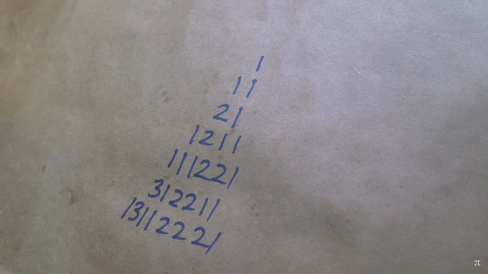

We discuss the look-and-say sequence, its behaviour, variations of it, and a Python implementation.

===




## What is the look-and-say sequence?

The look-and-say sequence is a numerical sequence that typically starts with 1 and then has the following terms:

 - 1
 - 11
 - 21
 - 1211
 - 111221
 - 312211
 - ...

(Can you guess the next one?)

The way the sequence works is that you read the digits aloud to build the next term.
For example, how would you read the term `312211`?
You would read it as “one 3, one 1, two 2s, and two 1s”, giving `13112221`.

The sequence is usually started with `1`,
but we can actually seed the sequence (start the sequence) with any other term we want.

For example, what if we start the sequence with `312`?
Then we would get

 - 312
 - 131112
 - 11133112
 - 31232112
 - 13111213122112
 - ...

So, the look-and-say sequence is often associated with the sequence that starts with 1,
but the rule makes sense in other contexts as well.


## Conway's constant

A couple of days ago [I learned][til-look-and-say-growth] that [John Conway][jc] was able to determine by how much all these sequences grow!
As you progress through the sequence, the length of the previous term is supposed to be $\approx 30\%$ greater than the length of the previous term.
To be more precise, the length of the previous term tends to be $1.303577269\cdots$ times the length of the previous one.
This is the value of Conway's constant, and it's [the only positive real root of a polynomial of degree 71][til-conway-constant].

Like I said, this constant governs the growth of any of these sequences, regardless of the start point...
Almost!

There is _just one_ seed for which this doesn't hold true.
Can you figure out which one?

!!! Think about it.
!!! You can find the answer below.


## Python implementation

After [talking about this sequence on Twitter][twitter-seq], I wrote a Python function that applies the look-and-say rule to a list of digits.
So, before you keep reading, can you implement such a function?
Write a function that accepts a list of digits and returns the list with the digits of the next term of the sequence.

Here is how I did it:

First, how does the sequence work?
The next term is created by looking at the previous one and saying what you are seeing.
The key here is understanding that we want to look at groups of consecutive equal digits, right?

That's how we go from 111221 to 312211:

```txt
 111 | 22 | 1
   31   22  11
```

And from 312211 to 13112221:

```txt
 3 | 1 | 22 | 11
 13  11   22  21
```

How can we do this in Python?
This grouping functionality is perfect for one tool from the `itertools` module,
`itertools.groupby`.
`groupby` returns consecutive keys and groups from an iterable;
the keys are the unique elements and the groups are the runs of unique elements.

Here are some examples to show how `groupby` works:

```py
>>> from itertools import groupby
```

Notice how the keys are the unique consecutive elements:

```py
## The keys are the unique elements:
>>> [k for k, _ in groupby("AAABAADDDCC")]
['A', 'B', 'A', 'D', 'C']
```

If we don't convert groups to lists first, we can't get the length of the group:

```py
## The groups are iterables with the consecutive elements:
>>> [list(g) for _, g in groupby("AAABAADDDCC")]
[['A', 'A', 'A'], ['B'], ['A', 'A'], ['D', 'D', 'D'], ['C', 'C']]

## We can compute the length of a group:
>>> [len(list(g)) for _, g in groupby("AAABAADDDCC")]
[3, 1, 2, 3, 2]
```

And we can obviously pair the lengths of the groups with the keys themselves:

```py
## We can pair keys and length of groups to count elements:
>>> [(len(list(g)), k) for k, g in groupby("AAABAADDDCC")]
[(3, 'A'), (1, 'B'), (2, 'A'), (3, 'D'), (2, 'C')]
```

So, do you see where this is going?
By using a similar structure as the last example,
we can get pretty far with our look-and-say implementation:

```py
>>> def look_and_say(digits):
...     return [(len(list(g)), k) for k, g in groupby(digits)]
...
>>> look_and_say([1, 1, 1, 2, 2, 1])
[(3, 1), (2, 2), (1, 1)]
```

However, the result isn't a flat list of digits... It's a list of tuples.
How can we flatten this?
`itertools` to the rescue again!
One of the best ways to flatten a list of lists is with `itertools.chain.from_iterable`:

```py
>>> from itertools import chain

>>> list(chain.from_iterable(
...     [(3, 'A'), (1, 'B'), (2, 'A'), (3, 'D'), (2, 'C')]
... ))
[3, 'A', 1, 'B', 2, 'A', 3, 'D', 2, 'C']
```

So, by putting together `chain` and `groupby`, we have ourselves an implementation:

```py
>>> from itertools import chain, groupby

>>> def look_and_say(digits):
...     return list(chain.from_iterable( 
...         (len(list(g)), k) for k, g in groupby(digits)
...     ))
...
>>> look_and_say([1, 1, 1, 2, 2, 1])
[3, 1, 2, 2, 1, 1]
```

Bonus Q: what if you wanted your function to accept an integer and return an integer?
E.g., `look_and_say(111221) → 312211`.

Can you modify the function below to handle that case?
I would do so by adding two functions:
`to_digits` and `from_digits`;
those would convert from an integer to a list of digits and back.

Here is how I would put everything together:

```py

>>> def to_digits(num):
...     return map(int, str(num))
... 

>>> def from_digits(digits):
...     return int("".join(map(str, digits)))
... 

>>> from itertools import chain, groupby
>>> def look_and_say(num):
...     return from_digits(chain.from_iterable(
...         (len(list(g)), k) for k, g in groupby(to_digits(num))
...     ))
... 
>>> look_and_say(111221)
312211
```

By separating the functions `to_digits` and `from_digits` from the function `look_and_say`,
you can easily change the way you do the conversions.
For example, I'm doing the conversions by using strings as intermediate values.
What if I couldn't convert my number (or my digits) to strings?
How would I do the conversions then?


## The exception to Conway's constant

The only seed that creates a look-and-say sequence that doesn't grow according to Conway's constant is the seed 22.
Why?

To see why, here are the first terms of the sequence:

 - 22
 - 22
 - 22
 - 22
 - ...

Can you guess the next term?

Because the terms are all the same, it is quite clear that the sequence doesn't grow!
Now, what's really impressive is that _all other sequences_ grow at the rate determined by Conway's constant.
That's what is _really_ impressive.


## Estimating Conway's constant

Another thing you can try doing is picking a seed,
computing successive elements,
and checking the ratios of the lengths of the successive terms.
Can you see them converge to Conway's constant, which is $1.303577269\cdots$?

Here is a simple Python program to do that.
I'll use the implementation that works on lists of digits because it's faster than.
Then, I'll just start an infinite loop that keeps printing the consecutive ratios:

```py
from itertools import chain, count, groupby

def look_and_say(digits):
    return list(chain.from_iterable( 
        (len(list(g)), k) for k, g in groupby(digits)
    ))

previous_term = [1]  # Pick a seed, any seed.
for idx in count(0):
    next_term = look_and_say(previous_term)
    print(f"{idx:>3}: {len(next_term) / len(previous_term)}")
    previous_term = next_term
```

If you run that, after 50 terms you will see that we already have around 3 correct decimal places (remember that Conway's constant starts with $1.303$):

```txt
...
 40: 1.3031208257437765  ←
 41: 1.3044580289250036
 42: 1.3028346096696766
 43: 1.303603544326008   ←
 44: 1.3040640010767794
 45: 1.302964816988995
 46: 1.3036889243154126  ←
 47: 1.303809389988721   ←
 48: 1.3031605805611626  ←
 49: 1.3037873962070161  ←
 50: 1.3037298502882633  ←
 51: 1.3035688691414649  ←
```

Try changing the initial values and see how many decimal places you can get correct!


[til-look-and-say-growth]: /blog/til/038
[til-conway-constant]: /blog/til/038#conways-constant
[jc]: https://en.wikipedia.org/wiki/John_Horton_Conway
[twitter-seq]: https://twitter.com/mathsppblog/status/1503823606899519489
