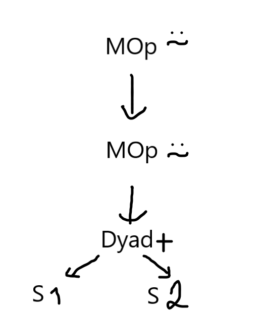
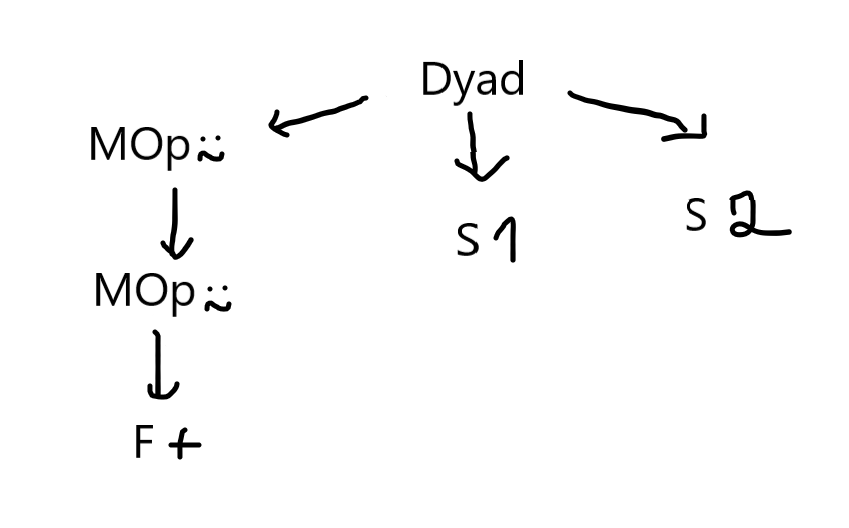
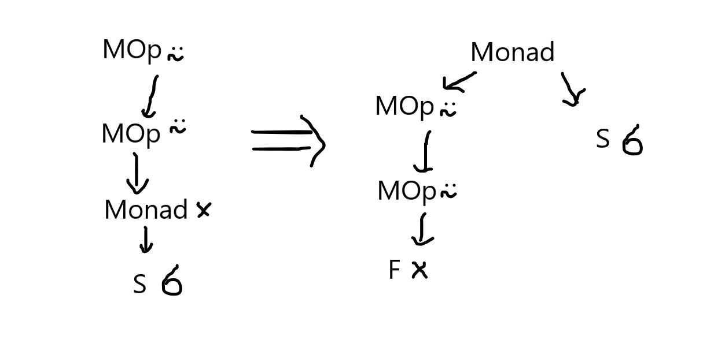

Today is the day! Today is the day we take our [APL][apl-wiki] programs and interpret them, so that something like `÷ 1 2 3 -⍨ 1.1 2.2 3.3` can output `10 5 3.33333333`.

===

Just to get us started, here are two ASTs, two Awfully Sketched Trees.

# Recap

If you recall, in the [last blog post][previous] of the series (which was also the first!) we created a simple program that took a basic [APL][apl-wiki] expression (APL is a really cool array-oriented programming language), tokenized it and then parsed it into an AST, an Abstract Syntax Tree. You can test that program online [here][repl-part1].

With that program, we can turn an expression like `5 6 -⍨ ÷1 2`

 - into a list of tokens like `[Token(EOF, None), Token(INTEGER, 5), Token(INTEGER, 6), Token(MINUS, -), Token(COMMUTE, ⍨), Token(DIVIDE, ÷), Token(INTEGER, 1), Token(INTEGER, 2)]`
 - and into an AST like `MOp(⍨ Dyad(- A([S(5), S(6)]) Monad(÷ A([S(1), S(2)]))))`

# Today

Today we are going to:

 1. implement assignment of scalars/arrays;
 1. allow for several statements split by `⋄`;
 1. implement the [Visitor pattern][visitor-wiki] to interpret an AST and produce the final result. You can check [Spivak's 8th post][lsbasi-part8] to see how he did it.

(writing this list was easy, I just went to the previous blog post and copied the list of things we would get done for today!)

Additionaly, to make the above changes easier to implement, I am also going to redesign some of the things that were already done. Please don't be mad at me! Quoting my previous post,

 > _"By the way, this might be a great moment to let you know that I make mistakes! Lots of them!"_

So we are actually starting with refactoring the parser and the way we represent monadic/dyadic function application. I decided to make this change when I realized implementing all the APL [operators][apl-wiki-op] was going to be a real headache.

To make my changes easier to understand, we will study the AST generated for the simple expression `1 +⍨⍨ 2`. If you [test it online](repl-part1) the program will print `MOp(⍨ MOp(⍨ Dyad(+ S(1) S(2))))`, which can be drawn as:

What I don't like about this AST is that I don't know if the operator `⍨` is acting in a monadic or dyadic function until I reach the bottom of the tree, where I have my function and my two arguments. If you type the same expression `1 +⍨⍨ 2` in [this series parser][repl-part2] the output printed is a list with the single element `Dyad(MOp(⍨ MOp(⍨ F(+))) S(1) S(2))` in it; this tree can be represented as:

With the new tree I have clearly separated the issue of finding the function I will apply from the arguments to which the function will be applied. I am also guessing this will make it easier to later implement things like [trains][apl-wiki-trains] and assigning functions to variables.

I challenge you modify the AST nodes and the parser yourself to produce trees like these for dyadic function applications. Monadic function application undergoes a similar change, exemplified in the picture below for the expression `×⍨⍨ 6`:

## The code

[][rgspl-repo]&nbsp;&nbsp;&nbsp;[][repl-part2]

The whole code for this project is hosted in [this][rgspl-repo] GitHub repo and the code for this specific blog post is [this subfolder][rgspl2]. You can also test today's code in your browser by hitting the "run on repl.it" button above.

---

Now that we got this out of the day, lets dive right into the changes for today.

# Updated grammar

Because we want to support assignments 

[repl-part1]: https://rgsplpart1.rojergs.repl.run/
[repl-part2]: https://RGSPLpart2.rojergs.repl.run/
[previous]: https://mathspp.com/blog/lsbasi-apl-part1
[apl-wiki]: https://aplwiki.com/
[apl-wiki-op]: https://aplwiki.com/wiki/Operator
[apl-wiki-trains]: https://aplwiki.com/wiki/Tacit_programming#Trains
[rgspl-repo]: https://github.com/RojerGS/RGSPL
[rgspl2]: https://github.com/RojerGS/RGSPL/blob/master/part2