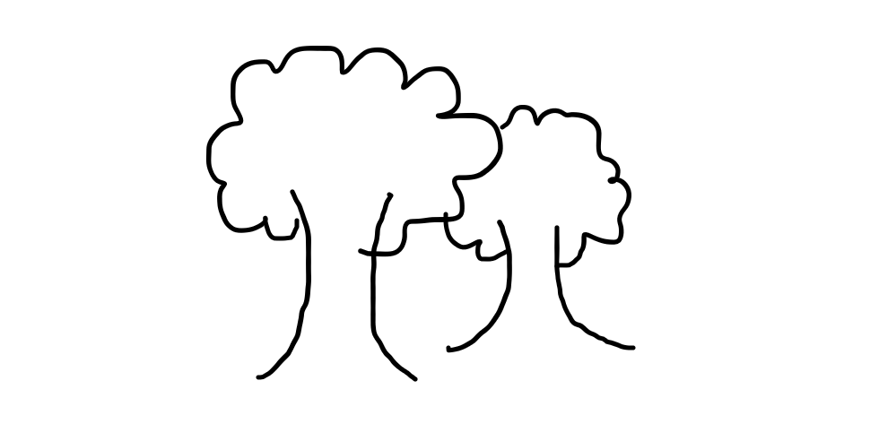
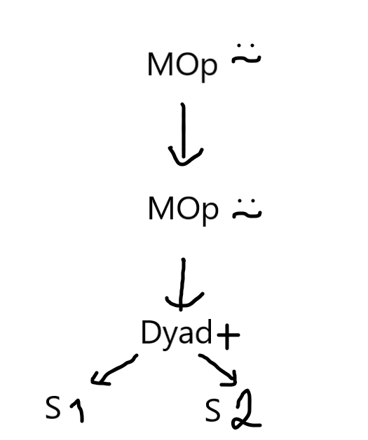
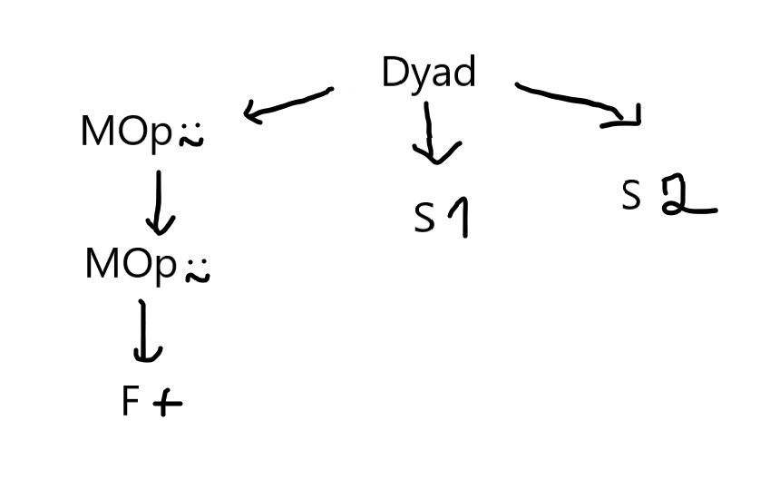
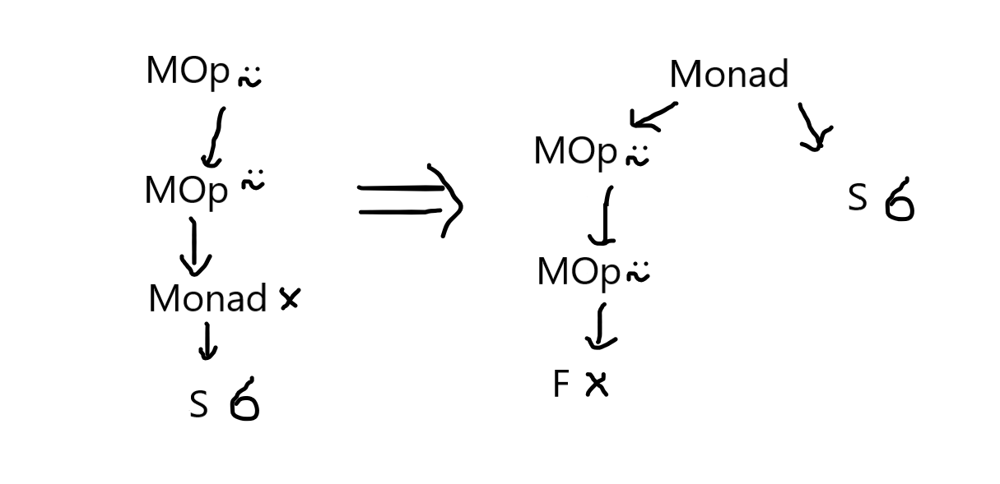

---
metadata:
    description: In this post we enhance our interpreter to handle multiple expressions
        and to evaluate them.
title: Let's build a simple interpreter for APL - part 2
---

Today is the day! Today is the day we take our [APL][apl-wiki] programs and interpret them, so that something like `÷ 1 2 3 -⍨ 1.1 2.2 3.3` can output `10 5 3.33333333`.

===




Just to get us started, here are two ASTs, two Awfully Sketched Trees.

# Recap

If you recall, in the [last blog post][previous] of the series (which was also the first!) we created a simple program that took a basic [APL][apl-wiki] expression (APL is a really cool array-oriented programming language), tokenized it and then parsed it into an AST, an Abstract Syntax Tree.

With that program, we can turn an expression like `5 6 -⍨ ÷1 2`

 - into a list of tokens like `[Token(EOF, None), Token(INTEGER, 5), Token(INTEGER, 6), Token(MINUS, -), Token(COMMUTE, ⍨), Token(DIVIDE, ÷), Token(INTEGER, 1), Token(INTEGER, 2)]`
 - and into an AST like `MOp(⍨ Dyad(- A([S(5), S(6)]) Monad(÷ A([S(1), S(2)]))))`

# Today

Today we are going to:

 1. implement assignment of scalars/arrays;
 1. allow for several statements split by `⋄`;
 1. implement the [Visitor pattern] to interpret an AST and produce the final result. You can check [Spivak's 8th post][ruslan-8] to see how he did it.

(writing this list was easy, I just went to the previous blog post and copied the list of things we would get done for today!)

Additionaly, to make the above changes easier to implement, I am also going to redesign some of the things that were already done. Please don't be mad at me! Quoting my previous post,

 > _"By the way, this might be a great moment to let you know that I make mistakes! Lots of them!"_

So we are actually starting with refactoring the parser and the way we represent monadic/dyadic function application. I decided to make this change when I realized implementing all the APL [operators][apl-wiki-op] was going to be a real headache with the format I chose before.

To make my changes easier to understand, we will study the AST generated for the simple expression `1 +⍨⍨ 2`. If you test it,
the program will print `MOp(⍨ MOp(⍨ Dyad(+ S(1) S(2))))`, which can be drawn as:



What I don't like about this AST is that I don't know if the operator `⍨` is acting on a monadic or dyadic function until I reach the bottom of the tree, where I have my function and my two arguments. If you type the same expression `1 +⍨⍨ 2` in the new parser, the output printed is a list with the single element `Dyad(MOp(⍨ MOp(⍨ F(+))) S(1) S(2))` in it; this tree can be represented as:



With the new tree I have clearly separated the issue of finding the function I will apply from the arguments to which the function will be applied. I am also guessing this will make it easier to later implement things like [trains][apl-wiki-trains] and assigning functions to variables.

I challenge you to modify the AST nodes and the parser yourself to produce trees like these for dyadic function applications. Monadic function application undergoes a similar change, exemplified in the picture below for the expression `×⍨⍨ 6`:



## The code

[][rgspl-repo]

The whole code for this project is hosted in [this][rgspl-repo] GitHub repo and the code for this specific blog post is [this release][rgspl2].

---

Now that we got this out of the way, lets dive right into the changes for today.

# Updated grammar

Because we want to support assignments and multiple consecutive statements (separated by the diamond `⋄` glyph) we will start by taking a look at the new grammar:

```
program := EOF statement_list
statement_list := (statement "⋄")* statement
statement := ( ID "←" | array function | function )* array
function := f | function mop
mop := "⍨"
f := "+" | "-" | "×" | "÷" | "⌈" | "⌊"
array := scalar | ( "(" statement ")" | scalar )+
scalar := INTEGER | FLOAT | ID
```

The main differences are in:

 - the new `program` definition that now consists of a `statement_list` followed by an `EOF` token, where the statement list is exactly that, a list of statements separated by `⋄`;
 - the `statement` rule was modified to include assignments as a special type of statement, which is a `←` followed by an `ID` token, used for variables.

# Changing the `Token` class

To implement these differences, first things first we need to update our tokens in the `Token` class; let us also take this opportunity to reorder our tokens in an attempt to organize them into sensible groups:

```py
class Token:
    """Represents a token parsed from the source code."""

    # "Data types"
    INTEGER = "INTEGER"
    FLOAT = "FLOAT"
    ID = "ID"
    # Functions
    PLUS = "PLUS"
    MINUS = "MINUS"
    TIMES = "TIMES"
    DIVIDE = "DIVIDE"
    CEILING = "CEILING"
    FLOOR = "FLOOR"
    # Operators
    COMMUTE = "COMMUTE"
    # Misc
    DIAMOND = "DIAMOND"
    NEGATE = "NEGATE"
    ASSIGNMENT = "ASSIGNMENT"
    LPARENS = "LPARENS"
    RPARENS = "RPARENS"
    EOF = "EOF"

    # Helpful lists of token types.
    FUNCTIONS = [PLUS, MINUS, TIMES, DIVIDE, FLOOR, CEILING]
    MONADIC_OPS = [COMMUTE]

    # What You See Is What You Get characters that correspond to tokens.
    # The mapping from characteres to token types.
    WYSIWYG_MAPPING = {
        "+": PLUS,
        "-": MINUS,
        "×": TIMES,
        "÷": DIVIDE,
        "⌈": CEILING,
        "⌊": FLOOR,
        "⍨": COMMUTE,
        "←": ASSIGNMENT,
        "(": LPARENS,
        ")": RPARENS,
        "⋄": DIAMOND,
    }

    ID_CHARS = "_abcdefghijklmnopqrstuvwxyzABCDEFGHIJKLMNOPQRSTUVWXYZ0123456789"
```

# Updating the `Tokenizer`

After defining our new tokens we need to tell the `Tokenizer` when to create them. Here comes _another_ thing I decided to do differently. Variable names can start with letters and then include numbers, e.g. `var1`, `s46sx` and `_1d` are all valid variable names... and with my tokenizer working backwards, upon reaching the `1` in `var1` I would have to peek at the following characters to decide whether to tokenize a number or a variable name. For this reason, I changed the `Tokenizer` to start at the beginning of the string and in the end just reverse the list of tokens.

Because of this change there is a fair share of uninteresting changes that must be done in some `Tokenizer` methods like `__init__`, `advance`, `get_integer`, `get_number_token`, `get_wysiwyg_token` and `tokenize`. A nice exercise would be for you to change these methods so that the `Tokenizer` goes from the beginning of the source string to the end but then returns a reversed list of `Token`s.

You can check those changes by scrolling down in [this GitHub diff](https://github.com/RodrigoGiraoSerrao/RGSPL/compare/bdd67edc9339f9e4598bcb188db66908b785f13d...cea3093f84361c57ac16d00c3a2eceb74258365e) and loading the diff for the `rgspl.py` file.

Besides those changes, we have to accomodate for our new `ID` Token with a `get_id_token` method and by adapting our `get_next_token` method:

```py
class Tokenizer:
    """Class that tokenizes source code into tokens."""

    # ...

    def get_id_token(self):
        """Retrieves an identifier token."""

        start = self.pos
        while self.current_char and self.current_char in Token.ID_CHARS:
            self.advance()
        return Token(Token.ID, self.code[start:self.pos])

    def get_next_token(self):
        """Finds the next token in the source code."""

        self.skip_whitespace()
        if not self.current_char:
            return Token(Token.EOF, None)

        if self.current_char in "¯0123456789":
            return self.get_number_token()

        if self.current_char in Token.ID_CHARS:
            return self.get_id_token()

        if self.current_char in Token.WYSIWYG_MAPPING:
            return self.get_wysiwyg_token()

        self.error("Could not parse the next token...")
```

Because we also allow for numbers in our variables, as we included the numbers `"0123456789"` in `Token.ID_CHARS`, we only check if the current character is in `Token.ID_CHARS` _after_ checking if the current character is a number. This allows for numbers to match first, which is what we want because a variable cannot start with a number.

# Changes to the `ASTNode` subclasses

## Utility change to `ASTNode`

For the sake of brevity we define the `AST.__repr__` method as `self.__str__` and leave `AST.__str__` undefined; then for each `ASTNode` subclass we only have to define the magic method `__str__` as we get the `__repr__` for free with inheritance.

## New `ASTNode` subclasses

From the updated grammar, both from the new functionalities and the changes I had to make because I changed my mind about the old grammar, we need to modify these `ASTNode` subclasses:

 - `Monad` - now represents a monadic function call instead of a function called monadically (cf. the drawings above);
 - `Dyad` - now represents a dyadic function call instead of a function called dyadically (cf. the drawings above).

and create these new subclasses:

 - `F` - to hold a function;
 - `Assignment` - for an assignment;
 - `Var` - to hold a reference to a variable;
 - `Statements` - to hold a list of statements.

On top of a couple of minor changes to variable namings, these are all the `ASTNode` subclasses we have:

```py
class ASTNode:
    """Stub class to be inherited by the different types of AST nodes.

    The AST Nodes are used by the Parser instances to build an
        Abstract Syntax Tree out of the APL programs.
    These ASTs can then be traversed to interpret an APL program.
    """

    def __repr__(self):
        return self.__str__()

class S(ASTNode):
    """Node for a simple scalar like 3 or ¯4.2"""
    def __init__(self, token: Token):
        self.token = token
        self.value = self.token.value

    def __str__(self):
        return f"S({self.value})"

class A(ASTNode):
    """Node for an array of simple scalars, like 3 ¯4 5.6"""
    def __init__(self, children: List[ASTNode]):
        self.children = children

    def __str__(self):
        return f"A({self.children})"

class MOp(ASTNode):
    """Node for monadic operators like ⍨"""
    def __init__(self, token: Token, child: ASTNode):
        self.token = token
        self.operator = self.token.value
        self.child = child

    def __str__(self):
        return f"MOp({self.operator} {self.child})"

class F(ASTNode):
    """Node for built-in functions like + or ⌈"""
    def __init__(self, token: Token):
        self.token = token
        self.function = self.token.value

    def __str__(self):
        return f"F({self.function})"

class Monad(ASTNode):
    """Node for monadic function calls."""
    def __init__(self, function: ASTNode, omega: ASTNode):
        self.function = function
        self.omega = omega

    def __str__(self):
        return f"Monad({self.function} {self.omega})"

class Dyad(ASTNode):
    """Node for dyadic functions."""
    def __init__(self, function: ASTNode, alpha: ASTNode, omega: ASTNode):
        self.function = function
        self.alpha = alpha
        self.omega = omega

    def __str__(self):
        return f"Dyad({self.function} {self.alpha} {self.omega})"

class Assignment(ASTNode):
    """Node for assignment expressions."""
    def __init__(self, varname: ASTNode, value: ASTNode):
        self.varname = varname
        self.value = value

    def __str__(self):
        return f"Assignment({self.varname.token.value} ← {self.value})"

class Var(ASTNode):
    """Node for variable references."""
    def __init__(self, token: Token):
        self.token = token
        self.name = self.token.value

    def __str__(self):
        return f"Var({self.token.value})"

class Statements(ASTNode):
    """Node to represent a series of consecutive statements."""
    def __init__(self):
        self.children = []

    def __str__(self):
        return str(self.children)
```

Congratulations on making it this far into the post! Now we are left with checking the changes our `Parser` class underwent and then interpreting our programs! Yeah!

# Parsing the new grammar

On top of some small edits needed to accommodate the changes I introduced in the grammar when I changed the way `Monad`/`Dyad` nodes are created, these are the main updates we need to do in the `Parser` class:

 - create a new `parse_statement_list` method to parse the `statement_list` rule; this method parses a statement and then enters a loop to try and parse as many more statements as possible; the `parse_statement_list` method will return a `Statements` AST node;
 - in the `parse_statement` method we
   - must identify assignments by checking for the presence of a `←` token to create an `Assignment` node;
   - in case we don't have an assignment at hands, we must differentiate between monadic and dyadic function calls;
 - allow the `parse_scalar` method to create `Var` nodes when we find variables;
 - separate the monadic operator parsing into a separate method `parse_mop`;
 - simplify the `parse_f` method because now we only care about the function itself and not its valence.

All in all, the `Parser` class ends up something like this:

```py
class Parser:
    """Implements a parser for a subset of the APL language.

    The grammar parsed is available at the module-level docstring.
    """

    # ...

    def parse_program(self):
        """Parses a full program."""

        self.debug(f"Parsing program from {self.tokens}")
        statement_list = self.parse_statement_list()
        self.eat(Token.EOF)
        return statement_list

    def parse_statement_list(self):
        """Parses a list of statements."""

        self.debug(f"Parsing a statement list from {self.tokens}")
        root = Statements()
        statements = [self.parse_statement()]
        while self.token_at.type == Token.DIAMOND:
            self.eat(Token.DIAMOND)
            statements.append(self.parse_statement())

        root.children = statements
        return root

    def parse_statement(self):
        """Parses a statement."""

        self.debug(f"Parsing statement from {self.tokens[:self.pos+1]}")

        relevant_types = [Token.ASSIGNMENT] + Token.FUNCTIONS + Token.MONADIC_OPS
        statement = self.parse_array()
        while self.token_at.type in relevant_types:
            if self.token_at.type == Token.ASSIGNMENT:
                self.eat(Token.ASSIGNMENT)
                statement = Assignment(Var(self.token_at), statement)
                self.eat(Token.ID)
            else:
                function = self.parse_function()
                if self.token_at.type in [Token.RPARENS, Token.INTEGER, Token.FLOAT, Token.ID]:
                    array = self.parse_array()
                    statement = Dyad(function, array, statement)
                else:
                    statement = Monad(function, statement)

        return statement

    def parse_array(self):
        """Parses an array composed of possibly several simple scalars."""

        self.debug(f"Parsing array from {self.tokens[:self.pos+1]}")

        nodes = []
        while self.token_at.type in [
            Token.RPARENS, Token.INTEGER, Token.FLOAT, Token.ID
        ]:
            if self.token_at.type == Token.RPARENS:
                self.eat(Token.RPARENS)
                nodes.append(self.parse_statement())
                self.eat(Token.LPARENS)
            else:
                nodes.append(self.parse_scalar())
        nodes = nodes[::-1]
        if not nodes:
            self.error("Failed to parse scalars inside an array.")
        elif len(nodes) == 1:
            node = nodes[0]
        else:
            node = A(nodes)
        return node

    def parse_scalar(self):
        """Parses a simple scalar."""

        self.debug(f"Parsing scalar from {self.tokens[:self.pos+1]}")

        if self.token_at.type == Token.ID:
            scalar = Var(self.token_at)
            self.eat(Token.ID)
        elif self.token_at.type == Token.INTEGER:
            scalar = S(self.token_at)
            self.eat(Token.INTEGER)
        else:
            scalar = S(self.token_at)
            self.eat(Token.FLOAT)

        return scalar

    def parse_function(self):
        """Parses a function possibly monadically operated upon."""

        self.debug(f"Parsing function from {self.tokens[:self.pos+1]}")

        if self.token_at.type in Token.MONADIC_OPS:
            function = self.parse_mop()
            function.child = self.parse_function()
        else:
            function = self.parse_f()
        return function

    def parse_mop(self):
        """Parses a monadic operator."""

        self.debug(f"Parsing a mop from {self.tokens[:self.pos+1]}")

        mop = MOp(self.token_at, None)
        if (t := self.token_at.type) not in Token.MONADIC_OPS:
            self.error(f"{t} is not a valid monadic operator.")
        self.eat(t)

        return mop

    def parse_f(self):
        """Parses a simple one-character function."""

        self.debug(f"Parsing f from {self.tokens[:self.pos+1]}")

        f = F(self.token_at)
        if (t := self.token_at.type) not in Token.FUNCTIONS:
            self.error(f"{t} is not a valid function.")
        self.eat(t)

        return f

    def parse(self):
        """Parses the whole AST."""
        return self.parse_program()
```

Well, that was a lot of work... If you only read the code, maybe not for you... But it was a lot of work for me to write that code and especially to change my mind about so many things... Sometimes one just has to do things the wrong way in order to realize that there is a much better way of doing it!

And now on to the moment we have all been waiting for... We will take these abstract syntax trees and actually interpret them!

# Visitor pattern

One thing I learned from reading the original [lsbasi] series was what the [Visitor pattern] is. In short, the visitor pattern allows me to modularize two different things that often come together: first I create an object with a helpful structure and _then_ I apply an algorithm to that structure instead of doing both at the same time.

A good thing that comes of it is that in the next post we will be able to reuse the AST we have to create nice graphic representations of the trees. If we had the AST parsing mixed with the interpreting of the programs it would be very hard and a lot of work to also generate the nice pictures we will be generating.

This visitor pattern starts with this definition:

```py
class NodeVisitor:
    """Base class for the node visitor pattern."""
    def visit(self, node, **kwargs):
        """Dispatches the visit call to the appropriate function."""
        method_name = f"visit_{type(node).__name__}"
        visitor = getattr(self, method_name, self.generic_visit)
        return visitor(node, **kwargs)

    def generic_visit(self, node, **kwargs):
        """Default method for unknown nodes."""
        raise Exception(f"No visit method for {type(node).__name__}")
```

This `NodeVisitor` defines a base class for any algorithm we wish to implement on top of the AST. For this blog post, the algorithm we want is going to be the interpreting of APL programs, so we will define a subclass `Interpreter(NodeVisitor)`.

The point is that the `visit` method is defined in a general setting and we just have to implement a `visit_*` method for each type of node our AST can have. That way, when we are traversing our AST and reach a given node, our `Intepreter` (which is a `NodeVisitor`) will know _exactly_ how to visit that specific node. We include a default `generic_visit` to fallback to if needed.

Here we create our `Interpreter`:

```py
class Interpreter(NodeVisitor):
    """APL interpreter using the visitor pattern."""

    # ...

    def __init__(self, parser):
        self.parser = parser
        self.var_lookup = {}

    # ...
```

(I will get back to those `# ...` in a jiffy)

Creating an `Interpreter` instance is really simple, we just give it a parser. Also, notice how we instantiate an empty dictionary where we will be saving our variables. This is just a hack we are going to use momentarily, while our programs are simple and we don't have things like scopes.

Having that said, most of the `visit_*` methods are really simple. For example,

 - what does it mean to visit an `S` node? When we visit an `S`, we just have to return the actual value of that scalar;
 - what does it mean to visit an `A` node? When visiting an array, we just have to visit each of the array's elements and return the array;
 - what does it mean to visit a `Var` node? When we visit a variable node we need to see if the variable is defined in our `var_lookup` dictionary and retrieve its value from there; similarly, in an `Assignment` node we need to get the result of what we want to assign and save it in our `var_lookup` dictionary;
 - what does it mean to visit a `Statements` node? A `Statements` node really is a collection of statements that need to be interpreted in order, so when we visit a `Statements` node we need only visit all children of the `Statements` node and return the result of the last statement.

Here is the code for these five `visit_*` methods:

```py
class Interpreter(NodeVisitor):
    """APL interpreter using the visitor pattern."""

    # ...

    def visit_S(self, scalar, **__):
        """Returns the value of a scalar."""
        return scalar.value

    def visit_A(self, array, **__):
        """Returns the value of an array."""
        return [self.visit(child) for child in array.children]

    def visit_Var(self, var, **__):
        """Tries to fetch the value of a variable."""
        return self.var_lookup[var.name]

    def visit_Statements(self, statements, **__):
        """Visits each statement in order."""
        return [self.visit(child) for child in statements.children[::-1]][-1]

    def visit_Assignment(self, assignment, **kwargs):
        """Assigns a value to a variable."""

        value = self.visit(assignment.value, **kwargs)
        varname = assignment.varname.name
        self.var_lookup[varname] = value
        return value

    # ...
```

Now we are only left with the `visit_Monad`, `visit_Dyad`, `visit_F` and `visit_MOp` methods. For these it is also relevant to talk about what I decided to do.

If you look closely, all these `visit_*` methods are also expecting some keyword arguments in the `**kwargs` argument; this is going to be used to propagate down the AST information about whether a given function is being called monadically or dyadically. We care about this because this changes how functions behave, for example if `×` is being used as the sign function or as multiplication.

Not only that, but I also define the monadic and dyadic versions of the functions separately in two dictionaries. For the glyphs we have so far, `+ - × ÷ ⌊ ⌈` I will define all of them with simple lambda expressions.

! I may or may not change this in the future, this was what I came up with at this point. Maybe you could experiment with different ways of defining the functions and how they change depending on their valence and then let me know how it went! Just drop a comment below ;)

Here are the six functions for the monadic and dyadic cases:

```py
class Interpreter(NodeVisitor):
    """APL interpreter using the visitor pattern."""

    monadic_functions = {
        "+": lambda x: x,
        "-": lambda x: -x,
        "×": lambda x: 0 if not x else abs(x)//x,
        "÷": lambda x: 1/x,
        "⌈": ceil,
        "⌊": floor,
    }

    dyadic_functions = {
        "+": lambda a, w: a + w,
        "-": lambda a, w: a - w,
        "×": lambda a, w: a * w,
        "÷": lambda a, w: a / w,
        "⌈": max,
        "⌊": min,
    }

    # ...
```

_exceeeeeeept_ this is not _quite_ what we want. In APL, most functions are [scalar functions][apl-wiki-scalar-functions]. You can think of these as functions that "automatically map" over arrays, so we can do things like

```apl
    1 + 1 2 3
2 3 4

    2 × 2 3 4
4 6 8

    1 2 3 + (1 2) 3 (4 5)
(2 3) 5 (7 8)
```

so I also had to define two helper functions, `monadic_pervade` and `dyadic_pervade` that do this "automatic mapping" for us. I defined these as two decorators because that is effectively what they are, functions that receive functions and return modified versions of the input functions.

What they effectively do is to recurse into the function arguments until there is nothing to do but to apply the actual function.

```py
def monadic_pervade(func):
    """Decorates a function to pervade into simple scalars."""

    def decorated(omega):
        if isinstance(omega, list):
            return [decorated(elem) for elem in omega]
        else:
            return func(omega)
    return decorated

def dyadic_pervade(func):
    """Decorates a function to pervade through the left and right arguments."""

    def decorated(alpha, omega):
        if not isinstance(alpha, list) and not isinstance(omega, list):
            return func(alpha, omega)
        elif isinstance(alpha, list) and isinstance(omega, list):
            if len(alpha) != len(omega):
                raise IndexError("Arguments have mismatching lengths.")
            return [decorated(al, om) for al, om in zip(alpha, omega)]
        elif isinstance(alpha, list):
            return [decorated(al, omega) for al in alpha]
        else:
            return [decorated(alpha, om) for om in omega]
    return decorated
```

With these decorators defined, we can actually fix the `monadic_functions` and `dyadic_functions` dictionaries of our `Interpreter` class:

```py
class Interpreter(NodeVisitor):
    """APL interpreter using the visitor pattern."""

    monadic_functions = {
        "+": monadic_pervade(lambda x: x),
        "-": monadic_pervade(lambda x: -x),
        "×": monadic_pervade(lambda x: 0 if not x else abs(x)//x),
        "÷": monadic_pervade(lambda x: 1/x),
        "⌈": monadic_pervade(ceil),
        "⌊": monadic_pervade(floor),
    }

    dyadic_functions = {
        "+": dyadic_pervade(lambda a, w: a + w),
        "-": dyadic_pervade(lambda a, w: a - w),
        "×": dyadic_pervade(lambda a, w: a * w),
        "÷": dyadic_pervade(lambda a, w: a / w),
        "⌈": dyadic_pervade(max),
        "⌊": dyadic_pervade(min),
    }

    # ...
```

Now that we have the functions defined properly we can implement the `visit_Monad`, `visit_Dyad`, `visit_F` and `visit_MOp` methods. We also include a simple `interpret` method that triggers the recursive `visit`ing of the tree at the root:

```py
class Interpreter(NodeVisitor):
    """APL interpreter using the visitor pattern."""

    # ...

    def visit_Monad(self, monad, **kwargs):
        """Evaluate the function on its only argument."""

        kwargs["valence"] = 1
        function = self.visit(monad.function, **kwargs)
        omega = self.visit(monad.omega)
        return function(omega)

    def visit_Dyad(self, dyad, **kwargs):
        """Evaluate a dyad on both its arguments."""

        kwargs["valence"] = 2
        function = self.visit(dyad.function, **kwargs)
        omega = self.visit(dyad.omega)
        alpha = self.visit(dyad.alpha)
        return function(alpha, omega)

    def visit_F(self, func, **kwargs):
        """Fetch the callable function."""

        if kwargs["valence"] == 1:
            return self.monadic_functions[func.function]
        elif kwargs["valence"] == 2:
            return self.dyadic_functions[func.function]

    def visit_MOp(self, mop, **kwargs):
        """Fetch the operand and alter it."""

        if mop.operator == "⍨":
            func = self.visit(mop.child, **{**kwargs, **{"valence": 2}})
            if kwargs["valence"] == 1:
                return lambda x: func(x, x)
            elif kwargs["valence"] == 2:
                return lambda a, w: func(w, a)
        else:
            raise SyntaxError(f"Unknown monadic operator {mop.operator}.")

    def interpret(self):
        """Interpret the APL code the parser was given."""
        tree = self.parser.parse()
        #print(tree)
        return self.visit(tree)
```

And that is it! Congrats on making it this far! Lets take our new interpreter for a ride.

# Experimenting

You can either download the code from the [GitHub repo][rgspl2] or finish your code with this utility `if` statement (just be sure to `import argparse` in the beginning of your file):

```py
if __name__ == "__main__":

    arg_parser = argparse.ArgumentParser(description="Parse and interpret an APL program.")
    main_group = arg_parser.add_mutually_exclusive_group()
    main_group.add_argument(
        "--repl",
        action="store_true",
        help="starts a REPL session",
    )
    main_group.add_argument(
        "-f",
        "--file",
        nargs=1,
        metavar="filename",
        help="filename with code to parse and interpret",
        type=str,
    )
    main_group.add_argument(
        "-c",
        "--code",
        nargs="+",
        metavar="expression",
        help="expression(s) to be interpreted",
        type=str,
    )

    args = arg_parser.parse_args()

    if args.repl:
        print("Please notice that, from one input line to the next, variables aren't stored (yet).")
        while inp := input(" >> "):
            try:
                print(Interpreter(Parser(Tokenizer(inp), debug=True)).interpret())
            except Exception as error:
                print(f"Caught '{error}', skipping execution.")

    elif args.code:
        for expr in args.code:
            print(f"{expr} :")
            print(Parser(Tokenizer(expr), debug=True).parse())

    elif args.file:
        print("Not implemented yet...")

    else:
        arg_parser.print_usage()
```

Now you can fire up your favourite interpreter and write `./rgspl.py --repl` and it will start a Read-Eval-Print-Loop (hence repl) where you can type your expressions and get their results printed back at you:

```apl
    1 2 3 + × (1 2) 3 (4 5 6)
[[2, 2], 3, [4, 4, 4]]

    r ← 1 2 4 5 + 3 4 1 2 ⋄ r2 ← 5×4×r ⋄ r2
[80, 120, 100, 140]
```

If the verbose output annoys you, you may want to set `debug=False` :)

# Exercises

For the next blog post I want you to implement some more of APL's primitive built-ins. For practice, why don't you tackle primitives like `*`, `○`, `|`, the comparison functions `<≤=≥>≠` and the boolean functions `∨∧⍱⍲`? Have a go at them! Do not forget to make them scalar!

I also want you to have a look at [Ruslan's 7th post][ruslan-7] and check out his code for the small utility he wrote to generate images from AST trees (search the text for _"To help you visualize ASTs"_). It is an excellent way for you to practice your visitor pattern skills: implement that utility for these APL trees we have.

# Where we are heading to

In future posts here are some of the things that will be covered:

 - implementing many more primitive functions;
 - implement more monadic operators;
 - finally introduce dyadic operators;
 - implement strand assignment (i.e. what allows you to do things like `(a b) ← 1 2`);
 - implement modified assignment;
 - make sure our list representation of arrays is compatible with APL's array model;
 - allow for the definition of trains and assignment of those.

These are some of the things I want to tackle next but having those complete doesn't mean we are close to having a full APL interpreter! APL has lots of cool features!

See you next time ;)

# The series

This is a series that I am working slowly but steadily on.
Feel free to ping me in the comments or over email
if you'd like an estimate of when the next article is being published :)
Until then, here is a list with all the articles in the series:

<ul>

    <li><a href="{{ post.url }}">{{ post.title }}</a></li>

</ul>


[previous]: https://mathspp.com/blog/lsbasi-apl-part1
[apl-wiki]: https://aplwiki.com/
[apl-wiki-op]: https://aplwiki.com/wiki/Operator
[apl-wiki-trains]: https://aplwiki.com/wiki/Tacit_programming#Trains
[apl-wiki-scalar-functions]: https://aplwiki.com/wiki/Scalar_function
[rgspl-repo]: https://github.com/RodrigoGiraoSerrao/RGSPL
[rgspl2]: https://github.com/RodrigoGiraoSerrao/RGSPL/releases/v0.2
[lsbasi]: https://ruslanspivak.com/lsbasi-part1/
[Visitor pattern]: https://en.wikipedia.org/wiki/Visitor_pattern
[ruslan-7]: https://ruslanspivak.com/lsbasi-part7/
[ruslan-8]: https://ruslanspivak.com/lsbasi-part8/
