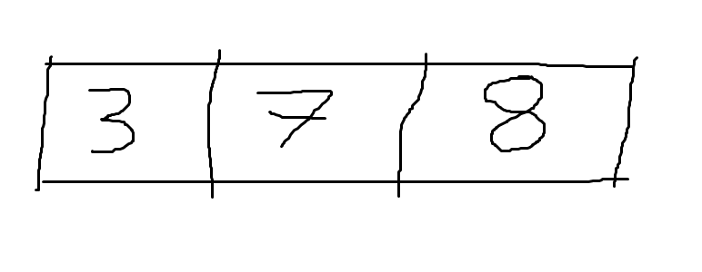
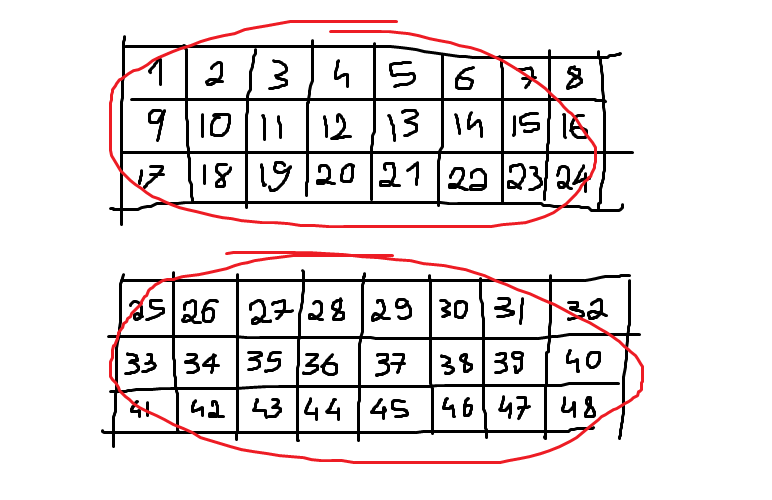

---
metadata:
    description: In the third instalment of this series we write a proper implementation of the APL array model
title: Let's build a simple interpreter for APL - part 3 - the array model
---

In this blog post we will go over some significant changes, from implementing APL's array model to introducing dyadic operators!

===


# Recap

In the last two blog posts we wrote a simple Python program that tokenizes basic [APL][apl-wiki] expressions, then parses and interprets them. We introduced some functions, like `+-×÷` and the operator `⍨`.

The program from [part 2][previous] takes an expression like `5 6 -⍨ ÷1 2` and then turns it

 - into a list of tokens like `[Token(EOF, None), Token(INTEGER, 5), Token(INTEGER, 6), Token(MINUS, -), Token(COMMUTE, ⍨), Token(DIVIDE, ÷), Token(INTEGER, 1), Token(INTEGER, 2)]`
 - then into an AST like `MOp(⍨ Dyad(- A([S(5), S(6)]) Monad(÷ A([S(1), S(2)]))))`
 - and finally evaluates it to `¯4 ¯5.5`.

# Today

Today we are going to:

 1. implement the APL array model properly;
 2. introduce dyadic operators;
 3. implement more functions and operators;
 4. introduce a testing script to check the implementations are working correctly.

Also, from now on I want to reduce the time between consecutive posts so I will write blog posts after less changes to the interpreter.
This will also mean the posts become smaller and easier to read.

## The code

[][rgspl-repo]

The whole code for this project is hosted in [this][rgspl-repo] GitHub repo and the code for this specific blog post is [this release][rgspl3].

[This link][changes] has the diff with all the changes that happened since the last post.

---

Now that we got this out of the way, let's dive right into the changes for today. You can follow [this link][changes] to see literally _every single change_ that happened since the last post.

Let us start with simpler changes like introducing complex numbers, allowing for variable names to contain digits, a couple of helper methods in our parser and moving functions/monadic operators/dyadic operators to their own files to keep everything sort of organised.


# Simpler changes


## Updated grammar

We needed to update our grammar to include dyadic operators (introduced today!), complex numbers and some new functions and operators.
Here is how the grammar looks now:

```py
    program        ::= EOF statement_list
    statement_list ::= (statement "⋄")* statement
    statement      ::= ( ID "←" | vector function | function )* vector
    function       ::= function mop | function dop f | f
    dop            ::= "∘" | "⍥"
    mop            ::= "⍨" | "¨"
    f              ::= "+" | "-" | "×" | "÷" | "⌈" | "⌊" |
                     | "⊢" | "⊣" | "⍳" | "<" | "≤" | "=" |
                     | "≥" | ">" | "≠" | "~" | "⊂" | LPARENS function RPARENS
    vector         ::= vector* ( scalar | ( LPARENS statement RPARENS ) )
    scalar         ::= INTEGER | FLOAT | COMPLEX | ID
```

The changes to the grammar will be explained in the relevant sections of this post.
The most notable changes are the addition of the `COMPLEX` token to the `scalar` rule, the inclusion of `dop`s in the `function` rule and the new `dop` rule itself, and the renaming of the `array` rule to `vector`.


## Variable names can contain digits

In APL variable names can contain plenty of interesting characters, like the accented latin letters or digits.
While the possibility of having accented letters in the name of a variable isn't very common in programming languages, digits are common and we will add support for those.

For this we just need to update our `ID_CHARS` variable to include the digits:

```py
class Token:
    # ...
    ID_CHARS = "_abcdefghijklmnopqrstuvwxyzABCDEFGHIJKLMNOPQRSTUVWXYZ0123456789"
    # ...
```


## Complex numbers as a data type

Today we also want to enrich our basic data types with complex numbers, which in APL are signaled with `J`.
For example, `0J1` is the imaginary unit $i$.
For this change we need to create a token type:

```py
class Token:
    """Represents a token parsed from the source code."""

    # "Data types"
    INTEGER = "INTEGER"
    FLOAT = "FLOAT"
    COMPLEX = "COMPLEX"
    ID = "ID"
    # ...
```

and now what was the `get_number_token` becomes `get_real_number`.
`get_number_token` attempted to read two integers separated by a `.`.
In a similar fashion, the new `get_number_token` will attempt to read two real numbers separated by `J`.
Depending on whether it succeeds or not, we build a complex number or not:

```py
class Tokenizer:
    # ...
    def get_real_number(self):
    """Parses a real number from the source code."""

        # Check for a negation of the number.
        if self.current_char == "¯":
            self.advance()
            int_ = "-" + self.get_integer()
        else:
            int_ = self.get_integer()
        # Check if we have a decimal number here.
        if self.current_char == ".":
            self.advance()
            dec_ = self.get_integer()
        else:
            dec_ = "0"

        if int(dec_):
            return float(f"{int_}.{dec_}")
        else:
            return int(int_)

    def get_number_token(self):
        """Parses a number token from the source code."""

        real = self.get_real_number()
        if self.current_char == "J":
            self.advance()
            im = self.get_real_number()
        else:
            im = 0

        if im:
            tok = Token(Token.COMPLEX, complex(real, im))
        elif isinstance(real, int):
            tok = Token(Token.INTEGER, real)
        elif isinstance(real, float):
            tok = Token(Token.FLOAT, real)
        else:
            self.error("Cannot recognize type of number.")
        return tok
```

Now that our complex numbers can be tokenized, we need them to be parsed in our `scalar` grammar rule, which is done by updating the `parse_scalar` function:

```py
class Parser:
    # ...

    def parse_scalar(self):
        """Parses a simple scalar."""

        self.debug(f"Parsing scalar from {self.tokens[:self.pos+1]}")

        if self.token_at.type == Token.ID:
            scalar = Var(self.token_at)
            self.eat(Token.ID)
        elif self.token_at.type == Token.INTEGER:
            scalar = S(self.token_at)
            self.eat(Token.INTEGER)
        elif self.token_at.type == Token.FLOAT:
            scalar = S(self.token_at)
            self.eat(Token.FLOAT)
        else:
            scalar = S(self.token_at)
            self.eat(Token.COMPLEX)

        return scalar
    # ...
```


## Comments in the source code

Allowing for comments in the code is also a trivial change away.
We just need the tokenizer to recognise the comment lamps `⍝` and ignore the rest of the line.
For this, we create a `skip_comment` function just like the `skip_whitespace` function:

```py
class Tokenizer:
    # ...

    def skip_comment(self):
        """Skips commented code."""

        if not self.current_char == "⍝":
            return
        while self.current_char and self.current_char != "\n":
            self.advance()
    # ...
```

Now that we know how to skip comments, we must do it every time we try to get a new token:

```py
class Tokenizer:
    # ...

    def get_next_token(self):
        """Finds the next token in the source code."""

        self.skip_whitespace()
        self.skip_comment()
        # ...
    # ...
```

Because comments make much more sense when we also allow our code to be multiline, we also add support for a newline `\n` to be interpreted as the diamond separator `⋄`, given that their behaviour is pretty much identical.
The major difference is that a newline breaks a comment while `⋄` doesn't.
For a newline to be recognised as a diamond we just need to add it to the `WYSIWYG_MAPPING`:

```py
class Token:
    # ...

    # What You See Is What You Get characters that correspond to tokens.
    # The mapping from characteres to token types.
    WYSIWYG_MAPPING = {
        # ...
        "⋄": DIAMOND,
        "\n": DIAMOND,
    }
    # ...
```

This will be properly tested when we implement the functionality to have `rgspl.py` run code from a source file.


## Move things to their own files

As our interpreter grows and we add support for more APL functions and operators, our source code will obviously increase.
To help keep everything more manageable I decided to move functions to their own `functions.py` file.
Similarly I moved monadic operators to `moperators.py` and soon we will add our first dyadic operators in `doperators.py`.

This change isn't a very big deal, except it changes a little bit the way we interpret our programs.
The way I decided to go about it was to define a function with the name equal to the name of the function token, e.g. `times` for `×`, and then use Python's `getattr` to fetch the appropriate function implementation from the `functions` import.

At the same time, I think it makes more sense to have a single function as an entry-point for our function calls and then the function decides if it is monadic or dyadic depending on what its inputs are.
In that sense, each function expects two named arguments, `omega` and `alpha`, where `alpha` always has a default value of `None`.
If `alpha` really is `None`, then this is a monadic function call. If `alpha` is not `None`, then we have a dyadic function call.
Having to distinguish between monadic and dyadic function calls was the only reason I had all `visit_` methods have a `**kwargs` argument, so now we can remove it.

Finally, the code changes to evaluate monadic/dyadic function calls and to visit functions and monadic operators becomes:

```py
class Interpreter(NodeVisitor):
    # ...

    def visit_Monad(self, monad):
        """Evaluate the function on its only argument."""

        function = self.visit(monad.function)
        omega = self.visit(monad.omega)
        return function(omega=omega)

    def visit_Dyad(self, dyad):
        """Evaluate a dyad on both its arguments."""

        function = self.visit(dyad.function)
        omega = self.visit(dyad.omega)
        alpha = self.visit(dyad.alpha)
        return function(alpha=alpha, omega=omega)

    def visit_F(self, func):
        """Fetch the callable function."""

        name = func.token.type.lower()
        function = getattr(functions, name, None)
        if function is None:
            raise Exception(f"Could not find function {name}.")
        return function

    def visit_MOp(self, mop):
        """Fetch the operand and alter it."""

        aalpha = self.visit(mop.child)
        name = mop.token.type.lower()
        operator = getattr(moperators, name, None)
        if operator is None:
            raise Exception(f"Could not find monadic operator {name}.")
        return operator(aalpha=aalpha)
    # ...
```

You can see above that, much like functions take named arguments `alpha` and `omega`, operators will take named arguments `aalpha` and `oomega`.

I think we already dealt with pretty much every minor change.
Now we can handle the implementation of an appropriate array model.

# Array model

By "array model" I mean the way the interpreter will deal with arrays, the way they are stored in memory, the way they are created and manipulated by the built-in functions, etc.

APL is an array-oriented programming language and that means arrays are the core of APL...
So it is not reasonable to implement an APL interpreter and _not_ have a good way of representing arrays.
I didn't do this right in the start because I thought it would be more interesting to have the interpreter interpret expressions...
But now that it does, we have to tackle this issue!

Key to implementing the array model is understanding how arrays work in APL.
As soon as one does understand, many possible solutions come to mind!
For the RGSPL interpreter I went with something that is easy to understand and easy to implement, certainly sacrificing some efficiency.

In APL, arrays have one very important property called _shape_, which tells you how many items the array has along each dimension.
This is easier to understand starting from vectors (akin to lists or vectors in other programming languages) and working our way up in the _length of the shape_ of the array, a.k.a. the _rank_ of the array.

Here is an example of a vector with 3 elements:



A vector is a linear container, in which items come one after the other.
A vector only has one dimension and its value equals the number of elements of the vector, so this vector has shape `[3]`.
Because it only has one dimension, it is said that a vector has rank 1.

The next step is to stack vectors on top of each other, by which means we create matrices like the one below:


This matrix has 2 vectors of length 3, or equivalently, this matrix has 2 rows and 3 columns, hence its shape is `[2, 3]`.
Because it has two dimensions, it is said that a matrix has rank 2.

If now we stack matrices on top of each other we get an array of rank 3:


Notice that we didn't collate the two matrices vertically because otherwise it would look like a matrix with 4 rows, instead of a 3D array with 2 matrices, each with 2 rows and 4 columns.
This 3D array has rank 3 (which is why we call it a _3D array_) and its shape is `[2, 2, 4]`.
By now you should get the idea: we can keep stacking these things on top of each other to increase the rank of the underlying array.

We have been building up, but now we are going to investigate the items of the arrays: the things we call _scalars_.
In APL, _scalars_ are arrays with empty shape (i.e. with shape `[]`).
We may refer to them loosely as arrays with "_no shape_", but please bear in mind that that is technically incorrect.
In the arrays above we have seen that the numbers 1 to 16 are scalars.
To be introduced next, characters are also scalars.
But anything can be made a scalar and used inside other arrays. The monadic _Enclose_ primitive (`⊂`) is used to turn its right argument into a scalar and we will see shortly how it works.


## Everything is an array

Everything has a shape (even if the shape is empty) and everything is an array in APL, so we can start off our implementation with a generic class that will hold all APL arrays, which I named in a not-so-imaginative-way as `APLArray`:

```py
class APLArray:
    # ...
```

(By the way, this APLArray is going to be implemented in `arraymodel.py`, separately from the rest, so that later on our different interpreter parts can import it without running into issues with circular imports.)

The next thing is to specify how an `APLArray` is created by implementing `__init__`.
For our purposes of having an APL interpreter that works and is easy to understand, I decided that these APL arrays will be specified by their shape and their data:

```py
class APLArray:
    def __init__(self, shape, data):
        self.shape = shape
        self.data = data

    def __str__(self):
        return f"{self.shape} :: {self.data}"

    __repr__ = __str__
```

In practice if `array` is an instance of `APLArray`, `array.shape` will specify its shape as seen above.
If `array.shape` is `[]`, then `array` is a scalar and its data is the contents of the scalar.
It may be an `int`, a `float`, a `complex` or another `APLArray`.
If `array.shape` is a non-empty list, then `array.data` is a list with `math.prod(array.shape)` items.
E.g., if `array.shape` is `[2, 3, 4]` then `array.data` is a list with $2 \times 3 \times 4 = 24$ items.


## Instancing arrays

Now that we know how to represent arrays we need to create them.
The first thing I did for clarity was to rename the AST node `A` to `V`, as things we type are actually not more than vectors, because we can't type matrices or any other higher-rank arrays directly:

```py
class V(ASTNode):
    """Node for a stranded vector of simple scalars, like 3 ¯4 5.6"""
    def __init__(self, children: List[ASTNode]):
        self.children = children


    def __str__(self):
        return f"V({self.children})"
```

This also meant minor renamings in some parts of the code.

Now what we need to do is tell the interpreter how to visit properly scalar and vector nodes, as these should now return `APLArray` instances!

```py
class Interpreter(NodeVisitor):
    # ...

    def visit_S(self, scalar):
        """Returns the value of a scalar."""
        return APLArray([], scalar.value)

    def visit_V(self, array):
        """Returns the value of an array."""
        scalars = [self.visit(child) for child in array.children]
        return APLArray([len(scalars)], scalars)
    # ...
```

And that is it!
Now we just have to make sure that our functions know how to handle `APLArray` instances as arguments.


# Updating scalar functions

The first class of functions we are going to update are the scalar functions.
For those, we had two decorators named `monadic_permeate` and `dyadic_permeate` that automatically "mapped" our function over the argument(s).
Because we are going to unify monadic and dyadic functions, we will also unify these two helper functions into one `pervade` decorator.

In order to better understand what we are aiming for, let us see our `plus` function decorated by `pervade`:

```py
@pervade
def plus(*, alpha=None, omega):
    """Define monadic complex conjugate and binary addition.

    Monadic case:
        + 1 ¯4 5J6
    1 ¯4 5J¯6
    Dyadic case:
        1 2 3 + ¯1 5 0J1
    0 7 3J1
    """

    if alpha is None:
        return omega.conjugate()
    else:
        return alpha + omega
```

The idea is that the `pervade` decorator takes care of handling the shapes of the two arguments and the function itself only has to worry about getting the simple data types as arguments: `int`s, `float`s and `complex` numbers.

So, how should the `pervade` decorator work?
It should take a scalar function and "teach it" how to pervade it into the arrays it gets as arguments.
The way I implemented it is the following: it first computes the `data` field of the result and in the end it computes the `shape` field of the result, like so:

```py
def pervade(func):
    """Decorator to define function pervasion into simple scalars."""

    @functools.wraps(func)
    def pervasive_func(*, alpha=None, omega):
        # calculate data

        shape = getattr(alpha, "shape", None) or omega.shape
        return APLArray(shape, data)

    return pervasive_func
```

The `shape` computation uses short-circuiting to decide what is the final shape of the result.
This works because either the shapes of `alpha` and `omega` are the same, or one of them is a scalar, or `alpha` didn't even exist to begin with.
If the two shapes are different then an error will be raised when trying to compute the `data`, so at this point we can assume everything is compatible.

If everything is compatible and one of them is a scalar, then its shape is `[]` and the `or` returns the other shape.
If both shapes are equal then it doesn't matter which one is returned and if `alpha` is `None`, and thus doesn't have a shape, `None or omega.shape` returns `omega.shape`, whatever that is.

Now we know how to compute the shape, which is the easy part.
Calculating the data isn't complicated, but takes a bit more work.

I started off by taking care of the monadic case.
If this was a monadic function call, we need to distinguish between three cases:

 - `omega` is an array - `data` is the array where the decorated function was applied to each member of the array;
 - `omega` is a simple scalar - `data` is the _original_ function applied to the scalar;
 - `omega` is another type of scalar - `data` is the decorated function applied to the scalar.

This translates into this code:

```py
def pervade(func):
    """Decorator to define function pervasion into simple scalars."""

    @functools.wraps(func)
    def pervasive_func(*, alpha=None, omega):
        # Start by checking if alpha is None
        if alpha is None:
            if omega.shape:
                data = [
                    pervasive_func(omega=w, alpha=alpha) for w in omega.data
                ]
            elif isinstance(omega.data, APLArray):
                data = pervasive_func(omega=omega.data, alpha=alpha)
            else:
                data = func(omega=omega.data, alpha=alpha)
        # Dyadic case ...

        shape = getattr(alpha, "shape", None) or omega.shape
        return APLArray(shape, data)

    return pervasive_func
```

Finally, we have to deal with the dyadic case!
For this, we just have to distinguish between the cases where `alpha` and/or `omega` are arrays, and then distinguish between when they are simple scalars or not.
All in all, the logic is similar to the one above.
We check if both `omega` and `alpha` are arrays, then we check if just one of them is an array and then we check if both of them are simple scalars (in which case we want to use the original function and _not_ the decorated one).
If it wasn't any of these cases, then both `alpha` and `omega` are scalars but at least one of them isn't simple.

Here is what the whole `pervade` decorator looks like:

```py
def pervade(func):
    """Decorator to define function pervasion into simple scalars."""

    @functools.wraps(func)
    def pervasive_func(*, alpha=None, omega):
        # Start by checking if alpha is None
        if alpha is None:
            if omega.shape:
                data = [
                    pervasive_func(omega=w, alpha=alpha) for w in omega.data
                ]
            elif isinstance(omega.data, APLArray):
                data = pervasive_func(omega=omega.data, alpha=alpha)
            else:
                data = func(omega=omega.data, alpha=alpha)
        # Dyadic case from now on
        elif alpha.shape and omega.shape:
            if alpha.shape != omega.shape:
                raise IndexError("Mismatched left and right shapes.")
            data = [
                pervasive_func(omega=w, alpha=a) for w, a in zip(omega.data, alpha.data)
            ]
        elif alpha.shape:
            w = omega.data if isinstance(omega.data, APLArray) else omega
            data = [pervasive_func(omega=w, alpha=a) for a in alpha.data]
        elif omega.shape:
            a = alpha.data if isinstance(alpha.data, APLArray) else alpha
            data = [pervasive_func(omega=w, alpha=a) for w in omega.data]
        # Both alpha and omega are scalars
        elif not isinstance(alpha.data, APLArray) and not isinstance(omega.data, APLArray):
            data = func(omega=omega.data, alpha=alpha.data)
        else:
            a = alpha.data if isinstance(alpha.data, APLArray) else alpha
            w = omega.data if isinstance(omega.data, APLArray) else omega
            data = pervasive_func(omega=w, alpha=a)

        shape = getattr(alpha, "shape", None) or omega.shape
        return APLArray(shape, data)

    return pervasive_func
```

And this settles it.
Having defined the `pervade` decorator, scalar functions become really easy to implement.

So far, RGSPL has implemented the following scalar functions:

 - monadic and dyadic versions of `+`, `-`, `×`, `÷`, `⌈`, `⌊`;
 - monadic version of `~`;
 - dyadic versions of `<`, `≤`, `=`, `≥`, `>`, `≠`.

and many are still missing!

This is the code for these:

```py
def plus(*, alpha=None, omega):
    if alpha is None:
        return omega.conjugate()
    else:
        return alpha + omega

def minus(*, alpha=None, omega):
    if alpha is None:
        alpha = 0
    return alpha - omega

def times(*, alpha=None, omega):
    if alpha is None:
        if not omega:
            return 0
        else:
            div = omega/abs(omega)
            if not isinstance(omega, complex):
                div = round(div)
            return div
    else:
        return alpha*omega

def divide(*, alpha=None, omega):
    if alpha is None:
        alpha = 1
    return alpha/omega

def ceiling(*, alpha=None, omega):
    if alpha is None:
        if isinstance(alpha, complex):
            raise NotImplementedError("Complex ceiling not implemented yet.")
        return math.ceil(omega)
    else:
        return max(alpha, omega)

def floor(*, alpha=None, omega):
    if alpha is None:
        if isinstance(alpha, complex):
            raise NotImplementedError("Complex floor not implemented yet.")
        return math.floor(omega)
    else:
        return min(alpha, omega)

def less(*, alpha=None, omega):
    return int(alpha < omega)

def lesseq(*, alpha=None, omega):
    return int(alpha <= omega)

def eq(*, alpha=None, omega):
    return int(alpha == omega)

def greatereq(*, alpha=None, omega):
    return int(alpha >= omega)

def greater(*, alpha=None, omega):
    return int(alpha > omega)

def _neq(*, alpha=None, omega):
    return int(alpha != omega)

def neq(*, alpha=None, omega):
    if alpha is None:
        return _unique_mask(alpha=alpha, omega=omega)
    else:
        return _neq(alpha=alpha, omega=omega)

def _not(*, alpha=None, omega):
    return int(not omega)

def without(*, alpha=None, omega):
    if alpha is None:
        return _not(alpha=alpha, omega=omega)
    else:
        return _without(alpha=alpha, omega=omega)
```

If you look closely enough, you will see that the `neq` and `without` functions above call two different functions, depending on whether they were called monadically or dyadically.
The non-scalar `_unique_mask` and `_without` will be explained now.


# New functions

Besides reworking scalar functions, we also have to retouch the non-scalar functions that were already included.
In this blog post I also introduce a couple of new functions.

As of now, these are the functions that RGSPL has support for:

 - monadic and dyadic `⊢` and `⊣`;
 - monadic `≠`, `⊂` and `⍳`;
 - dyadic `~`.

Only `⍳` was already available, but I rewrote it to make it clearer and compliant with the new array model.
In the process of such rewrite I also created an auxiliary function `_encode` which will come in handy later on, when we implement `⊤`.

## Left and right tacks

`⊢` and `⊣` are very uninteresting, implementation-wise:

```py
def right_tack(*, alpha=None, omega):
    return omega

def left_tack(*, alpha=None, omega):
    return alpha if alpha is not None else omega
```

## Enclose

Monadic `⊂` isn't particularly challenging, but it was an interesting function to add because it allows us to test our array model. Monadic `⊂` is _Enclose_, a function that takes any array and turns it into a scalar, unless said array is a simple scalar.

The code for it is

```py
def lshoe(*, alpha=None, omega):
    if alpha is None:
        if (not omega.shape) and (not isinstance(omega.data, APLArray)):
            return omega
        else:
            return APLArray([], omega)
    else:
        raise NotImplementedError("Partitioned Enclose not implemented yet.")
```

## Index Generator

The new implementation for monadic `⍳` has about the same size as the old one, except now most of the code is to check that the argument satisfies all the restrictions it should.

The old implementation had a convoluted way of computing the indices when the argument vector had 2 or more integers.
Now, because the internal representation of all arrays is their shape and a _linear_ container with all their elements, we can just create all the vectors of indices in a row.
It is in doing so that the auxiliary `_encode` comes into play.

The auxiliary `_encode` performs the maths that is involved when I ask you how many hours, minutes and seconds there is in 10.000 seconds.
The answer is `_encode([24, 60, 60], 10000)`.

This is a very simple operation to implement:

```py
def _encode(radices, n):
    bs = []
    for m in radices[::-1]:
        n, b = divmod(n, m)
        bs.append(b)
    return bs[::-1]
```

And with it, so is the Index Generator (monadic `⍳`):

```py
def _index_generator(*, alpha=None, omega):
    d = omega.data
    if isinstance(d, int):
        shape = [d]
    elif isinstance(d, list):
        shape = [sub.data for sub in d]
    else:
        raise TypeError("Index generator expects an integer or vector of integers.")

    if (r := len(omega.shape)) > 1:
        raise ValueError(f"Index generator did not expect array of rank {r}.")

    if any(not isinstance(dim, int) for dim in shape):
        raise TypeError(f"Cannot generate indices with non-integers {shape}.")
    elif any(dim < 0 for dim in shape):
        raise ValueError("Cannot generate indices with negative integers.")

    decoded = map(lambda n: _encode(shape, n), range(math.prod(shape)))
    if (l := len(shape)) == 1:
        data = [APLArray([], d[0]) for d in decoded]
    else:
        data = [APLArray([l], d) for d in decoded]
    return APLArray(shape, data)
```

As you can see, most of the code is checking the argument makes sense.

Then we just have to call it from `iota`, which is the entry point for the interpreter itself:

```py
def iota(*, alpha=None, omega):
    if alpha is None:
        return _index_generator(alpha=alpha, omega=omega)
    else:
        raise NotImplementedError("Index Of not implemented yet.")
```

## Without

Without is another function that is very simple to implement.
One only has to be careful to handle correctly the distinction between scalar and non-scalar arguments.
For that matter, I started by making sure I had a list of "needles" and a list representing the "haystack": all the items I want to remove.
Then I just have to iterate over the needles and check if they are, or are not, inside the haystack:

```py
def _without(*, alpha=None, omega):
    if (r := len(alpha.shape)) > 1:
        raise ValueError(f"Cannot use Without with array of rank {r}")

    if omega.shape == []:
        haystack = [omega.data] if isinstance(omega.data, APLArray) else [omega]
    else:
        haystack = omega.data
    if alpha.shape == []:
        needles = [alpha.data] if isinstance(alpha.data, APLArray) else [alpha]
    else:
        needles = alpha.data
    newdata = [needle for needle in needles if needle not in haystack]
    return APLArray([len(newdata)], newdata)
```

## Unique Mask

Implementing Unique Mask is an interesting exercise because it introduces the notion of major cells.
A major cell of an array is a sub array with rank one lower than the original array.
Unless the array is a scalar, in which case its only major cell is the array itself.
If you are well-versed in maths, you can think that major cells are to arrays what hyperplanes are to spaces.

Here is a table summarising what major cells are for some arrays:

| Array is | Major cell is |
| :- | :- |
| a scalar | the array itself |
| a vector | the scalars of the vector |
| a matrix | the rows of the matrix |
| a 3D array | the matrices of the array |
| ... | |


The Unique Mask checks which major cells of the argument array are repetitions of previous major cells, so the first thing we do in our implementation is to split the data of the array into its major cells.

Here is a hand-crafted drawing of a 3D array with its 2 major cells circled in red:



Remember that, according to our new array model, this array is an `APLArray` with shape `[2, 3, 8]` and data `[1, 2, 3, ..., 46, 47, 48]`.
How can we split the data in the major cells?
Well, we know that the array has `2` major cells - the first element of its shape - and the remaining numbers should be multiplied to tell the size of each major cell.
In this case, `3×8` gives that each major cell has 24 elements.

We can make this general with little effort.

After having computed the major cells, we just have to iterate over them and check which ones are repetitions of previous major cells:

```py
def _unique_mask(*, alpha=None, omega):
    if not omega.shape:
        return APLArray([], 1)

    # find how many elements each major cell has and split the data in major cells
    mcl = int(math.prod(omega.shape)/omega.shape[0])
    major_cells = [omega.data[i*mcl:(i+1)*mcl] for i in range(omega.shape[0])]
    return APLArray(
        [omega.shape[0]],
        [int(major_cell not in major_cells[:i]) for i, major_cell in enumerate(major_cells)]
    )
```

After we do this, we just have to plug `_neq` and `_unique_mask` in the `neq` function that interfaces with the interpreter:

```py
def neq(*, alpha=None, omega):
    if alpha is None:
        return _unique_mask(alpha=alpha, omega=omega)
    else:
        return _neq(alpha=alpha, omega=omega)
```


# Dyadic operators

Dyadic operators are just what their name suggests... Operators that expect *two* operands.
In Dyalog APL the operands can be arrays or functions (in general) but as of now only functions can be used as operands.
To add support for dyadic operators we just have to modify our grammar slightly, including a new option for the `function ::=` production rule:

```py
function ::= function mop | function dop f | f
```

and then we add to the `dop ::=` the dyadic operators we want to add.
For today, let us start with the jot `∘` and over `⍥` operators.

I will not waste many words to explain what the operators do.
Instead, it is easier to just show you equivalent expressions:

| Operator usage | Equivalence |
| :- | :- |
| `f∘g Y` | `f g Y` |
| `f⍥g Y` | `f g Y` |
| `X f∘g Y` | `X f g Y` |
| `X f⍥g Y` | `(g X) f (g Y)` |


You might wonder what these operators are good for, if the equivalent expressions are so simple...
I would argue the main purpose of these dyadic operators is to create a derived function (in the first column) that *behaves* as the second column shows.
Having a single function that has this behaviour is particularly useful in trains.

With the table above to guide us, implementing the actual operators is a walk in the park.
Here is the code in `doperators.py`:

```py
def jot(*, aalpha, oomega):
    def derived(*, alpha=None, omega):
        return aalpha(alpha=alpha, omega=oomega(omega=omega))
    return derived

def over(*, aalpha, oomega):
    def derived(*, alpha=None, omega):
        if alpha is None:
            return aalpha(alpha=alpha, omega=oomega(omega=omega))
        else:
            return aalpha(alpha=oomega(omega=alpha), omega=oomega(omega=omega))
    return derived
```

Later on, when we allow operators to take arrays as operands, we will see that jot (`∘`) can also be used to *curry* either the left or right argument of a function.

Of course there is no point in putting the cart before the horse, so let us go through the smaller changes needed.
First off, we need tokens for the new characters and we also create a new auxiliary list for the dyadic operators:

```py

class Token:
    # ...

    JOT = "JOT"
    OVER = "OVER"
    # ...

    DYADIC_OPS = [JOT, OVER]

    WYSIWYG_MAPPING = {
        # ...
        "∘": JOT,
        "⍥": OVER,
        # ...
    }
```

Now that we have the ability to tokenise these dyadic operators, we need to teach our parser how to deal with the tweaked grammar.
For that matter, we first define an AST node for dyadic operators,

```py
class DOp(ASTNode):
    """Node for dyadic operators like ∘"""
    def __init__(self, token: Token, left: ASTNode, right: ASTNode):
        self.token = token
        self.operator = self.token.value
        self.left = left
        self.right = right

    def __str__(self):
        return f"DOP({self.left} {self.operator} {self.right})"
```

and then we modify the `parse_function` function to accommodate for dyadic operators:

```py
class Parser:
    # ...

    def parse_function(self):
        """Parses a (derived) function."""

        self.debug(f"Parsing function from {self.tokens[:self.pos+1]}")

        if self.token_at.type in Token.MONADIC_OPS:
            function = self.parse_mop()
            function.child = self.parse_function()
        else:
            function = self.parse_f()
            if self.token_at.type in Token.DYADIC_OPS:
                dop = DOp(self.token_at, None, function)
                self.eat(dop.token.type)
                dop.left = self.parse_function()
                function = dop
        return function
    # ...
```

Finally, we just have to implement the appropriate `visit_DOp` method, so that we can interpret statements that make use of dyadic operators.
There is not much to it, we just check if the dyadic operator we have at hands is implemented in `doperators` and fetch it:

```py
class Interpreter(NodeVisitor):
    # ...

    def visit_DOp(self, dop):
        """Fetch the operands and alter them as needed."""

        oomega = self.visit(dop.right)
        aalpha = self.visit(dop.left)
        name = dop.token.type.lower()
        operator = getattr(doperators, name, None)
        if operator is None:
            raise Exception(f"Could not find dyadic operator {name}.")
        return operator(aalpha=aalpha, oomega=oomega)
    # ...
```


## Operator chain binding

Now that we have dyadic operators in our APL implementation, it is important to disambiguate the expression `f∘g∘h`.
Is this `f∘(g∘h)` or `(f∘g)∘h`?
In APL, operators bind from the left so `f∘g∘h` is equivalent to `(f∘g)∘h`.
Of course, if we want the other alternative, we just have to use parentheses.
This means we have to stop using a little shortcut we had been using so far, which was to assume that to the left of a `)` would only appear a token belonging to an array, e.g. an integer.

Fixing this means we have to update our `f` grammar rule, so that a "simple" function can actually be a parenthesised `function`:

```py
function ::= function mop | function dop f | f
f        ::= ... | LPARENS function RPARENS
```

You should know by now that fiddling with the grammar means fiddling with the `parse_` methods, so here's our updated `parse_f` method:

```py
class Parser:
    # ...

    def parse_f(self):
        """Parses a simple one-character function."""

        self.debug(f"Parsing f from {self.tokens[:self.pos+1]}")

        if (t := self.token_at.type) in Token.FUNCTIONS:
            f = F(self.token_at)
            self.eat(t)
        else:
            self.eat(Token.RPARENS)
            f = self.parse_function()
            self.eat(Token.LPARENS)

        return f
    # ...
```

Parsing an `f` really means one of two things:
we either parse a primitive function from the long list of primitive functions available, or we parse a parenthesised function - the option we just added to our grammar.

Finally, because we were relying on the fact that to the left of a `)` only vectors would show up, we need to go and fix our `parse_vector` function.
Until today, it would eat all scalars and parenthesised vectors it could find and, whenever it found a `)`, it would automatically assume it was a parenthesised vector. For example, as in `(1 2 3) ¯4 0 5`.

Recall that the parser goes right to left, so up until now we would parse the three integer scalars `5`, `0` and `¯4`, then look at `)` and automatically recurse to the `vector` grammar rule...
But now we could have an expression like `1 +∘(|∘×) ¯4 0 5`, which means that when we are parsing the vector `¯4 0 5` and reach a `)`, we have to be careful about what comes next.

To deal with this, I started by defining a little helper function that we can use to peek beyond a sequence of `)`:

```py
class Parser:
    # ...

    def peek_beyond_parens(self):
        """Returns the next token type that is not a right parenthesis."""
        peek_at = self.pos - 1
        while peek_at >= 0 and self.tokens[peek_at].type == Token.RPARENS:
            peek_at -= 1
        return None if peek_at < 0 else self.tokens[peek_at].type
    # ...
```

and now we use it in the `parse_vector` function, like so:

```py
class Parser:
    # ...

    def parse_vector(self):
        """Parses a vector composed of possibly several simple scalars."""

        self.debug(f"Parsing vector from {self.tokens[:self.pos+1]}")

        nodes = []
        array_tokens = [Token.INTEGER, Token.FLOAT, Token.COMPLEX, Token.ID]
        while self.token_at.type in array_tokens + [Token.RPARENS]:
            if self.token_at.type == Token.RPARENS:
                if self.peek_beyond_parens() in array_tokens:
                    self.eat(Token.RPARENS)
                    nodes.append(self.parse_statement())
                    self.eat(Token.LPARENS)
                else:
                    break
            else:
                nodes.append(self.parse_scalar())
        nodes = nodes[::-1]
        # ...
    # ...
```

And that is it! Congratulations on adding support for dyadic operators to your APL interpreter!


# New monadic operator

Also a new addition for today's post, while not much in line with what was already done, is the monadic operator Each `¨` (*diaeresis* is the name of the symbol).
`f¨` is similar to a function that maps `f` along its argument(s). For example, `⍳¨ 1 2 3` is the same as `(⍳ 1)(⍳ 2)(⍳ 3)`.

But `f¨` can also be used to make `f` "map" over the left argument, or over *both* arguments at the same time. For example, `(1 2 3)(4 5 6) ~¨ 2 3` is the same as `(1 2 3 ~ 2) (4 5 6 ~ 3)`.

With this in mind, implementing `¨` is fairly straightforward.
Adding the tiny bits in the `Token` class for it to work shouldn't be too hard, so I leave it to you.
Other than that, the only thing that is missing is its implementation in `moperators.py`:

```py
def diaeresis(*, aalpha):
    def derived(*, alpha=None, omega):
        if alpha:
            if alpha.shape and omega.shape:
                if len(alpha.shape) != len(omega.shape):
                    raise ValueError("Mismatched ranks of left and right arguments.")
                elif alpha.shape and omega.shape and alpha.shape != omega.shape:
                    raise IndexError("Left and right arguments must have the same dimensions.")
            shape = alpha.shape or omega.shape
        else:
            shape = omega.shape
        
        l = math.prod(shape)
        omegas = omega.data if omega.shape else l*[omega]
        alphas = l*[None] if alpha is None else (
            alpha.data if alpha.shape else l*[alpha]
        )
        data = [aalpha(omega=o, alpha=a) for o, a in zip(omegas, alphas)]
        if not shape:
            data = data[0]
        return APLArray(shape, data)
    return derived
```

There isn't much going on, to be honest.
We just start by computing the shape of the result, and then use that knowledge to build a list of omegas and alphas to use as arguments to our function, in a `for ... in zip(x, y)` loop.
After the loop, we just have to check if the final result is supposed to be a scalar or not, and we return everything.


# Basic testing

Another thing that is useful and that maybe I should have added earlier, is automated testing.
It is nice to have some automated tests for our interpreter (and maybe I should also add tests for the tokenizer/parser?) to help ensure we are not breaking things as we move them around.

The point of this is to have small tests that check the functionalities are working as expected, by checking what the interpreter evaluates them to against the known result.

For that matter, I created a couple of helper functions in a new `testing.py` file:

```py
"""
Tests the current subset of APL implemented.
"""

from rgspl import Interpreter, Parser, Tokenizer
from arraymodel import APLArray

run = lambda code: Interpreter(Parser(Tokenizer(code))).interpret()

def S(scalar):
    return APLArray([], scalar)

def raw_data_test(code, raw):
    """Test if the given code gives the expected raw result."""
    assert run(code) == raw

def test(code, expected):
    """Test if the given code is interpreted to the expected result."""
    assert run(code) == run(expected)
```

and now I just have to write some tests!

To start off, notice the distinction between the `test` and `raw_data_test` functions.
`raw_data_test` is for when I want to check if a piece of code gives a specific Python object as result, for example as in

```py
# Test simple scalars on their own.
raw_data_test("5", S(5))
raw_data_test("¯2", S(-2))
raw_data_test("123456", S(123456))
raw_data_test("5.6", S(5.6))
raw_data_test("1.0", S(1))
raw_data_test("¯05.06", S(-5.06))
raw_data_test("¯000.001", S(-0.001))
raw_data_test("0J1", S(complex(0, 1)))
raw_data_test("56J0.002", S(complex(56, 0.002)))
raw_data_test("102.5J1", S(complex(102.5, 1)))
raw_data_test("1J0", S(1))
raw_data_test("¯3.7J0.0", S(-3.7))
```

whereas `test` is for when I want to check if two pieces of code give the exact same result.
This is preferable for more involved tests because writing out the explicit `APLArray` an expression should evaluate to can become pretty cumbersome.
Here are the *only* `test` tests I included already:

```py
# Test nesting of scalars
test("⊂1", "1")
test("⊂⊂1", "1")
test("⊂⊂⊂¯3.5", "¯3.5")
```

You can check [this GitHub file][testing] for the few tests I already included.
This is an exercise for both you and me:
add more extensive testing to cover what the interpreter is supposed to be able to do already.


# Exercises

Solving exercises is a great way to help consolidate knowledge, so I do suggest you finish the ones I list here.
Do not worry, these aren't just for you.
I will also be completing these exercises!

So without further ado, here's what you could be doing to make sure you understand everything:

 - make without (`x~y`) work on the major cells of its left argument, instead of only accepting `x` that are vectors -- this is an extension to the current `x~y` implementation and shouldn't break existing code;
 - make a distinction between `⍳5` and `⍳,5` so that `⍳,5` returns 5 1-item vectors instead of 5 scalars -- this also needs `,` to be implemented;
 - add the dyadic operator atop `⍤`, which is fairly similar to `∘` and `⍥` so it should't be a problem;
 - add more primitive functions:
   - scalar ones, like `∨`, `∧`, `⍱` and `⍲`, for example;
   - non-scalar ones, like `⊥` and `⊤`, for example;
 - add extensive testing to `testing.py`;
 - add pretty-printing for `APLArray`s by redefining `__str__` to be something prettier and easier to digest.

Of course, you could also have a swing at whatever APL feature is missing right now (which is most of them, really) and/or at other things that I have been putting some thought to already, listed in the next section.


# Where we are heading to

In future posts here are some of the things that will be covered:

 - more comprehensive testing;
 - have arrays print nicely to the console;
 - implement a utility tool to visualize ASTs (cf. [Ruslan's 7th post][ruslan-7])
 - allow arrays as operands to operators;
 - implement character arrays;
 - implement empty vector prototypes;
 - implement many more primitive functions;
 - implement more monadic and dyadic operators;
 - implement strand assignment (i.e. what allows you to do things like `(a b) ← 1 2`);
 - implement modified assignment (akin to Python's augmented assignment);
 - allow for the definition of trains and assignment of those.

These are some of the things I want to tackle next but having those complete doesn't mean we are close to having a full APL interpreter! APL has lots of cool features!

See you next time ;)

P.S.: have any questions or suggestions? Be sure to leave them in the comment section below!


# The series

This is a series that I am working slowly but steadily on.
Feel free to ping me in the comments or over email
if you'd like an estimate of when the next article is being published :)
Until then, here is a list with all the articles in the series:

<ul>

    <li><a href="{{ post.url }}">{{ post.title }}</a></li>

</ul>


[changes]: https://github.com/RodrigoGiraoSerrao/RGSPL/compare/v0.2...v0.3
[testing]: https://github.com/RodrigoGiraoSerrao/RGSPL/blob/v0.3/testing.py

[rgspl3]: https://github.com/RodrigoGiraoSerrao/RGSPL/releases/tag/v0.3
[previous]: ../lsbasi-apl-part2
[rgspl-repo]: https://github.com/RodrigoGiraoSerrao/RGSPL
[lsbasi]: https://ruslanspivak.com/lsbasi-part1/

[ruslan-7]: https://ruslanspivak.com/lsbasi-part7/

[apl-wiki]: https://aplwiki.com/
[apl-wiki-op]: https://aplwiki.com/wiki/Operator
[apl-wiki-trains]: https://aplwiki.com/wiki/Tacit_programming#Trains
[apl-wiki-scalar-functions]: https://aplwiki.com/wiki/Scalar_function
