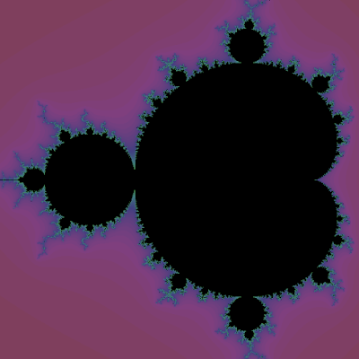

I have always liked the concept of fractal. They are very beautiful, they have a notion of infinity embedded in them, and they make no sense (seriously though, _self-similarity_?). How could they not be loved?

===

Despite being fond of fractals, I had never understood them because I didn't know how to mathematically define one. I knew how to draw some, for example the [snowflake](https://en.wikipedia.org/wiki/Koch_snowflake) or the [Sierpinski triangle](https://en.wikipedia.org/wiki/Sierpinski_triangle), but drawing a fractal and mathematically defining it aren't quite the same thing...

Enlightenment struck after watching [this](https://www.youtube.com/watch?v=NGMRB4O922I) video from Numberphile about the mandelbrot set, the fractal I presented above. After all, a fractal like this was not but a simple formula and a check for a bound on a sequence! I recommend all of you to watch that video.

To decide if a complex number $c$ belongs to the fractal or not, you define $f(x) = x^2 + c$ and then you look at the sequence $c, f(c), f(f(c)), f(f(f(c))), ...$. If the modulus of these numbers stays bounded, then $c$ belongs to the mandelbrot set. If these numbers keep on growing in modulus, then $c$ does not belong to the set.

After learning how to create the mandelbrot set I put that knowledge to practice, making use of Python. At first I wrote [this](https://drive.google.com/open?id=0ByBeLS6ciLYVWm9yMldrVE1GVDg) piece of code, but I quickly realised it had a major flaw: as you zoomed in, the fractal became round, which is **not** supposed to happen. The problem lied in the way I tried to check if a pixel belonged to the set or not: I created the sequence as described in the video and above, and I would check if the 50th term was already _"too big"_ or not. As you zoom in around the border of the fractal, the points in those regions take more iterations to _"explode"_ and hence checking the $50$th term didn't provide enough information.

To try and fix that, I created a [second version](https://drive.google.com/open?id=0ByBeLS6ciLYVOU9SdGQzdTI5Ylk) of the script for which the iteration I check depends on the zoom level, so that as I keep zooming in, I calculate more terms of the sequences before deciding if the points are inside the mandelbrot set or not. The obvious downside to this is that, as you zoom in, the fractal takes more time to be rendered.

The scripts were written in Python3 and make use of pygame (probably 1.9.2). You can also find a Windows executable [here](https://drive.google.com/open?id=0ByBeLS6ciLYVc09ZQllMcW94R2s), which is inside the zipped folder. The executable opens a 600x600 window with the fractal. Clicking the fractal zooms it in, around the point you clicked.