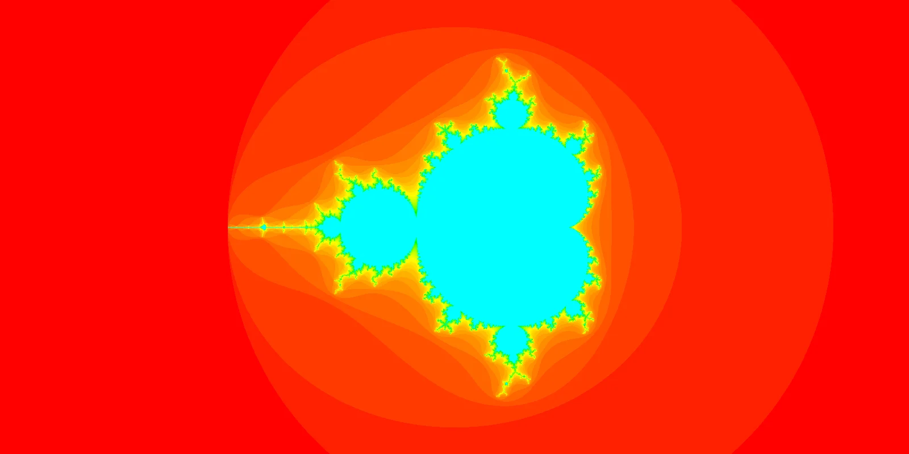
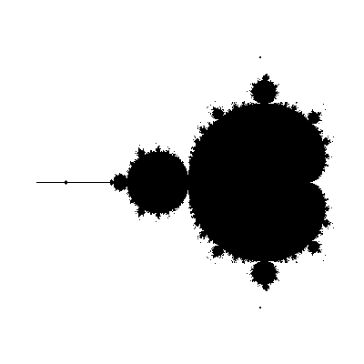
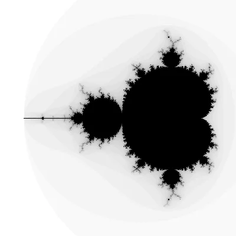

I have always liked the concept of fractal. They are very beautiful, they have a notion of infinity embedded in them, and they make no sense (seriously though, _self-similarity_?). How could they not be loved?

===

# Fractals and the Mandelbrot set



Despite being fond of fractals, I had never understood them because I didn't know how to mathematically define one.
I knew how to draw some, for example the [snowflake](https://en.wikipedia.org/wiki/Koch_snowflake) or the [Sierpinski triangle](https://en.wikipedia.org/wiki/Sierpinski_triangle), but drawing a fractal and mathematically defining it aren't quite the same thing...

Enlightenment struck after watching [this](https://www.youtube.com/watch?v=NGMRB4O922I) video from Numberphile about the Mandelbrot set, the fractal I presented above.
After all, a fractal like this was not but a simple formula and a check for a bound on a sequence!
I recommend to all of you that you watch that video.

To decide if a complex number $c$ belongs to the fractal or not, you define $f(x) = x^2 + c$ and then you look at the sequence $c, f(c), f(f(c)), f(f(f(c))), ...$.
If the absolute value of these numbers stays bounded, then $c$ belongs to the Mandelbrot set.
If these numbers keep on growing in absolute value, then $c$ does not belong to the set.

After learning how to create the Mandelbrot set I put that knowledge to practice, making use of Python.

The script below uses `pygame` to create a simple rendering of the Mandelbrot set.
The image will be black and white and you need to use <kbd>Ctrl</kbd> + </kbd>C</kbd> to stop the script after you're done looking at the image.

```py
import pygame


WIDTH = HEIGHT = 400

screen = pygame.display.set_mode((WIDTH, HEIGHT))


def f(z, c):
    return z**2 + c


MAX_ITER = 50
for x in range(WIDTH):
    for y in range(HEIGHT):
        re = 3 * x / WIDTH - 2.3
        im = 3 * y / HEIGHT - 1.5
        z = c = complex(re, im)
        iter = 0
        while iter < MAX_ITER and abs(z) < 2:
            z = f(z, c)
            iter += 1

        if abs(z) < 2:
            screen.set_at((x, y), pygame.Color(0, 0, 0))
        else:
            screen.set_at((x, y), pygame.Color(255, 255, 255))

pygame.display.flip()
pygame.image.save(screen, "bw.png")

while True:
    for ev in pygame.event.get():
        pass
```

This will open said pygame window and it will save an image `bw.png` with the rendering:




To make this slightly more interesting, we can create a list with shades of gray and assign each shade to an iteration number, so that the colour a pixel is coloured in depends on how quickly the `while` loop was broken.
To achieve this, we need to modify the middle section of the code:

```py
# We added this.
GRAYS = list(
    reversed(
        [pygame.Color(*(int(255 * i / MAX_ITER),) * 3) for i in range(MAX_ITER + 1)]
    )
)


for x in range(WIDTH):
    for y in range(HEIGHT):
        re = 3 * x / WIDTH - 2.3
        im = 3 * y / HEIGHT - 1.5
        z = c = complex(re, im)
        iter = 0
        while iter < MAX_ITER and abs(z) < 2:
            z = f(z, c)
            iter += 1

        screen.set_at((x, y), GRAYS[iter])  # <-- Modified here.

pygame.image.save(screen, "gray.png")  # <-- Save with a new name.
```

This produces the following rendering:




To make this even more colourful, we can do all sorts of crazy things.
I played around with lots of lists of colours and I ended up finding this one that I like:

```py
colours = []
for i in range(MAX_ITER + 1):
    c = pygame.Color(0, 0, 0)  # Irrelevant RGB values.
    c.hsla = (180 * (i / MAX_ITER) ** 0.8, 100, 50, 100)
    colours.append(c)
```

This palette produces the much more colourful version you can find below:


Here is the full code, with the dimensions used to generate the thumbnail for this article:

```py
import pygame


WIDTH = 1600
HEIGHT = 800

screen = pygame.display.set_mode((WIDTH, HEIGHT))


def f(z, c):
    return z**2 + c


MAX_ITER = 50

# GRAYS = list(
#     reversed(
#         [pygame.Color(*(int(255 * i / MAX_ITER),) * 3) for i in range(MAX_ITER + 1)]
#     )
# )

colours = []
for i in range(MAX_ITER + 1):
    c = pygame.Color(0, 0, 0)  # Create a colour instance.
    c.hsla = (180 * (i / MAX_ITER) ** 0.8, 100, 50, 100)
    colours.append(c)


for x in range(WIDTH):
    for y in range(HEIGHT):
        re = 6 * x / WIDTH - 3.5
        im = 3 * y / HEIGHT - 1.5
        z = c = complex(re, im)
        iter = 0
        while iter < MAX_ITER and abs(z) < 2:
            z = f(z, c)
            iter += 1

        screen.set_at((x, y), colours[iter])

pygame.display.flip()
pygame.image.save(screen, "thumbnail.png")

while True:
    for ev in pygame.event.get():
        pass
```


## Next steps

There are plenty of things you can do if you want to keep exploring this world.
Some ideas include:

 - add zoom to your rendering when the user clicks;
 - explore other colour paletters;
 - look into producing high-definition renderings; and
 - learn about [the Julia set](/blog/julia-set).
