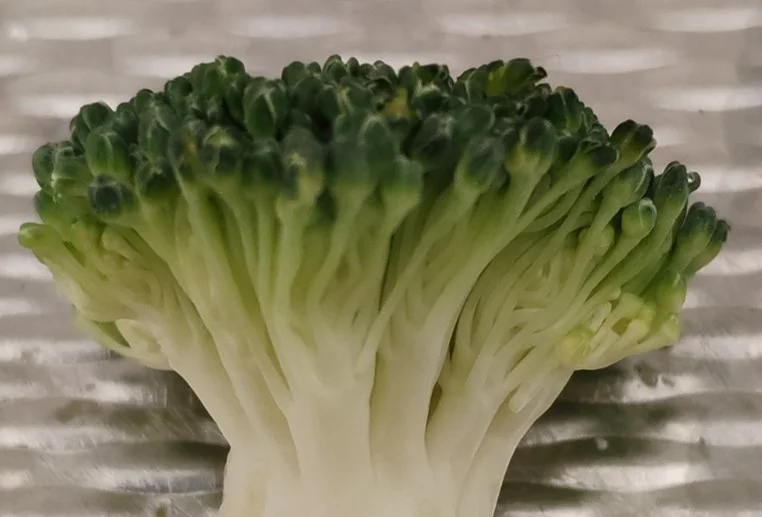
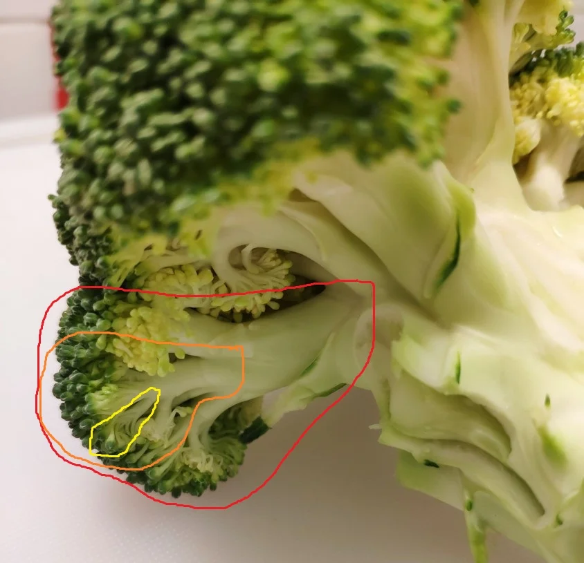

This post shows how fractals occur naturally in broccoli, one of my favourite vegetables.

===

# Mathy broccoli

This post is about showing you how mathematics is beautiful and how it occurs naturally in the world around us. In two previous posts ([here](https://mathspp.com/blog/julia-set) and [here](https://mathspp.com/blog/mandelbrot-set)), I talked about fractals. Today, I am going to do the same thing — except now, I will use broccoli as the example instead of some weird set on the complex plane!

Here's an image with two broccoli poorly edited into the image:

Which one is bigger? There are only two possible answers:

1. Exhibit **A** is bigger.
2. Exhibit **B** is smaller.

Right? **WRONG!** [Don't be fooled like Joey!](https://www.youtube.com/watch?v=QVCmWVD-NH4) Options 1 and 2 are the same...

Going back to the matter at hand, which one is bigger? The right answer is exhibit **A**, but I don't really expect you to get that. The actual question is: how much bigger is **A** compared to **B**?

In fact, **B** was "removed" from inside **A**! But they both look like perfectly fine broccoli, right? This is one of the properties of fractals: self-similarity. Fractals usually exhibit this very interesting behavior: you keep zooming in, and the things you see while you zoom in still look like the original one! (For example, in [this video](https://www.youtube.com/watch?v=pCpLWbHVNhk), we are zooming in on the [Mandelbrot set](https://mathspp.com/blog/mandelbrot-set); by second 13, we get the same shape with which we started!)

I'll show you the two pictures again, but this time without the background removed—you can use it to get a relative scale of the two images.

This self-similarity can also be seen from a recursive point of view, by which I would define *broccoli* this way:

> *Broccoli*: a green vegetable composed of a stalk and smaller broccoli.

If you take a moment to think about it, this is exactly what is going on! Broccoli is the vegetable that has smaller versions of itself on top of a stalk.

Of course, I went even further, and from within **B**, I removed this:

At this point, everything is so small that Mother Nature never bothered to finish up the details, so there isn’t much more zooming I could do.

Now let us zoom out. I started out with this:

Then I extracted exhibit **A**, then I got exhibit **B** from it, and from it, I got *Broccoli Jr. Jr. Jr.*.

As a final image, I outlined the self-similar pattern of broccoli. Next time you eat broccoli, take the time to appreciate the fractals you are eating!

