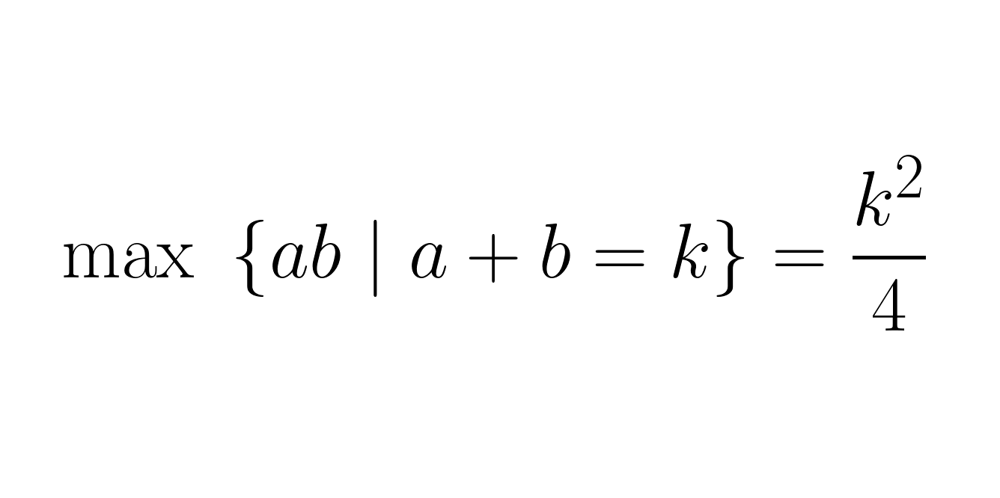

---
metadata:
    description: In this twitter proof I show how to maximise the product of two terms whose sum is fixed.
title: 'Twitter proof: maximising the product with a fixed sum'
---

Let's prove that if you want to maximise $ab$ with $a + b$ equal to a constant value $k$, then you want $a = b = \frac{k}{2}$.

===

<blockquote class="twitter-tweet">
Twitter proof: Take s = k/2. If a = s+h then b = s-h, from which we get that ab = (s+h)(s-h) = s^2 - h^2. Because we know h^2 &gt;= 0, ab is maximised when h = 0, that is a = b = s = k/2.<a href="https://t.co/9ypegSMF2F">https://t.co/9ypegSMF2F</a>
&mdash; Mathspp (@mathsppblog) <a href="https://twitter.com/mathsppblog/status/1324435707918721025?ref_src=twsrc%5Etfw">November 5, 2020</a></blockquote>

Do you have an idea for a twitter proof? Let me know in the comments below!
