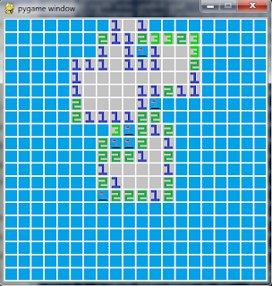

Minesweeper has to be one of the most well-known minigames of all time, no? I spent my fair share of Sunday mornings playing minesweeper in my Windows XP computer...

===

I made a remake of Minesweeper when I was trying to sharpen my Python skills and you can see above a screenshot of my version of the game.

You can find the code in [this GitHub repo](https://github.com/RojerGS/minigames/tree/master/minesweeper) GitHub repo, where you can also find a Windows executable.

The game is fairly easy to play:

 - The objective is to find all of the mines.
 - Using the left mouse button reveals what is beneath the cell clicked. Clicking a mine means game over.
 - If you are sure of the location of a mine, use the right mouse button to flag it.
 - A numbered cell indicates how many mines are present in its neighbouring cells.