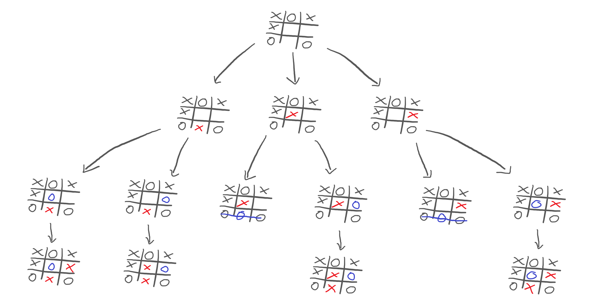
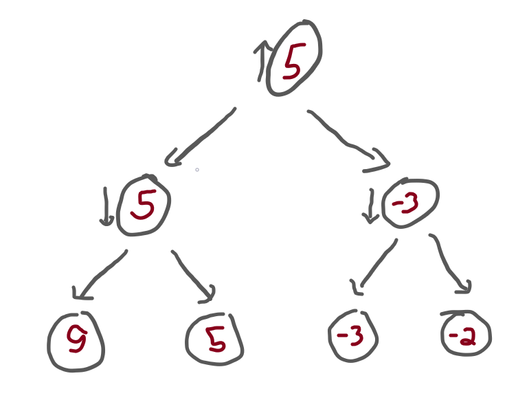
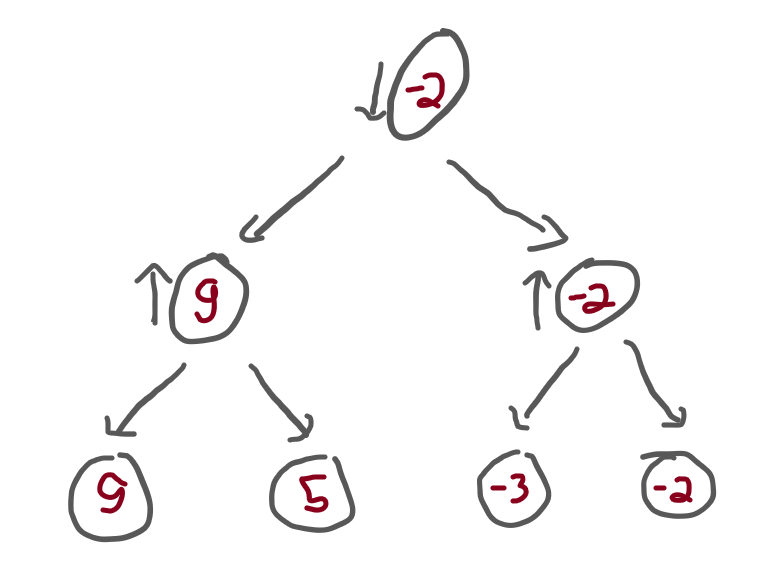

This article will teach you about the minimax algorithm and alpha-beta pruning, from a beginner's perspective.

===


## Introduction

This article aims at providing the reader with an introduction to the minimax search algorithm,
and to alpha-beta pruning – an optimisation over that same algorithm.

I am writing this article as a complete beginner with regards to this topic,
which hopefully will benefit you and me:

 - it will benefit me because, in order to write a good article,
 I will have to push myself to really understand the algorithms; and
 - it will benefit you because, as I am a beginner in this topic,
 I will be extra careful to explain all the little details.

The article will introduce the theoretical concepts needed to understand the minimax algorithm,
as well as the alpha-beta pruning optimisation.

I will be implementing the algorithms in Python.
Feel free to join me in writing some Python code,
do it in any other language you prefer,
or just skip the coding parts altogether!

On top of this, we will be taking a look at these algorithms from the perspective
of a game.
That is, we want to implement these algorithms so that we can use them
as artificial intelligence algorithms to play games against humans.
Therefore, the language I will be using will also revolve around that:
“players”, “moves”, “scores”, “winning/losing”, etc.

So, without further ado, let's start!


## Prior knowledge

Like I just said, I am a complete beginner at this topic.
The only things I have done are as follows:

 - I read [this][ab-wiki] Wikipedia article; and
 - watched two YouTube videos at 2× speed.

If you only want to watch one, I recommend you watch [this one][yt-recommended].
If you have the time and patience to watch both,
then start with [this one][yt-2nd-recommended] and only then watch [this][yt-recommended].


## The minimax algorithm

The minimax algorithm is the algorithm around which this whole article revolves,
so it is best if we take some time to really understand it.

In a short, but unhelpful sentence, the minimax algorithm
tries to maximise my score,
while taking into account the fact that you will do your best
to minimise my score.

Suppose that you and me are playing Tic Tac Toe, I'm the crosses (`X`),
it's my turn to play, and the game looks like this:


I have to pick a move and, for that, I analyse all of my possibilities:


So, I play out these three moves inside my head, and I see that none of the moves gives me a win.
Therefore, there is no obvious choice that I should make.

What does this mean?
It means I need to keep playing out the moves inside my head,
and I need to predict what you would do in each situation:


Now, this reveals something interesting!
If we look at the third and fifth games of the bottom row, we see that you could win the game:


This shows that we probably don't want to go down those paths!
But you and me are humans, and we are taking a look at the whole drawing all at once.
Let's just play out the rest of the other alternative games to see what could happen:



Now that we played out the _whole_ game in our heads, we need to see what choices each
player will make.
This is straightforward:

 - I want to play what is best for me; I want to maximise my score, because I want to win; and
 - you want to play what is worst for me; you want to minimise my score, because you want me to lose.

So, in order to evaluate all these alternatives, I have to start at the bottom.
If I manage to reach any of the games in the fourth row, we will end in a draw:


Now, I need to evaluate the game positions in the third row.
In other words, I need to look at the third row,
and figure out how good each position is for myself.
What does that depend on?
It depends on how well I can do _after_ we reach that position.

What we see is that some games in the third row will result in a draw and some in a loss for me:


Now, I need to go up one level and examine the games in the second row.
Remember, all I am doing is trying to figure out what move I should make.
In order to do that, I played out all possibilities in my head,
and am now trying to predict how you will play.

If I want to examine the positions in the second row, now I have to think like _you_!
Why is that?
Because the arrows from the second row to the third represent _your_ moves.
What does that mean?
It means that _I_ am the one who chooses to which position of the second row we go,
but _you_ are the one who picks where to go next!

For example, if I decide to make the middle move, what would you do in response?


If I decide to make the middle move, then we can ignore the left and right parts of the sketch,
and you can focus on only two positions from the third row.
One of them makes me lose, the other one ends in a draw.
Which one do you pick?

The one that makes me lose, obviously!

Therefore, when I examine the second row, I need to figure out what's the worst-case scenario, _for me_,
for each position.
Why?
Because if we do go to that position in the second row, I know you will pick what is best for you/worst for me.

This means that the second row of the diagram ends up looking like this:


Finally, this diagram brings some clarity!
Now I understand that:

 - if I make the move on the left, the game ends in a draw;
 - if I make the centre move, I lose; and
 - if I make the move on the right, I lose.

Thus, the obvious choice is to go with the move on the left.


## Tree structure abstraction

In order to practise what we are still trying to grasp about the minimax algorithm,
we will implement it.
Trying to implement the algorithm will push you towards understanding, so let's do it.

In order to focus on the details of the minimax algorithm,
we will abstract away the context of a game,
and instead will focus on the tree structure of the sketch I showed above.

Let me take the sketch above and refactor it:


I replaced all the specific drawings by circles.
When it is my turn, the circle has an arrow pointing up:
that's because I want to increase my score as much as possible.
When it is your turn, the circle has an arrow pointing down:
that's because you want to decrease my score as much as possible.

Then, I gave a score of 0 to the positions that ended in a draw
and a score of -1 to the positions that ended in a loss.

What happens next is that we need to make the information flow upwards,
so that I can make a move.
When the information flows upwards, we need to fill in the circles:

 - a circle with an arrow pointing down picks the lowest number below it; and
 - a circle with an arrow pointing up picks the highest number below it.

This corresponds to:

 - you pick the move that is worst for me; and
 - I pick the move that is best for me, respectively.

This is the structure that we want to work with.


## Minimax dummy implementation

In order to solidify our knowledge, let's make a dummy implementation of the minimax algorithm.

To make it as simple as possible, we will implement the minimax algorithm over a tree.
The tree will have nodes that branch out, and it will have terminal positions with fixed values.
Our job is to implement an algorithm that traverses the tree and figures out which moves will be played out.

Here is the simple tree structure, in Python:

```py
class Choice:
    def __init__(self, left, right):
        self.left = left
        self.right = right

class Terminal:
    def __init__(self, value):
        self.value = value
```

With these two classes, we can build a tree like the following:

```py
tree = Choice(
    Choice(
        Terminal(9),
        Terminal(5),
    ),
    Choice(
        Terminal(-3),
        Terminal(-2),
    )
)
```

This corresponds to the following tree:


Now we implement our minimax algorithm.
The algorithm needs to accept the tree root node of the tree structure
_and_ a Boolean flag to tell which one of us is playing.

Why is that?

Because, when I go down the tree, I want to call the function recursively.
As we go down the tree, we switch back and forth between being my turn
or your turn and, as we do that, we switch the objective of the algorithm:

 - when it's my turn, the algorithm is trying to maximise the scores; and
 - when it's your turn, the algorithm is trying to minimise the scores.

Then, this is the structure of the algorithm:

 - if we have a choice, then we need to ask the algorithm to evaluate both branches,
 and we pick the appropriate one;
 - otherwise, just return the value of the terminal.

All in all, the code looks like this:

```py
def minimax(tree, maximising_player):
    if isinstance(tree, Choice):
        lv = minimax(tree.left, not maximising_player)
        rv = minimax(tree.right, not maximising_player)
        if maximising_player:
            return max(lv, rv)
        else:
            return min(lv, rv)
    else:
        return tree.value
```

Notice that we use `not maximising_player` when calling `minimax` recursively
to switch back and forth between the players.

Now, we can call the `minimax` function with the previous `tree`, and see what we get.
If we start by saying that `maximising_player = True`,
that means that the top of the tree has an arrow pointing up.
In that case, the result should be `5`:



If we call `minimax` with `maximising_player = False`,
that means that the top of the tree has an arrow pointing down.
In that case, the result should be `-2`:



To check this, add the two calls to your script and run it:

```py
print(minimax(tree, True))
print(minimax(tree, False))
```


## A better minimax

The dummy minimax algorithm we implemented above worked on trees with a very specific structure.
Now we will try to make it slightly more generic,
by allowing tree nodes to have an arbitrary number of children.

For that, we can start by improving the classes that represent the tree structure:

```py
class Tree:
    def __init__(self, children):
        self.children = children

class Terminal(Tree):
    def __init__(self, value):
        # A terminal state is a tree with no children:
        super().__init__([])
        self.value = value
```

Now that each tree may have multiple subtrees, we can no longer evaluate the left and right
subtrees by hand.
Instead, we need to use a `for` loop to traverse all the subtrees.
We also need to distinguish between the case when we are maximising and minimising:

```py
def minimax(tree, maximising_player):
    if isinstance(tree, Terminal):
        return tree.value

    if maximising_player:
        max_ = float("-inf")
        for subtree in tree.children:
            max_ = max(minimax(subtree, not maximising_player), max_)
        return max_

    else:
        min_ = float("+inf")
        for subtree in tree.children:
            min_ = min(minimax(subtree, not maximising_player), min_)
        return min_
```

However, we can see that there is some duplicated code.

What we need to do is realise that the code under the `if` statement
has the exact same structure as the code under the `else`,
it's just that we start with a different value and use a different function
to update the running value.

By noticing that, we can rewrite the function to look like this:

```py
def minimax(tree, maximising_player):
    if isinstance(tree, Terminal):
        return tree.value

    val, func = (float("-inf"), max) if maximising_player else (float("+inf"), min)
    for subtree in tree.children:
        val = func(minimax(subtree, not maximising_player), val)
    return val
```

The code above uses a [conditional expression][pydont-cond-expr] to initialise
the running value and the function that we use to update the value.
The `for` loop that follows has the same structure that the two loops
in the previous version of `minimax`.

Personally, I would go one step further and rewrite the function as

```py
def minimax(tree, maximising_player):
    if isinstance(tree, Terminal):
        return tree.value

    v, f = (float("-inf"), max) if maximising_player else (float("+inf"), min)
    return f((minimax(sub, not maximising_player) for sub in tree.children), default=v)
```

Or, now that I did, maybe I wouldn't..?
If you want to study Python, try to understand why this function
still works.

Now, what we need to do is test our generic `minimax` function.

Let's create a tree:

```py
tree = Tree([
    Tree([
        Tree([
            Terminal(3),
            Terminal(4),
        ]),
        Tree([
            Terminal(8),
            Tree([
                Terminal(-2),
                Terminal(10),
            ]),
            Terminal(5),
        ])
    ]),
    Terminal(7),
])
```

which corresponds to this tree:


Now, take your time to walk through this tree and figure out what
should be the result of applying the `minimax` algorithm
to the tree, both as the maximising player and _not_ as the maximising player.

This is what you should get:

```py
print(minimax(tree, True))      # 7
print(minimax(tree, False))     # 5
```


## Alpha-beta pruning rationale

Now that we have a basic understanding of the minimax algorithm,
let's introduce the alpha-beta pruning optimisation.

But first, why?

So far, we only applied the minimax algorithm to very small trees.
For trees of this size, the algorithm has no trouble going
through the whole tree.
However, suppose we were playing chess.

In chess, players can generally make plenty of different moves,
which means that the trees that I have been drawing would get
very huge, very fast.
On top of that, chess matches last for much longer than just three or four moves,
which means that the trees can also get very deep.

In short, it is a _lot_ of work to traverse the whole tree.

Having said this, it would be nice if we could optimise our minimax algorithm in some way.
For example, what if we managed to avoid traversing certain parts of the tree,
if we know those parts are irrelevant?
That would be great!

But how could we ever realise that a certain part of the tree is irrelevant..?

Let's look at the heterogeneous tree from before,
from the point of view of the maximising player:


And now that we are looking at the tree, let's try to evaluate the tree.
We will start at the bottom left, where there is a node that is maximising,
and gets to choose between a `3` and a `4`.
Obviously, that node picks the `4`:


Now it's time to evaluate the node to the right of that one,
which I highlighted here:


Not only did I highlight the next node, but I also drew a little arrow
from the terminal value `8` to that highlighted node.
Think with me:

 - the highlighted node is a maximising node; and
 - the terminal value `8` is connected to the highlighted node.

Therefore, we _know_ that the highlighted node will evaluate
to `8` _or higher_.

However, the node immediately above is a minimising node:


What can we tell, then?
We already know that the minimising node will pick the path on the left!
Why?
Because that node wants to minimise the score, and it has two alternatives:

 - it goes left, picking a path worth `4`; or
 - it goes right, picking a path that is worth `8` or more!

If you want to keep the score as low as possible, what alternative do you pick?
The first one, of course!
And, in doing this, you managed to completely ignore a portion of the tree:


_This_ is the essence of alpha-beta pruning!


## Challenges

The intuitive explanation of alpha-beta pruning is, well,
fairly intuitive.
Now, we need to turn it into something objective,
so that we can translate it into code.

In the example above, why were we able to ignore a part of the tree?
We managed to ignore a part of the tree because, at some point,
we realised that the maximising node would result in a move that is
too good for the minimising node immediately above,
which already knows of a move that has a lower score.

Slow down and re-read the paragraph above, please.

To make sure you understand, here is a small tree:


The root node is seen from the maximiser's perspective,
there is a terminal node on the left (represented by the question mark) and there is a subtree to the right.

In turn, that subtree is seen from the minimiser's perspective and
has a terminal node on the left, whose value is 5.
To its right, the remainder of the subtree is represented by an ellipsis (“...”).

**Question**: what value(s) could the `?` have,
which would allow us to completely ignore the “...” subtree to the right,
after we find the terminal node of value 5?

I'll help you out.
The minimiser node sees a 5, so what do we know?
We know that the minimiser node will evaluate to 5 _or less_:


Immediately above it, is a maximiser node, who already visited the `?` node.
The maximiser node has two options:

 - it goes with the option on the left, which is worth `?`; or
 - it goes with the option on the right, which is worth 5 _or less_.

If it happens that `?` is better than a _5 or less_,
then we can ignore the “...” subtree and just go with the option on the left!

In other words, `?` can be any value larger than 5:


Was this easy?
If not, re-read it carefully, grab a pen and a piece of paper,
and make the drawings, the arrows, etc.

Let's try another one (bear with me, these two exercises are handy!):


In this new exercise, the root node is seen from the minimiser's perspective, and contains two children.
On the left, a terminal node with an unknown value.
On the right, a subtree.

In turn, the subtree is seen from the maximiser's perspective,
and contains three children:

 - a terminal of value 5;
 - a terminal of value 7; and
 - a subtree “...” that was omitted from the drawing.

**Question**: what values can the subtree `?` have so that these
two restrictions apply:

 - the algorithm has to keep going after it finds the 5; and
 - the algorithm can stop after it finds the 7.

Let's work this out.
When we first reach the terminal 5, we know that the maximiser node will evaluate to 5 or more:


The maximiser node is 5 or more, but we don't want the algorithm to stop.
The algorithm would be able to stop if 5 were already too large
when compared to `?` because, in that case,
the minimiser node would know that going left is always better.
Therefore, `?` has to be greater than 5:


If you can't see why, imagine that the terminal node is less than 5.
For example, imagine it's 4.
Then convince yourself that, in that case, the algorithm could stop
as soon as the 5 is hit.

Alright, so if the left terminal is greater than 5, the algorithm
doesn't stop and then looks at the 7.
When it does, it realises that the maximiser node will evaluate
to 7 _or more_:


But, at this point, we wanted our algorithm to be able to stop.
Therefore, the terminal node on the far left can't be _that_ high.
It had to be high enough so that the 5 wouldn't stop the algorithm,
but it has to be low enough so that the 7 _can_ stop the algorithm!

Therefore, if the left terminal has a value between 5 (exclusive) and 7 (inclusive), we satisfy the restrictions of my problem statement.

For example, if the left terminal had a value of 6,
then the restrictions of the problem statement would be satisfied:


## Alpha and beta

These two exercises we just did had us thinking about the algorithm
in an interesting way:
we were thinking about what the algorithm _had to have seen_
earlier on, so that it could stop at a particular point in time.

Both exercises had the same focus:
when evaluating a node $n$,
when can I know the node above will never pick $n$?
From the exercises above, we figured this out:

 - if a minimising node $n$ has a value of $v$ or lower,
 and the maximising node above knows a path with a value greater than or equal to $v$, then we can stop; and, similarly,
 - if a maximising node $n$ has a value of $v$ or higher,
 and the minimising node above knows a path with value less than or equal to $v$, then we can stop.

So, for us to be able to optimise our minimax algorithm,
we need to find a way to keep track of two things:

 - when we are inside a minimising node, we need to know what's the value of the highest node that the maximising node above has seen; and
 - when we are inside a maximising node, we need to know what's the value of the lowest node that the minimising node above has seen.

I know this is too many words, so let's focus on one case:

If a minimising node $n$ has a value of $v$ or lower,
and the maximising node above knows a path with a value greater than or equal to $v$, then we can stop.

Therefore, when we are inside a minimising node, we need to know what's the value of the highest node that the maximising node above has seen.

This is what we call “alpha” ($\alpha$), in _alpha_-beta pruning.

$\alpha$ will be the best value that a maximiser node has found elsewhere.
(The “best” value of a maximiser is also the _highest_.)

When we are inside a minimising node, we run through its children,
evaluating them, and updating the value $v$ to always be
the lowest one found so far.
If, at any point in time, $v \leq \alpha$, we can stop.

We can stop because we know that the maximiser node above
will have an option that is worth $\alpha$.
If the current minimiser has a value of $v$, that can only go down
(because we are in a minimising node), then we can save ourselves
the trouble to trying to get $v$ to be even lower.
We will never go down that subtree, either way.

In contrast, we use “beta” ($\beta$) to keep track of the lowest
option that a minimiser node has found so far.
When a maximiser node finds its value above $\beta$, we can stop.


## Implementing alpha-beta pruning

The first step to implementing alpha-beta pruning is modifying
the `minimax` algorithm so that it also accepts values
for `alpha` and `beta`,
which can have default values of $-\infty$ and $+\infty$, respectively:

```py
def pruning(tree, maximising_player, alpha=float("-inf"), beta=float("+inf")):
    ...
```

Then, we need to make sure that these values are passed down the recursion calls:

```py
def pruning(tree, maximising_player, alpha=float("-inf"), beta=float("+inf")):
    if isinstance(tree, Terminal):
        return tree.value

    val, func = (float("-inf"), max) if maximising_player else (float("+inf"), min)
    for subtree in tree.children:
        val = func(pruning(subtree, not maximising_player, alpha, beta), val)
    return val
```

But these are useless if we never really use them to prune branches of the tree.
So, we can do the checks that we talked about earlier:

 - in a maximising node, we can see if the value is too high when compared to `beta`; and
 - in a minimising node, we can see if the value is too low when compared to `alpha`.

This gives us this code:

```py
def pruning(tree, maximising_player, alpha=float("-inf"), beta=float("+inf")):
    if isinstance(tree, Terminal):
        return tree.value

    val, func = (float("-inf"), max) if maximising_player else (float("+inf"), min)
    for subtree in tree.children:
        val = func(pruning(subtree, not maximising_player, alpha, beta), val)
        if (maximising_player and val >= beta) or (not maximising_player and val <= alpha):
            break
    return val
```

This implements the logic to prune the branches, but it won't prune anything yet.
Why not?
Because we never update `alpha` and `beta`, that's why!
Updating them is similar to updating `val`,
we just need to distinguish between the maximising/minimising cases:

```py
def pruning(tree, maximising_player, alpha=float("-inf"), beta=float("+inf")):
    if isinstance(tree, Terminal):
        return tree.value

    val, func = (float("-inf"), max) if maximising_player else (float("+inf"), min)
    for subtree in tree.children:
        val = func(pruning(subtree, not maximising_player, alpha, beta), val)
        if maximising_player:
            alpha = max(alpha, val)
        else:
            beta = min(beta, val)
        if (maximising_player and val >= beta) or (not maximising_player and val <= alpha):
            break
    return val
```

And that's it!
We can make it cleaner, but let's take it for a test drive.

First, let's make sure that it gives the correct results:

```py
tree = Tree([
    Tree([
        Tree([
            Terminal(3),
            Terminal(4),
        ]),
        Tree([
            Terminal(8),
            Tree([
                Terminal(-2),
                Terminal(10),
            ]),
            Terminal(5),
        ])
    ]),
    Terminal(7),
])

print(pruning(tree, True))      # 7
print(pruning(tree, False))     # 5
```

Now, we need to make sure that it _actually_ prunes a couple of things.
We can check that with ease.

First, implement the dunder method `__str__` on the `Tree` and `Terminal` classes.
This allows them to be printed in a nice way:

```py
class Tree:
    def __init__(self, children):
        self.children = children

    def __str__(self):
        return f"Tree({', '.join(str(sub) for sub in self.children)})"

class Terminal(Tree):
    def __init__(self, value):
        super().__init__([])
        self.value = value

    def __str__(self):
        return f"T({self.value})"
```

! If you need to read up on what `__str__` does, take a look at [this Pydon't article][pydont-str].

With this in place, printing the `tree` above should result in this:

```py
print(tree)
## Tree(Tree(Tree(T(3), T(4)), Tree(T(8), Tree(T(-2), T(10)), T(5))), T(7))
```

Now, we add a `print(tree)` statement at the top of the `pruning` algorithm.
This way, we can see what trees/terminals are being visited by the function:

```py
def pruning(tree, maximising_player, alpha=float("-inf"), beta=float("+inf")):
    print(tree)
    ...
```

Remember that, in the maximising case, we could avoid visiting a subtree:


For example, the terminal with value 10 should never be visited.
Let's run the algorithm as the maximising player,
and see what the output is:

```py
print(pruning(tree, True))
""" Output is:
Tree(Tree(Tree(T(3), T(4)), Tree(T(8), Tree(T(-2), T(10)), T(5))), T(7))
Tree(Tree(T(3), T(4)), Tree(T(8), Tree(T(-2), T(10)), T(5)))
Tree(T(3), T(4))
T(3)
T(4)
Tree(T(8), Tree(T(-2), T(10)), T(5))
T(8)
T(7)
7
"""
```

In the output above, each line corresponds to a recursive call.
When the output just looks like `T(?)`, that's because we reached a terminal... and, as you can see, a couple of terminals were never visited!

The terminals `T(-2)`, `T(10)`, and `T(5)`, were never visited!
The tree `Tree(T(-2), T(5))` was also never visited, as expected.

Amazing!


## Refactoring the alpha-beta pruning implementation

The algorithm is working just fine,
but it doesn't look as good as it could!

Yet!

The first thing we can do is refactor the condition that allows us to break out of the loop:

```py
def pruning(tree, maximising_player, alpha=float("-inf"), beta=float("+inf")):
    ...
    for subtree in tree.children:
        ...
        if maximising_player:
            alpha = max(alpha, val)
        else:
            beta = min(beta, val)
        if (maximising_player and val >= beta) or (not maximising_player and val <= alpha):
            break
    return val
```

Notice that when we are the maximising player,
`alpha` keeps getting updated to get increasingly higher values,
that come from `val`.
Then, we check if `val >= beta`.
When we are _not_ the maximising player,
`beta` keeps getting updated to get increasingly lower values,
that come from `val`.
Then, we check if `val <= alpha`.

We can combine these two cases together,
and just write `beta <= alpha`:

```py
def pruning(tree, maximising_player, alpha=float("-inf"), beta=float("+inf")):
    if isinstance(tree, Terminal):
        return tree.value

    val, func = (float("-inf"), max) if maximising_player else (float("+inf"), min)
    for subtree in tree.children:
        val = func(pruning(subtree, not maximising_player, alpha, beta), val)
        if maximising_player:
            alpha = max(alpha, val)
        else:
            beta = min(beta, val)
        if beta <= alpha:
            break
    return val
```

By the way,
now that we have an explicit `if maximising_player` statement,
we can get rid of the assignment to `func`:

```py
def pruning(tree, maximising_player, alpha=float("-inf"), beta=float("+inf")):
    if isinstance(tree, Terminal):
        return tree.value

    val = float("-inf") if maximising_player else float("+inf")
    for subtree in tree.children:
        sub_val = pruning(subtree, not maximising_player, alpha, beta)
        if maximising_player:
            val = max(val, sub_val)
            alpha = max(alpha, sub_val)
        else:
            val = min(val, sub_val)
            beta = min(beta, sub_val)
        if beta <= alpha:
            break
    return val
```


## Conclusion

### Overview

In this article, you:

 - explored a game scenario as a tree with branches representing possible moves;
 - learned the minimax algorithm;
 - implemented the minimax algorithm for:
   - homogeneous tree structures; and
   - trees with an arbitrary number of children.
 - understood _when_ the minimax algorithm can save time;
 - solved challenges that made you think about the values that we want to keep track of in the alpha-beta pruning algorithm;
 - implemented the alpha-beta pruning algorithm; and
 - verified that your implementation is able to prune irrelevant search paths.

### Next steps

We implemented alpha-beta pruning over explicit trees,
but I said I wanted to use this to play games.

Therefore, I need to implement a game,
and then create an abstraction that allows
the alpha-beta pruning algorithm to work its magic without having
to worry about the exact game that we implemented.

Then, we piece everything together!

This will be material for a couple of future articles,
so [subscribe][subscribe] to my newsletter not to miss them.


[pydont-cond-expr]: /blog/pydonts/conditional-expressions
[pydont-list-comp]: /blog/pydonts/list-comprehensions-101
[pydont-str]: /blog/pydonts/str-and-repr
[subscribe]: /subscribe

[ab-wiki]: https://en.wikipedia.org/wiki/Alpha%E2%80%93beta_pruning
[yt-recommended]: https://www.youtube.com/watch?v=l-hh51ncgDI
[yt-2nd-recommended]: https://www.youtube.com/watch?v=xBXHtz4Gbdo
