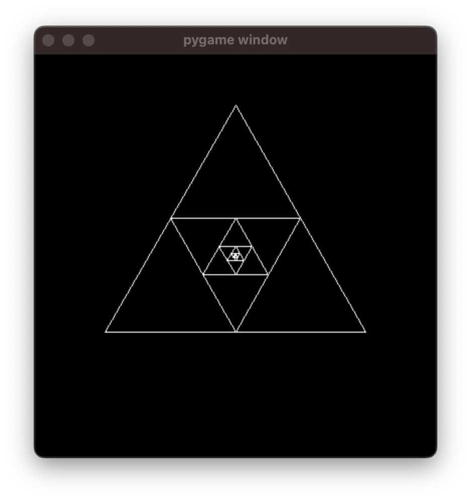

Create a zooming animation from first principles in Python. In 5 minutes. Kind of.

===


# (More) Animations from first principles (in 5 minutes)

This is a follow-up to my recent article called [“Animations from first principles (in 5 minutes)”][/blog/animations-from-first-principles-in-5-minutes].
In that article, we created a simple animation with Python and pygame.

In _this_ article, we will create a different type of animation, where we will draw a recursive triangular structure that can be zoomed in indefinitely.
We'll be using Python and `pygame`, so make sure you install it in your preferred way, and make sure it was installed properly:

```pycon
>>> import pygame
pygame 2.5.1 (SDL 2.28.2, Python 3.11.4)
Hello from the pygame community. https://www.pygame.org/contribute.html
```

The code in this article was written with Python 3.11 and `pygame` 2.5.1.
However, it should run well on older versions of Python/`pygame` because we're only using fundamental features that have been around for a while and that are unlikely to go anywhere.


## In 5 minutes?

I have no idea if you can go through this in 5 minutes.
You'll likely need more time if these ideas are new to you and you're typing the code yourself.
However, I did present most of this material in 5 minutes in [a lightning talk at PyCon Portugal](/talks).


## I'll cheat a bit

For this demo, I'll cheat a bit and I will add a little bit of boilerplate for free.
This is a class `Point` that I'm using to represent 2D points.
The idea is to make it easier to add and subtract points, and to multiply and divide points by numbers.

The class `Point` looks like this:

```py
class Point:
    def __init__(self, x, y):
        self.values = (x, y)

    def __add__(self, other):
        x, y = self.values
        x_, y_ = other.values
        return Point(x + x_, y + y_)

    def __sub__(self, other):
        x, y = self.values
        x_, y_ = other.values
        return Point(x - x_, y - y_)

    def __mul__(self, other):
        return Point(self.values[0] * other, self.values[1] * other)

    __rmul__ = __mul__

    def __truediv__(self, other):
        return Point(self.values[0] / other, self.values[1] / other)

    @property
    def length(self):
        return self.values[0] ** 2 + self.values[1] ** 2
```

It uses [arithmetic dunder methods][pydont-arithmetic-dunder-methods] and a [property][pydont-properties], but it is just so I can do operations like `Point(1, 2) + Point(3, 4)` or `3 * Point(1, 0)`.

With this out of the way, let us start!

## Creating the canvas to draw on

Just like last time, we'll start by making sure we can get a black screen in front of us:

```py
import pygame

WHITE = (255, 255, 255)
BLACK = (0, 0, 0)


screen = pygame.display.set_mode((400, 400))
screen.fill(BLACK)


while True:
    pygame.display.flip()
```

The code above fills a 400 by 400 screen with black and then it refreshes it forever.
If you run this program, you'll see a black screen:


To close this window, you'll need to interrupt _the Python shell where you ran your program_.


## Drawing a triangle

We'll start by drawing a triangle, so we'll define the three points that represent the vertices of the triangle and then we'll use the function `pygame.draw.line` to draw the three lines that connect the vertices:

```py
def draw_triangle(screen, points):
    for idx in range(3):
        pygame.draw.line(
            screen,
            WHITE,
            points[idx - 1].values,
            points[idx].values,
        )
```

For `draw_triangle`, we're assuming that the argument `points` is a list of three points that are instances of `Point`.
Then, if we're using instances of `Point`, we use the attribute `values` to access the tuple with the two underlying values:

```pycon
>>> Point(1, 2).values
(1, 2)
```

Then, we use a `for` loop to draw the three edges of the triangle.
We use a tiny little trick, where in the first iteration we have `idx=0`, so the indexing `points[idx - 1]` actually indexes into `points[-1]`, which is the third vertex.
This is a fairly clean way of making sure we draw the three edges in a single loop.

Then, we can define three points for the triangle and then draw it:

```py
class Point:
    ...

import pygame

WHITE = (255, 255, 255)
BLACK = (0, 0, 0)

screen = pygame.display.set_mode((400, 400))
screen.fill(BLACK)


def draw_triangle(screen, points):
    for idx in range(3):
        pygame.draw.line(
            screen,
            WHITE,
            points[idx - 1].values,
            points[idx].values,
        )

triangle = (
    Point(200, 70),
    Point(50, 300),
    Point(350, 300),
)

draw_triangle(screen, triangle)

while True:
    pygame.display.flip()
```

If you run this program, you'll get a nice little triangle:


## Drawing the recursive triangular structure

To draw the recursive triangular structure, the only thing we need to notice is that, given an outer triangle, the inner triangle is given by taking the mid-points of the edges of the outer one.
In other words, if we take the vertices of the outer triangle and compute the averages, we get the vertices of the inner triangle.

Thus, all we need is to implement a recursive function that draws a triangle, computes the middle points, and calls itself recursively.
As the recursion base case, we will stop recursing if the triangle becomes too small.

This is our function:

```py
def recursive_triangle(screen, points):
    if (points[0] - points[1]).length < 3:
        return

    draw_triangle(screen, points)

    mid_points = [
        (points[idx - 1] + points[idx]) / 2
        for idx in range(3)
    ]
    recursive_triangle(screen, mid_points)
```

Now, we change the call to `draw_triangle` with a call to `recursive_triangle`:

```py
# ...

recursive_triangle(screen, triangle)

while True:
    pygame.display.flip()
```

This produces the following drawing:


## Changing the triangle representation

To create a “zooming in” animation, we want to expand the outer triangle at every frame.
Doing this isn't _that_ complicated but it isn't _that_ trivial either.
The challenge here is that the point at the centre of the screen is _not_ the point `(0, 0)`, but `(200, 200)` in our case.
And it only works properly if the triangle is actually centred at the point `(200, 200)`, which it really isn't.

(Try to expand the triangle in this way.
It's an interesting challenge!)

I'll skip over this hurdle and I'll show you another way of going about this.
Instead of representing a triangle as its three vertices, I'll represent the triangle as the distance of the top vertex to the centre of the screen.
Then, because the vertices of an equilateral triangle lie on a circle, we can use just a little bit of trigonometry to compute the two other vertices.

The function `triangle` below takes the distance between the centre of the screen and the triangle vertices and produces the three vertices:

```py
CENTRE = Point(200, 200)

def triangle(length):
    return [
        CENTRE + length * Point(cos(angle), sin(angle))
        for angle in (0, 2 * pi / 3, 4 * pi / 3)
    ]
```

So, we can replace the variable `triangle` with this function, and our code will now look like this:

```py
# ...

CENTRE = Point(200, 200)

def triangle(length):
    return [
        CENTRE + length * Point(cos(angle), sin(angle))  # some trig here.
        for angle in (0, 2 * pi / 3, 4 * pi / 3)  # some trig here.
    ]

length = 150
recursive_triangle(screen, triangle(length))

while True:
    pygame.display.flip()
```

If you run this, you create a drawing like this:


However, this is different from the previous drawing because the triangle is rotated.


## Fixing the triangle angle

The reason the triangle is pointing right, instead of pointing up, is because of how we compute the vertices inside `triangle`, as we go through the three values `(0, 2 * pi / 3, 4 * pi / 3)`, which are three angles (in radian coordinates).

To reorient the triangle, we can add an offset to those angles, which we can introduce as a parameter to the function:

```py
def triangle(length, offset):
    return [
        CENTRE + length * Point(cos(offset + angle), sin(offset + angle))
        for angle in (0, 2 * pi / 3, 4 * pi / 3)
    ]

length = 150
offset = -pi / 2

recursive_triangle(screen, triangle(length, offset))

frame = 0
while True:
    pygame.display.flip()
```

This will produce a triangular structure pointing upwards:




## Animating the zoom and rotation

Now, animating this is the _easy_ part!
For every frame, you change the angle just a little bit and you increase the length just a little bit.
(Don't forget to use `pygame.time.Clock` to make sure the framerate is controlled.)

The code looks like this:

```py
# ...

length = 20  # Start with a shorter length.
offset = -pi / 2

clock = pygame.time.Clock()
while True:
    clock.tick(60)
    screen.fill(BLACK)

    length *= 1.01  # Increase length
    offset += 0.01  # Change offset
    recursive_triangle(screen, triangle(length, offset))

    pygame.display.flip()
```

The new animation looks like this:


## Follow-up challenges

In the previous article I showed [how to create an animation video](/blog/animations-from-first-principles-in-5-minutes#creating-a-video), so go ahead and do that!
An interesting challenge, now, is that if you let this run for long enough, you will get a recursion error...
Can you see why..?
Fixing it is your challenge.
Good luck!


[pydont-arithmetic-dunder-methods]: /blog/pydonts/overloading-arithmetic-operators-with-dunder-methods
[pydont-properties]: /blog/pydonts/properties
