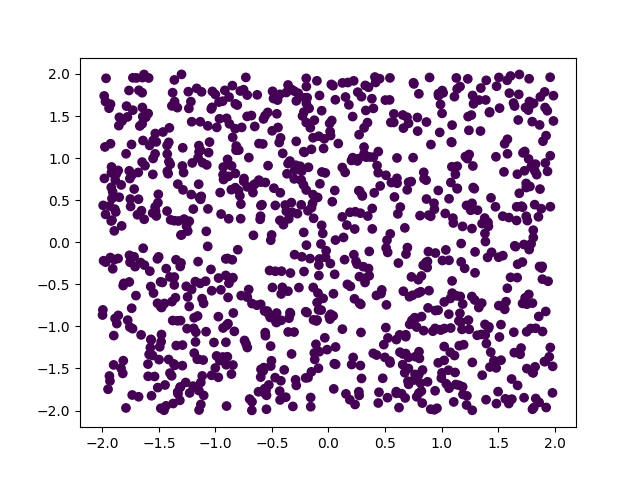
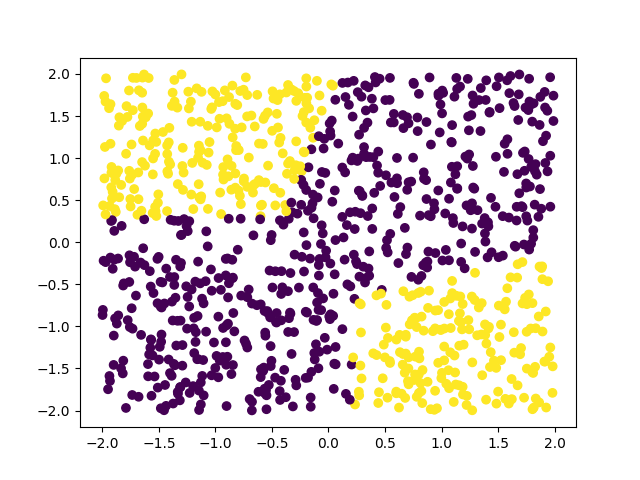

The third article of this short series concerns itself with the
implementation of the backpropagation algorithm, the usual choice
of algorithm used to enable a neural network to learn.

===


# Purpose of this article

In this article we will be deriving and implementing the backpropagation algorithm.
That is, we will be performing the necessary calculations in order to see
how the algorithm works, and then we will implement it.
After the algorithm is implemented, we will run a small test to verify
empirically that it is working.

!!! The code for this article, and for the all articles of the series,
!!! can be found in [this GitHub repository][gh-nnfwp].
!!! This article will build upon [v0.2][gh-nnfwp-v0_2] of that code.
!!!
!!! If you need a refresher on what we built last time, have a quick read
!!! [at the previous article][part2].


# Preamble

I will try my best to write an intuitive explanation of what really happens under the hood,
and at the same time I will include all the mathematics needed to formalise what is really going on.
If I succeed, you will be able to grasp what is going on by reading the intuitive explanations
and you will be able to check I didn't make any mistakes if you check the mathematics.

!!!! The mathematical formalisations will be included inside these notices,
!!!! so feel free to ignore these if you do not care about the mathematics behind everything.

First things first, we need to understand _why_ we need an algorithm like backpropagation.


# Why is backpropagation needed?

A neural network contains _many_ weights and bias which affect the output of the network when you feed it some input.
The whole idea of the neural network model is that

  1. you feed some input to the network and get some output;
  2. you compare this output with what was the expected output;
  3. you tweak the neural network just a _tiny_ bit so that this particular input produces something that is slightly closer to the actual output;
  4. you repeat this for various different inputs, in the hopes that these small improvements compound into really good improvements after a lot of iterations.

!!!! In order to know how to tweak the neural network, we will use derivatives.
!!!! If $L$ is your loss function and $w$ is one of the many weights of the neural network,
!!!! then $\frac{\partial L}{\partial w}$ quantifies how much $L$ changes when you change $w$ slightly,
!!!! and thus you can use that information to know how to tweak $w$.

The backpropagation algorithm is an algorithm you can use to make these small improvements *in an efficient way*.


# Setup

Let us start by defining exactly what we are working with, so that there are no mix-ups.

We will be working with an instance of a `NeuralNetwork`, that we will refer to as `net`,
that we assume has `n` layers.
That is, `n = len(net._layers)`.
Each layer `i` has a weights matrix, `net._layers[i]._W`, and a *column* vector `net._layers[i]._b` with
the biases.
Each layer also has an activation function, `net._layers[i].act_function`.

It is *very important* to notice that in the code above and throughout this article
I will assume the vectors are *column* vectors.

We have seen that our `net` has a `forward_pass` method that depends on
the `forward_pass` of each layer.
If we were to write out explicitly the expression for each layer's forward
pass, then we would have something like

```py
class NeuralNetwork:
    # ...

    def forward_pass(self, x):
        out = x
        for layer in self._layers:
            out = layer.act_function.f(np.dot(layer._W, out) + layer._b)
        return out
```

How we set this forward pass up is highly relevant because it will greatly impact the specific details of the algorithm.


# Propagation of effects

After the forward pass is complete we will want to see by how much the network got the answer wrong.
We do this by measuring the loss with `net._loss_function.loss`.
Then, for each `layer`, we will want to update `layer._W` and `layer._b` so that, next time,
the loss is slightly lower (i.e., the answer is slightly more correct).

How do the parameters of the network influence the loss?
To answer this, let us first rewrite out network's forward pass slightly,
so that we actually save the intermediate values:

```py
class NeuralNetwork:
    # ...

    def forward_pass(self, x):
        xs = [x]
        for layer in self._layers:
            xs.append(layer.forward_pass(xs[-1]))
        return xs
```

The input to the network is `xs[0]`, and the layer in `self._layers[0]` will take it and create `xs[1]`.

Then, the layer in `self._layers[1]` will take it and create `xs[2]`.

Then, the layer in `self._layers[2]` will take it and create `xs[3]`...

Up until the point where the layer in `self._layers[n-1]` takes `xs[n-1]` and creates `xs[n]`,
the final network output.
Then, that output `xs[n]` directly influences the loss, because the loss
is `net._loss_function.loss(xs[n], t)`, where `t` is the target output.

The lines above should paint a picture of "closeness" to the loss,
helping you understand that the effects of `xs[n]` on the loss are much more immediate than the effects of `xs[3]` on the loss,
which in turn are more immediate than the effects of `xs[0]`.

This is why it is so much easier to update the network by starting with the last layer and working your way up to the first layer of the network:
because in order to know how a layer influences the loss, you first need to know how the following layer influences the loss.

!!!! This becomes clearer if we unfold the recursive definition of $x_n$:
!!!! $$
!!!! \begin{aligned}
!!!! L(x_n, t) &= L(f_{n-1}(W_{n-1}x_{n-1} + b_{n-1}), t) \\
!!!! &= L(f_{n-1}(W_{n-1}f_{n-2}(x_{n-2}W_{n-2} + b_{n-2}) + b_{n-1})), t) \\
!!!! &= ...
!!!! \end{aligned}
!!!! $$
!!!! Taking the partial derivative of $L$ with respect to $W_0$ will involve many more chain rules than if you take the partial derivative of $L$ with respect to $W_{n-1}$.


# Matrix calculus

One thing that is noteworthy is that everything becomes much easier if we write the algorithm in terms of operations with matrices, instead of only being allowed to write sums and products of real numbers.

For that matter, we will write everything in terms of matrices and vectors.
If you, or someone else, want to know the specific equation for a specific weight, you just have to inspect the appropriate coordinate of the appropriate matrix.

!!!! This also helps if you are doing the calculations yourself.
!!!! Calculus becomes a little bit more subtle if you are computing derivatives of vectorial or matrix functions, but more often than not you can get away with applying the usual rules you are used to, as long as you make sure the shapes of the terms involved match.


# The algorithm

So now that we know that we really need to work our way backwards, we just need to find out a couple more things before we can really implement the method.
The two other things we need to know are:

 - the derivative of the loss function;
 - the derivative of each activation function.

Strictly speaking, we don't really need to _know_ what they are, we just need a way to compute them,
and we did that in [the previous article in the series][part2].
So we have the derivative of the loss function, with respect to the network's output, as `net._loss_function.dloss`.
Similarly, for each layer, we have `layer.act_function.df` that represents that activation function's derivative.

The backpropagation algorithm is a really clever algorithm because it introduces some intermediate variables that allow us to reuse many computations, speeding up what could be a _really_ slow algorithm.

!!!! In practice, we will just be saving the intermediate partial derivatives that we compute along the way.

In order to derive the actual algorithm, we will try to make more clear the recursive pattern we are dealing with.
We will be populating three lists, `dxs`, `dWs`, and `dbs`, where:

 - `dxs[i]` quantifies how much `xs[i]` influences the loss;
 - `dWs[i]` quantifies how much `net._layers[i]._W` influences the loss; and
 - `dbs[i]` quantifies how much `net._layers[i]._b` influences the loss.

For convenience, let us also assume `Ws` is a list with all the weight matrices,
`bs` is a list with all the bias vectors, `fs` is a list with all the activation
functions, and `dfs` is a list with their derivatives:

```py
Ws = [layer._W for layer in net._layers]
bs = [layer._b for layer in net._layers]
fs = [layer.act_function.f for layer in net._layers]
dfs = [layer.act_function.df for layer in net._layers]
```

On top of that, let `L` be the loss function and `dL` its derivative,
as if we had done

```py
L = net._loss_function.loss
dL = net._loss_function.dloss
```

These assignments aren't strictly needed, but they will make the remainder
of the article lighter to follow.


## First step

Recall the formula for the loss, if written with the weights and biases from the last layer:

```py
loss = L(fs[n-1](np.dot(Ws[n-1], xs[n-1]) + bs[n-1]), t)
```

When we have the loss at hands, this is the most recent computation we did,
and so it seems reasonable to start by computing `dxs[n-1]`, `dWs[n-1]` and `dbs[n-1]`:

```py
y = np.dot(Ws[n-1], xs[n-1]) + bs[n-1]
dbs[n-1] = dfs[n-1](y) * dL(xs[n], t)
dxs[n-1] = np.dot(Ws[n-1].T, dbs[n-1])
dWs[n-1] = np.dot(dbs[n-1], xs[n-1].T)
```

where `.T` transposes a vector or matrix.
Strictly speaking, `dfs[n-1](y)` should return a matrix,
and we should then use `np.dot` to multiply with `dL(xs[n], t)`,
but it is simpler to implement the derivatives of the
activation functions like we have seen, and so we can
get away with plain multiplication.

!!!! We start off by computing $\frac{\partial L}{\partial x_{n-1}}$, $\frac{\partial L}{\partial W_{n-1}}$ and $\frac{\partial L}{\partial b_{n-1}}$.
!!!! Turns out the first two can also be written by reusing the latter:
!!!!
!!!! $$
!!!! \begin{aligned}
!!!! &y_{n-1} = x_{n-1}W_{n-1} + b_{n-1} ~ ,\\
!!!! &\frac{\partial L}{\partial b_{n-1}} = dL(x_n, t) f_{n-1}'(y_{n-1}) ~ ,\\
!!!! &\frac{\partial L}{\partial x_{n-1}} = W_{n-1}^T \frac{\partial L}{\partial b_{n-1}} ~ ,\\
!!!! &\frac{\partial L}{\partial W_{n-1}} = \frac{\partial L}{\partial b_{n-1}} x_{n-1}^T
!!!! \end{aligned}
!!!! $$
!!!!
!!!! If you got lost along the way or you don't trust me (and you shouldn't), just define $h(x, W, b) = L(f(Wx + b), t)$ and compute $\frac{\partial h}{\partial x}$, $\frac{\partial h}{\partial W}$ and $\frac{\partial h}{\partial b}$ for yourself.
!!!! Do _not_ forget that you are dealing with vectors and matrices, so you need to be careful with the shapes.


## Next step

Now that we know how to quantify the way `xs[n-1]`, `Ws[n-1]`, and `bs[n-1]` influence the loss (because we just computed `dxs[n-1]`, `dMs[n-1]` and `dbs[n-1]`), it is time to quantify how `xs[n-2]`, `Ws[n-2]` and `bs[n-2]` influence the loss.

Here is the formula for the loss again, this time showing the dependence on `xs[n-2]`, `Ws[n-2]` and `bs[n-2]`:

```py
loss = L(fs[n-1](
    np.dot(
        Ws[n-1],
        fs[n-2](np.dot(Ws[n-2], xs[n-2]) + bs[n-2])
) + bs[n-1]), t)
```

You may feel it is reasonable, or maybe you don't, but the fact that the dependences on `xs[n-2]`, `Ws[n-2]` and `bs[n-2]` are hidden behind `xs[n-1]` because `xs[n-1] = fs[n-2](dot(Ws[n-2], xs[n-2]) + bs[n-2])`, means we can compute `xs[n-2]`, `Ws[n-2]` and `bs[n-2]` at the
expense of `dxs[n-1]`.

After the maths is carried out, the formulas turn out to be:

```py
y = np.dot(Ws[n-2], xs[n-2]) + bs[n-2]
dbs[n-2] = dfs[n-2](y) * dxs[n-1]
dxs[n-2] = np.dot(Ws[n-2].T, dbs[n-2])
dWs[n-2] = np.dot(dbs[n-2], xs[n-2].T)
```

!!!! This is simply the chain rule, trust me. Or don't.
!!!! Ever wondered where calculus showed up in real life?
!!!! Well, this is it!
!!!! Just notice that $x_{n-1} \equiv x_{n-1}(x_{n-2}, W_{n-2}, b_{n-2})$ is in fact a function of the previous parameters and thus
!!!!
!!!! $$
!!!! \begin{aligned}
!!!! &y_{n-2} = x_{n-2}W_{n-2} + b_{n-2} ~ ,\\
!!!! &\frac{\partial L}{\partial b_{n-2}} = \frac{\partial L}{\partial x_{n-1}}\frac{\partial x_{n-1}}{\partial b_{n-2}} = \frac{\partial L}{\partial x_{n-1}}f_{n-2}'(y_{n-2}) ~ ,\\
!!!! &\frac{\partial L}{\partial x_{n-2}} =
!!!!   \frac{\partial L}{\partial x_{n-1}}\frac{\partial x_{n-1}}{\partial x_{n-2}} =
!!!!   \frac{\partial L}{\partial x_{n-1}} f_{n-2}'(y_{n-2}) \frac{\partial y_{n-2}}{\partial x_{n-2}} =
!!!!   W_{n-2}^T \frac{\partial L}{\partial b_{n-2}} ~ ,\\
!!!! &\frac{\partial L}{\partial W_{n-2}} = \frac{\partial L}{\partial x_{n-1}}\frac{\partial x_{n-1}}{\partial W_{n-2}} = \frac{\partial L}{\partial b_{n-2}} x_{n-2}^T
!!!! \end{aligned}
!!!! $$
!!!!
!!!! Once again, if you don't trust me just find the partial derivatives of $h(x, W, b) = L(f_{n-1}(W_{n-1}f_{n-2}(Wx + b) + b_{n-1}), t)$.


## The general step

I won't spell out another step for you, so I hope you understood by now that the next iteration will be

```py
y = np.dot(Ws[n-3], xs[n-3]) + bs[n-3]
dbs[n-3] = fs[n-3](y) * dL(xs[n-2], t)
dxs[n-3] = np.dot(Ws[n-3].T, dbs[n-3])
dWs[n-3] = np.dot(dbs[n-3], xs[n-3].T)
```

all the way until

```py
y = np.dot(Ws[0], xs[0]) + bs[0]
dbs[0] = fs[0](y) * dL(xs[1], t)
dxs[0] = np.dot(Ws[0].T, dbs[0])
dWs[0] = np.dot(dbs[0], xs[0].T)
```

which can be folded into a generic loop where we build the lists `dxs`, `dWs` and `dbs` from the end up to the start:

```py
dbs, dWs = [], []
dxs = [dL(xs[n], t)]
for x, W, b, f in reversed(list(zip(xs[:-1], Ws, bs, fs))):
    y = np.dot(W, x) + b
    dbs.append(f(y) * dxs[-1])
    dxs.append(np.dot(W.T, dbs[-1]))
    dWs.append(np.dot(dbs[-1], x.T))
```

This shows how ridiculously simple it can be to implement backpropagation if you have access to matrix multiplication.
If you don't, I would recommend you either get access to it or implement it yourself.

!!!! In mathematical notation, the recursive definition can be written out as
!!!!
!!!! $$
!!!! \begin{aligned}
!!!! &\frac{\partial L}{\partial x_n} = dL(x_n, t) ~ ,\\
!!!! &\frac{\partial L}{\partial b_{n-i}} = \frac{\partial L}{\partial x_{n-i+1}}f'_{n-i}(x_{n-i}W_{n-i} + b_{n-i}) ~ ,\\
!!!! &\frac{\partial L}{\partial x_{n-i}} =
!!!!   \frac{\partial L}{\partial x_{n-i+1}}\frac{\partial x_{n-i+1}}{\partial x_{n-i}} =
!!!!   \frac{\partial L}{\partial x_{n-i+1}} f_{n-i}'(y_{n-i}) \frac{\partial y_{n-i}}{\partial x_{n-i}} =
!!!!   W_{n-i}^T \frac{\partial L}{\partial b_{n-i}} ~ ,\\
!!!! &\frac{\partial L}{\partial W_{n-i}} = \frac{\partial L}{\partial x_{n-i+1}}\frac{\partial x_{n-i+1}}{\partial W_{n-i}} = \frac{\partial L}{\partial b_{n-i}} x_{n-i}^T
!!!! \end{aligned}
!!!! $$

And this is how you go about implementing backpropagation!
If you know calculus I challenge you to derive the formulas all by yourself.
I, for one, have derived them repeatedly over the years, as I keep forgetting how everything works.
Hopefully this was the last time I did it!
Next time I will be checking this article instead of doing all the work all over again.

# Training a network

With the backpropagation algorithm we now get access to the derivatives of the loss
with respect to the weight matrices and with respect to the bias vectors.
With those derivatives we can train the network:
the derivative tells you the direction in which to go if you want to increase the
function (in this case, the loss), so if you go just a little bit in the opposite direction,
the loss will likely decrease a little bit.

Therefore, what we need to do is take that backpropagation loop and,
while we compute the successive derivatives, we should subtract
a small multiple from the actual parameters:

```py
class NeuralNetwork:
    # ...

    def train(self, x, t):
        """Train the network on input x and expected output t."""

        xs = self.forward_pass(x)
        dx = self._loss_function.dloss(xs.pop(), t)
        for layer in reversed(self._layers):
            # Compute the derivatives
            x = xs.pop()
            y = np.dot(layer._W, x) + layer._b
            db = layer.act_function.df(y) * dx
            dx = np.dot(layer._W.T, db)
            dW = np.dot(db, x.T)
            # Update parameters.
            layer._W -= 0.001*dW
            layer._b -= 0.001*db
```

To see this is working, we can create a little demo like before.
Let us create a small network whose job is to return a vector
with 3 zeroes, no matter what the input is.
Then, to see the network actually learns, before and after
training we compute its loss over some training samples and print it:

```py
if __name__ == "__main__":
    """Demo of a network as a series of layers."""
    # Silly network whose job is to return a vector of 0s no matter what.
    net = NeuralNetwork([
        Layer(2, 4, LeakyReLU()),
        Layer(4, 4, LeakyReLU()),
        Layer(4, 3, LeakyReLU()),
    ], MSELoss())
    t = np.zeros(shape=(3,1))

    loss = 0
    for _ in range(100):
        x = np.random.normal(size=(2,1))
        loss += net.loss(net.forward_pass(x)[-1], t)
    print(loss)

    for _ in range(10000):
        net.train(np.random.normal(size=(2,1)), t)

    loss = 0
    for _ in range(100):
        x = np.random.normal(size=(2,1))
        loss += net.loss(net.forward_pass(x)[-1], t)
    print(loss)
```

I ran the file once and I obtained the following:

```py
 > python nn.py
9.853435230767493
0.013773771604489364
```

We can see that the second time we printed the accumulated loss, it was
much, much smaller.
This means our algorithm is probably working, now we will just clean it
up a little bit.
For starters, the `0.001` I multiplied the derivatives with was fairly
arbitrary, and is generally a parameter of the network itself – the
learning rate.
Therefore, we will make this number a network parameter.

Next thing we can do is restore the `forward_pass` to be the function
that simply computes the output, and write our own loop in the `train`
function.

With all this in mind, we could get the following:

```py
class NeuralNetwork:
    """A series of connected, compatible layers."""
    def __init__(self, layers, loss_function, learning_rate):
        self._layers = layers
        self._loss_function = loss_function
        self.lr = learning_rate

        # Check layer compatibility
        for (from_, to_) in zip(self._layers[:-1], self._layers[1:]):
            if from_.outs != to_.ins:
                raise ValueError("Layers should have compatible shapes.")

    # ...

    def train(self, x, t):
        """Train the network on input x and expected output t."""

        # Accumulate intermediate results during forward pass.
        xs = [x]
        for layer in self._layers:
            xs.append(layer.forward_pass(xs[-1]))

        dx = self._loss_function.dloss(xs.pop(), t)
        for layer, x in zip(self._layers[::-1], xs[::-1]):
            # Compute the derivatives
            y = np.dot(layer._W, x) + layer._b
            db = layer.act_function.df(y) * dx
            dx = np.dot(layer._W.T, db)
            dW = np.dot(db, x.T)
            # Update parameters.
            layer._W -= self.lr * dW
            layer._b -= self.lr * db
```

Now the demo should also be updated, because we just returned the `net.forward_pass`
method to its original state.
But now we have reached a point where we can actually use the network for
interesting things, so for this demo let us create a separate file.


# Distinguishing the quadrant of the points

In a file [`examples/quadrants.py`][gh-quadrants] I wrote the following code:

```py
import sys, pathlib
# (Ugly) workaround to enable importing from parent folder without too much hassle.
sys.path.append(str(pathlib.Path(__file__).parent.parent))

from nn import NeuralNetwork, Layer, LeakyReLU, MSELoss
# import matplotlib.pyplot as plt
import numpy as np

def col(a):
    """Make sure the array is a column."""
    return np.atleast_2d(a).T

N = 100_000     # Create N points inside the square [-2,2]×[-2,2]
data = np.random.uniform(low=-2, high=2, size=(2, N))

ts = np.zeros(shape=(2, N))
ts[0, data[0,]*data[1,]>0] = 1
ts[1, :] = 1 - ts[0, :]

net = NeuralNetwork([
    Layer(2, 3, LeakyReLU()),
    Layer(3, 2, LeakyReLU()),
], MSELoss(), 0.05)

def assess(net, data, ts):
    correct = 0
    # cs = []
    for i in range(data.shape[1]):
        out = net.forward_pass(col(data[:, i]))
        guess = np.argmax(np.ndarray.flatten(out))
        if ts[guess, i]:
            correct += 1
        # cs.append(guess)
    # fig = plt.figure()
    # plt.scatter(data[0, :1000], data[1, :1000], c=cs)
    # fig.show()
    # input()
    return correct

test_to = 1000
print(assess(net, data[:, :test_to], ts[:, :test_to]))
for i in range(test_to, N):
    net.train(col(data[:, i]), col(ts[:, i]))
print(assess(net, data[:, :test_to], ts[:, :test_to]))
```

What this does is create a series of points inside the square of
side length 4 centred in the origin, and then try to distinguish
the points in the upper-right and bottom-left corners from the
ones in the top-left and lower-right corners.

The lines that are commented out are just a quick and dirty way
of visualising the guesses that the network is making.
If you have `matplotlib` available, you can uncomment those and
you may get something like the figures below.

The first figure shows the network trying to distinguish the points
before training (we can see the network thinks all points are the same),
and the next figure shows the network already distinguishes many points.






# Wrap-up & current code

At this point, the implementation of the network should take up about 110
lines of code of your main file, plus two dozen more for a small demo
that shows your network is learning.
Notice that, at this point, the neural network implementation is working
and ready to be used!
Because of that, we can now release v1.0 of our code!

You can find all the code for this series in [this GitHub repository][gh-nnfwp] and
you can find v1.0 (that is, specifically what we built in this article) [under the tag v1.0][gh-nnfwp-v1_0].

In the next article of this short series we will be using our network
to recognise handwritten digits in small images!
Stay tuned for that.


# The series

These are all the articles in this series:

<ol>

    <li><a href="{{ article.url }}">{{ article.title }}</a></li>

</ol>

[part2]: /blog/neural-networks-fundamentals-with-python-network-loss
[3b1b-nn]: https://www.youtube.com/playlist?list=PLZHQObOWTQDNU6R1_67000Dx_ZCJB-3pi
[3b1b-nn1]: https://www.youtube.com/watch?v=aircAruvnKk
[gh-nnfwp]: https://github.com/mathspp/NNFwP
[gh-nnfwp-v0_2]: https://github.com/mathspp/NNFwP/tree/v0.2
[gh-nnfwp-v1_0]: https://github.com/mathspp/NNFwP/tree/v1.0
[gh-quadrants]: https://github.com/mathspp/nnfwp/blob/main/examples/quadrants.py
