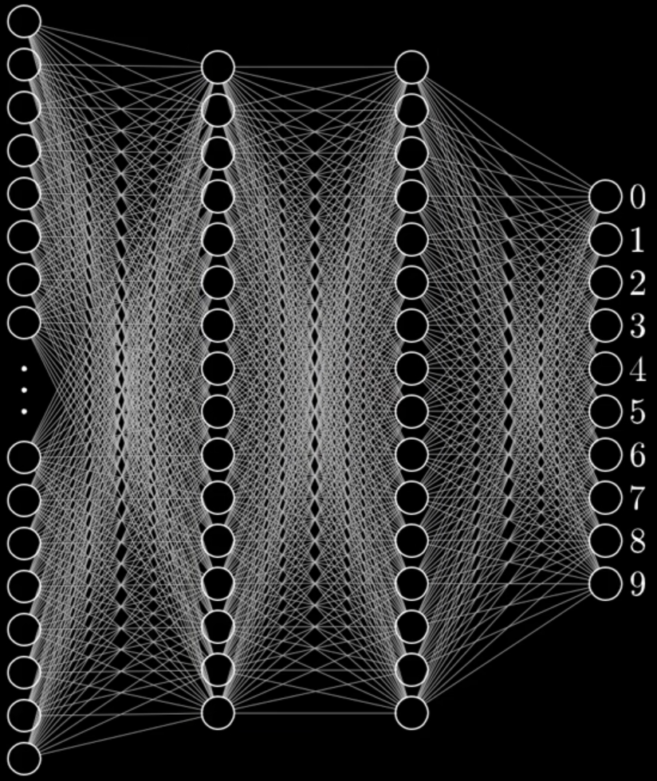
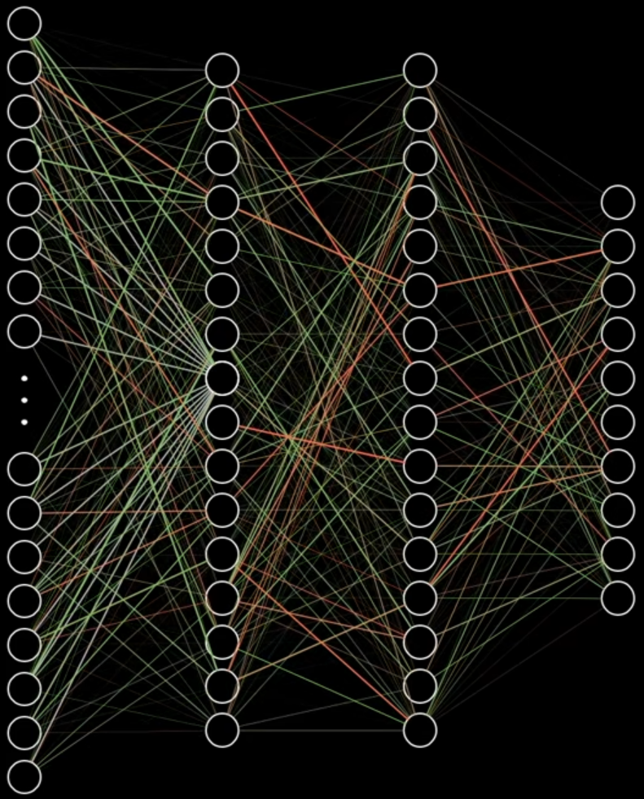

This is the first article in a series to implement a neural network from *scratch*.
We will set things up in terms of software to install, knowledge we need,
and some code to serve as backbone for the remainder of the series.

===


## Purpose of the series

In this short series I will be guiding you on how to implement a neural network
from scratch, so that you really understand how they work.

 > By the time we are done, your network will be able to read images
 > of handwritten digits and identify them correctly, among other things.

Your network will receive an image like


and will output a `7`.

Not only that, but we will also do a bunch of other cool things with our networks.

It is incredible that nowadays you can just install tensorflow or pytorch or any
other machine learning framework, and with just a couple of lines you can train
a neural network on some task you pick.
The downside to using those libraries is that they teach you little about how the
models actually work, and one of the best ways to understand how something works
is by dissecting it, studying it and assembling it yourself.


### Knowledge pre-requisites

When it comes to programming, I will assume you are comfortable with the basic
concepts of Python.
I will not be using features that are too advanced,
but every now and then I might use modules from the Python Standard Library.
If you don't know those modules, that's fine.
Reading the description from the documentation should be enough to bring you
up to speed!
I also have a [series of blog articles][pydonts] to help you write better
Python code, so take a look at that if you feel the need.

Throughout the series I will be assuming you are familiar with the general idea
of how neural networks work.
If you have *no idea* what a neural network is, it is with great pleasure that
I recommend you watch [3blue1brown's video(s)][3b1b-nn].

Being familiar with matrix algebra and a bit of calculus (knowing what derivatives are
and understanding them) will make it easier for you to follow along, but you
don't really need to be a master of these subjects in order to implement a neural net:
the first time I implemented a neural network I didn't know matrix algebra nor
derivatives.
I will be giving intuitive explanations of what is going on at each step, and then
proceed to justify them with the calculations needed.
Feel free to skip the formal calculations if you are in a rush, but bear in mind
that going through those is one of the things that really helps the knowledge sink in.


## Purpose of this article

In this article we will be setting up for the remainder of the series.
First, I will be covering what needs to be installed.
Then we will be taking a look at some of the more basic things we can already
implement: we will be modelling and initialising layers, the backbone of any neural network.

!!! The code for this article, and for the future articles of the series,
!!! can be found in [this GitHub repository][gh-nnfwp].


## Software needed

In order to follow along you will need to have Python 3 installed
(I will be running all my code in Python 3.9, which is my main installation
at the time of writing this article) and you also need to have [NumPy] installed.

NumPy is a Python library for numerical computations and we will be using thoroughly
for its matrix algebra capabilities:
turns out it is much easier to implement a neural network if you do most of your
operations in bulk, instead of doing everything by hand with `for` loops and whatnot.
(Which is what I did the first time, and let me tell you it was *not* pretty...)

Installing NumPy should be effortless with

```bash
python -m pip install numpy
```

but check out [their instructions][numpy-install] if you need help with the installation.

Every now and then, you might trip up on something that isn't working as intended...
I know that can be frustrating, but don't forget that Google exists for this type
of situation.


## First lines of code

Whenever I am doing a project, I usually spend a bit of time thinking about
the components I am going to need and how they will interact.
Then I need to pick a place to start, and I tend to start some place where
I will be producing code that works, so that I can actually see progress
happening in terms of result, instead of just seeing the number of lines of
code increase.

The first thing we could try to do is create a representation for a layer of a neural
network and implement a way to initialise it, so that we have something palpable
to play with right from the get-go.
But what is a layer in a neural network?


## Neurons and layers

A neural network can be thought of as a very basic emulation of the human brain.
I am no neurologist, but from my understanding our neurons are connected to each other
and they communicate with each other by sending signals, so in a way we can think
of our neurons as entities that can be “on” or “off”.
Not only that, but each neuron depends on some other neurons
(the ones it is connected to) to know whether it should be “on” or “off”.

Our neural networks will be emulating that behaviour, but instead of having
the neurons all mixed up, we will line them up neatly in what we call *layers*.
In the figure below we show four layers, and the neurons of consecutive layers
are connected by thin lines:

[][3b1b-nn1]

We will also determine that a neuron can only be connected to the neurons
of the next layer and to the neurons of the previous layer, instead of allowing
connections between arbitrary neurons.
The only exceptions are the neurons of the leftmost layer, as those are the *input*
neurons:
they accept the data we give them,
and the neurons of the rightmost layer, as those are the *output* neurons:
they return some result.

In the example image we have ten output neurons labelled 0 through 9
and some number of input neurons (784 if you watch [the video][3b1b-nn1]).

The “on” and “off” state of each neuron will actually be a floating point
number and the neurons of the input layer will be receiving their states as the input
to the network.
Then, the states of each following layer will be computed from the states of the
previous layer.
In order to compute the state of a single neuron, what you do is take the states
of all the $m$ neurons of the preceding layer:

$$
    x_1, ~ x_2, ~ x_3, ~ \cdots, ~ x_m ~~~ ,
$$

and then add them up, *after* weighting them:

$$
    w_1x_1 + w_2x_2 + w_3x_3 + \cdots + w_mx_m ~~~ .
$$

Think of this as a vote, in the sense that each neuron of the previous layer is casting
their vote ($x_j$) about whether or not this neuron should be “on”,
but then you care more about what some neurons say and less about what other
neurons say, so you give a weight ($w_j$) to each "opinion".

If we colour the connections depending on the weight they carry, we can have
an image like the one below:

[][3b1b-nn1]

Then, you take into account your opinion about the vote, your own *bias* ($b$), and
add that into the mix:

$$
    b + w_1x_1 + w_2x_2 + w_3x_3 + \cdots + w_mx_m ~~~ .
$$

The final step is to take the result of that vote and plug it in a function,
that we call the *activation function*, that processes the result of the vote
and computes the state the neuron will be in.
If we are using an activation function named $f$, then the state of this neuron
would be

$$
    f(b + w_1x_1 + w_2x_2 + w_3x_3 + \cdots + w_mx_m) ~~~ .
$$

This is what we will be doing, but instead of computing all of these sums
by hand for each neuron, we will be using matrix algebra to represent things
in bulk:

 - the connections between the neurons of two consecutive layers can be represented
as a matrix; and
 - the bias of the neurons of a single layer can be represented as a column vector.

In doing so, we will have a weight matrix $W$ and a bias vector $b$
that models the connections between two consecutive sets of neurons.
If the preceding set of neurons has $m$ neurons and the next set of
neurons has $n$ neurons, then we can have $W$ be a $n \times m$ matrix,
and $b$ be a column vector of length $n$, and then $W$ and $b$
can be interpreted as follows:

 - the ith element of $b$ is the bias of the ith neuron of the next set;
 - the ith row of $W$ contains all the connections from the previous
neurons to the ith neuron of the next set; and
 - the jth column of $W$ contains all the connections from the jth
neuron of the previous set to all the neurons of the next set.

Then, if the preceding layer produced a vector $x$, and if $F$ is
the activation function being used, we can compute the next set of states
by performing the calculation

$$
    F(Wx + b) ~~~,
$$

where $Wx$ is a matrix multiplication.
If you look at each element of the column vector $Wx$, you will
see the multiplications and addition I showed above for a single neuron,
except now we are doing them in bulk.
The $+ b$ sums the bias, and then we apply the activation function $F$
to everything at the same time.

This process by which we take the states of the previous neurons and compute
the states of the next set of neurons is often dubbed the *forward pass*.

Therefore we conclude that we need to be able to create these matrices of weights
and these bias vectors in order to model a layer in a neural network,
so let us get that off the way.


## Initialising weight matrices and bias vectors

In order to create the weight matrices and the bias vectors we just need to know
their dimensions, so we can define two functions
(one for the weight matrices and another for the bias vectors)
and take the dimensions as arguments:

```py
import numpy as np

def create_weight_matrix(nrows, ncols):
    return np.zeros((nrows, ncols))

def create_bias_vector(length):
    return np.zeros((length, 1))
```

In the code above you can see that I created a column vector as a matrix with
only one column.
You could create the bias vector as a plain vector, but I did it like so in order
to keep the implementation as close as possible to the mathematical calculations
we will be doing later, and it helps to have everything consistent.

You can go ahead and create a weight matrix:

```py
>>> create_weight_matrix(2, 4)
array([[0., 0., 0., 0.],
       [0., 0., 0., 0.]])
```

This is not extremely interesting, and also not very helpful when dealing with
neural networks.
In general, these weight matrices and bias vectors are initialised with small,
random values.
When you are more comfortable around these topics,
you can look for scientific papers on what are the best practices for deciding
what type of randomness you want to use and how small the numbers should be,
but I will be doing something that has worked well for me and is fairly sensible:
we will sample the weights and the bias, so that they are drawn from a normal
distribution with mean 0 and a standard deviation that decreases as the size
of the matrix/vector increases.

Thankfully, in NumPy you can generate normally distributed random numbers
with ease:

```py
import numpy as np

def create_weight_matrix(nrows, ncols):
    return np.random.default_rng().normal(loc=0, scale=1/(nrows*ncols), size=(nrows, ncols))
```

Now let us check how a random matrix would look like:

```py
>>> create_weight_matrix(2, 4) 
array([[-0.09040462, -0.00485385, -0.08010303,  0.29271109],
       [ 0.12528501, -0.08750708, -0.26472923,  0.13410931]])
```

For the bias vectors, we can be a little bit lazy and recall that a column
vector is just a matrix with a single column:

```py
def create_bias_vector(length):
    return create_weight_matrix(length, 1)
```


## Updating neuron states

Now that we have the weights and the bias that model the connections between
different layers, we can actually see what it looks like to give some input
to our network.

Imagine we have 4 numbers as input, the column vector $(1, 0, 0, 0)^T$,
and let us assume that the next layer will have only 2 neurons.
If that is the case, then our weight matrix should have 2 rows
(one for each neuron we want to update the state of) and 4 columns
(one for each neuron that is contributing to the update of the states):

```py
>>> W = create_weight_matrix(2, 4)
>>> b = create_bias_vector(2)
>>> x = np.array((1, 0, 0, 0), ndmin=2).T    
>>> x
array([[1],
       [0],
       [0],
       [0]])
>>> np.dot(W, x) + b
array([[-0.67662439],
       [ 0.18410246]]))
```

The only thing missing is the activation function.
We will start with a simple activation function called Leaky Rectified Linear Unit,
or Leaky ReLU for short.
Code speaks louder than words, so here's the implementation:

```py
def leaky_relu(x, leaky_param=0.1):
    return np.maximum(x, x*leaky_param)
```

If a number is positive, the Leaky ReLU does nothing and if it is
negative, it multiplies it by the parameter of the function:

```py
>>> np.dot(W, x) + b
array([[-0.67662439],
       [ 0.18410246]])
>>> leaky_relu(np.dot(W, x) + b)
array([[-0.06766244],
       [ 0.18410246]])
```


## Modelling layers

We now have some of the building blocks in order to get a layer working,
so another simple thing we could do is actually put them together.

The implementation becomes simple to follow and to understand if we define
a custom class for an object that we will call `Layer` and that will
represent the connections and the flow of information between a column
of neurons and the next:
that is, instead of having the layer specifically represent the neurons
of each vertical column, we deal with what happens in between two columns
of neurons.

If we represent our data in this way, then we do not need to special
case the input layer or the output layer in any way, and that simplifies
the coding process a lot.

When we create a layer (of connections), we need to tell it three things:

 1. how many neurons are on the left of it, feeding it input;
 2. how many neurons are on the right of it, getting input from this layer; and
 3. what is the activation function we are using.

With that information we can already initialise a layer properly:

```py
class Layer:
    def __init__(self, ins, outs, act_function):
        self.ins = ins
        self.outs = outs
        self.act_function = act_function

        self._W = create_weight_matrix(self.outs, self.ins)
        self._b = create_bias_vector(self.outs)
```

We can also write a little helper method that computes the forward pass
in our layer, a method that takes a set of neuron states and computes
the next set of neuron states:

```py
class Layer:
    # ...

    def forward_pass(self, x):
        return self.act_function(np.dot(self._W, x) + self._b)
```

This is exactly the same as the `leaky_relu(np.dot(W, x) + b)` line we had above
in the REPL, but this time we are writing it in the general setting of an
arbitrary layer.

We can also include a little demo in our code:

```py
if __name__ == "__main__":
    """Demo of chaining layers with compatible shapes."""
    l1 = Layer(2, 4, leaky_relu)
    l2 = Layer(4, 4, leaky_relu)
    l3 = Layer(4, 1, leaky_relu)

    x = np.random.uniform(size=(2, 1))
    output = l3.forward_pass(l2.forward_pass(l1.forward_pass(x)))
    print(output)
```

Try running your script and see what output you get.
One of the times I ran it, I got

```py
 > python nn.py
[[-0.07763001]]
```


## Wrap-up & current code

Now that we have the backbone for the neural network in place,
we can take a look at what we have coded so far and insert the docstring comments
we forgot to add because we were in such a rush to get something working.
My docstring-writing skills aren't very sharp,
but perhaps what I wrote can serve as inspiration for you.

You can find all the code in [this GitHub repository][gh-nnfwp] and, in particular,
the code from this specific article is available under the [v0.1 tag][gh-nnfwp-v0_1].

Currently we have a file that spans for 39 lines.
It doesn't look like much, but on the other hand we have advanced quite a lot.

In the next article we will be aggregating layers in a class for a neural network
and we will be looking at how neural networks learn.

## The series

These are all the articles in this series:

<ol>

    <li><a href="{{ article.url }}">{{ article.title }}</a></li>

</ol>

[3b1b-nn]: https://www.youtube.com/playlist?list=PLZHQObOWTQDNU6R1_67000Dx_ZCJB-3pi
[3b1b-nn1]: https://www.youtube.com/watch?v=aircAruvnKk
[numpy]: https://numpy.org
[numpy-install]: https://numpy.org/install/
[gh-nnfwp]: https://github.com/mathspp/NNFwP
[gh-nnfwp-v0_1]: https://github.com/mathspp/NNFwP/tree/v0.1
[pydonts]: /blog/pydonts
