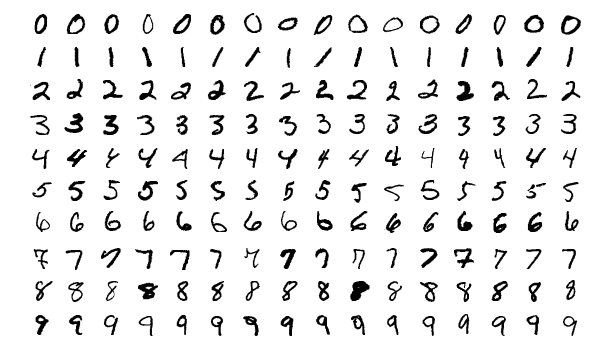

In the fourth article of this short series we will apply
our neural network framework to recognise handwritten digits.

===


## Purpose of this article

The purpose of this article is to take the neural network
framework you built in the previous three articles and apply it
to an actual machine learning problem.
In particular, we will take the MNIST dataset – a dataset that
contains images of handwritten digits – and train a neural
network to be able to recognise them.

The images we will be working with are like the ones below:



By the time you are done with this article, you will have a neural
network that is able to recognise the digit in an image
9 out of 10 times.

!!! The code for this article, and for the all articles of the series,
!!! can be found in [this GitHub repository][gh-nnfwp].
!!! This article will build upon [v1.0][gh-nnfwp-v1_0] of that code.
!!!
!!! If you need a refresher on what we built last time, have a quick read
!!! [at the previous article][part3].


## Getting the data

In the world of machine learning, the MNIST dataset is very well-known
and it is common to play around with this dataset when you are experimenting
with a new machine learning model.
Think of it as the “Hello, World!” of machine learning.

For your convenience, I compressed the MNIST dataset
it and made it available for download [here][mnist-csv-data]
([direct download link][mnist-csv-data-download]).

After you decompress the data folder, you should get two files:
 - `mnist_train.csv`, a CSV file with 60 000 rows to train the network; and
 - `mnist_test.csv`, a CSV file with 10 000 rows to test the network.

! If you want to follow along with me, be sure to decompress the `mnistdata`
! folder inside the `examples` folder, so that the two files are
! `examples/mnistdata/mnist_train.csv` and `examples/mnistdata/mnist_test.csv`.

Each row of the file is composed of 785 integers:
the first one is a number between 0 and 9, inclusive,
and tells you which digit that row is.
The remaining 784 integers go from 0 to 255 and represent
the greyscale levels of the original image, which
was 28 by 28 pixels.


## Creating a new file

Because you are done with *implementing* the network and are now going
to *use* it, it makes sense to create a new file for this little
project, so go ahead and create a `mnist.py` file next to your file
containing the neural network implementation.


## Reading the data in

The first thing we want to do is take a look at the data,
so let's go ahead and create a simple function to read it in
and build a NumPy array out of the file.

In order to do that, we first use `csv` to import the data
from the CSV file into a list with the rows of the file,
and then use NumPy to convert that list of rows into an array.
Do this inside the `examples/mnist.py` file:

```py
import csv
import numpy as np

def load_data(filepath, delimiter=",", dtype=float):
    """Load a numerical numpy array from a file."""

    print(f"Loading {filepath}...")
    with open(filepath, "r") as f:
        data_iterator = csv.reader(f, delimiter=delimiter)
        data_list = list(data_iterator)
    data = np.asarray(data_list, dtype=dtype)
    print("Done.")
    return data
```

We included two extra function arguments, `delimiter` and `dtype`,
to allow us to further control how `csv` will read the data in
and how NumPy will convert the data into an actual array.


## Basic data inspection

After you are done with implementing that `load_data` function,
go to your Python REPL and take it for a spin:

```py
>>> from mnist import load_data
>>> data = load_data("examples/mnistdata/mnist_test.csv", ",", int)
Loading examples/mnistdata/mnist_test.csv...
Done.
>>> for row in range(28):
...     if not sum(data[0, 28*row:28*(row + 1)]):
...             continue
...     for col in range(28):
...             idx = row*28 + col
...             print("#" if data[0, 1+idx] else " ", end="")
...     print()
...

      ######
      ################
      ################
           ###########
                  ####
                 ####
                 ####
                ####
                ####
               ####
               ###
              ####
             ####
            #####
            ####
           #####
           ####
          #####
          #####
          ####
```

In the REPL session above, we used our new function to load the test
data into an array called `data`, and then we used a double
`for` loop and some indexing arithmetic (`idx = row*28 + col`)
to print the original 28 by 28 image, which is represented
by 784 integers in a row inside `data`.
We printed the very first row, if you change the `0` in `data[0, 1+idx]`
to another integer, you will print another MNIST image.


## Building the network

If we want to create a network that recognises handwritten digits,
before being able to train the network we need to actually build one.
For this, we will be using the components we built and implemented
during the previous articles.

When building a network, two of the most important things you have
to do is understand how many inputs the network should accept
and how many outputs it should produce.

For our case, we have seen that the MNIST images have 784 values,
so that is the number of inputs the network takes.

As for the outputs, we want the network to be able to recognise
the correct digit, amongst the ten different digits that exist.
For that matter, we will say that the network output will be a
column vector with ten integers:
the index `i` in the output will give a measure for how much
the network thinks the input image is the digit `i`.
If the network takes `x` as input and then produces the column
vector `out`

```py
>>> out
array([[0.40814177],
       [0.23417614],
       [0.55003812],
       [0.77545582],
       [0.83813274],
       [0.05773683],
       [0.27620492],
       [0.37310017],
       [0.47088771],
       [0.26011783]])
```

then we would say that, for the input `x`, the network
recognises the digit `4`, because `out[4]` is the largest
element of `out`.
A simple way to compute this is with `np.argmax`:

```py
>>> np.argmax(out)
4
```

So, we have established that the network takes 784 inputs
and produces 10 outputs, but how many layers does it have?
And what should the learning rate of the network be?
These configuration parameters are generally the things
you have to tweak manually when creating a machine
learning model for some task, because unfortunately
there is no one-size-fits-all architecture.
However, I can let you in on a little secret:
for our particular case, here is a network architecture that
will work just fine:

```py
import sys, pathlib
## (Ugly) workaround to enable importing from parent folder without too much hassle.
sys.path.append(str(pathlib.Path(__file__).parent.parent))

from nn import NeuralNetwork, Layer, LeakyReLU, MSELoss

layers = [
    Layer(784, 16, LeakyReLU()),
    Layer(16, 16, LeakyReLU()),
    Layer(16, 10, LeakyReLU()),
]
net = NeuralNetwork(layers, MSELoss(), 0.001)
```

Of course, we cannot forget to import the relevant components
from our neural network implementation, which I assumed was in
a file named `nn`.


## Testing the network

Now that we have a network, the first thing we can do is test
the network to see what is the accuracy of a fresh network.
If everything works out well, we expect the accuracy of this untrained
network to be around 10%, which is the accuracy of a model that
guesses randomly.

Testing the network is simple:
go over each row of the testing data and extract the correct digit of that
row and extract the 784 inputs *as a column vector*
(this is very important, we spent the three previous articles making sure
that everything would work for input vectors that were *columns*);
feed the 784 inputs to the network;
find the largest element in the output vector and compare to the correct
digit; count the number of times the network guesses correctly and return
the accuracy of the network:

```py
def to_col(x):
    return x.reshape((x.size, 1))

def test(net, test_data):
    correct = 0
    for test_row in test_data:
        t = test_row[0]
        x = to_col(test_row[1:])
        out = net.forward_pass(x)
        guess = np.argmax(out)
        if t == guess:
            correct += 1

    return correct/test_data.shape[0]
```

This is a process that takes anywhere between a couple of seconds and a couple
of minutes, depending on your computer, so let us add a print statement
that shows, every one thousand iterations, how many iterations we have done:

```py
def test(net, test_data):
    correct = 0
    for i, test_row in enumerate(test_data):
        if not i%1000:
            print(i)

        t = test_row[0]
        x = to_col(test_row[1:])
        out = net.forward_pass(x)
        guess = np.argmax(out)
        if t == guess:
            correct += 1

    return correct/test_data.shape[0]
```

`if not i%1000` can be read as “if `i` has no remainder when divided by 1000”,
and so it evaluates to `True` only when `i` is a multiple of `1000`.


## Putting everything together

If we put all the bits and pieces from this article together,
and if we use `pathlib` to make sure we create the correct
paths to the data files,
this is what we have so far:

```py
import sys, pathlib
## (Ugly) workaround to enable importing from parent folder without too much hassle.
sys.path.append(str(pathlib.Path(__file__).parent.parent))

import csv
import numpy as np
from nn import NeuralNetwork, Layer, LeakyReLU, MSELoss

TRAIN_FILE = pathlib.Path(__file__).parent / "mnistdata/mnist_train.csv"
TEST_FILE = pathlib.Path(__file__).parent / "mnistdata/mnist_test.csv"

def load_data(filepath, delimiter=",", dtype=float):
    """Load a numerical numpy array from a file."""

    print(f"Loading {filepath}...")
    with open(filepath, "r") as f:
        data_iterator = csv.reader(f, delimiter=delimiter)
        data_list = list(data_iterator)
    data = np.asarray(data_list, dtype=dtype)
    print("Done.")
    return data

def to_col(x):
    return x.reshape((x.size, 1))

def test(net, test_data):
    correct = 0
    for i, test_row in enumerate(test_data):
        if not i%1000:
            print(i)

        t = test_row[0]
        x = to_col(test_row[1:])
        out = net.forward_pass(x)
        guess = np.argmax(out)
        if t == guess:
            correct += 1

    return correct/test_data.shape[0]

layers = [
    Layer(784, 16, LeakyReLU()),
    Layer(16, 16, LeakyReLU()),
    Layer(16, 10, LeakyReLU()),
]
net = NeuralNetwork(layers, MSELoss(), 0.001)

test_data = load_data(TEST_FILE, ",", int)
print(test(net, test_data))
```

I ran this code once, and here is what I got:

```
 > python mnist.py
0.1028
```

The `0.1028` is 10.28%, which is in line with the accuracy we expected.
Now, all there is left to do is train the network.


## Training the network

Training the network is pretty similar to testing it,
except that instead of comparing the network output to the correct answer
and incrementing a counter for the correct answers,
we need to feed the network with the vector we expected the network
to output.


### Building the expected output

For each row of the training data, we have information for the digit
that the row actually represents, but we need to build the target
*column vector*, the column vector we wish the neural network
produced when given that same image as input.
If we interpret the outputs of the network as probabilities,
with the number in position `i` of the output representing
the probability that the network gives to the input image
being an `i`, we can reverse-engineer that to build the target output
for a given image:

```py
>>> digit = 3
>>> t = np.zeros((10, 1))
>>> t[digit] = 1
>>> t
array([[0.],
       [0.],
       [0.],
       [1.],
       [0.],
       [0.],
       [0.],
       [0.],
       [0.],
       [0.]])
```

! In doing this, we are actually overlooking a mathematical
! subtlety that makes our setup a bit incoherent: the output of the
! network cannot be interpreted strictly as a probability because
! the activation function of the last layer can produce any real number,
! and probabilities need to lie in the range $[0, 1]$.


### Implementing training

Now that we know how to build the target column vector, we can implement
our `train` function:

```py
def train(net, train_data):
    # Precompute all target vectors.
    ts = {}
    for t in range(10):
        tv = np.zeros((10, 1))
        tv[t] = 1
        ts[t] = tv

    for i, train_row in enumerate(train_data):
        if not i%1000:
            print(i)

        t = ts[train_row[0]]
        x = to_col(train_row[1:])
        net.train(x, t)
```


### Adding training to the script

Now that we have all the functions that we need, we can actually
refactor our code ever so slightly to perform the network creation,
testing, training and re-testing only if our script is executed
directly.
In order to do so, we just need the following code after all our function
definitions:

```py
if __name__ == "__main__":
    layers = [
        Layer(784, 16, LeakyReLU()),
        Layer(16, 16, LeakyReLU()),
        Layer(16, 10, LeakyReLU()),
    ]
    net = NeuralNetwork(layers, MSELoss(), 0.001)

    test_data = load_data(TEST_FILE, delimiter=",", dtype=int)
    accuracy = test(net, test_data)
    print(f"Accuracy is {100*accuracy:.2f}%")     # Expected to be around 10%

    train_data = load_data(TRAIN_FILE, delimiter=",", dtype=int)
    train(net, train_data)

    accuracy = test(net, test_data)
    print(f"Accuracy is {100*accuracy:.2f}%")
```

The code above prints the accuracy as a percentage (because we multiplied
by 100) with two decimal places (with the `:.2f` inside the `f`-string),
but other than that we just loaded the `train_data` in the same way
we loaded the `test_data` array before, and we just call the `train` function.

I ran this code, and here is the output I obtained (after removing the intermediate
prints from the `test` and `train` functions that are there just to ensure the
functions are running):

```
 > python mnist.py
Loading mnistdata/mnist_test.csv...
Done.
Accuracy is 10.10%
Loading mnistdata/mnist_train.csv...
Done.
Accuracy is 91.94%
```


The exact numbers you get will probably be different, but you should
get something around 10% before training the network and around 90%
after training the network, *provided* you used the same network
setup (number of layers, respective input and output sizes,
respective activation functions, loss function and learning rate).


## Code & next steps

You can find all the code for this series in [this GitHub repository][gh-nnfwp] and
the code that corresponds to the end of this article is available [under the tag v1.1][gh-nnfwp-v1_1].

After reaching this point, the next sensible thing to do would be
to implement a loss function that is more appropriate for this type
of task, and an activation function that is more suitable to produce
outputs that can be interpreted as probabilities.
We will do so in the next article of the series.

If you reached this far, you may also find interesting to experiment
by yourself with different network architectures and see if you can
come up with a configuration that performs as well as possibly, in
a consistent manner.
Remember that you can change the number of layers, their internal
input and output sizes, the parameter of the `LeakyReLU` (we have been
using the default value), and the learning rate of the network.


## The series

These are all the articles in this series:

<ol>

    <li><a href="{{ article.url }}">{{ article.title }}</a></li>

</ol>

[part3]: /blog/neural-networks-fundamentals-with-python-backpropagation
[mnist-csv-data]: https://github.com/mathspp/NNFwP/blob/main/examples/mnistdata.rar
[mnist-csv-data-download]: https://github.com/mathspp/NNFwP/blob/main/examples/mnistdata.rar?raw=true
[gh-nnfwp]: https://github.com/mathspp/NNFwP
[gh-nnfwp-v1_0]: https://github.com/mathspp/NNFwP/tree/v1.0
[gh-nnfwp-v1_1]: https://github.com/mathspp/NNFwP/tree/v1.1
