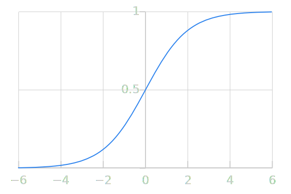

In the fifth article of this short series we will be handling
some subtleties that we overlooked in our experiment to classify handwritten
digits from the MNIST dataset.

===


# Purpose of this article

The purpose of this article is to go over the code
we have written so far and, in particular, the code
we wrote in the [previous article][part4],
and fix a couple of little inconsistencies that are related
to some subtleties I overlooked in the previous articles.

!!! The code for this article, and for the all articles of the series,
!!! can be found in [this GitHub repository][gh-nnfwp].
!!! This article will build upon [v1.1][gh-nnfwp-v1_1] of that code.


# Interpreting outputs as probabilities

In the [article where we classified handwritten digits][part4]
there was a point in which we had to create the target
column vector outputs for the images of the digits:
we only knew what digit each image referred to, we didn't
have the column vector we wanted the network to output.

What we decided to do was create a vector with 0s, except
in the position of the correct digit:

```py
>>> digit = 3
>>> t = np.zeros((10, 1))
>>> t[digit] = 1
>>> t
array([[0.],
       [0.],
       [0.],
       [1.],
       [0.],
       [0.],
       [0.],
       [0.],
       [0.],
       [0.]])
```

I then proceeded to saying we would more or less interpret
these numbers as the probabilities that the network assigns to
each digit; e.g. if the network receives an image of a three,
we want the network to say that there's 0% chance that image
is a 0, 0% chance it is a 1, or 0% chance it is an 8, but we
would want the network to say there's 100% chance that that image
is an image of a 3.
*However*, the activation function we used in the last
layer was the leaky ReLU, and the leaky ReLU can output numbers
outside the range $[0, 1]$, which is the range where probabilities
lie.

As we have seen, we can still create something that works if we
overlook this subtlety, but we should actually be careful to
make sure everything is consistent with our assumptions, otherwise
we might get a problem later down the road that is caused by
these inconsistencies... and if you kick this can down the road,
it becomes really hard to trace back those future problems
to this present inconsistency.

Fixing this can be as simple as using an activation function
that only produces values in the range $[0, 1]$ in the last layer.
The [sigmoid function][sigmoid] is an appropriate alternative,
as it takes any real number and always produces a value in $[0, 1]$.
The sigmoid function looks like this:



The formula for the sigmoid function is the following:

$$
f(x) = \frac1{1 + e^{-x}}
$$

If we want to implement a `Sigmoid` activation function, all we need
to do is figure out what its derivative is, and then implement it
as a class that inherits the `ActivationFunction` abstract class we created.

If you do the maths you can find out that the derivative of the sigmoid function
is 

$$
f'(x) = \frac{e^{-x}}{\left(e^{-x} + 1\right)^2} ~~~,
$$

which can feel a bit nasty, but you can also write the derivative of the
sigmoid function in terms of the sigmoid function itself, which means that

$$
f'(x) = f(x)(1 - f(x)) ~~~.
$$

Writing this as code is really simple:

```py
class Sigmoid(ActivationFunction):
    def f(self, x):
        return 1/(1 + np.exp(-x))

    def df(self, x):
        return self.f(x) * (1 - self.f(x))
```

Having implemented the `Sigmoid` class, you can go to your `mnist.py`
script and replace the activation function you are using in your final
layer:

```py
# ...

if __name__ == "__main__":
    layers = [
        Layer(784, 16, LeakyReLU()),
        Layer(16, 16, LeakyReLU()),
        Layer(16, 10, Sigmoid()),
    ]

    # ...
```


# Appropriate loss function

The loss function is the function that we use to measure
how well the network behaves: we give some input to the network
and then compare its output to the target output by means
of the loss function.
We can then differentiate the loss function and use the
[backpropagation][part-backprop] algorithm to adjust the weights
and biases in the network.

What we didn't spend much time on is the fact that different
loss functions will give different results for the same
network and target outputs, and therefore will influence
the several weights and biases in different ways.
In particular, depending on the type of task we are performing,
some loss functions are more suitable than others.


## Mean squared error

Recognising handwritten digits is a classification task,
which means that given some input, we want to find out the class
that it falls into: in our case, we had ten classes – one for
each digit.
The mean squared error isn't necessarily the best loss function
for classification problems because the MSE computes the euclidean
distance between the two outputs (computed and target) and it is not
very sensitive to actual classification mistakes, which will show up
when you compute the derivative of the loss function.

To try and make my point clear, let us pretend we have an image of a three,
for which the target output is the following:

```py
>>> digit = 3
>>> t = np.zeros((10, 1))
>>> t[digit] = 1
>>> t
array([[0.],
       [0.],
       [0.],
       [1.],
       [0.],
       [0.],
       [0.],
       [0.],
       [0.],
       [0.]])
```

And let us create a vector that we will pretend the network created:

```py
>>> out = np.array([0.51, 0, 0, 0.49, 0, 0, 0, 0, 0, 0]).reshape((10, 1))
```

If we differentiate the loss function on the output `out` and the target
`t`, this is what we get:

```py
>>> MSELoss().dloss(out, t)
array([[ 0.102],
       [ 0.   ],
       [ 0.   ],
       [-0.102],
       [ 0.   ],
       [ 0.   ],
       [ 0.   ],
       [ 0.   ],
       [ 0.   ],
       [ 0.   ]])
```

If you look at the result of the derivative above, you can see that there
are zeroes in all positions, except positions `0` and `3`, which were the
ones where `out` differed from `t`.
For those two positions, the values are the same, apart from the sign:
this shows that the mean squared error loss function attributes the same
importance to both mistakes:
 - the mistake of giving `+0.51` to the wrong class; and
 - the mistake of giving `-0.51` to the correct class.

We could argue that it would be more interesting to come up with an
activation function that punishes classification mistakes
in a harsher way.


## Alternative loss function

If you know of a loss function that you would prefer to
use at this point, go right ahead and implement it.
I am not a connoisseur of loss functions so I just
borrowed some ideas from [PyTorch][pytorch]
and found this loss function that, quoting the docs,

 > “[It] is useful to train a classification problem with C classes.”

This is talking about the [`NLLLoss`][pytorch-nllloss] loss function.
However, if we keep on reading, [the docs go on to say][pytorch-nllloss]
that this loss function expects the input in a given format,
and provides two suggestions for this:

 - add an extra layer at the end of the network,
 that computes the appropriate transformation of the network outputs; or
 - use the [`CrossEntropyLoss`][pytorch-cel] instead,
 which is basically the `NLLLoss` with a pre-processing of the arguments.
 The composition of that pre-processing with the `NLLLoss` creates
 the `CrossEntropyLoss`.

Because I am the type of person that would implement `NLLLoss`
and then forget to add that extra layer to my networks,
I'll just implement the `CrossEntropyLoss` as
[per PyTorch docs][pytorch-cel].

For this, we just create a new `CrossEntropyLoss` class.
The `loss` method is basically defined in the docs for us,
so we just write

```py
class CrossEntropyLoss(LossFunction):
    def loss(self, values, target_class):
        return -values[target_class, 0] + np.log(np.sum(np.exp(values)))
```

The only thing that remains is having to implement `dloss`,
and for that we need to differentiate the function above.
If $x$ is the output of our network and $tc$ is the index
of the target class, then the loss function above is

$$
L(x) = -x_{tc} + \log\left(\sum_i e^{x_i} \right) ~~~.
$$

Differentiating this function will yield

$$
\frac{\partial L}{\partial x_j} = \begin{cases}
\frac{e^x_j}{\sum_i e^{x_i}} ~, j \neq tc \\
-1 + \frac{e^x_j}{\sum_i e^{x_i}} ~, j = tc
\end{cases} ~~~,
$$

which translates to the following code:

```py
class CrossEntropyLoss(LossFunction):
    """Cross entropy loss function following the pytorch docs."""
    def loss(self, values, target_class):
        return -values[target_class, 0] + np.log(np.sum(np.exp(values)))

    def dloss(self, values, target_class):
        d = np.exp(values)/np.sum(np.exp(values))
        d[target_class, 0] -= 1
        return d
```

! The `CrossEntropyLoss` function has another important difference,
! when compared to the `MSELoss` function.
! While the `MSELoss` expected a target vector,
! the `CrossEntropyLoss` expects a scalar index.

What that means is that, when training a network with the `CrossEntropyLoss`,
instead of giving it the target column vector like we have,
we just feed it the index of the correct class.

In our `examples/mnist.py` file, that would mean changing the `train` function
to the following:

```py
def train(net, train_data):
    # We no longer need to compute the dictionary `ts`.
    for i, train_row in enumerate(train_data):
        t = train_row[0]            # <-- was   t = ts[train_row[0]]
        x = to_col(train_row[1:])
        net.train(x, t)
```


# Incorporating the changes

Now that we have the tools to fix these inconsistencies,
we can experiment with them.
For one, we have the new `Sigmoid` activation function
that allows to actually interpret output values as probabilities.
Secondly, we have a new `CrossEntropyLoss` loss function
that is more suitable for the type of task we are performing.

When you are trying to solve some task with machine learning,
part of the trouble is going through the configuration of your model.
So far, I have guided you because my purpose is helping you to
implement a neural network.
However, now I invite you to actually spend a bit of time
playing around with the activation and loss functions you now
have and figuring out what type of model seems to work for the
MNIST dataset, or for some other task you came up with.

To give you a little push, why don't you try these configurations,
and play around with them:

```py
    # First configuration we tried.
    layers = [
        Layer(784, 16, LeakyReLU()),
        Layer(16, 16, LeakyReLU()),
        Layer(16, 10, LeakyReLU()),
    ]
    net = NeuralNetwork(layers, MSELoss(), 0.001)

    # Use a Sigmoid as the final layer (don't forget to import it!)
    layers = [
        Layer(784, 16, LeakyReLU()),
        Layer(16, 16, LeakyReLU()),
        Layer(16, 10, Sigmoid()),
    ]
    net = NeuralNetwork(layers, MSELoss(), 0.001)

    # Use Sigmoid at the end and CrossEntropyLoss (import them!)
    layers = [
        Layer(784, 16, LeakyReLU()),
        Layer(16, 16, LeakyReLU()),
        Layer(16, 10, Sigmoid()),
    ]
    net = NeuralNetwork(layers, CrossEntropyLoss(), 0.001)

    # Only LeakyReLU's and the CrossEntropyLoss (import the loss!)
    layers = [
        Layer(784, 16, LeakyReLU()),
        Layer(16, 16, LeakyReLU()),
        Layer(16, 10, Sigmoid()),
    ]
    net = NeuralNetwork(layers, CrossEntropyLoss(), 0.001)
```

Notice that I only changed the activation function of the last layer
and the loss function being used.
You can play around with the number of layers, their activation functions,
the learning rate of the network, ...

You can find all the code for this series in [this GitHub repository][gh-nnfwp] and
the code that corresponds to the end of this article is available [under the tag v1.2][gh-nnfwp-v1_2].

In the next article we will take a look at an interesting
experience you can do with two neural networks,
where we will essentially try to compress a neural network
into a smaller network.


# The series

These are all the articles in this series:

<ol>

    <li><a href="{{ article.url }}">{{ article.title }}</a></li>

</ol>


[part-backprop]: /blog/neural-networks-fundamentals-with-python-backpropagation
[part4]: /blog/neural-networks-fundamentals-with-python-mnist
[sigmoid]: https://en.wikipedia.org/wiki/Sigmoid_function
[pytorch]: https://pytorch.org/
[pytorch-cel]: https://pytorch.org/docs/stable/generated/torch.nn.CrossEntropyLoss.html
[cel-se]: https://datascience.stackexchange.com/a/20301
[cel-blogpost]: https://machinelearningmastery.com/cross-entropy-for-machine-learning/
[pytorch-nllloss]: https://pytorch.org/docs/stable/generated/torch.nn.NLLLoss.html#torch.nn.NLLLoss
[gh-nnfwp]: https://github.com/mathspp/NNFwP
[gh-nnfwp-v1_1]: https://github.com/mathspp/NNFwP/tree/v1.1
[gh-nnfwp-v1_2]: https://github.com/mathspp/NNFwP/tree/v1.2
