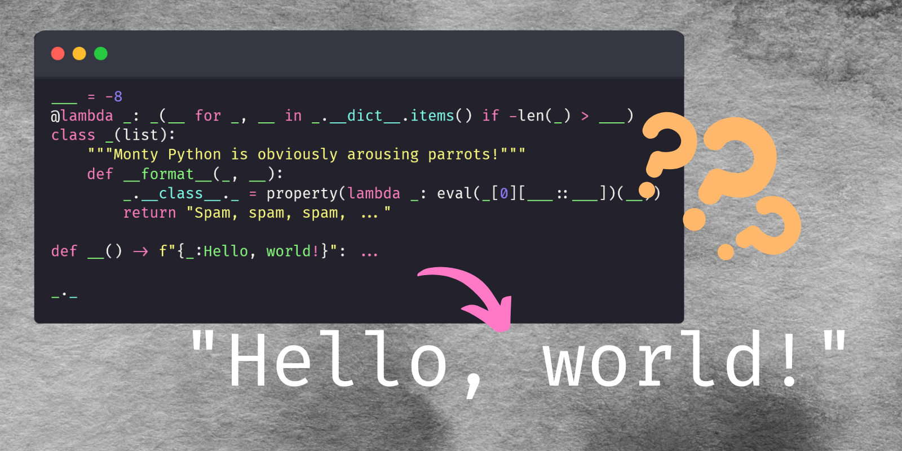

This is the most obfuscated “Hello, world!” program I have ever seen!

===

<script async src="https://platform.twitter.com/widgets.js" charset="utf-8"></script>




# The code

Here is a monstrous piece of Python code:

```py
___ = -8
@lambda _: _(__ for _, __ in _.__dict__.items() if -len(_) > ___)
class _(list):
    """Monty Python is obviously arousing parrots!"""
    def __format__(_, __):
        _.__class__._ = property(lambda _: eval(_[0][___::___])(__))
        return "Spam, spam, spam, ..."

def __() -> f"{_:Hello, world!}": ...

_._
```

This is a valid Python program, in Python 3.9+.
If you run this program, the output you get is `"Hello, world!"`, but how?

This program is the most obfuscated “Hello, world!” program I have ever seen,
taking the spot from [this very obscure “Hello, world!” Python program][obscure-hello-world]
that I wrote about yesterday.


# Background

I will explain this program _assuming you've read the article about this simpler version_:

```py
@lambda _: _()
class _:
    def __format__(_, __):
        _.__class__._ = property(lambda _: print(__))
        return ""

def __() -> f"{_:Hello, world!}": ...

_._
```

As a quick reminder, the simpler version works because we define a class that is immediately replaced by an instance of itself.
Then, that instance's dunder method `__format__` is called when the return annotation is evaluated in the function definition,
which ends up binding the call to `print` to a property called `_`.
That call to `print` has the format specification `__` as argument, which happens to be `"Hello, world!"`.
Finally, the property of the instance is accessed, triggering the `print`.

If you would like a step-by-step explanation of how the simpler version works,
you can find it [here][obscure-hello-world].


# Understanding the source

The version we want to study now is mostly the same as the simpler one,
apart from a few changes:

```py
___ = -8  # <- new; v different v
@lambda _: _(__ for _, __ in _.__dict__.items() if -len(_) > ___)
class _(list):  # <- now inheriting from `list`
    """Monty Python is obviously arousing parrots!"""
    def __format__(_, __):
        # The property here is slightly different:
        _.__class__._ = property(lambda _: eval(_[0][___::___])(__))
        # The return was empty:
        return "Spam, spam, spam, ..."

# ...
```

I started by trying to remove docstring from the class and by making the `return` the empty string again,
but removing the docstring broke the program.
So, the docstring is needed but the `return` isn't:

```py
___ = -8
@lambda _: _(__ for _, __ in _.__dict__.items() if -len(_) > ___)
class _(list):
    """Monty Python is obviously arousing parrots!"""
    def __format__(_, __):
        _.__class__._ = property(lambda _: eval(_[0][___::___])(__))
        return ""

def __() -> f"{_:Hello, world!}": ...

_._
```

Then, I looked at the property definition.
It is quite similar to the previous one, apart from what follows the `lambda _: ...`:

```py
# old v
property(lambda _:        print        (__))
property(lambda _: eval(_[0][___::___])(__))
# new ^
```

So, it looks like `eval(_[0][___::___])` is supposed to be replacing `print`...
But how?

If we look at the decorator, we can see it also looks similar:

```py
# old v
@lambda _: _()
@lambda _: _(__ for _, __ in _.__dict__.items() if -len(_) > ___)
# new ^
```

The difference is that we build an instance of the class with an argument,
and the class itself inherits from `list`,
so we are building a list with some stuff in it.

The good news is that we can just print the instance itself to see what it contains!
If we add `print(_)` to the end of the program and if we run it, this is what we get:

```py
['Monty Python is obviously arousing parrots!']
```

Interesting!
The generator expression inside the `lambda` decorator is the iterable that will be used to build the list,
and therefore that generator expression must be filtering everything out of `_.__dict__.items()` _except_
for the docstring.

The `lambda` decorator receives the class and then looks at the items in its dunder name `__dict__`.
We can inspect that `__dict__` by running the program with `python -i`,
which runs the whole program and then drops us into a REPL where everything from the program has been defined.
If we do that, we can play around with a couple of things:

```pycon
>>> list(_.__class__.__dict__.keys())
['__module__', '__doc__', '__format__', '__dict__', '__weakref__', '_']
>>> list(name for name in _.__class__.__dict__.keys() if -len(name) > ___)
['__doc__', '_']
```

We can see that the constant `___ = -8` defined at the top of the program is being used to filter the keys of this dictionary.
Only two keys are short enough: `"__doc__"` and `_`.
However, `_` is the property that only gets added _after_ the `lambda` decorator runs,
so when the program runs for the first time,
the generator expression

```py
@lambda _: _(__ for _, __ in _.__dict__.items() if -len(_) > ___)
```

only finds the key `"__doc__"` and then uses its corresponding value,
which is the string `"Monty Python is obviously arousing parrots!"`.

We know how this funky string ends up inside the list,
now we just need to figure out how it is used to build the function `print`.

The property that we define contains an interesting expression inside the `lambda`:

```py
eval(_[0][___::___])
```

`_` refers to the list itself and `_[0]` is the string `"Monty Python is obviously arousing parrots!"`.
Then, `[___::___]` is [slicing syntax][slicing], and it is equivalent to `[-8::-8]` because that is the value of `___`.
Incidentally, the slice builds the string `"print"`:

```pycon
>>> s = "Monty Python is obviously arousing parrots!"
>>> s[-8::-8]
'print'
```

The final step is to use `eval` to transform the string into the built-in `print`:

```pycon
>>> eval("print")
<built-in function print>
```

That is how this works!
Insane, right?

If you come up with an even crazier “Hello, world!” program,
feel free to comment it below or send it to me [on Twitter][twitter], for example.


# The short explanation

The short explanation is that the `lambda` decorator is creating a list whose only element is the docstring of the class.
Then, with some funky slicing, we use that string to build the string `"print"` and then `eval` it into the `print` function,
which then prints the formatting specification as the simpler version of this program.


# Source

The program we studied was not authored by me.
In fact, it was sent to me in the comment section of [a Reddit post][reddit-source]
where I was sharing [another obscure “Hello, world!” Python program][obscure-hello-world].


[obscure-hello-world]: /blog/the-most-obscure-hello-world-program
[slicing]: /blog/pydonts/mastering-sequence-slicing
[reddit-source]: https://www.reddit.com/r/Python/comments/w0nggx/explaining_the_most_obscure_hello_world_program_i
[twitter]: https://twitter.com/mathsppblog
