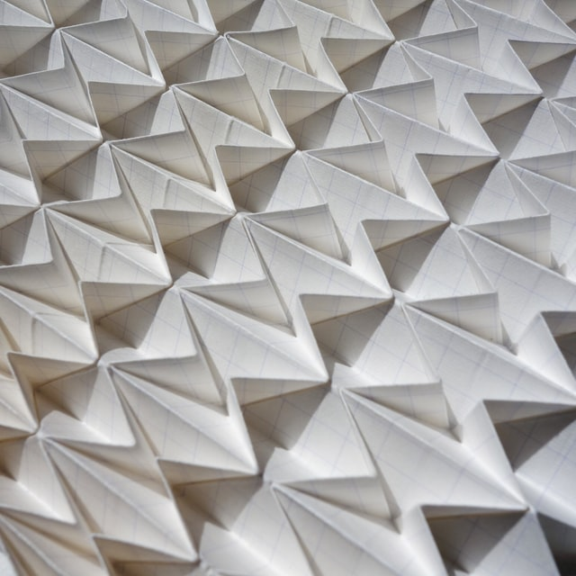
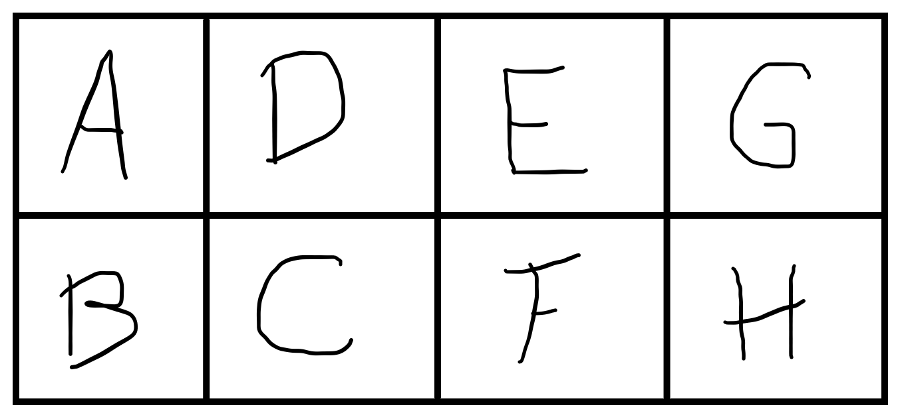
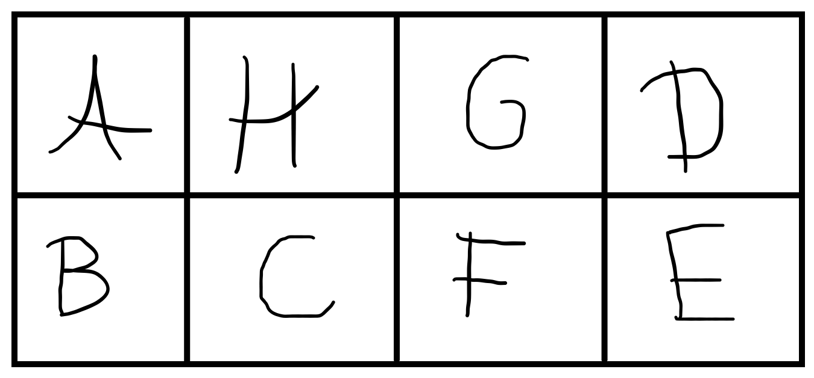
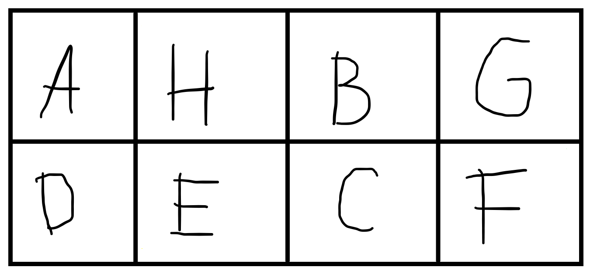
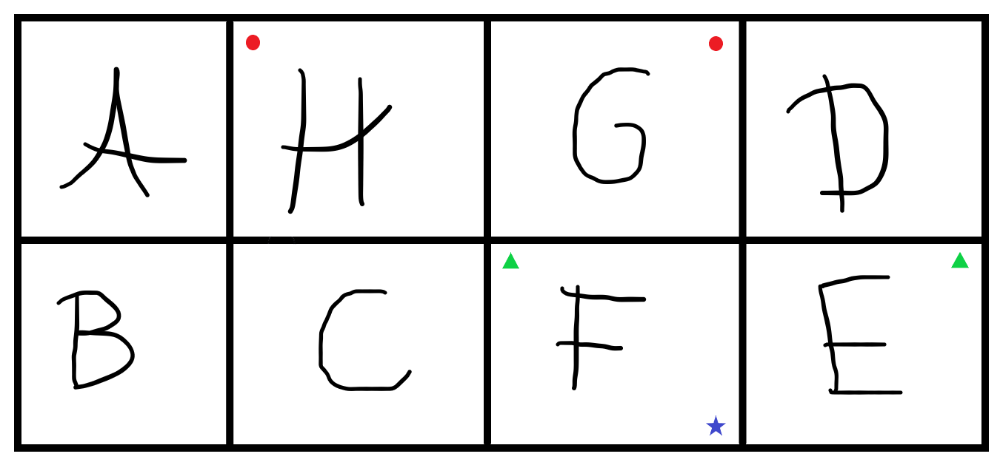
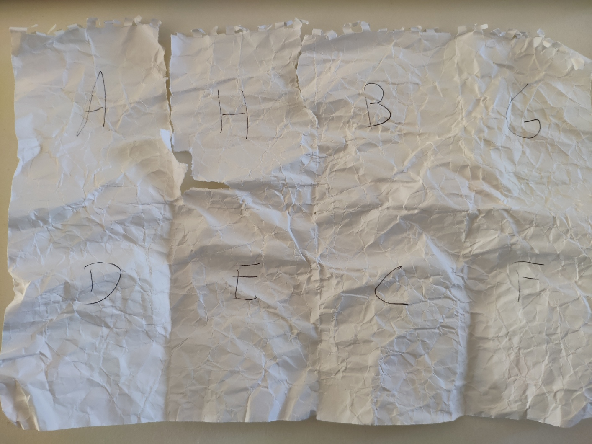

Pega numa folha de papel e num lápis. Agora vou pedir-te que escrevas umas letras na folha e depois vou desafiar-te a dobrar a folha... Soa fácil? Prometo que não vai ser.

===

### Preparação

Pega numa folha de rascunho e deita-a na horizontal.

Agora preciso que dobres a folha ao meio, ao longo do eixo horizontal de simetria; de seguida dobra ao meio, ao longo do eixo vertical de simetria duas vezes consecutivas.

No fim, é suposto teres uma folha dividida em oito retângulos:

Exceto que as tuas dobras deviam estar centradas e no meu desenho ficou tudo torto... Azar!

### Enunciado

O desafio é o seguinte: vou pedir-te que escrevas as letras `ABCDEFGH` nos retângulos que criaste e depois tens de dobrar a folha de papel de modo a que

 - os oito retângulos estejam todos empilhados;
 - folheando os retângulos um a um, as letras do alfabeto devem aparecer por ordem.

A única restrição é que não podes cortar a folha de papel! O objetivo é _mesmo_ dobrar a folha da forma certa, não é pegar numa tesoura, recortar os oito retângulos e empilhá-los.

Vou desafiar-te com três níveis, que vão corresponder a disposições diferentes das letras na folha. Começa pelo nível 1: escreve as letras a lápis na folha e tenta fazer as dobras corretas. Quando conseguires, apaga as letras e tenta o nível 2 e depois o nível 3. Boa sorte!

#### Nível 1

#### Nível 2

#### Nível 3

!!! Pensa um pouco... e mais importante de tudo, pega numa folha de papel e tenta! Conta-me como correu na secção de comentários no fim da artigo ;)

!!!! **Dica**: se estiver a ser difícil manter tudo em ordem e saber que retângulo é qual, talvez valha a pena escrever as letras também na parte de trás da folha... mas **tem cuidado**, um retângulo deve ter a **mesma** letra à frente e atrás.

!!!! **Dica**: se o papel for demasiado rijo podes tentar amarrotá-lo todo e depois voltar a esticar antes de tentares fazer as dobras todas.

### Soluções

#### Nível 1

Para este nível basta dobrar a folha ao longo do eixo horizontal e depois dobrar o retângulo que obtemos como se fosse uma concertina.

#### Nível 2

Esta solução é bastante mais difícil de explicar por palavras portanto fiz um boneco da folha com umas marcas especiais:

Agora vira a folha ao contrário, porque também vais precisar destas marcas:

O processo é o seguinte:

 1. dobra o papel ao longo do eixo vertical para que os dois círculos vermelhos (nas letras `H` e `G`) se toquem. Agarra o papel pelas letras `H` e `G`;
   
 2. dobra o papel ao longo do eixo horizontal para que os dois quadrados amarelos (nas letras `G` e `F`) se toquem. Agarra o papel pelas letras `H` e `C`;
 3. procura as duas estrelas azuis (nas letras `F` e `H`) e agarra o papel pelas estrelas, com o teu indicador e com o polegar. Os dedos devem estar mesmo a tocar nas marcas para que tenhas _precisamente_ três camadas de papel entre os dedos;
 4. pega nas letras `E` e `D` e dobra-as, por dentro da dobra que estás a manter, para que os triângulos verdes se toquem;
 5. faz a dobra final para que o `B` vá para cima do `C`.

_Voilà!_

#### Nível 3

Na minha opinião, este é mais fácil de perceber como se faz _mas_ é bem mais difícil de conseguir fazer sem destruir a folha de papel... Vamos a isso!

Vamos começar com algumas marcas:

E no lado de trás também:

Agora faz-se assim:

 1. dobra ao longo do vinco vertical mais à esquerda para que os dois círculos amarelos (em `A` e `H`) se toquem;
 2. dobra de novo a partir do lado esquerdo, para que os quadrados verdes (o quadrado no `A` acabou de ficar à vista) se toquem;
 3. dobra ao longo do eixo horizontal para que os triângulos vermelhos (em `B` e `C`) se toquem;
 4. dobra da direita para a esquerda para que as estrelas azuis (em `E` e `F`) se toquem.

E é isto! _Quase_. Agora vem a parte difícil... Se olhares com atenção, está tudo bem exceto que o `H` está na ponta errada, a tapar o `A` em vez de vir a seguir ao `G`. Precisamos de passar o `H` para baixo, e a maneira como se faz isso é virando o papel de dentro para fora, como se estivéssemos a dobrar uma meia (parecido com o que acontece no [minuto 3:44 deste vídeo](https://youtu.be/124L94hoBQg?t=224))...

Eu precisei de um par de tentativas para conseguir fazer este; é perfeitamente natural que a tua folha de papel se rasgue um pouco... Na verdade, olha o que me aconteceu à primeira tentativa:

O `H` quase que foi completamente rasgado da folha!

O amigo que me falou deste problema viu-o [neste vídeo do YouTube](https://www.youtube.com/watch?v=GpClxF41ugg).

Até à próxima!