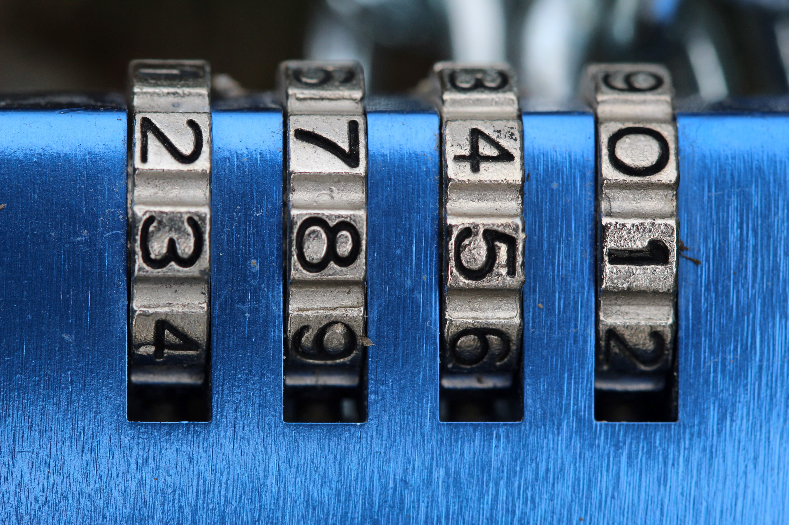

---
metadata:
    description: "In this article, I will share my intuitive understanding of what permutations, arrangements, and combinations are, and I'll help you reason about these things and about their differences."
title: "Buffet of self-references"
---

In this article, I will share with you my intuitive understanding of what
permutations, arrangements, and combinations are,
and I'll help you reason about these things and about their differences.

===

# Introduction

Permutations, arrangements, and combinations, are three things that come up
a _lot_ in combinatorics, an area of mathematics, but also in programming and,
in general, in our daily lives!
This article will explain you what these are, as well as tell you how I intuitively
think about these things.
Finally, we will take a look at some of the ways in which these three things are related.

By the time you are done with this article, you will

 - know what permutations, arrangements, and combinations, are;
 - know how to count permutations, arrangements, and combinations, with arbitrary parameters; and
 - understand how the formulas for the three concepts are related.

All these concepts have to do with sets: loosely speaking,
a set is the mathematical name for a collection of things.

Throughout this article, we will be working with the generic definitions
of things and we will also give concrete examples of things.
For the examples, we will be using the set $\{A, C, D, B\}$ a lot.

Right off the bat, it is important to understand that $\{A, B, C, D\}$,
$\{D, B, A, C\}$, and $\{D, C, B, A\}$ are just three ways of representing
the same set, because in a collection of things, in a bag full of items,
what matters is what the actual things inside the set are, ok?
It doesn't matter the order in which I type things inside the curly braces $\{ \}$.

# Permutations

 > Permutations are the ways in which you can put your objects in a line.

A couple of sentences ago, I said that, in a set, we only care about what
is inside it, and not the order in which I type it.
Well, that is no longer true when dealing with permutations.
A “permutation” is what you get if you take the things from inside your set,
and put them in a line.
If you then take that line and scramble everything, bam, you have another permutation.
Scramble everything once more?
There you have it, a whole new permutation.

How do these permutations get created?
I literally think about these as lines, for example if you wanted to
put things on display, one next to the other.
First thing we do is prepare the spots for everything.
There's four items in our set $\{A, B, C, D\}$, so I just need to get four spots ready:

$$
― ~~ ― ~~ ― ~~ ―
$$

Now, I want to put all of my items on display, so let's do it orderly, please.
I'll start on the left.
What should be the item I put on the left?
Well, there's 4 different items I could pick, all of them would be nice choices...
But I feel like the $C$ should go first, so let's pick $C$ out of the 4 possibilities:

$$
C ~~ ― ~~ ― ~~ ―
$$

I started off with $C$, but I could've had 4 different beginnings
of my display, right?
Because there were 4 choices for the position that $C$ was
chosen to occupy.

Now, $C$ is no longer in my set, because I just displayed it,
so there are 3 items left: $\{A, B, D\}$.
Now, what item should go to my display next?
Well, there are 3 different items I could pick, but I do feel
like $A$ would be a nice choice, so I'll put $A$ next on my permutation,
you can go ahead and add whatever you feel like:

$$
C ~~ A ~~ ― ~~ ―
$$

Well, my permutation above starts with $CA$, but yours might start
with something else, it really depends on what you chose for your
example, right?
But, in total, how many different things could there be on display?
Well, in the beginning I had to choose one out of 4 and now I had
to choose one out of 3, so if we put all those choices together,
it shows I just chose one out of the $4 \times 3 = 12$ possible
choices there were.

Now, $A$ is no longer in my set, because I just displayed it,
so there are 2 items left: $\{B, D\}$.
Now, what item should go to my display next?
Well, there are 2 different items I could pick,
and I am feeling like $B$ would be a really cool choice now,
so I'll add $B$ to my permutation now:

$$
C ~~ A ~~ B ~~ ―
$$

Well, when I only had two items on display, there was a total
of $4 \times 3 = 12$ ways I could've built that display,
but I just added something else, I added the $B$.
In how many ways could I have built the display with these three
letters?
It is just a matter of taking into account all of the successive
choices that had to be made, so that is going to be the
4 choices for the first letter, the 3 choices for the second letter,
and the 2 choices for the third letter, so that amounts to a total
of $4 \times 3 \times 2 = 24$ choices!

Now that $B$ was added to the permutation, $D$ is the only letter
left in the set, so there's no doubt that's the letter that is
going next to the permutation:

$$
C ~~ A ~~ B ~~ D
$$

In total, how many permutations could there be?
Well, we need to take into account all of the choices we made,
but it is also important to note that, for the final element,
we didn't really make a “choice”, because there was only _one_
element left, so that was kind of forced upon us, right?
Having only 1 possibility is the same as having no alternatives,
which means the last “choice” is going to contribute with a
$\times 1$ to the whole calculation.
In the end, because our set had 4 elements in it,
we see we could have built a total of $4 \times 3 \times 2 \times 1 = 24$ permutations from it.

Here are just a couple of permutations:

$$
→ A ~~ B ~~ C ~~ D \\
→ A ~~ C ~~ D ~~ B \\
→ D ~~ B ~~ C ~~ A \\
→ C ~~ A ~~ B ~~ D \\
→ C ~~ D ~~ A ~~ B
$$

Could you figure out what would've been the total number of
possible permutations if, instead of using a set with 4 elements,
we had used a set with 5 elements?
For example, if we had started off with the set $\{A, B, C, D, E\}$?

Give it some thought.

If you came to the conclusion that there would've been
$5 \times 4 \times 3 \times 2 \times 1 = 120$ total permutations,
then you are absolutely right.

Notice that we are doing some multiplications that always follow
this pattern, of multiplying consecutive numbers that decrease
down to 1.
This is such a common pattern, that mathematics has both a name
and a symbol for it, you might have heard of it:
it is the factorial, which you represent with an exclamation mark.
So, instead of writing $4 \times 3 \times 2 \times 1 = 24$,
you can just write $4! = 24$.
Similarly, instead of writing
$5 \times 4 \times 3 \times 2 \times 1 = 120$, you can just write
$5! = 120$.

So, in general, if people ask you how many permutations a set
of size $n$ has, you can answer confidently that there's
$n!$ total permutations, and the rationale is the one for building
the display:
there will be $n$ different ways in which you can choose the
element that goes first in the display, then there will be
$n - 1$ different ways in which you can choose the second
element to go into the display, etc,
until you are almost done.
When you are almost done, there will be 2 different choices
for the second-to-last element in the display and, finally,
there will be no alternatives left for the last item of the display,
you'll just have to use whatever was left in the end.
If you multiply all those choices, that gives

$$
n \times (n - 1) \times \cdots \times 2 \times 1 = n!
$$

To conclude, we see that permutations can be characterised by
the total number of elements we have available,
that we want to order in some way,
and in order to count the permutations of a set with $n$ elements
we use the factorial, to get $n!$.

# Arrangements

If you have understood permutations well, I believe you will
also be able to grok arrangements.
An arrangement is just the beginning of a permutation!

For example, if I have my set $\{A, B, C, D\}$ that I want to line up,
but I only have 2 available spots:

$$
― ~~ ―
$$

then I would be making an arrangement of 2 elements out of my 4 elements.
In fact, looking back at the explanation of the permutation,
we can see that in the process of building a permutation,
we build successively larger arrangements!
Hence, you can also look at an arrangement as a permutation that was cut short.

This idea of a permutation that is “half done” or “unfinished” can be really
helpful in helping you understand that there are all sorts of relationships
between arrangements and permutations.

So, how do you count arrangements?

Well, go back to the explanation of the permutations, and see if you can figure out,
from that text, how many arrangements of size 2 you can make out of your set
of 4 letters.

The answer should be $4 \times 3 = 12$.

Why is that?
Because, in order to create an arrangement, you start off by laying out the empty spaces

$$
― ~~ ―
$$

and then you fill them up, one by one, in sequence.
Any of the 4 items of your set could go in the first spot, and as soon as you put
something in there, for example, $C$,

$$
C ~~ ―
$$

there is one less element in the set, so now you only have 3 different choices
for the second position in the arrangement, making up for a total of $4 \times 3 = 12$
different arrangements you could have created.

In general, if I have a set of size $n$ and I want to make an arrangement of size $k$,
how many such arrangements are there?
Well, the formula is more or less still a factorial, but you just have to stop multiplying
early!

For example, how many arrangements of size $k = 2$ can I make with $n$ elements?
Well, that would be

$$
n \times (n - 1) ~ .
$$

Why?
Notice there are only 2 factors in that product because $k = 2$,
and those are the numbers because there are $n$ different elements I can have in my first position
and then $n - 1$ that can go in the second position.

How can I write the generic formula?
If I have $k$ elements in the arrangement, how many of them are left out?
$n - k$, correct.
So, when I start the product $n \times (n - 1) \times (n - 2) \times \cdots$,
that looks like the factorial, if I only include $k$ terms of the beginning
of the product of the factorial, how many terms were left out?
Again, $n - k$, which are the final $n - k$ terms, corresponding to

$$
(n - k) \times (n - k - 1) \times \cdots \times 2 \times 1
$$

So, a mathematical way of referring to the first $k$ terms of the product
of a factorial is by dividing the whole factorial by the terms we want to ignore!
Hence, the formula for the number of arrangements of size $k$ from a set of size $n$ is

$$
\require{cancel}
\begin{aligned}
n \times (n - 1) \times \cdots \times (n - k + 1) &= \frac{n \times (n - 1) \times \cdots \times (n - k + 1) \times \cancel{(n - k)} \times \cancel{(n - k - 1)} \times \cdots \times \cancel{2} \times \cancel{1}}{\cancel{(n - k)} \times \cancel{(n - k - 1)} \times \cdots \times \cancel{2} \times \cancel{1}} \\
&= \frac{n \times (n - 1) \times \cdots \times (n - k + 1) \times (n - k) \times (n - k - 1) \times \cdots \times 2 \times 1}{(n - k) \times (n - k - 1) \times \cdots \times 2 \times 1} \\
&= \frac{n!}{(n - k)!}
\end{aligned}
$$

To conclude, we can see that an arrangement feels like a partial
permutation, and the arrangement is characterised by the size
of the arrangement, to which we have been calling $k$,
and by the total number of options we have,
which we have been calling $n$.

!!! By the way, in case you are not familiarised with the
!!! factorial function and these formulas and etc,
!!! and in case you feel kind of scared: don't!
!!! Whenever you see this symbol, take a break and think
!!! explicitly about what the symbol is representing,
!!! so that it isn't just “a maths symbol”,
!!! but something with a concrete meaning.
!!! You will be comfortable with this in no time.

# Combinations

Combinations are my favourite.

Combinations are unordered arrangements.
What does that mean?
It means that, instead of grabbing $k$ elements and placing
them in a line, we take $k$ elements and put them inside
a bag!
What is the difference..?
Well, the level of organisation we have!

Yesterday I did some groceries and here is what I bought:

 - a bottle of apple juice;
 - a can of tuna; and
 - a bag of chips.

Also, just so you know, a week ago I also did some groceries,
and I bought this:

 - a can of tuna;
 - a bottle of apple juice; and
 - a bag of chips.

What are the differences in my two groceries runs?
Are there any differences?
There are no differences, because even though I listed
the items in a different order, I brought home exactly the same things
and paid exactly the same amount.

Generally, combinations refer to some $k$ objects from within
a larger collection.
For example, how many combinations of $k = 2$ letters are there
if we consider our set of $n = 4$ letters $\{A, B, C, D\}$?
In other words, in how many different ways can we bag 2 letters
from the larger bag of 4 letters?

Well, we can start by taking a look at all the arrangements
of 2 letters there are:

$$
\begin{matrix}
AB & AC & AD \\
BA & BC & BD \\
CA & CB & CD \\
DA & DB & DC
\end{matrix}
$$

Using the formula from the previous section, these should be

$$
\frac{n!}{(n-k)!} = \frac{4!}{(4 - 2)!} = 12
$$

and that is exactly how many pairs we listed.
This is a good start, because we can use these arrangements
to help us figure out what are the letters that go into the bag,
but this isn't exactly what we want because, for the arrangements,
the order is important.
For example, the arrangements $AB$ and $BA$ are different,
whereas they represent exactly the same combination.

So, how do we list only combinations?
Well, my advice to you (and what I do) is to list them in such
a way that the successive terms are ordered in an ascending way,
so as to help you not list things twice.
For example, for the combinations of 2 elements from the set of
4 elements, this is what you would list:

$$
\begin{matrix}
AB & AC & AD \\
   & BC & BD \\
   &    & CD
\end{matrix}
$$

Making up for a total of 6 combinations, which is exactly half
of the arrangements we had ($12/2 = 6$).
Why is it that we had to divide by 2, and not by 3 or 4?
And, in general, how do we know the number of combinations there
are if we want to pick $k$ elements from a total of $n$
different elements?

I think the easiest way to figure out how to count combinations
is by counting arrangements, and then figuring out how many
times we _over_-counted each combination.
How do we do that?

Suppose $k$ and $n$ are fixed and you want to count the number
of combinations of size $k$ that can be done out of $n$ elements.
In mathematical notation, we usually represent this quantity
by the symbol $n \choose{k}$, which is the number of combinations
of size $k$ there are if you pick elements from a set of size $n$.
If we want to compute $n \choose k$, we start by noticing
that there are a total of $\frac{n!}{(n-k)!}$
arrangements of size $k$.
Now, order is important for the arrangements, but not for the
combination, so a single combination can be represented by different
arrangements.

For example, the combination $A B C$ can be represented by the
arrangements $ABC$, $BCA$, or $CAB$, among others.
How many different arrangements can represent this 3-letter
combination?
In other words, in how many ways can we reorder the letters
of $ABC$?
Well, that is just the number of permutations of the set
$\{A, B, C\}$, which is $3! = 6$.

In general, a combination of size $k$ can be represented by $k!$
arrangements, which are the $k!$ different ways you can
order the elements of a given combination.
So, from $n$ elements we can create $n\choose k$ combinations
(we defined the symbol to have that value) and each combination
gives rise to $k!$ arrangements, but we also know that the
total number of arrangements of size $k$ from our set is
$\frac{n!}{(n-k)!}$, so we know that

$$
{{n}\choose{k}} \times k! = \frac{n!}{(n-k)!} ~ ,
$$

which means we can reorder the terms above to find a
formula for $n \choose k$:

$$
{n \choose{k}} = \frac{n!}{(n-k)!k!}
$$

# Relationships

I presented three concepts above, and now we will see the many
relationships that exist between the three of them.
If you find the remaining of this article too repetitive,
then it probably means you understood what permutations,
arrangements, and combinations are.

I will try to give many different interpretations of the same things.
Again, if you find this too repetitive,
then it is actually a good thing for you.
I do it for 

## Recursiveness of the permutations

# Conclusion
