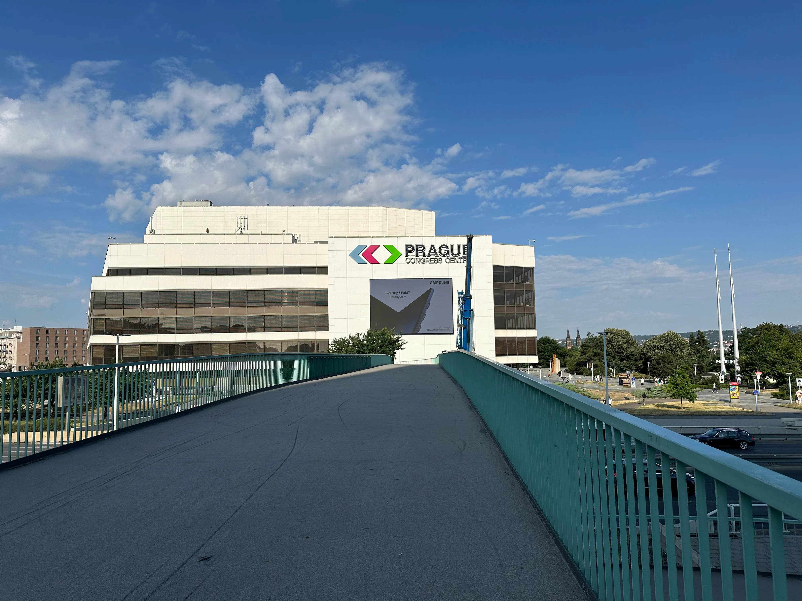
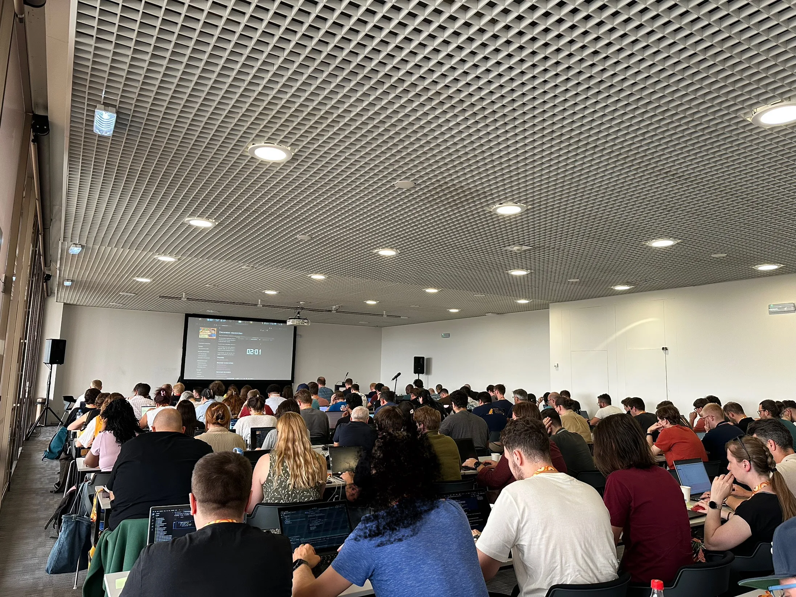
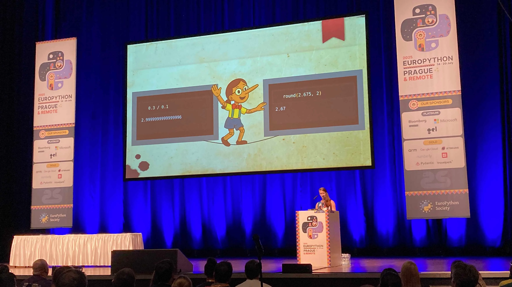
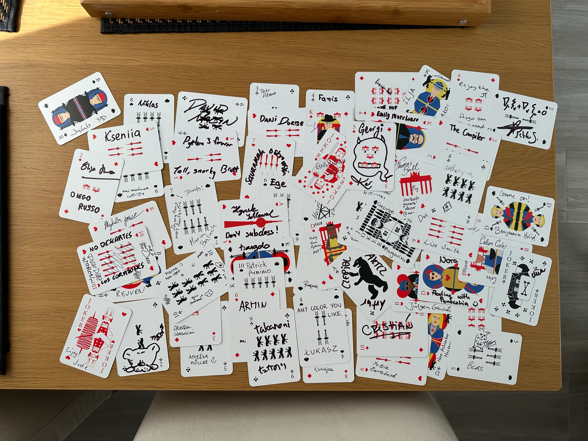
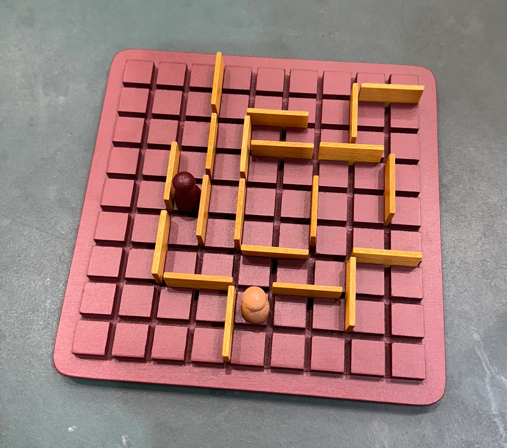
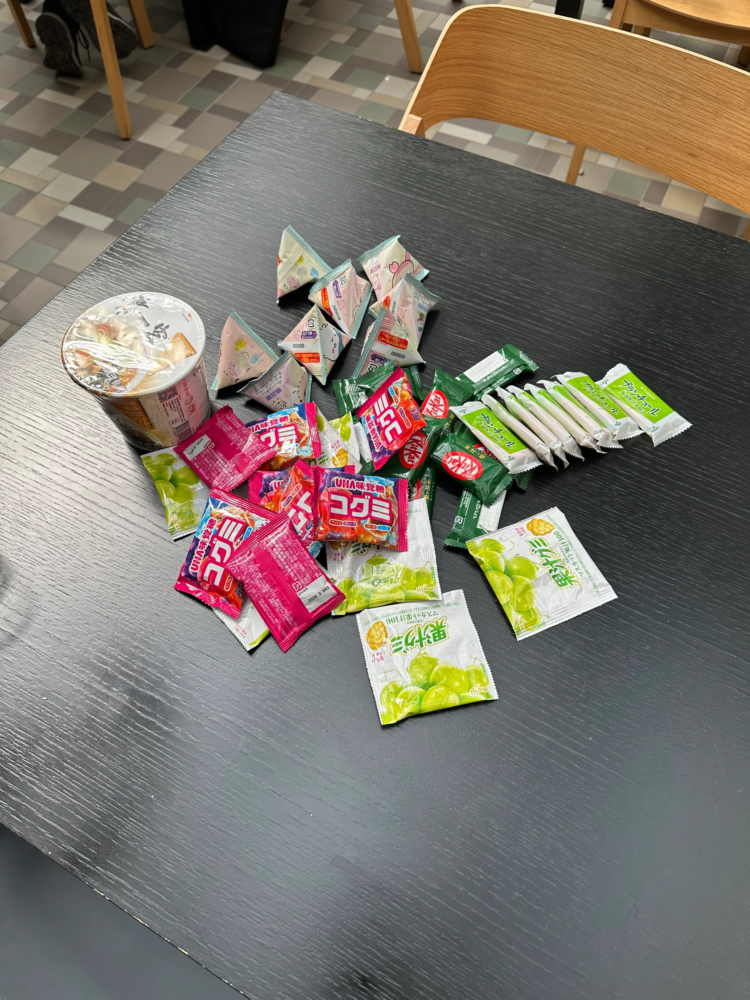
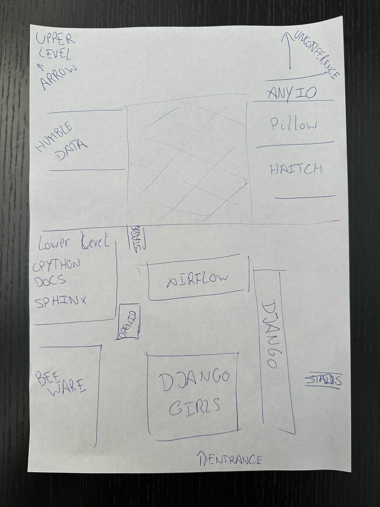

In this article I share my personal highlights of the 2025 edition of the EuroPython conference in Prague, Czech Republic.

===

## EuroPython feels like home

EuroPython was my first in-person conference, ever, and for that reason EuroPython holds a special place in my heart.
The conference is genuinely fun, the community is very welcoming, and the organisers and volunteers are extremely warm, so going to EuroPython doesn't feel like work.

Walking up to the venue on the first day to check-in and get your badge is a really joyful feeling.
Combined that with the fact that EuroPython 2023, 2024, and 2025, were in the same venue/city, I got this warm fuzzy feeling of familiarity as I arrived on Monday morning.

## Badge stickers

Python conferences will usually have stickers for you to put on your badge, to make it your own.
But also, to provide useful information to others meeting you for the first time.

This year, EuroPython prepared badges with dedicated spots to put stickers and they also created a bunch of useful informational stickers that all had the same shape.
The stickers provided included:

 - pronoun stickers for he/him, she/her, and they/them;
 - social interaction indicators for folks who prefer social distancing, elbow bumps, handshakes, or hugs;
 - speaker and tutor stickers;
 - volunteer and organiser stickers;
 - stickers for core developers;
 - stickers for folks participating in the [snack exchange](#snack-exchange); and
 - probably more I can't remember!

That meant it was particularly easy to customise your badge and to provide extra useful information to folks meeting you.

## Co-organising the programme

In my badge picture above you can see an “organiser” sticker.
That's because I was part of the programme team, who is responsible for going over the ~600 proposals that EuroPython receives to create the EuroPython programme that, hopefully, everyone ends up enjoying.

I was part of a wonderful team co-lead by Cristián Maureira-Fredes and Jodie Burchell, who also counted with the help of Marina Moro López, Diego Russo, Naa Ashiorkor Nortey, and Yuliia Barabash.

The work of the programme team is time-consuming and tiring, but it would be impossible without the help of everyone who takes part in the community voting (when past participants vote on the submissiosn that seem interesting to them) and without the dozens of reviewers who participate in the blind review phase, reviewing dozens of proposals, scoring them, and leaving written reviews with their thoughts on why a proposal might look particularly suitable or unsuitable for the conference.
Thank you, everyone!

Despite being a lot of work, I enjoy volunteering with the programme team and hopefully they'll have me again next year!
But my involvement with the conference didn't end with the programme team...

## EuroPython 2025 was... surprisingly tiring!

EuroPython 2025 was my fourth in-person EuroPython conference.
It was simultaneously the best so far, and the most tiring so far.
This year, I did lots of stuff at the conference:

 - I gave a tutorial and a talk ([more on that below](#speaking-at-europython-2025));
 - organised and co-hosted a [Python language and community quiz](/blog/python-quiz-europython-2025-edition);
 - showed up on stage a couple of times to give info and make announcements;
 - reviewed, selected, and ran, the [lightning talks](#poetry-music-and-mascots-at-the-lightning-talks);
 - co-hosted a panel about a Python documentary; and
 - co-organised the [sprints weekend](#sprints-weekend).

All of this work[^1] had some interesting consequences...

[^1]: I'm neither bragging nor complaining. Anyone who steps up can get involved with the organising team and get responsibilities aligned with their willingness to contribute, the dependability they show, and their skill set/interests.

First, as the conference went on, I got very tired, to the point I had to take afternoon naps a couple of days, which is something I don't normally do.
But also...

**So many** people walked up to me and thanked me for the conference!
It was such an amazing feeling to have people smiling, after enjoying however many days of conference they attended, and walking up to me and thanking me for it, implying I had a role in their enjoyment of the conference.

I was taken by surprise for the first couple of “thank you”s, but I quickly figured out what I think is a very good response.
Whenever someone thanked me for the conference, I'd reply “It was a team effort”.

There are 100+ organisers and on-site volunteers that make the conference happen.
I got some visibility because I was on stage a couple of times, and I think that's why people thanked me explicitly, but there are so many folks who devoted so much of their time and energy to the conference...
Even as I'm writing this, 4 weeks _after_ the conference, there are many volunteers still hard at work processing financial aid refunds, working on publishing the talk videos, and more.

Next year, you should also volunteer!

## Speaking at EuroPython 2025

This year I also gave a tutorial and a talk at the conference.

My [decorators tutorial](https://decorators.mathspp.com), on Monday afternoon, was scheduled at the same time as some other very interesting tutorials, some of them by speakers who already have some reputation, so I was afraid I wouldn't have a lot of participants.
I was overjoyed to be wrong, as the room for my tutorial was packed!

After the tutorial I got some brilliant reviews and a couple of participants walked up to me and said they really enjoyed it.
That made my day.

Two days later, Wednesday night, we got a last-minute talk cancellation for 10:30 the next morning, so I happily volunteered to cover that slot with a talk about `itertools`.
Because it was a last-minute cancellation, and because this year's website had a pretty strong cache policy, it was not easy to let folks know that there would be a different talk happening at 10:30.

In fact, when I got to the room and noticed someone sitting close to the front a full **20 minutes** before the talk, I double-checked with them if they were aware that the talk had been changed.
They were disappointed that the original talk was cancelled and then they asked what the new talk was about.
I said “the module `itertools`”, they shrugged their shoulders, and said “eh, why not?”.
That was a fun interaction.

My `itertools` talk was an expanded version of a similar talk I gave at PyCon Italia 2025 earlier this year, and the feedback I got was also very positive.

## Once-in-a-lifetime compliment

Speaking of very positive feedback, this year I got a compliment that I had **never** received.
One EuroPython participant complimented _my hand-washing_!
They said I was very thorough.

I am not sure if they were being sarcastic, though, because there was only one sink available in that restroom and they were waiting for me...

## Poetry, music, and mascots at the lightning talks

This year I was running lightning talks.
This means that I received all lightning talk submissions through the form, I reviewed them to make sure there was nothing inappropriate being submitted, and then performed the selection.
The selection was a mostly-random process that picked some talks from first-time speakers and some talks from experienced speakers.

(For the sake of transparency, the talks that were not randomly selected were Moisés's final lightning talk and the PyPI talk, as I approved those directly, and the talk about learning Japanese with Python, since I recognised the speaker and yanked him from the audience at the last minute, when one of the accepted speakers didn't show up.)

Lightning talks are always one of my favourite sessions of a Python conference, and this year it was no different.
Some of my highlights include Moisés's music performance with other musicians scattered through the audience and an overview of the worst and best Olympic mascots by Emma.

But my personal favourite this year was a lightning talk that explored the issues with floating-point inaccuracies, and possible solutions, recited as a poem.
The title of the talk was “Pynocchia - Tales of Floating Off by just a... bit”.

What I find particularly amusing is how Nora, who was a first-time speaker, said she was very nervous but ended up giving such a memorable lightning talk.
Nora's slides were beautifully illustrated with her main character, Pynocchia, and a handful of animations that played perfectly in sync with the verses that Nora was reciting.

## A tutorial, a talk, and two keynotes

This year I didn't get a chance to attend many talks and tutorials, but I managed to attend a couple of very impactful sessions.

On Tuesday, I attended Reuven Lerner's tutorial on how to build a dictionary.
I've been to plenty of Reuven's talks and tutorials and sometimes I don't even care about the topic!
But I attend Reuven's sessions whenever possible because I learn a lot about giving good talks/tutorials when I do, and this year was no different.

Reuven's tutorial was about building a dictionary-like class in Python, not only from the point of view of implementing the appropriate dunder methods, but also in terms of the data structure that powers dictionaries under the hood.
The format works really well because it's super hands-on and I will steal this “Let's build X” format for tutorials in the future.

I also got the chance to watch Hynek's talk about design pressure.
I was very upset that I couldn't watch it at PyCon US, so I made sure to catch it this time at EuroPython.
It's always good to listen to people with strong opinions because they'll make you think about the way you do things, and Hynek's talk did just that.
One takeaway for me is that “simple” and “easy” aren't the same thing, and while you should strive for the former, you should be wary of the latter.
(Watch the talk.)

I also watched two keynotes that resonated a lot with me and from which I learned a lot: Savannah's and Sebastián's.

Savannah became a Python core developer less than a year ago and she shared part of her story during the keynote.
I found Savannah's keynote inspiring because she tells us that you can be afraid and _still_ do the thing you're afraid of, and that's how she started contributing to Python.
Hopefully, this keynote plus another conversation I had with Pablo Galindo Salgado – another core developer – will be the things that pushed me over the edge to start contributing to Python myself.

Sebastián – @tiangolo online, creator of FastAPI, Typer, and more – also shared his story and he shared some lessons he learned about creating software that others enjoy using.
My main takeaway from his keynote was what he calls the “bus ticket factor”.

Instead of being concerned with the “bus factor” of a project – what would happen to a project if its only maintainer got hit by a bus –, be concerned with the “bus ticket factor” – what it is that the maintainer of the projects gets out of it and what would happen if the maintainer stopped getting it.
For example, suppose you're maintaining a project because you genuinely enjoy it.
You're much more likely to stop maintaining the project because it stops being enjoyable than you are to stop maintaining it because you get hit by a bus.
So, the community should do what they can to make sure you keep getting enjoyment out of maintaining your project.

Oh, and I also liked the slide that Sebastián showed with a weird comment from the Internet.
Someone dislikes FastAPI's documentation because it uses emoji.
According to this random person from the Internet, using emoji in the documentation shows that the author consumes hard drugs.

## Meeting new and old friends

EuroPython, and other Python conferences, aren't really about the talks and tutorials.
I mean, they're a very important part of the conference, but the conference really is about the community.
As Brett Cannon put it, “I came for the language but stayed for the community”.

Since I collect decks of cards, I decided to create a unique EuroPython souvenir for myself.
I took a deck of cards that Jodie brought all the way from Berlin for me (thank you, Jodie!) and I walked around the conference asking people to sign my cards.

I got signatures from core developers and from open source maintainers, from speakers and from first-time attendees.
I got signatures from folks I've known for a long time and from folks who I met 5 minutes earlier.

Some of the folks that I met at this conference for the first time and then got to sign my cards were people that I met at the “main” social event on Thursday.
Sadly, it was a rainy day and it wasn't easy to enjoy the outdoor space that the organisers had booked for us, but thankfully there was also a room indoors where we could play board games.
Participants were supposed to bring their own board games and I brought a couple of my favourite to share with everyone at the social event.

When I was leaving the social event, my friend David Horvath ropped me in a for a game of Quoridor and he absolutely destroyed me.

Oh, and David also mercilessly wrecked me in a number of foosball games during the sprint weekend.

## Snack exchange

This year, EuroPython held an official snacks exchange.
Participants were encouraged to bring snacks from their countries, put a “Snacks Exchange” sticker on their badge, and then exchange snacks with other participants during the conference.

I took a bottle of “ginjinha d'Óbidos” with me, a sweeet Portuguese liquour made from sour cherry, that I shared with friends and other random participants during the Thursday social event.

## Sprints weekend

For me, the conference ended with the sprints weekend.
I was supposed to co-organise the sprints weekend...
But when I got there on Saturday morning, everything had already been sorted out by Anežka Müller and others!
So, all I had to do was stand by the entrance, greet folks as they walked in, and direct them to the place where the project they wanted to sprint on was located...
To help with directing folks to the correct locations, I drew a map of the sprints venue:

As someone remarked, note how the location of the “Arrow” project didn't fit the map, and thus I had to use an arrow to point in the direction of the location of the “Arrow” project.

This year, the sprints were in a different venue from the last two years.
In the past, we had hosted the sprints at a university and we got different classrooms for the different sprints projects.
This time, everything happened in a space that was much more open, split across two levels.
The overall feedback I got was that people enjoyed it more because it felt more communal, instead of everyone being separated from everyone else.

The sprints venue got quieter and calmer as the weekend passed, as folks progressively left the conference to return to their lives.
Come Sunday afternoon, I helped pack everything, I kicked people out of the sprints venue, I had dinner with a random group of friendly folks, and suddenly the conference was over!

I can't wait for next year!
