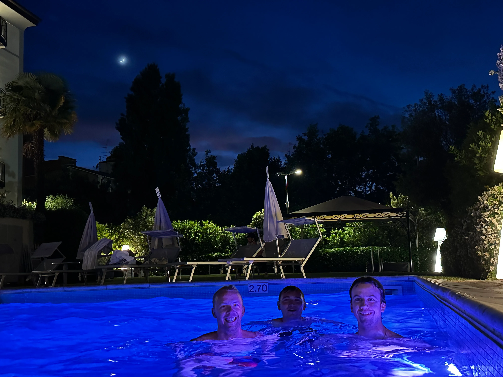

In this article I share my personal highlights of PyCon Italy 2025, including stories and anecdotes.

===


# Personal highlights of PyCon Italy 2025

PyCon Italy is one of my favourite Python conferences.
There is just something about the warmth of the community that is unmatched by other conferences I've been at!
This year was the second time I attended and I want to thank the organisers for helping me attend the conference.

In this article I will share some random stories and my personal highlights of the conference in no particular order.
It's just a brain dump of the experience!


## Sebastián Ramírez's clicker

I went to PyCon Italy to give an [introductory talk to metaprogramming](/blog/dipping-my-toes-in-metaprogramming) but at the last minute I had to prepare a second talk [where I talked about the module `itertools`](/blog/module-itertools-overview).

I haven't bought a clicker for myself yet, although I always ask around for one when I'm presenting...
This time, it wasn't any different, and I got a clicker for the first talk but then that person left the conference.
So, I looked around for someone who could lend me their clicker for the second talk, and eventually I got to Sebastián Ramírez, the creator of FastAPI, Typer, and others.
And just like that, I borrowed Sebastián's clicker!

One of the cool things about the Python community is that these folks that we may look up to, and that are essentially “celebrities” of the Python world, are alwasy very down to Earth and friendly!

(10 minutes before my talk I decided to test the clicker and for my dismay the clicker didn't work.
Every button was working except for the “next slide” and “previous slide” buttons...
Then, I realised they were working, but they were bound to the up and down arrow keys instead of the right and left, so in a last-minute desperate effort I installed some random program I found online and remapped my up/down arrows to the right/left arrows...)


## Lightning talks

Lightning talk are one of my favourite parts of any Python conference – and I don't get why other conferences don't have these.
PyCon Italy 2025 was no exception.

First, PyCon Italy's lightning talks this year featured a pizza wheel that you could spin to get an extra challenge while presenting your talk.
[When I spun the wheel I got the BBQ pizza, so they gave me some sausage glasses](https://www.youtube.com/watch?v=LpGW2Wwxlug).
As far as the challenges went, that was pretty easy to handle.
I am not sure!


I like the sentiment of adding a fun twist to lightning talks, but I am not a huge fan of the challenges they created.
I think lightning talks are already very fun and dynamic and there is no need to make it more confusing for others.
At least, we should figure out a way for others to feel less pressure to play the game.
Spinning the pizza wheel is optional and no one is forced to do it, but there is obvious pressure to do so and it was clear that some folks just spun the wheel because they felt the pressure to do so.

If you _must_ have some sort of “challenge”, maybe the solution is restricting the “challenges” to wearable props?
Maybe there's a table of props and you just pick whatever you want?

Hugo van Kemenade, Python 3.14 and 3.15's release manager, gave a lightning talk about some of the new features that are landing in Python 3.14 and he talked about t-strings and colours in the REPL.
However, he did so with lots of references to Italy, like using t-strings to sanitise strings that included the names of bad Italian dishes.
And when showing off the colours in the REPL, he tweaked the theme to use the colours from the Italian flag.

Another one of my favourite lightning talks from this conference was Andrew's talk about what the terminal can do.
It was very fun and engaging and I was very proud to have worked on Textual, the OSS project on top of which some of the things that Andrew shared were built on, like [posting](https://github.com/darrenburns/posting), a modern API client for your terminal.
The talk culminated with Andrew showing off the [TermOS project](https://github.com/ThatOtherAndrew/TermOS), a “fantasy operating system and desktop environment” built on top of Textual.


## Build the community you want

Last year, my friend Cristián told me something like “we have to purposefully build the community we want”.
His words stuck with me because, well, because they make sense.
The community didn't just materialise like this.
The Python community is welcoming and warm because many people actively choose to be welcoming and warm.
And two of PyCon Italy's keynotes reminded me of this.


First, Sarah's keynote was about raising awareness about web accessibility and some great arguments were made.
Perhaps the most compelling one was that improving accessibility of a website benefits _everyone_, and not just the folks with disabilities.
Then, I got to thinking about how I'd improve the accessibility of my website and how I'd make sure I was making changes for the better and not for the worse.
And then Sarah showed a picture of a talk given by someone with a disability where they say “nothing about us without us”.


In the Q&A section I asked how I could include people with disabilities in the process of trying to make my website more accessible, and Sarah gave a brilliant suggestion: I should add an accessilibity statement to make it clear that I care and I should also add contact details so that others can provide feedback easily.

I am still processing Nicholas's keynote but Nicholas also shared something that stuck with me.
Nicholas talked a lot about how we must pay attention to the way we interact with others, with the world, and with software.
And we must also pay attention to the software we create, because that has impact on how people use it, which means it has impact _on_ the people that use it.

For example, Nicholas is one of the developers and maintainers of the Mu editor and as teachers told them, what makes the most difference to students is that the editor speaks their own language, even if Python has keywords in English.
So, they did it, and the Mu editor now has its interface translated into a bunch of different languages.

What's my point?
I don't know.
Yet.
I just liked what Nicholas said and what his team did.


## Python Quiz

Before the conference I reached out to the organisers because I had the idea of doing a Python quiz about the language and the community.
The organises sounded very interested in it and so they helped me make it happen!
There was a dedicated session in the schedule for the quiz, they got some great prizes for the top 3 players of both rounds (Flipper Zeros, PyCon Italy 2026 tickets, and Microbit Labs!), and they even had me host the quiz.

You [can play the quiz here](/blog/python-quiz-pycon-italia-2025-edition), which featured questions about Python packages, the output of funky snippets of code, the standard library, the community, and more.

I am a big proponent of fairness in general, and in skill-based games in particular.
I took many steps to make sure the quiz was as fair as possible, like sorting the multiple choice options alphabetically to make sure there was no bias in how I distributed them and I made sure to read the question before showing it to the players, so that people who read slowly are not at a disadvantage...
And yet, I managed to commit a terrible blunder!
For one of the questions, the correct answer wasn't available!

The question was about “[the appearing built-in](/blog/til/the-appearing-builtin)”: the fact that the length of the module `builtins` magically increases when in the REPL:

```pycon
>>> import builtins
>>> len(dir(builtins))
159
>>> len(dir(builtins))
160  # ?!
```


## The pink octopus plushie

I've been trying to win one of Kraken's large octopus plushies for a while now...

This time, I randomly got to the booth a minute before the raffle.
I got there, joined the raffle, played a short unrelated challenge that involved trying to throw mini plushies into cups, and the next minute dozens of folks were crowding the booth waiting for the raffle.
They draw a name and it was mine!
And I had just joined, almost by chance!
I'm glad I joined at the last minute.
The others around me weren't.


## PyCon Italy actively fosters the community

PyCon Italy does a great job at fostering lots of moments for social interaction.
Each night, there was something going on that you could attend to hang out with your fellow conference attendees.
The first night, it was the “PyDrink”, which included a moment where some of the conference organises were playing “slide karaoke”.

Organisers formed pairs and had to deliver a presentation based on a random theme and a random set of slide images that they had never seen.
This is a game of improvisation and the only goal is to have fun.
And maybe make the audience laugh.

They played a tournament and after the winner was determined I remarked to Alessia – one of the organisers – that the game is really fun and that I'd love to play.
(I had played slide karaoke once, at EuroPython 2021, over a Zoom meeting.)
Incidentally, at the same time, the host was saying that they had an extra slide deck.
Alessia immediately volunteers me and before I knew it I was playing slide karaoke!

I got paired up with Juliana, a Brazilian, and we played in a slightly different format.
We also didn't know the theme nor the slides beforehand, but I was supposed to present in Portuguese and then Juliana had to translate in real-time.
We had lots of fun and the fact that sometimes the Italians – who supposedly don't speak Portuguese — could understand me better than Juliana was particularly amusing for everyone involved!

For some, this social event culminated in a night swim in the pool!



In the next evening they had the PyDinner, and in the next they had the PyFest.
I didn't go to the dinner but I went to PyFest, which was a party they held in a different venue.


The party started with a live performance by a band that was surprisingly good!
Some people were dancing inside, but you know what they say of developers, so there were lots of folks outside as well.
(I think the dance floor was too large, so the fact that it was sparsely populated didn't help.
At least, I know it didn't help me. 🤪)
When I was outside for a while, I taught Cabo (a card game) to a group of 7 very enthusiastic players and then we played for a few rounds!
In fact, some of the players had already played last year and during the conference they came to me and told me they wanted to play this year again.


## PyCon Italy is such a warm community

PyCon Italy is one of my favourite Python conferences and it's because their community is so warm and welcoming.
I am lucky that so far I only had excellent interactions with all attendees, but the organisers and the volunteers in particular have made me feel right at home for two years in a row, now!

During the closing session, all organisers and volunteers were called on stage and they were applauded by the audience.
They did a great job, so the applause was definitely well-deserved.


After the closing session, and because PyCon Italy had a long history of always holding the conference in the same venue in Florence (it was in Bologna this year), they played a PyCon Italy documentary that was recorded during the 2024 edition.

The documentary included short participations from random attendees (yours truly included), but it was focused mostly on the organisers.
I don't speak Italian, and yet it was moving to watch how many organisers got emotional during the documentary; not only when they were recorded last year, talking about PyCon Italy, but also while watching the documentary.
I don't speak Italian, and yet similarities between Portuguese and Italian allowed me to understand enough of what was said to understand how tightly knit the organisers are and how they feel about each other.
It was a beautiful moment!

I am very grateful for having been welcomed into this community for two years in a row now, and I hope to return next year, from the 27th of May to the 30th.
I already have the dates on my calendar!


