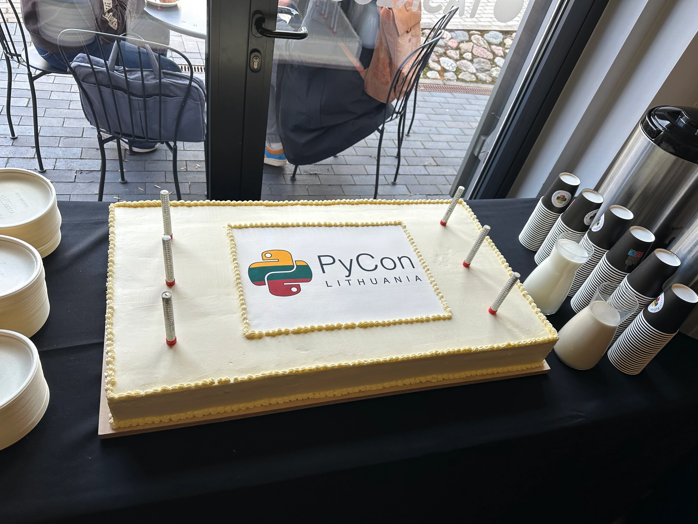
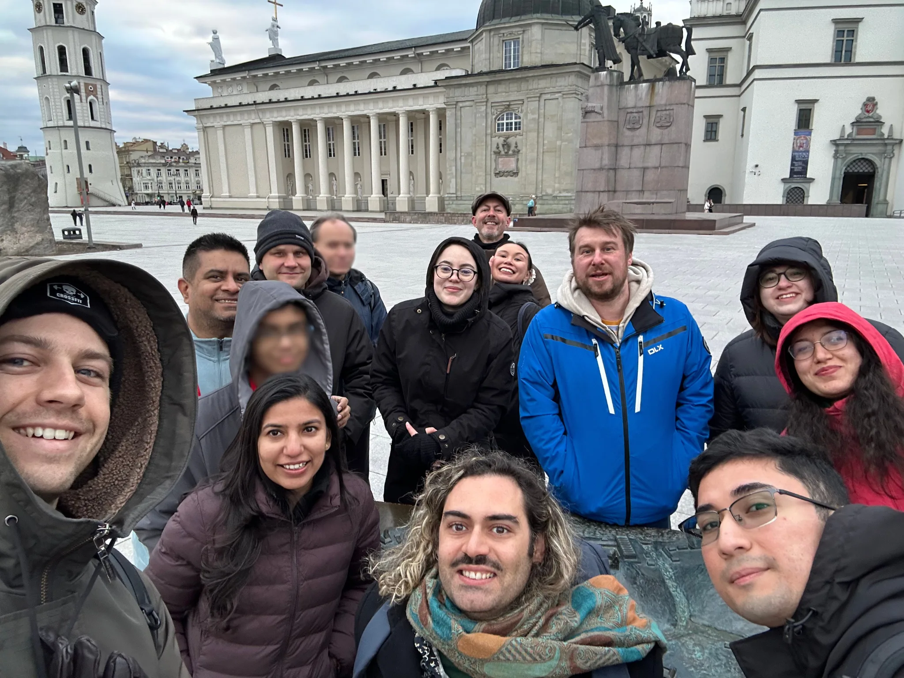
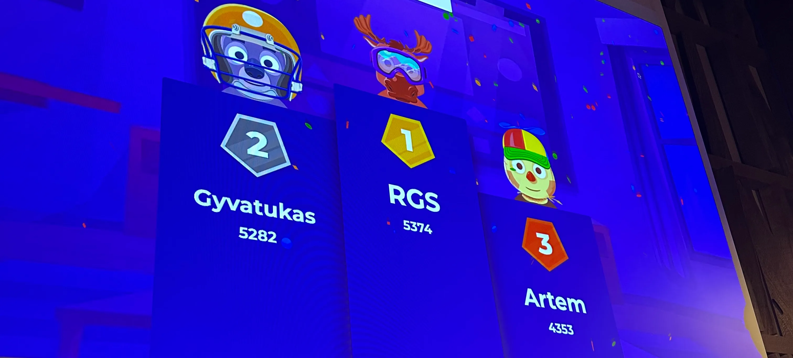
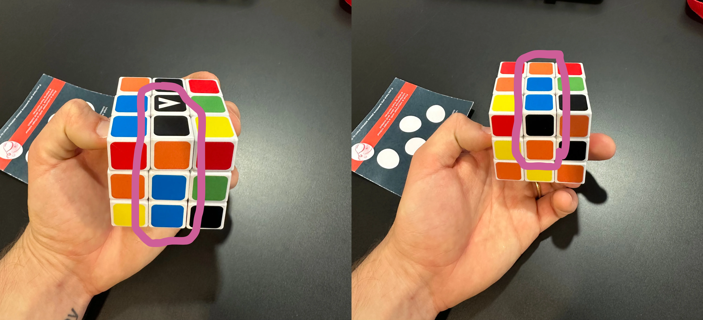
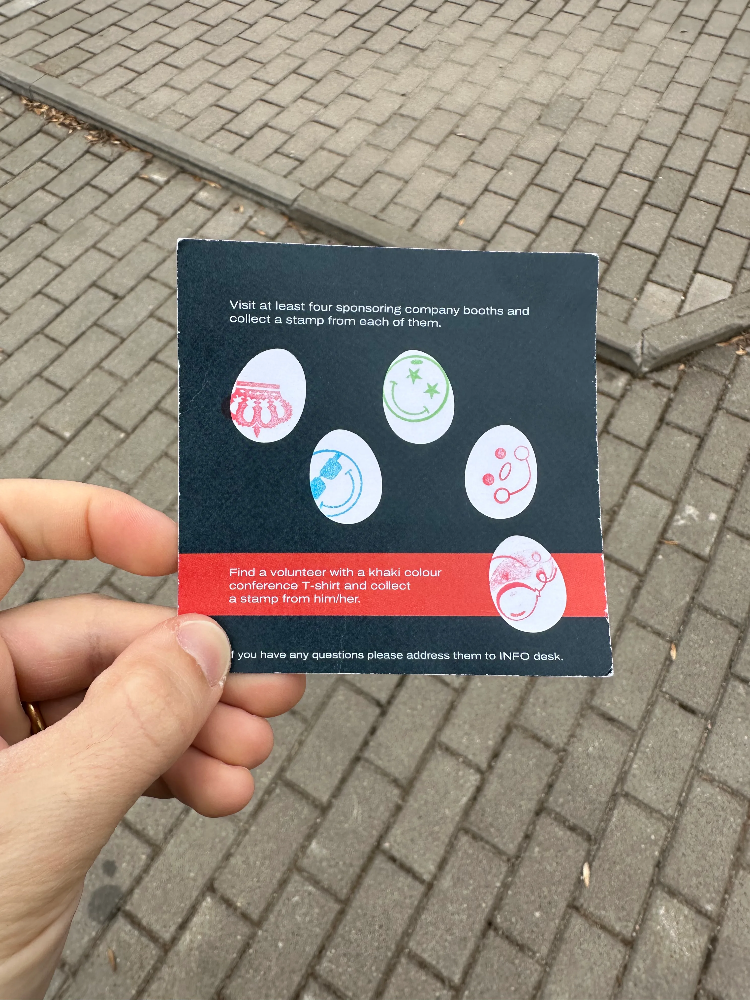
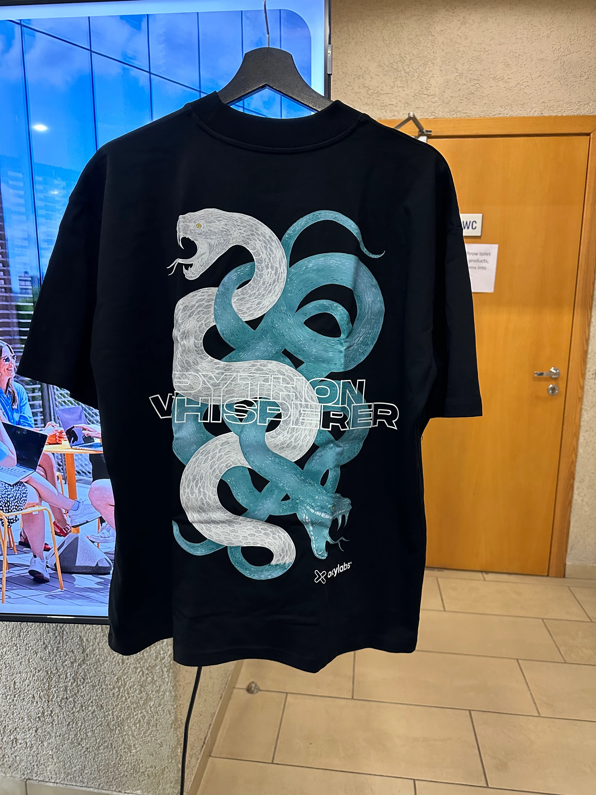
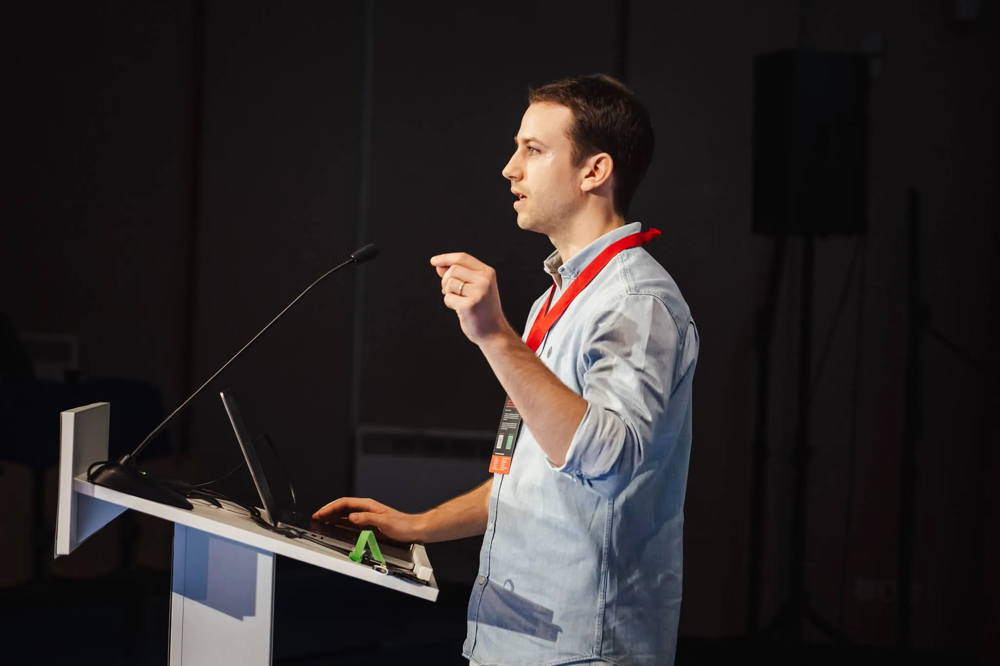
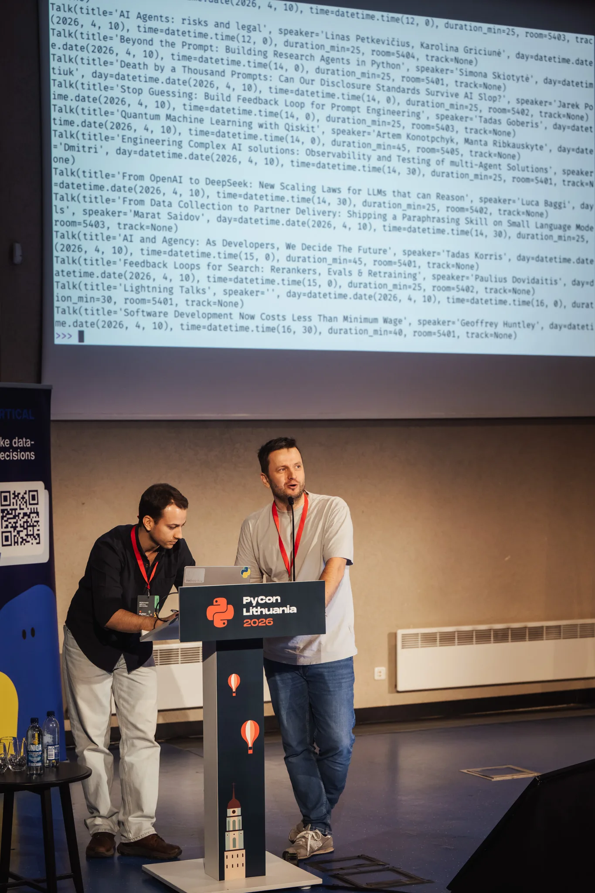
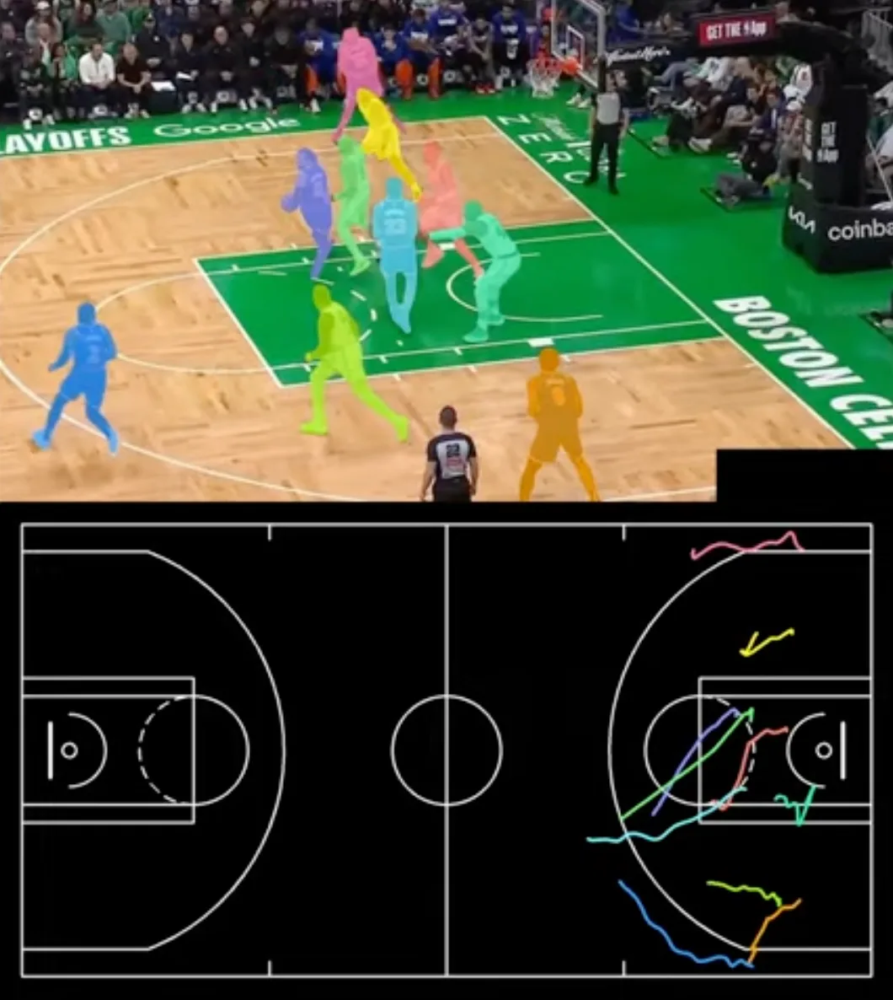

In this article I share my personal highlights of PyCon Lithuania 2026.

===

## Shout out to the organisers and volunteers

This was my second time at PyCon Lithuania and, for the second time in a row, I leave with the impression that everything was very well organised and smooth.
Maybe the organisers and volunteers were stressed out all the time — organising a conference is never easy — but everything looked under control all the time and well thought-through.

Thank you for an amazing experience!

And by the way, congratulations for 15 years of PyCon Lithuania.
To celebrate, they even served a gigantic cake during the first networking event.
The cake was _at least_ 80cm by 30cm:

I'll be honest with you: I didn't expect the cake to be good.
The quality of food tends to degrade when it's cooked at a large scale...
But even the taste was great and the cake had three coloured layers in yellow, green, and red.

## Social activities

The organisers prepared _two_ networking events, a speakers' dinner, and three city tours (one per evening) for speakers.
There was _always_ something for you to do.

The city tour is a brilliant idea and I wonder why more conferences don't do it:

 - Participants get to know a bit more of the city that's hosting the conference.
 - Participants get the chance to talk to each other in a relaxed and informal environment.
 - Hiring a tour guide is typically fairly cheap, especially when compared to organising a full-blown social event in a dedicated venue and with dedicated catering.

I had taken the city tour last time I had been at PyCon Lithuania and taking it again was not a mistake.
Here's our group at the end of the tour, immediately before the speakers' dinner:

The conference organisers even made sure that the city tour ended close to the location of the speakers' dinner _and_ that the tour ended at the same time as the dinner started.
Another small detail that was carefully planned.

The atmosphere of the restaurant was very pleasant and the staff there was helpful and kind, so we had a wonderful night.
At some point, at our table, we noticed that the folks at the other two tables were projecting something on a big screen.
There was a large curtain that partially separated our table from the other two, so we took some time to realise that an impromptu Python quiz was about to take place.

I'm (way too) competitive and immediately got up to play.
After six questions, which included learning about the existence of the web framework _Falcon_ and correctly reordering the first four sentences of the Zen of Python, I was crowned the winner:

The top three players got a _free_ spin on the PyCon Lithuania wheel of fortune.

## Egg hunt and swag

On each day of the conference there was an egg hunt running throughout the full day.
You'd get stamps by talking to sponsors, which is a fun way of getting more people to talk to sponsors, and each card would have a random side quest.
One of those side quests was to solve a Rubik's cube.
The conference had two you could play with, but one of them was rigged:

The face of the cube that should be blue is shown on both pictures (find the blue central square).
On the left, we see that the black face is neighbouring the blue face.
On the right, we see that the orange face is neighbouring the blue face.

On the left, you see a piece at the top that is black and orange, which means that the orange and black faces are also neighbouring.
On the other hand, the two highlighted regions are contiguous and show that the black and orange faces are opposite to each other.

I think this was a small prank they were playing on the folks that already knew how to solve the cube and were lucky to get that random side quest.
I got a different side quest, but at some point wanted to play with the cube and noticed someone had messed up with it.

After chatting with some sponsors and stumbling on the only volunteer that had the t-shirt with the colour I was looking for, I managed to collect all my stamps for my egg hunt:

After spinning the wheel of fortune, I won the book “[Agentic Architectural Patterns for Building Multi-Agent Systems](https://www.packtpub.com/en-us/product/agentic-architectural-patterns-for-building-multi-agent-systems-9781806029563)” published by Packt.

I also managed to get a _Python Whisperer_ t-shirt by [Oxilabs](https://oxylabs.io):

They raffled some of these t-shirts among folks who played the 5-minigame challenge they had at their booth.

## Lightning talks

The lightning talks are one of my favourite parts of all Python conferences.
I gave a [Python quiz lightning talk](/blog/who-wants-to-be-a-millionaire-iterables-edition) on the first day and then did a short performance entitled “What the Python?” on the last day:

I will link to both lightning talks here when their recordings are up.

My favourite lightning talks this year, in no particular order:

 - **Surviving a rapid river**: James Donahue's talk about how to survive a rapid river, which at one point featured James laying down on top of some tables to demonstrate the technique he was describing
 - **PyCon Lithuania's anthem**: Kader Miyanyedi got some audience participation going to create a hip-hop anthem for PyCon Lithuania
 - **Building from first-principles**: the two lightning talks by the 13 year old Viraj Sharma, who walked us through the code he wrote to implement two algorithms from first principles

An honourable mention goes to the speaker who got us to reflect about the parallelism between the democratisation of art and the democratisation of software that the advent of LLMs brought.

I was also randomly roped into Aidis Stukas's lightning talk where he showed off the package `pycon-lithuania`.
His computer couldn't connect to the projector, so I lent him my computer.
But he also didn't want to type the short demo during the lightning talk, so he asked me to go present with him:

I typed the commands and the short snippets of code while he presented his package.
He told me that maybe one day you'll be able to submit to the CFP through his package.

## Talks

I had a talk about `itertools.tee` scheduled for the first day and ended up giving a second talk to cover for a last-minute cancellation on the second day about generators, duck typing, and branchless conditionals.
[The slide decks and reference materials are already available](/talks) and I'll link to the YouTube videos when they go up.

My favourite talk was Piotr Migdał's “[Vibe reverse engineering of old games and new hardware](https://pycon.lt/2026/talks/HLCPZ9)”.
With the help of LLMs, Piotr went from reverse-engineering and replicating old games to hacking the LED display of his backpack.

The keynotes were also very interesting.
The [closing keynote of the conference, by Geoffrey Huntley](https://pycon.lt/2026/talks/H3RL3Q), was a bit too gloomy for my personal taste, but left me “pondering the ponderoos” about LLMs and the future of programming.

My favourite keynote was Piotr's “[Computer Vision, Meet Sports](https://pycon.lt/2026/talks/VCZ7VK)”, where Piotr showed how he applied all sorts of computer vision models and techniques to analyse games of basketball:

The screenshot above is from one of [Piotr's YouTube videos](https://www.youtube.com/watch?v=yGQb9KkvQ1Q).
In the talk (and in the video linked) Piotr walked us through the many challenges faced when trying to segment players, track them, identify them, and classify their role throughout the game and each play.
Piotr also told us about the models and techniques used to solve those challenges.
It was a very interesting technical keynote.

## And now for something completely different

Earlier today, the day after the final day of the conference, I was walking back to the hotel after having lunch to get my luggage before going to the airport.

As I was crossing the street right in front of the hotel, I saw someone had caught their jacket with the car door.
The end of their jacket was outside the car.
After a bit of gesturing to the passenger, the puzzled lady understood what I was trying to say, opened the car door, and got her jacket fully inside the car.

As I was moving away from the car, I heard the driver open their car door and shout “Thank you, Rodrigo”.
I was obviously caught off guard.
How come a random Lithuanian driver knows me?
When I looked back, I saw Aidis — one of the organisers — smiling.
That was a very quirky final event at PyCon Lithuania 2026!
