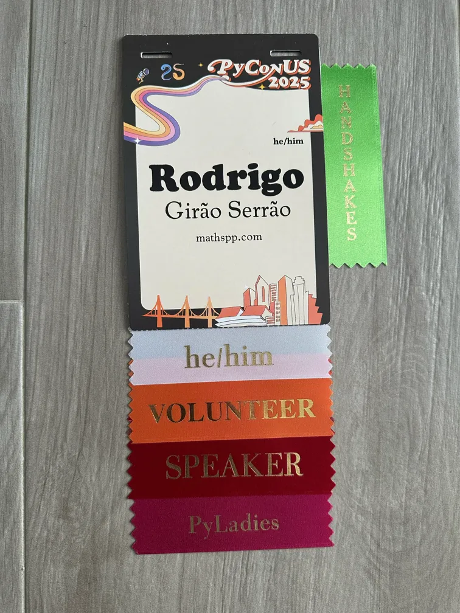
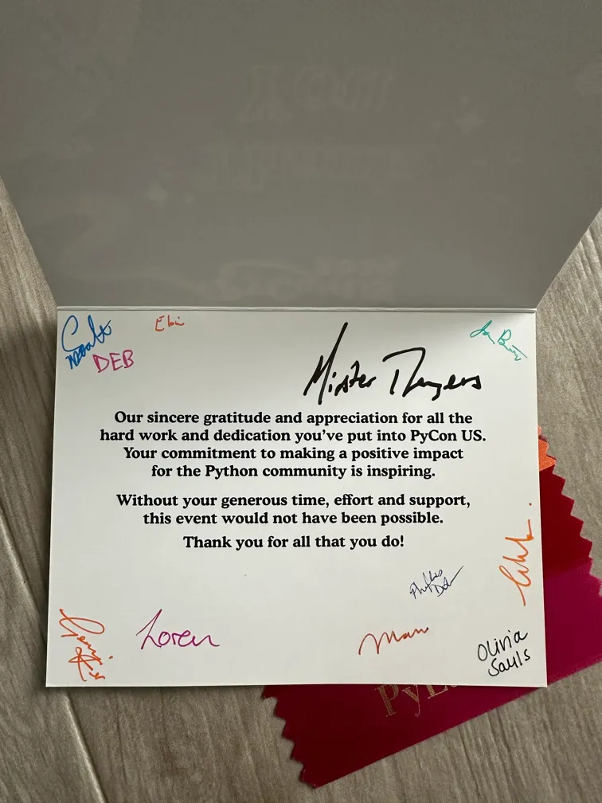
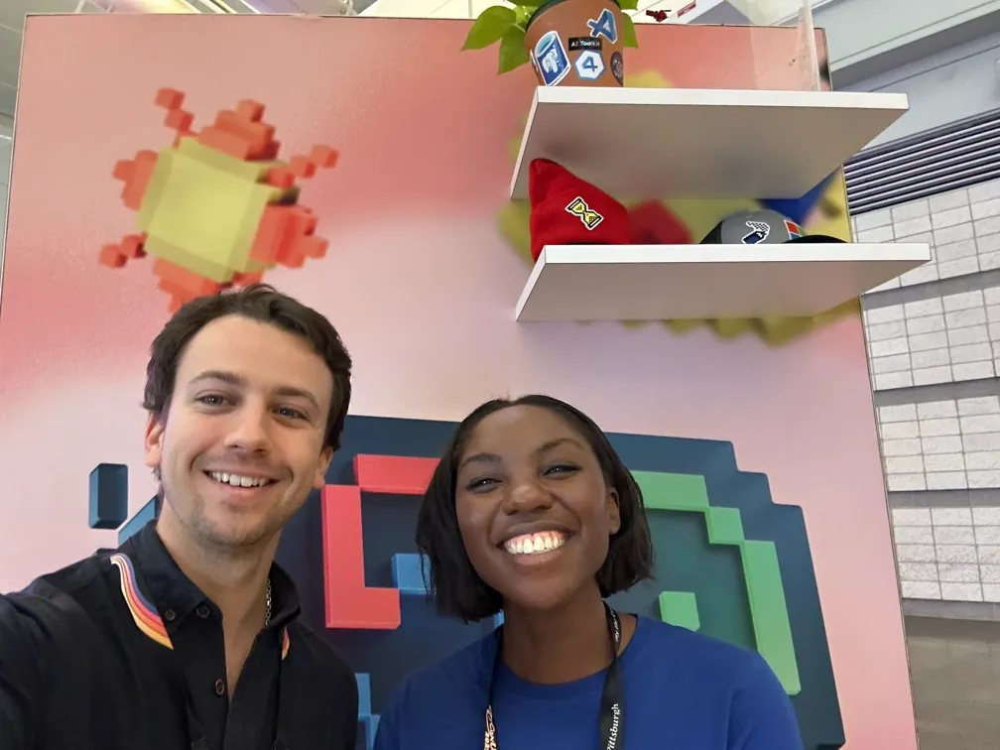
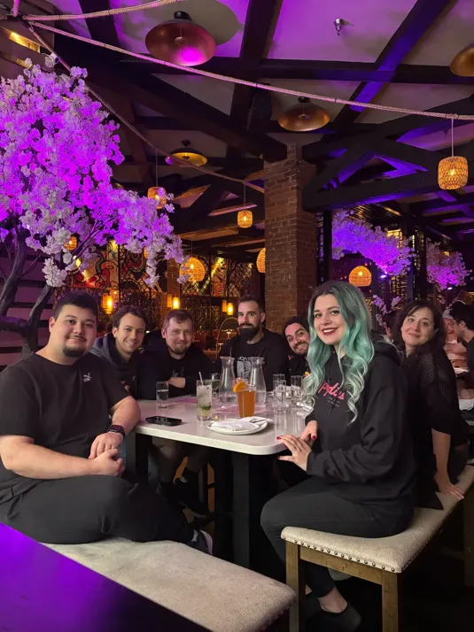
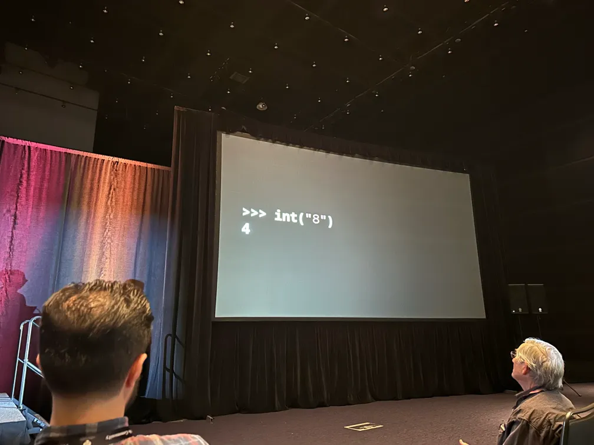
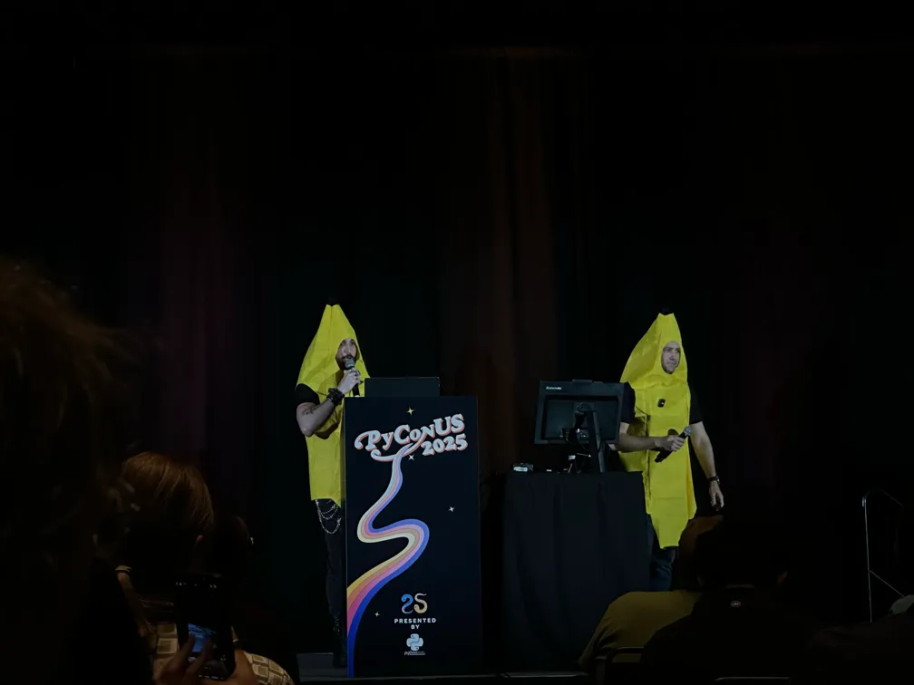

In this article I share my personal highlights of the 2025 edition of the PyCon US conference,.

===

# Personal highlights of PyCon US 2025

This year was the second time I went to PyCon US and that would have not been possible without the help of the [PyCon US travel grants](https://us.pycon.org/2025/attend/travel-grants/).
So, first and foremost, thank you to PyCon US for the opportunity!
Next, I'd like to express my heartfelt appreciation for _everyone_ involved in making the conference possible, especially the volunteers and organisers.
Thank you!

This article won't be very well structured, it's just a brain dump of my personal highlights for the conference!
Here I go.

## My personal involvement

To get this out of the way, I had the opportunity to give a tutorial ([“Reimplementing the module `itertools` for fun and profit”](https://us.pycon.org/2025/schedule/presentation/93/)), a talk ([“503 days working full-time on FOSS: lessons learned”](https://us.pycon.org/2025/schedule/presentation/164/)), and a lightning talk ([“Meta lightning talk”](https://us.pycon.org/2025/schedule/presentation/168/)).
The participants engaged with me during my tutorial, asked lots of questions, and seemed to enjoy the exercises I gave them.
I also got some excellent feedback following my talk, so I am very happy about that.

The organisers also gave me, and every other speaker, a very kind “thank you” note where they shared their appreciation, that they all signed.
As if organising the whole conference wasn't enough hard work, they went through the trouble of signing each note by hand...
These small things are why I love the Python community so much!

## The people & socialising

PyCon US hits different than the European conferences because it's where you get to meet many people that are based in the US (or elsewhere) and that don't usually go to European conferences.
PyCon US aggregates a huge number of people, and if I go ahead and list everyone I was happy to see at the conference, I will both

 1. spend the next couple of hours typing; and
 2. inevitably forget someone.

Instead, let's just say I was particularly happy for finally meeting [Marlene](https://x.com/marlene_zw), who I “met” on Twitter, Jim, and Mike.
I had good conversations and moments with dozens of others and that's what “I came for the language but stayed for the community” means to me.

I'd also like to thank Anaconda and Astral for the two “parties” I was at on Friday and Saturday, which provided a venue and food so that dozens of us could hang out after the conference ended for the day and to keep the conversations going.

One of the nights, I found myself at the Westin lobby listening to Pablo talk about his PhD thesis on theoretical physics.
I don't know for how long I was there.
Maybe 2 hours?
I was completely wrecked since I had been sleeping so little the previous nights to finish the prep for my tutorial and talk.
Plus, Pablo's PHD THESIS wasn't on some trivial topic.
It's a PhD thesis.
In theoretical physics.
I did my best to keep up with the conversation.
I'm not sure if I succeeded.
I feel like I understood some of the intuition behind is work: not sure if it's because his explanations were good, if it's because I still remember some things from my master's in maths, or if I just hallucinated my comprehension.

In some order I can't remember, we were joined by others _and_ the conversation itself degenerated into talking about the similarities and differences between Portuguese from Portugal, Portuguese from Brazil, Spanish from Spain, and Spanish from the many countries in South America that speak Spanish.
I say the conversation "degenerated" because we weren't really having an intellectual discussion about linguistics.
No.
Pablo showed me a video of a crab doing pull-ups...
That's was the level of the conversation!

On my last night in the US I had dinner with some fellow volunteers and organisers from EuroPython, which was also a very good time.

## Keynotes

Keynotes this year were very good, in my opinion.
Cory Doctorow's keynote left an impression on me but I will be honest: I had a very hard time following the keynote since the pace was _very_ quick and the speaker used lots of words that are far from trivial.

In her keynote, Dr. Kari L. Jordan shared a despicable story from 20/30 years ago, of a woman who had been working long nights, processing hundreds of files, one by one, on 6 computer terminals in parallel.
One day, she attended a workshop (led by the nonprofit Dr. Kari was representing), and in that workshop they taught people how to use loops in the terminal.
The woman immediately started crying...
Because from her colleagues' remarks, she understood they already knew how to use loops in the terminal and they knew what she had been doing for nights on end...
And, instead of teaching her, they just thought it was funny that she spent her nights like that!

Teaching others empowers them.
Whenever you have the chance, teach.

I also related a lot to Lynn Root's keynote.
Among other things, Lynn talked about the importance of play, and shared an anecdote of [a crow that was filmed going down a snowy roof with a plastic lid over and over again](https://www.youtube.com/watch?v=L9mrTdYhOHg) just for the heck of it.

I was also particularly fond of a marvelous quote she shared:

 > “Critics who treat 'adult' as a term of approval, instead of as a merely descriptive term, cannot be adult themselves. To be concerned about being grown up, to admire the grown up because it is grown up, to blush at the suspicion of being childish; these things are the marks of childhood and adolescence. And in childhood and adolescence they are, in moderation, healthy symptoms. Young things ought to want to grow. But to carry on into middle life or even into early manhood this concern about being adult is a mark of really arrested development. When I was ten, I read fairy tales in secret and would have been ashamed if I had been found doing so. Now that I am fifty I read them openly. When I became a man I put away childish things, including the fear of childishness and the desire to be very grown up.” – C.S. Lewis

## Tutorials & talks

During the two tutorial days I volunteered for Reuven Lerner's [“Comprehending comprehensions” tutorial](https://us.pycon.org/2025/schedule/presentation/106/) and for Trey Hunner's [“Decorators Demystified” tutorial](https://us.pycon.org/2025/schedule/presentation/106/).
I did so because I enjoy their pedagogical skills and wanted to see what I could learn from them as I watched them teach.
I was particularly interested in Trey's tutorial because I'm giving a tutorial on decorators at EuroPython later this year, so I wanted to see if my plan was aligned with what Trey did.

I am also happy about a small interaction that happened during Trey's tutorial.
At some point someone asked Trey why we'd use `functools.partial` instead of a simple mockup of `functools.partial` that was being displayed as an example of functions manipulating functions.
Trey pointed out a couple of differences and then remarked “I think there are more differences... Rodrigo, do you know any?”.
I was at the back of the room and didn't expect the impromptu quiz!
I don't think I'm particularly quick on my feet, but I managed to point out another benefit of using `functools.partial`, so that made me smile!

I did not watch _many_ talks, but I watched some.
I watched Marie's and Yngve's talk [“Why `len('😶‍🌫️') == 4` and other weird things you should know about strings in Python”](https://us.pycon.org/2025/schedule/presentation/27/) and I don't think I'd ever seen a talk with two speakers that was so well presented.
Usually, a talk with two speakers just means it's going to be extra messy, but they were clearly well prepared and managed to baffle me with all sorts of weird intricacies of the Unicode standard.

I enjoyed Mike's talk [“Detecting Honeybee Swarms Using the Integration of OpenCV, Pandas, AI, and PyTorch”](https://us.pycon.org/2025/schedule/presentation/20/), where Mike shared how he set up some hardware to help him detect if his bees were swarming or not, in an attempt to better control the swarm (you don't want 30,000 of your bees nesting in a neighbour's house...).
The talk shared the hardware setup and also the code that drives everything and it's very interesting seeing how folks apply Python to their daily lives.

I also regretted having missed Pablo's and Yuri's talk [“Zoom, Enhance: Asyncio's New Introspection Powers”](https://us.pycon.org/2025/schedule/presentation/116/) since the two speakers had a whole performance going on, as they presented their talk dressed up as bananas.
When I entered the room, they were concluding the talk and when they opened the floor for questions, Łukasz Langa walked in dressed up as a banana.
He asked “what they thought the author of `asyncio` thought of their work”.
Since Guido is the author of `asyncio`, Guido walked in _also dressed up as a banana_ and replied “I think it's bananas!”.

## Lightning talks

Lightning talks are one of my favourite moments of Python conferences: a time during which a number of folks present short talks (5 minutes max, strictly enforced) on all sorts of random topics.
This year, my favourites included

 - a brilliant and engaging talk on how to give a talk by Peter Sobot;
 - Ee Durbin sharing they're trying to create a PyCon timezone (a timezone that aligns with the geographical location of PyCon US each year);
 - a demonstration of how someone's trying to use Python and computer vision to improve their archery skills by Quang Vu;
 - a chaotic quiz where the audience had to distinguish valid regex patterns from line noise by Mason Egger; and
 - the announcement of a site where you can review the swag that the sponsors are handing out by Cheuk Ting Ho.

I also gave a lightning talk on why you should give a lightning talk and how you can prepare for it, but if I had known that Peter was giving a similar talk, I would have stayed out of Peter's way!
