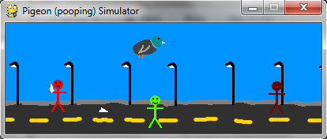

Este artigo tem um único propósito: partilhar um jogo estranho que fiz, inspirado pelo Flappy Bird e pelo meu professor (maluco) de Inglês.

===

A inspiração para este jogo veio durante uma aula de Inglês, em que o meu professor de Inglês disse, em jeito de piada, que devia haver um jogo que fosse um simulador de pombos.
Claro que eu levei aquilo muito a sério e criei este pequeno jogo: um jogo onde andamos a voar por cima de pessoas e tentamos fazer-lhes cocó em cima.

O jogo funciona de um modo muito simples: basta carregar na tecla do "espaço" para fazer cocó e tentar acertar nas pessoas por baixo de nós. Carregar no **Q** fecha o jogo e
usar as teclas **+** e **-** no ecrã inicial permite-nos alterar a velocidade a que voamos (voar mais depressa faz com que o jogo seja mais difícil).

O objetivo é acertar no maior número de pessoas possível, sabendo que não podemos estar a fazer cocó _constantemente_: há um pequeno intervalo de tempo, intencional, entre cada
duas tentativas de arruinar a vida às pessoas por baixo do pombo. Depois de andarmos por aí a voar e a fazer cocó durante 60 segundos, aparece o ecrã final que nos diz qual a 
percentagem dos cocós que acertaram em pessoas e qual a percentagem de pessoas a quem conseguimos arruinar o dia.

O jogo foi escrito em Python 3 com pygame e podem encontrar [neste respositório do GitHub](https://github.com/RojerGS/minigames/tree/master/pigeon-simulator) o código e as imagens.
Um executável Windows pode ser encontrado [nesta pasta do Drive](https://drive.google.com/open?id=0ByBeLS6ciLYVWElhc2dZdFc1Ykk).
Para se poder correr o jogo, é necessário deixar a pasta tal e qual como está.