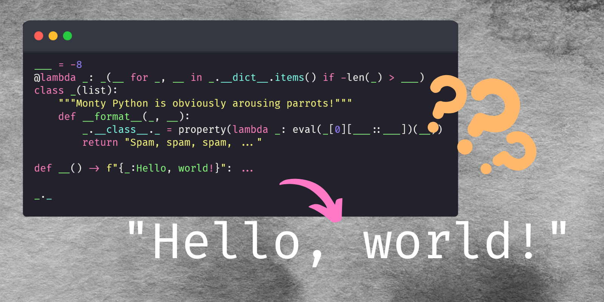

This article is a gentle introduction to property-based testing with the Python library Hypothesis.

===





# What is property-based testing?

Tests help you find bugs in your program.
The way this typically works is straightforward:

 - you give some input to your program;
 - you let your program produce the output; and
 - you compare the program output with the expected output.

If there is a mismatch between the program output and the output you expected,
you raise an exception or print a huge red warning on the screen.

With **property-based testing**, you still raise an exception or print a huge red warning on the screen if something is wrong.
However, you use a different mindset to try and find the bugs in your program.

The name **property-based testing** really does tell you what it is:
it is testing your code by making sure that the results produced satisfy the properties that they should satisfy.


# What is Hypothesis?

[Hypothesis] is a Python library that lets you write property-based tests.
Hypothesis enables you in two different ways:

 1. it lets you write tests in which you check properties of the expected output; and
 2. it generates random test cases for you.

The second bullet point is useful for multiple reasons:

 1. Hypothesis generates many more tests than the ones you would be bothered to write down in your tests;
 2. Hypothesis generates tests that are more extreme than the ones you will realistically write in your tests (for example, Hypothesis will test your code with longer lists or bigger integers);
 3. Hypothesis is not biased towards the edge cases that you considered explicitly, because it wasn't Hypothesis that wrote your code;
 4. ...


# What is an example of property-based testing?

Imagine you implemented your very own sorting algorithm.
Now that it is implemented, you need to test it!

In a “traditional” test, you would write something like this:

```py
def my_sort(iterable):
    ...

# List of pairs, (to_be_sorted, sorted_result)
test_cases = [
    ([5, 2, 3], [2, 3, 5]),
    ([10.5, 8.5, 3.2, 0.9], [0.9, 3.2, 8.5, 10.5]),
    ([-3, -2, -1], [-3, -2, -1]),
]

for inp, out in test_cases:
    assert my_sort(inp) == out
```

We list a couple of inputs and the respective outputs and then we apply our function to all of the inputs,
checking if the result matches the expected outputs.

In writing property-based tests for the function `my_sort`, we could write something like this:

```py
def my_sort(iterable):
    ...

def test_sorted_result_properties(iterable):
    result = my_sort(iterable)

    # Is the result actually sorted?
    for left, right in zip(result, result[1:]):
        assert left <= right
```

Our test function accepts the input, computes the output, and then checks that the output is actually sorted!
As you read through this article, you will gain a better understanding of why this is different from what we did in the “traditional” example and why this is useful.


# Using Hypothesis

In this article we will use Hypothesis together with `pytest`.
There is nothing to prevent you from using Hypothesis with other testing libraries,
but I enjoy using `pytest` and will go with it in this article.


## Installation

To install both `pytest` and Hypothesis, run the following command:

```bash
λ python -m pip install hypothesis pytest
```

!!! If you want to learn more about `pytest`,
!!! head over to [the `pytest` documentation][pytest].


## Code to test

Suppose we implemented a function `gcd(n, m)` that computes the [greatest common divisor](https://en.wikipedia.org/wiki/Greatest_common_divisor) of two integers.
(The greatest common divisor of `n` and `m` is the largest integer `d` that divides evenly into `n` _and_ `m`.)
What is more, suppose that our implementation handles positive and negative integers.
Here is what this implementation could look like:

```py
def gcd(n, m):
    """Compute the GCD of two integers by Euclid's algorithm."""

    n, m = sorted([n, m])  # Sort their absolute values.
    while m % n:         # While `n` doesn't divide into `m`:
        n, m = m % n, n  # update the values of `n` amd `m`.
    return n
```

If you save that into a file, say `gcd.py`, and then run it with

```bash
λ python -i gcd.py
```

you will be able to define your function and then hop into a REPL with your function defined.
In there, you can play with it a bit:

```pycon
λ python -i main.py
>>> gcd(15, 6)
3
>>> gcd(15, 5)
5
>>> gcd(9, 15)  
3
```

Now that the function is running and looks about right, we will test it with Hypothesis.


## Testing the code

This is a very small toy example, so we will add the test next to the function itself.

First, we can write a function that accepts the same inputs as the function `gcd` itself:

```py
def test_gcd(n, m):
    ...
```

Now, we have to fill in the function with the properties we want to test...
But what properties are those?
The greatest common divisor is a number that satisfies all of these properties:

 - it divides `n`;
 - it divides `m`; and
 - it is the greatest number that satisfies the two conditions above.

The last property could also be rephrased as such:

 - no integer above it can divide both `n` and `m`.

Therefore, that is what we are going to check in our test:

```py
def test_gcd(n, m):
    d = gcd(n, m)

    assert n % d == 0  # d divides n
    assert m % d == 0  # d divides m

    # Ensure no integer above d divides both n and m.
    for i in range(d + 1, min(n, m)):
        assert (n % i) or (m % i)
```

Now, the test function `test_gcd` needs to be given the inputs that Hypothesis generates, right?
That is what we will do now.

First, we need to decide what are the legal inputs for our function `gcd`,
which should be all integers.
Then, we need to tell Hypothesis to feed two integers to our test function.

To do that, we need to import a couple of things:

```py
from hypothesis import given, strategies as st
```

`given` is what we will use to tell Hypothesis that a test function needs to be _given_ data.
The submodule `strategies` is the module that contains lots of tools that know how to generate data.

With these two imports, we can annotate our test:

```py
from hypothesis import given, strategies as st


def gcd(n, m):
    ...


@given(st.integers(), st.integers())
def test_gcd(n, m):
    d = gcd(n, m)

    assert n % d == 0  # d divides n
    assert m % d == 0  # d divides m

    # Ensure no integer above d divides both n and m.
    for i in range(d + 1, min(n, m)):
        assert (n % i) or (m % i)
```

You can read the decorator `@given(st.integers(), st.integers())` as
“the test function needs to be given one integer, and then another integer”.
To run the test, you can just use `pytest`:

```bash
λ pytest gcd.py
```

As soon as you do so, `pytest`/Hypothesis will scream at you with an error message,
saying you got a `ZeroDivisionError`.
Let us try to understand what Hypothesis is telling us by looking at the bottom of the output of running the tests:

```bash
λ pytest gcd.py
============================ test session starts ============================
platform win32 -- Python 3.9.7, pytest-6.2.5, py-1.11.0, pluggy-1.0.0
rootdir: C:\tmp\hyp
plugins: hypothesis-6.50.1
collected 1 item

gcd.py F                                                               [100%]

================================= FAILURES ==================================
_________________________________ test_gcd __________________________________

    @given(st.integers(), st.integers())
>   def test_gcd(n, m):

gcd.py:14: 
_ _ _ _ _ _ _ _ _ _ _ _ _ _ _ _ _ _ _ _ _ _ _ _ _ _ _ _ _ _ _ _ _ _ _ _ _ _ _
gcd.py:15: in test_gcd
    d = gcd(n, m)
_ _ _ _ _ _ _ _ _ _ _ _ _ _ _ _ _ _ _ _ _ _ _ _ _ _ _ _ _ _ _ _ _ _ _ _ _ _ _

n = 0, m = 0

    def gcd(n, m):
        """Compute the GCD of two integers by Euclid's algorithm."""
    
        n, m = sorted([n, m])  # Sort their absolute values.
>       while m % n:         # While `n` doesn't divide into `m`:
E       ZeroDivisionError: integer division or modulo by zero

gcd.py:8: ZeroDivisionError
--------------------------------- Hypothesis ----------------------------------
Falsifying example: test_gcd(
    m=0, n=0,
)
=========================== short test summary info ===========================
FAILED gcd.py::test_gcd - ZeroDivisionError: integer division or modulo by zero
============================== 1 failed in 0.67s ==============================
```

This shows that the tests failed with a `ZeroDivisionError`,
and the line that reads “Falsifying example: ...”
contains information about the test case that blew our test up.
In our case, that was `n = 0` and `m = 0`.
So, we are just starting, and Hypothesis is already telling you 


[Hypothesis]: https://hypothesis.readthedocs.io/
[pytest]: https://docs.pytest.org/
