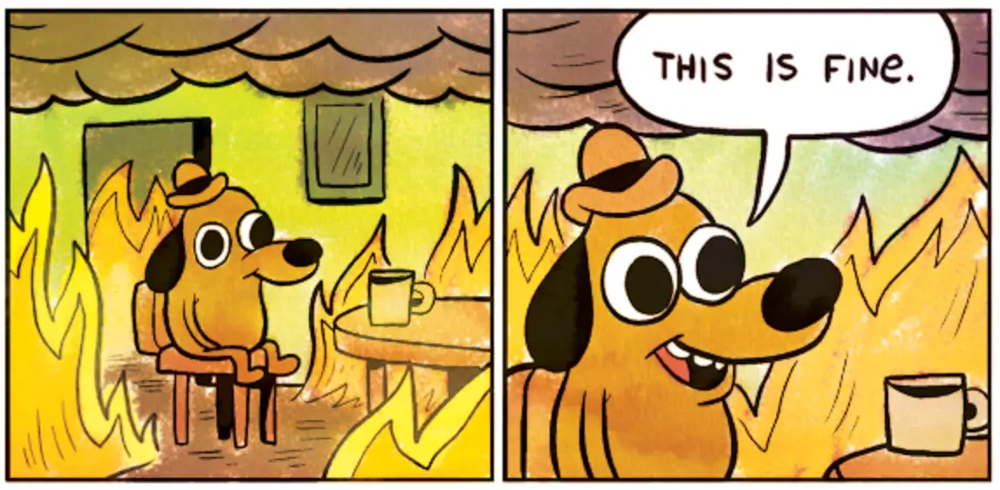

The PyCon Portugal 2025 programme appears to be dominated by a mafia of a few speakers... Let me explain!

===

## Programme composition

[PyCon Portugal 2025](https://2025.pycon.pt/talks/schedule/) had a total of 18 talks (2 keynotes + 16 regular talks) and 6 workshops, for a total of 24 sessions.
This means that PyCon Portugal 2025 could have given the opportunity to 24 different speakers to lead a session.
Instead, PyCon Portugal had 19 distinct speakers, including a duo that led one of the keynotes.
More specifically, there were 5 speakers who were responsible for 11 sessions.
Why?

## The selection process

When the programme team was selecting the talks and workshops, we started by selecting the workshops because we always have fewer quality workshop proposals, making it easier to do the selection.
The blind reviews made it even easier and we ended up selecting 6 workshops by 6 different speakers, among which you could count three key people:

 1. Maxim Danilov;
 2. Stefanie Molin; and
 3. yours truly, Rodrigo Girão Serrão.

(These names will be important later.)

Then, we moved on to selecting the talks, and we looked for 16 quality talks by 16 other different speakers.
This wasn't that easy, because we had a healthy number of good proposals, but we eventually did it.
Acceptances were sent out and speakers confirmed their proposals.

For the keynotes, we got a local duo to lead one of the sessions, and then I invited Pablo Galindo Salgado to come give the other keynote.
Here's the fourth key person:

 4. Pablo Galindo Salgado

That was it and we had a full line-up.
And then...
They started.

## The cancellations

I've been a part of the EuroPython programme team a couple of times already so I know that it is quite common for speakers to cancel their sessions.
It is unfortunate, but it happens for a variety of reasons (some good and some bad, from the point of view of the speaker).

The first cancellation happened two months before the conference, which is great in the sense that you get plenty of time to find a replacement.
What wasn't so great was that it was a workshop cancellation.
Between the lack of proposals and the withdrawal of the other workshops that we had in the waiting list, we were left scrambling for a minute...

But then I reached out to Cristián Maureira-Fredes to invite him to give a workshop at PyCon Portugal.
There's the fifth key person:

 5. Cristián Maureira-Fredes

## The last-minute cancellations

There's one thing that is worse than a cancellation two months away from the conference: a cancellation 5 days before the conference!
And PyCon Portugal 2025 had **seven** of those.
In the 5 days before the conference, 30% of the programme was redone!

PyCon Portugal 2025 had more last-minute cancellations than EuroPython 2025, which had a programme that was 8 times larger...
Last-minute cancellations aren't funny for anyone because they typically involve sudden health issues or travel complications.
I know it from first-hand experience: I couldn't attend the very first PyCon Portugal in 2022 because the night immediately someone close to me had a health problem and I had to take care of them.
(Honestly, it was one of the scariest nights of my life.
Thankfully, everything is more than fine.)

At the same time, I can't help but think that there is no way that 7 different speakers all head major health or travel issues...
And that saddens me...

If you're ever in a position where you see that it is possible that you might be unable to attend a conference to give a talk/tutorial, give the organisers a heads up.
Even if you're still trying to make it work, at the very least let the organisers know, so they can be prepared and not be caught off guard!

## The fix

With cancellation emails pouring in, I started trying to get replacement talks by reaching out to people I know who might be able to travel to the conference on such short notice.
I also tried cross-referencing the emails of people who had already bought a ticket with the emails of people who submitted a talk, but without success.
I even posted online asking whether someone was interested in stepping in.

We got Anže Pečar to give a really nice talk about the upcoming features of Python 3.14, but no one else came in our aid, so the only thing left was to get speakers to do two sessions...
So, throughout the days leading up to the conference, and during the conference days too, I ended up getting Maxim, Stefanie, Cristián, Pablo, and I, to do a second session each.
After exhausting all the back-up plans to cover all cancellations, a talk was cancelled just a couple of hours before it was due, so I replaced it too, increasing my number of sessions at PyCon Portugal 2025 to three.

Thank you Anže, Stefanie, Cristián, Maxim, and Pablo, for helping cover for all the cancellations.
Without you, we would've had a pretty empty schedule!

## Long-term solutions

For the upcoming years, I will try to do a couple of things differently and hopefully that will help reduce the number of last-minute cancellations:

 1. Try to send acceptance emails earlier so that people coming from further away have more time to take care of their travel visas.
 2. Have more touchpoints with the accepted speakers to check if their travel arrangements are going well or if they are having any issues.
 3. Curate a larger waitlist, which this year corresponded roughly to 20% of the total number of sessions in the schedule.
 4. Reach out to waitlisted speakers close(r) to the conference to check if they are still ok with being in the waitlist or they'd like to withdraw their proposals from the waitlist.

## See you next year!

With that said, I hope to see you next year, at PyCon Portugal 2026, in a location yet to be announced!

