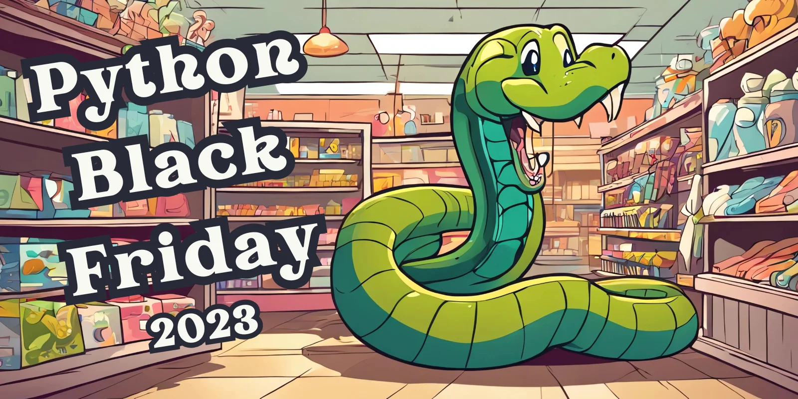
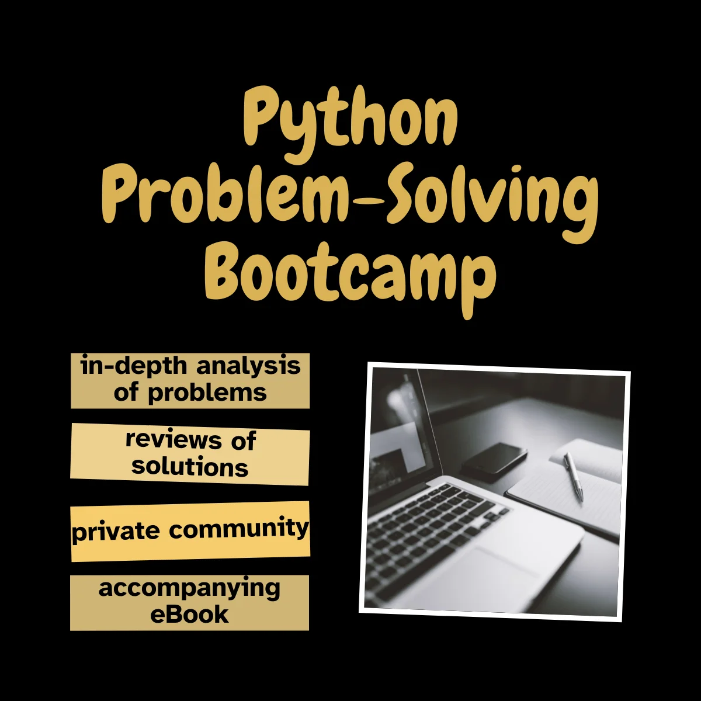

This article lists the best 2023 Black Friday deals for Python developers.

===

# Python Black Friday 2023

This article lists Black Friday deals for Python developers, from books and courses, to tools and other things.

If you find a deal that's not listed here, just comment below or [email it to me](mailto:rodrigo@mathspp.com).

## Sponsored deal

The [Python Problem-Solving Bootcamp](/pythonbootcamp) is 40% off for Black Friday.
It'll be a 21-day intensive bootcamp dedicated to solving problems with Python while learning about Python features and modules that will help you write better, cleaner code in your day-to-day.

You can learn more about the Python Problem-Solving Bootcamp [here](/pythonbootcamp).

## Books

 - [Boost Your Git DX](https://gumroad.com/a/817193683/wlrcr) by Adam Johnson is 50% off, no code needed (usual price is $39).

 - [Python 101](https://driscollis.gumroad.com/l/pypy101), [Python 201](https://driscollis.gumroad.com/l/py201), [Automating Excel with Python](https://driscollis.gumroad.com/l/openpyxl), [The Python Quiz Book](https://driscollis.gumroad.com/l/pyquiz), and [all other books](https://driscollis.gumroad.com) by Mike Driscoll are 33% off with code `black23` from the 20th of November until the 27th.

 - [Boost Your Django DX](https://gumroad.com/a/817193683/epPif) and [Speed Up Your Django Tests](https://gumroad.com/a/817193683/gLNvJ) by Adam Johnson are 50% off, no code needed.

## Courses

 - [Python Essentials for Data Scientists](https://courses.dataschool.io/python-essentials-for-data-scientists) and [all other Data School courses](https://courses.dataschool.io/black-friday) will be 40% off between the 24th and 27th of November.

## Memberships

 - [Teach Me Python](https://teachmepython.com) membership (by Mike Driscoll) is 33% off with code `black23` from the 20th of November until the 27th.

 - [The Python Coding Place](https://thepythoncodingplace.com) lifetime membership (by Stephen Gruppeta) is 70% off, no code needed.

 - [Python Morsels](https://www.pythonmorsels.com/lifetime-access-sale/) lifetime access for the price of a 2-year subscription, no code needed.

## Miscellanious

 - [snappify] is the tool that I use to share snippets of code online and to create slides for my talks and it is 30% for your first year with the code `BLACKFRIDAY_2023`.

<!--
Matt Harrison
Real Python
Patrick
Sundeep
PyCharm
AWS? Azure?
-->
