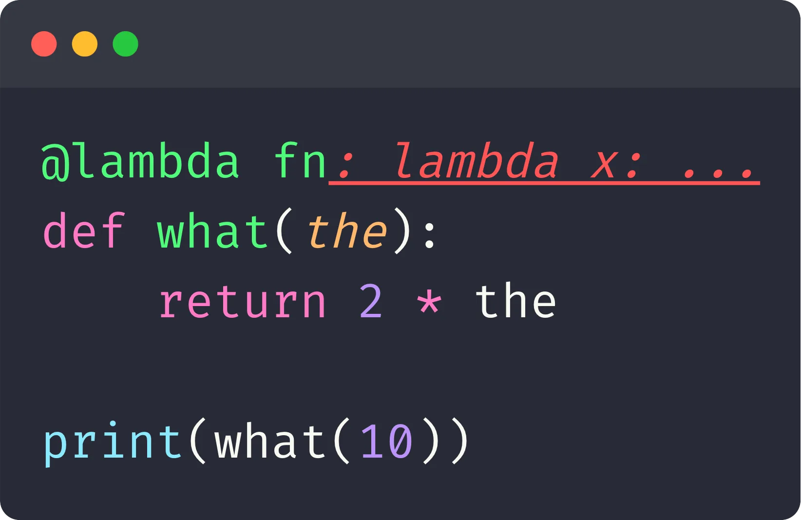
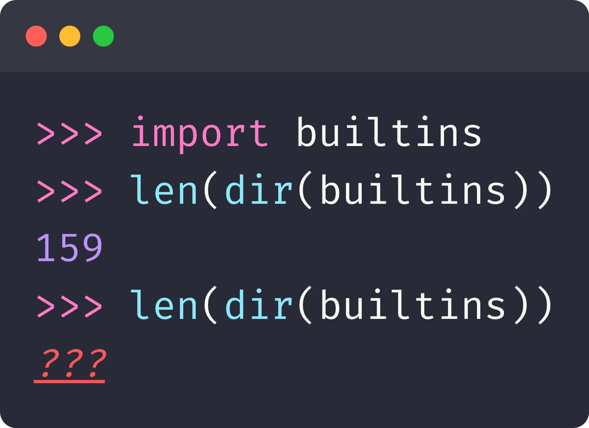

Answer this quiz to test your knowledge about the Python language, community, andd the 2025 edition of EuroPython!

===

<link rel="stylesheet" href="/user/themes/myquark/css/quiz-custom.css">

# EuroPython 2025 quiz

These are the questions asked during [the EuroPython 2025 quiz](https://ep2025.europython.eu/session/python-quiz).
They will test your knowledge of the Python language, the community, and of EuroPython 2025.
(Unless explicitly stated, questions refer to CPython 3.13.)

At the conference, participants played to win two awesome prizes:

 1. 3D printer
 2. EuroPython 2026 ticket

A couple of PyCharm vouchers were also raffled among the participating players.

## Questions

  

Where is EuroPython 2025 being held?

  <ul class="choices">
    <li data-option="a">Bikini Bottom</li>
    <li data-option="b">Camelot</li>
    <li data-option="c">Hogwarts</li>
    <li data-option="d">Prague</li>
  </ul>
  

  

What's the source of inspiration for Python's name?

  <ul class="choices">
    <li data-option="a">Ball Python (snake)</li>
    <li data-option="b">Monty Python (comedy troupe)</li>
    <li data-option="c">Python (psychedelic doom metal band)</li>
  </ul>
  

  

Which of these was not a Summit held at EuroPython 2025?

  <ul class="choices">
    <li data-option="a">C API Summit</li>
    <li data-option="b">PyScript Summit</li>
    <li data-option="c">Rust Summit</li>
    <li data-option="c">WebAssembly Summit</li>
  </ul>
  

  

Which of these is not a module from the standard library?

  <ul class="choices">
    <li data-option="a"><code>__future__</code></li>
    <li data-option="b"><code>antigravity</code></li>
    <li data-option="c"><code>dataclass</code></li>
    <li data-option="d"><code>this</code></li>
  </ul>
  

  

Of these four developers, who's been a Python core developer the longest?

  <ul class="choices">
    <li data-option="a">Diego Russo</li>
    <li data-option="b">Hynek Schlawack</li>
    <li data-option="c">Pablo Galindo Salgado</li>
    <li data-option="d">Savannah Bailey</li>
  </ul>
  

  

Which of the following is not a Python keyword?

  <ul class="choices">
    <li data-option="a"><code>_</code></li>
    <li data-option="b"><code>finally</code></li>
    <li data-option="c"><code>throw</code></li>
    <li data-option="d"><code>type</code></li>
  </ul>
  

  

What's printed if you run this code?

  

  
  

  <ul class="choices">
    <li data-option="a"><code>...</code></li>
    <li data-option="b">20</li>
    <li data-option="c">Ellipsis</li>
    <li data-option="d">Nothing; you get a <code>SyntaxError</code></li>
  </ul>
  

  

What's the output you get if you run this code in a fresh REPL session?

  

  
  

  <ul class="choices">
    <li data-option="a">159</li>
    <li data-option="b">160</li>
    <li data-option="c"><code>RuntimeError</code></li>
    <li data-option="d"><code>ValueError</code></li>
  </ul>
  

