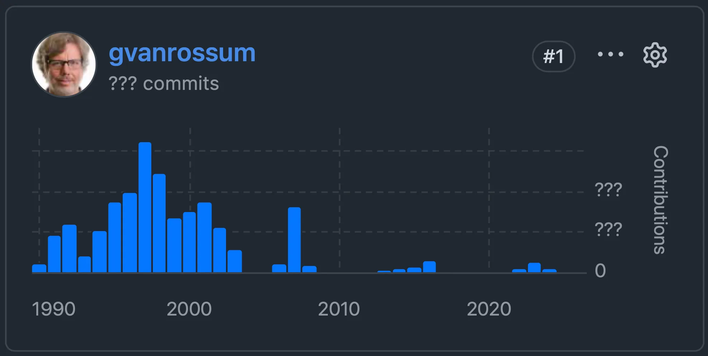
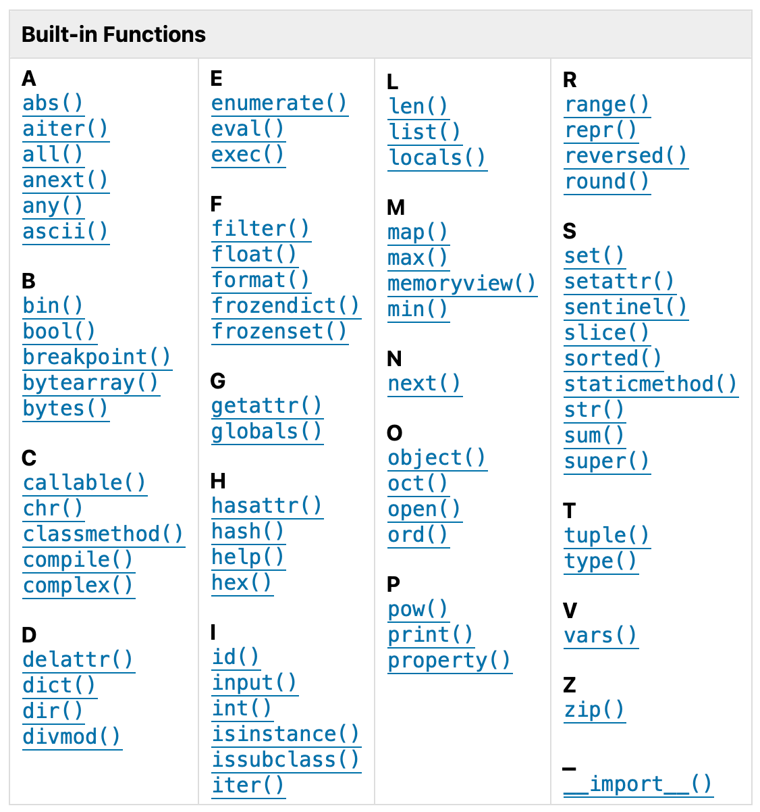
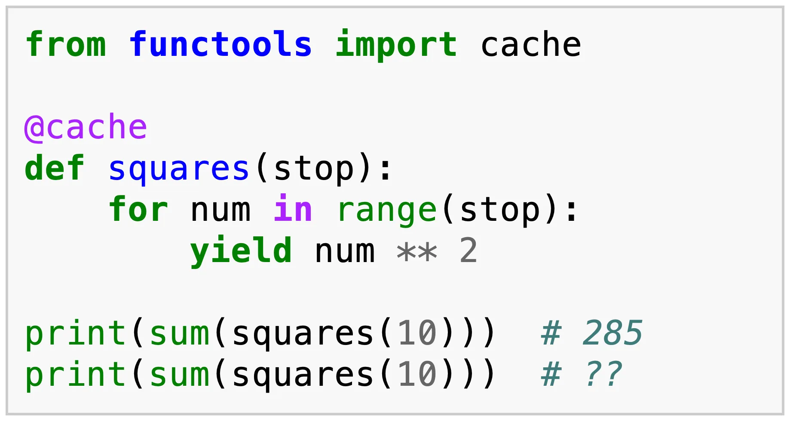
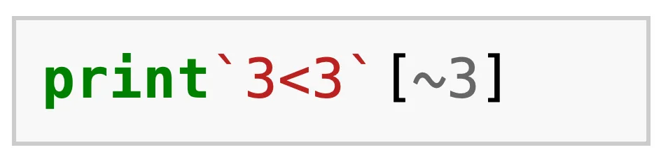

Replay the EuroPython 2026 Python quiz.

===

These are the questions asked during [the EuroPython 2026 quiz](https://ep2026.europython.eu/session/python-quiz).
They will test your knowledge of the Python language, the community, and of EuroPython 2026.
Since we were celebrating 25 years of EuroPython at EuroPython 2026, some questions also touched on that theme.
(Unless explicitly stated, questions refer to CPython 3.14.)

! Note that the version of the quiz presented here is less interactive than the one presented at the conference.

## Questions

  

In 25 years of conference, which of these European cities never hosted EuroPython?

  

  
  

  <ul class="choices">
    <li data-option="a">Bilbao</li>
    <li data-option="b">Birmingham</li>
    <li data-option="c">Lisbon</li>
    <li data-option="d">Prague</li>
  </ul>
  

  

This year's conference programme has it all. This quiz. Talks. Lightning talks. Tutorials. Summits. Open spaces. Talks. And posters during lunch breaks. How many posters are scheduled to be presented at EP 2026?

  <ul class="choices">
    <li data-option="a">4</li>
    <li data-option="b">6</li>
    <li data-option="c">12</li>
    <li data-option="d">15</li>
  </ul>
  

  

Which of the following Python-related projects has the FEWEST stars on GitHub?

  <ul class="choices">
    <li data-option="a">CPython</li>
    <li data-option="b">Django</li>
    <li data-option="c">FastAPI</li>
    <li data-option="d">uv</li>
  </ul>
  

  

The Python repo has over 130,000 commits made by more than 3,500 contributors over the past 35+ years. The Python core developers are the people with permissions to commit directly to the CPython GitHub repo and plenty of them were at the conference. Out of the following 4 core devs, who are all at this conference, who's made the fewest commits?

  <ul class="choices">
    <li data-option="a">Guido van Rossum, the creator of Python</li>
    <li data-option="b">Hugo van Kemenade, Python 3.14 and 3.15 release manager</li>
    <li data-option="c">Łukasz Langa, Python Developer in Residence for ~5 years</li>
    <li data-option="d">Pablo Galindo Salgado, Python 3.10 and 3.11 release manager</li>
  </ul>
  

  

Speaking of commits, how many commits did Guido van Rossum make?

  

  
  

  <form>
    <input type="number" min="11309" max="11309" required>
    <button type="submit">Check</button>
  </form>
  

  

Since we're celebrating 25 years of EuroPython, which of the following expressions does not evaluate to 25?

  <ul class="choices">
    <li data-option="a"><code>0x19</code></li>
    <li data-option="b"><code>0b11001</code></li>
    <li data-option="c"><code>0o33</code></li>
    <li data-option="d"><code>25</code></li>
  </ul>
  

  

3.15 comes with two new built-in functions. Before that, the previous Python version that got new built-ins was 3.10, with also TWO new built-ins. What two built-ins were introduced in 3.10?

  

  
  

  <ul class="choices">
    <li data-option="a"><code>aiter</code> and <code>anext</code></li>
    <li data-option="b"><code>breakpoint</code> and <code>compile</code></li>
    <li data-option="c"><code>frozendict</code> and <code>sentinel</code></li>
    <li data-option="d"><code>frozenset</code> and <code>memoryview</code></li>
  </ul>
  

  

What's printed by the second print if you run this code?

  

  
  

  <ul class="choices">
    <li data-option="a"><code>0</code></li>
    <li data-option="b"><code>285</code></li>
    <li data-option="c"><code>KeyError</code></li>
    <li data-option="d"><code>ValueError</code></li>
  </ul>
  

  

What does the following cursed Python 2 code print?

  

  
  

  <ul class="choices">
    <li data-option="a"><code>'a'</code></li>
    <li data-option="b"><code>25</code></li>
    <li data-option="c"><code>True</code></li>
    <li data-option="d"><code>SyntaxError</code></li>
  </ul>
  

## Explanations

### Question 1 — Hosting EuroPython

[EuroPython 2009](https://ep2009.europython.eu) and [2010](https://ep2010.europython.eu/about/venue.html) was hosted in Birmingham.
[EuroPython 2015](https://ep2015.europython.eu) and [2016](https://ep2016.europython.eu) was hosted in Bilbao.
[EuroPython 2023](https://ep2023.europython.eu), [2024](https://ep2024.europython.eu), and [2025](https://ep2025.europython.eu) was hosted in Prague.
Of the four options, Lisbon is the only European city that never hosted an EuroPython.

### Question 2 — poster presentations

Originally, 9 poster presentations were scheduled.
After a mixup and a couple cancellations we ended with only 6.

### Question 3 — GitHub stars

The official quiz asked you to order all four projects, from most stars to least stars.
Can you do it?

On the 15th of July of 2026, this would be the correct ordering:

 1. FastAPI, 101k
 2. Django, 88.2k
 3. uv, 87.5k
 4. CPython, 73.8k

### Question 4 — commits

On the 15th of July of 2026, GitHub reported the following number of all-time commits per contributor:

 1. Guido van Rossum (11,309)
 2. Pablo Galindo Salgado (1,035)
 3. Hugo van Kemenade (844)
 4. Łukasz Langa (473)

The point of the question was that Łukasz's impact during the 5 years he was a Dev in Residence was visible in the absurd number of PRs he reviewed and co-authored, along with the number of issues he took care of.
Neither of these are reflected on the number of commits that GitHub reports.

### Question 5 — Guido's commits

During the conference, this question was presented first for double the points.
Instead of 4 options, you had to type the _exact_ number.
No one got it right.
(As was expected.)

A few questions later, this question was asked again.
This time, over 20% of the players got it right!

### Question 6 — 25

All four expressions are [valid integers written as literals in different bases](/blog/base-conversion-in-python).

 - `0x19` is hexadecimal for `1 * 16 + 9 * 1` which is 25.
 - `0b11001` is binary for `1 * 16 + 1 * 8 + 1 * 1` which is 25.
 - `0o33` is octal for `3 * 8 + 3 * 3` which is 27.
 - `25` is decimal for `2 * 10 + 5` which is... 25!

### Question 7 — new built-ins

Just check the documentation.
`frozendict` and `sentinel` are new in Python 3.15.
`aiter` and `anext` are the asynchronous counterparts to `iter` and `next` and were added in 3.10.
`breakpoint` was added in 3.7.
And the others have been around for a while.

### Question 8 — cached generator

The first time the generator `squares` is called with `squares(10)` and summed, you get the sum of the first few squares (285).
But this generator was _cached_, so the next time `squares(10)` is called, you get _the exact same generator_.
What's the problem?
The problem is that the generator has been exhausted already, so you're summing an empty iterable, which produces the value `0`.

In short, [don't cache generators](/blog/til/do-not-cache-generators).

### Question 9 — cursed Python 2 code

The expression `3<3` evaluates to `False` and the backticks, in Python 2, are the same using the built-in `repr`.
So, `repr(3<3)` is the string `"False"`.
The tilde `~` is the bitwise invert operator and `[~3]` is the same as `[-4]`, evaluating to the letter `'a'`.
Finally, `print` was a statement in Python 2, so putting the whole thing together means you'll print the letter `'a'`.

Source: [answer by xnor on codegolf.stackexchange.com](https://codegolf.stackexchange.com/a/90352/75323).
