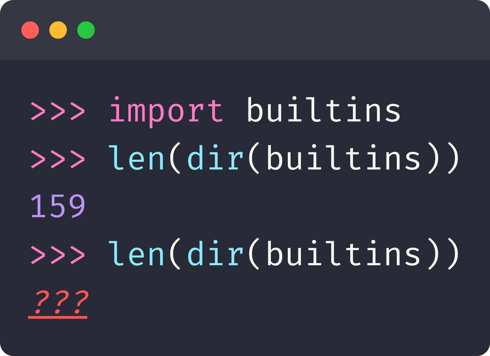
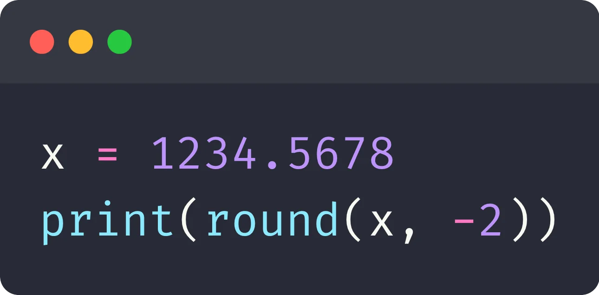

Answer this quiz to test your knowledge about the Python language, community, andd the 2025 edition of PyCon Italy!

===

<link rel="stylesheet" href="/user/themes/myquark/css/quiz-custom.css">

These are the questions asked during the PyCon Italy 2025 quiz.
They will test your knowledge of the Python language, the community, and of PyCon Italy 2025.
(Unless explicitly stated, questions refer to CPython 3.13 and “today” refers to the 30th of May of 2025.)

At the conference, participants played to win some awesome prizes:

 1. Flipper Zero
 2. PyCon Italy 2026 ticket
 3. Microbit lab

I'd like to give an awesome shoutout to the PyCon Italy organizers who went with my idea to have a quiz at the conference and who did an amazing job at getting these incredible prizes.

## Round 1

  

In what Italian city is PyCon Italy 2025 being held?

  <ul class="choices">
    <li data-option="a">Bologna</li>
    <li data-option="b">Firenze / Florence</li>
    <li data-option="c">Pisa</li>
    <li data-option="d">Roma / Rome</li>
  </ul>
  

  

The Python logo alludes to snakes, but what's the source of inspiration for Python's name?

  <ul class="choices">
    <li data-option="a">A comedy troupe</li>
    <li data-option="b">A Dutch heavy-metal band</li>
    <li data-option="c">A quaint Dutch town</li>
    <li data-option="d">A wrestling fighter</li>
  </ul>
  

  

What is the date of the oldest commit in the Python repo?

  <ul class="choices">
    <li data-option="a">Circa 300 AC</li>
    <li data-option="b">Aug 9, 1990</li>
    <li data-option="c">Oct 16, 2000</li>
    <li data-option="d">Jan 1, 2020</li>
  </ul>
  

  

Who is the most recent Python core developer?

  <ul class="choices">
    <li data-option="a">Bénédikt Tran</li>
    <li data-option="b">Diego Russo</li>
    <li data-option="c">Matt Page</li>
    <li data-option="d">Savannah Bailey</li>
  </ul>
  

  

As of today, which of these popular packages has the most GitHub stars?

  <ul class="choices">
    <li data-option="a">Django</li>
    <li data-option="b">FastAPI</li>
    <li data-option="c">pandas</li>
    <li data-option="d">Polars</li>
  </ul>
  

  

How many built-in “functions” does Python's documentation list?

  <ul class="choices">
    <li data-option="a">42</li>
    <li data-option="b">53</li>
    <li data-option="c">71</li>
    <li data-option="d">99</li>
  </ul>
  

  

What's the output you get if you run this code in a fresh REPL session?

  

  
  

  <ul class="choices">
    <li data-option="a">159</li>
    <li data-option="b">160</li>
    <li data-option="c">RuntimeError</li>
    <li data-option="d">ValueError</li>
  </ul>
  

  

Which of the following is not a module from the standard library?

  <ul class="choices">
    <li data-option="a">antigravity</li>
    <li data-option="b">regex</li>
    <li data-option="c">this</li>
    <li data-option="d">webbrowser</li>
  </ul>
  

## Round 2

  

Approximately how many core developers does Python have (past & present)?

  <ul class="choices">
    <li data-option="a">50</li>
    <li data-option="b">100</li>
    <li data-option="c">200</li>
    <li data-option="d">400</li>
  </ul>
  

  

What's the name of the key organisation that supports the Python language, the ecosystem, and the community?

  <ul class="choices">
    <li data-option="a">Guido & Co.</li>
    <li data-option="b">PyPI</li>
    <li data-option="c">Python Software Foundation</li>
    <li data-option="d">Snakes United</li>
  </ul>
  

  

Which of these is not a real Python package listed on PyPI?

  <ul class="choices">
    <li data-option="a">lasagna</li>
    <li data-option="b">piadina</li>
    <li data-option="c">pizza</li>
    <li data-option="d">tagliatelle</li>
  </ul>
  

  

Which of these is not a Python built-in?

  <ul class="choices">
    <li data-option="a">anext</li>
    <li data-option="b">ascii</li>
    <li data-option="c">compile</li>
    <li data-option="d">reduce</li>
  </ul>
  

  

What's the length of the Python list <code>[""''', ,''', ','" , "]</code>?

  

  ![Image containing a snippet of code that contains the following code: \[""''', ,''', ','" , "\]](_list.webp)
  

  <ul class="choices">
    <li data-option="a">1</li>
    <li data-option="b">2</li>
    <li data-option="c">3</li>
    <li data-option="d">That's an invalid list literal</li>
  </ul>
  

  

The module <code>itertools</code> documents 20 objects, of which 19 are iterables. What's the name of the odd one out?

  <ul class="choices">
    <li data-option="a">compress</li>
    <li data-option="b">dropwhile</li>
    <li data-option="c">starmap</li>
    <li data-option="d">tee</li>
  </ul>
  

  

What's the output of running this code?

  

  
  

  <ul class="choices">
    <li data-option="a">1200.0</li>
    <li data-option="b">1234.56</li>
    <li data-option="c">1234.57</li>
    <li data-option="d">ValueError</li>
  </ul>
  

  

True or false? Python code is compiled before being interpreted...

  <ul class="choices">
    <li data-option="a">True</li>
    <li data-option="b">False</li>
  </ul>
  

  

True or false? The Boolean type is a subclass of the integer type...

  <ul class="choices">
    <li data-option="a">True</li>
    <li data-option="b">False</li>
  </ul>
  

  

True or false? All iterators are also iterables...

  <ul class="choices">
    <li data-option="a">True</li>
    <li data-option="b">False</li>
  </ul>
  

