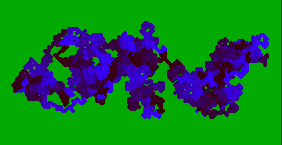
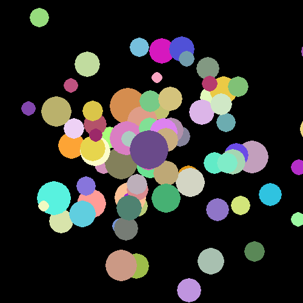

Think of a drunk man that continuously tumbles left and right, back and forth, with no final destination.

===

This drunk man walking around can be thought of as a [random walk](https://en.wikipedia.org/wiki/Random_walk) on the plane... Now imagine that the drunk man has a shorter leg and tumbles more to one of the sides: that is a biased random walk. Now imagine the drunk man can teleport to a nearby location. That is (kind of) a [Lèvy flight](https://en.wikipedia.org/wiki/L%C3%A9vy_flight)! All those are quite interesting to observe in motion and I implemented them in Python. (the code can be found [here](https://github.com/RojerGS/projects/tree/master/randomWalks)). From those, only the tilted walks and the one with the trail are such that the particle's movement wraps around the borders (leaving the green area makes the particle appear in the opposite side, just like the snake from the game Snake).

The image above is a screenshot of the execution of the random walk that leaves a coloured trail.

I also implemented an animation where the screen gets progressively filled with circles of different colours, as if being splattered with paint. Not sure why... But it looks interesting:

The implementation is in the same directory as the walks.

For all these, I got windows executables. [Here](https://drive.google.com/open?id=0ByBeLS6ciLYVX1k0M2Z2Z2RjYkU) you can find all the executables for the random walks and [here](https://drive.google.com/open?id=0ByBeLS6ciLYVcDh0a051T3plRlk) for the paint splatter.
