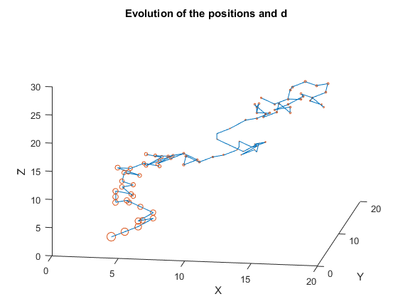
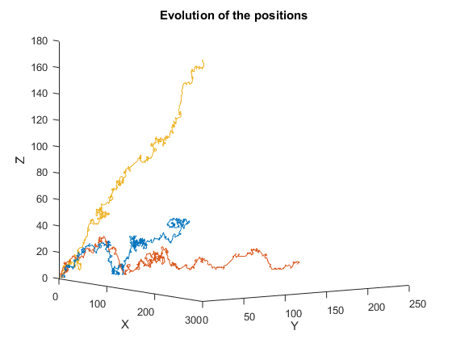

Here's how I like to solve my equations: just walk around randomly until I trip over a solution!

===

Random walks (check my older post [here](../random-walk-simulations)) and [Diophantine equations](https://en.wikipedia.org/wiki/Diophantine_equation) are two simple mathematical beasts. After a college seminar, I tried putting them together to make something neat, and came up with this: just pick a Diophantine equation, simulate a random walk, and try to see if the random walk went over any solutions! In [this report](https://drive.google.com/open?id=0ByBeLS6ciLYVY2hTYU9TV2lUb1k) I briefly go over how I came up with this, and show the code I wrote/some results. The Matlab code is all in [here](https://github.com/RodrigoGiraoSerrao/projects/tree/master/randomWalks/diophantineEqs) (I also have some Python code about random walks [here](https://github.com/RodrigoGiraoSerrao/projects/tree/master/randomWalks), check [my post](https://mathspp.blogspot.pt/2017/10/random-walk-simulations.html)!).

In the image above, the blue line represents a path taken by the random walk and in orange/red the nodes tell us how far we are from a solution (the smaller the node, the closer we are). Note that this notion of proximity isn't given by actually computing the distance to a known solution, but just by looking at how similar the two sides of the equation are. The image below shows the evolution of three independent random walks trying to find an example solution of $\frac{4}n = \frac1x + \frac1y + \frac1z$ with $n = 25$ (that expression is the expression of the [Erdös-Straus conjecture](https://en.wikipedia.org/wiki/Erd%C5%91s%E2%80%93Straus_conjecture)).

